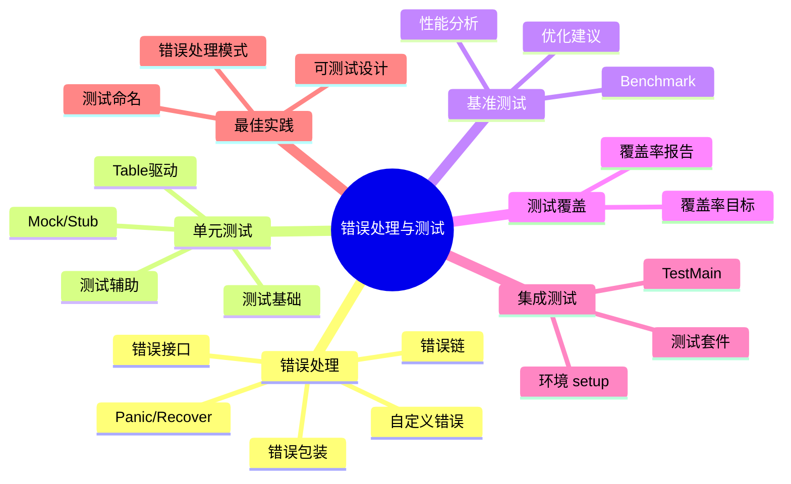
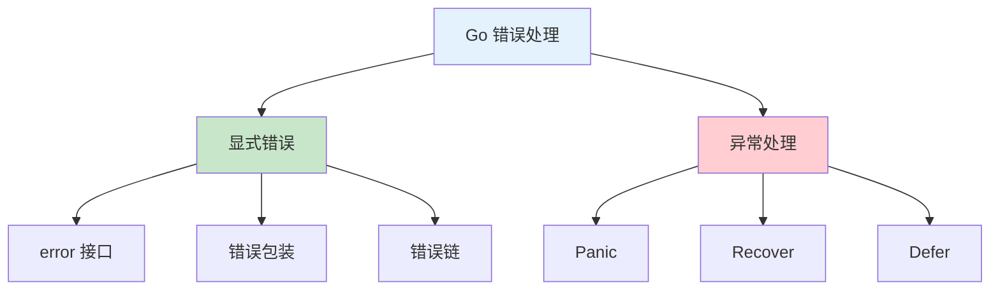
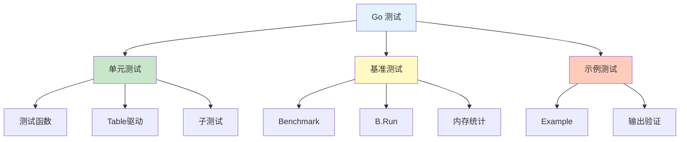
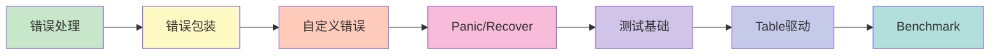

# 错误处理与测试

欢迎来到 Go 语言错误处理与测试章节！Go 的错误处理哲学和测试工具是其工程实践的重要组成部分。

## 章节导航



## 知识体系

### 错误处理概览



### 测试概览



## 学习路线



## 快速预览

### 错误处理

```go
// 返回错误
func readFile(path string) ([]byte, error) {
    data, err := os.ReadFile(path)
    if err != nil {
        return nil, fmt.Errorf("read file failed: %w", err)
    }
    return data, nil
}

// 处理错误
data, err := readFile("config.json")
if err != nil {
    log.Fatal(err)
}
```

### 单元测试

```go
func TestAdd(t *testing.T) {
    result := Add(2, 3)
    if result != 5 {
        t.Errorf("Add(2, 3) = %d; want 5", result)
    }
}
```

### Table 驱动测试

```go
func TestAdd(t *testing.T) {
    tests := []struct {
        a, b, expected int
    }{
        {1, 2, 3},
        {2, 3, 5},
        {-1, 1, 0},
    }

    for _, tt := range tests {
        t.Run(fmt.Sprintf("%d+%d", tt.a, tt.b), func(t *testing.T) {
            if got := Add(tt.a, tt.b); got != tt.expected {
                t.Errorf("got %d, want %d", got, tt.expected)
            }
        })
    }
}
```

### Benchmark

```go
func BenchmarkAdd(b *testing.B) {
    for i := 0; i < b.N; i++ {
        Add(2, 3)
    }
}
```

## 核心概念

### 错误接口

```go
// error 是内置接口
type error interface {
    Error() string
}

// 创建错误
err := errors.New("something went wrong")
err := fmt.Errorf("value %d is invalid", 42)
```

### 测试函数

```go
// 测试函数以 Test 开头
func TestFunctionName(t *testing.T) {
    // t.Fatal: 失败后停止
    // t.Errorf: 失败后继续
    // t.Log: 记录信息
    // t.Run: 子测试
    // t.Parallel: 并行测试
}
```

## 实践建议

::: tip 学习建议

1. **显式错误** - 始终检查和返回错误
2. **错误包装** - 使用 `%w` 保留错误链
3. **Table 驱动** - 使用表格测试多场景
4. **覆盖率** - 确保关键代码被测试
5. **Benchmark** - 对性能关键代码进行基准测试

:::

## 学习检查

完成本章节学习后，您应该能够：

- [ ] 理解 Go 的错误处理哲学
- [ ] 正确处理和包装错误
- [ ] 创建自定义错误类型
- [ ] 编写有效的单元测试
- [ ] 使用 Table 驱动测试
- [ ] 编写和运行 Benchmark
- [ ] 理解测试覆盖率

## 下一步

让我们开始深入学习错误处理与测试的各个部分！

::: v-pre

[错误处理](./errors.md) → [自定义错误](./custom-errors.md) → [Panic/Recover](./panic-recover.md) → [测试基础](./testing-basics.md) → [Table驱动](./table-driven.md) → [Benchmark](./benchmarks.md)

:::
