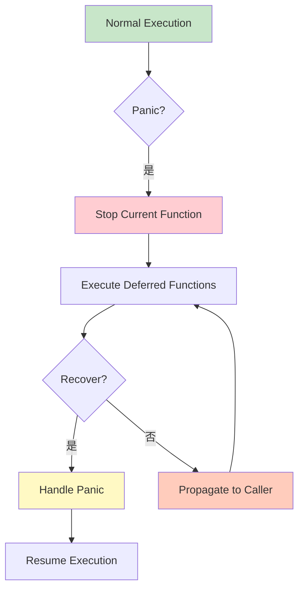

# Panic 与 Recover

Panic 和 Recover 是 Go 的异常处理机制，类似于其他语言的 try/catch，但应该谨慎使用。

## Panic 基础

### 触发 Panic

```go
// 1. 显式调用 panic
func explicitPanic() {
    panic("something went wrong")
}

// 2. 运行时错误
func runtimePanic() {
    var nums []int
    _ = nums[0]  // panic: index out of range
}

// 3. nil 指针
func nilPointerPanic() {
    var ptr *int
    *ptr = 42  // panic: nil pointer dereference
}

// 4. 向关闭的 channel 发送
func closedChannelPanic() {
    ch := make(chan int)
    close(ch)
    ch <- 1  // panic: send on closed channel
}
```

### Panic 流程



## Recover

### 基本 Recover

```go
func safeFunction() (err error) {
    // defer 中使用 recover
    defer func() {
        if r := recover(); r != nil {
            // 捕获 panic
            err = fmt.Errorf("panic recovered: %v", r)
        }
    }()

    // 可能 panic 的代码
    panic("something bad happened")

    return nil
}

func main() {
    err := safeFunction()
    if err != nil {
        fmt.Println("Recovered:", err)
    }
}
```

### Recover 模式

```go
// 模式 1: 在 defer 中 recover
func pattern1() {
    defer func() {
        if r := recover(); r != nil {
            log.Printf("Recovered: %v", r)
        }
    }()

    riskyOperation()
}

// 模式 2: 返回错误
func pattern2() (err error) {
    defer func() {
        if r := recover(); r != nil {
            err = fmt.Errorf("panic: %v", r)
        }
    }()

    doSomething()
    return nil
}

// 模式 3: 记录堆栈
func pattern3() (err error) {
    defer func() {
        if r := recover(); r != nil {
            stack := debug.Stack()
            log.Printf("Panic: %v\nStack:\n%s", r, stack)
            err = fmt.Errorf("panic: %v", r)
        }
    }()

    riskyCode()
    return nil
}
```

### Recover 限制

```go
// ❌ Recover 只能在 defer 中生效
func invalidRecover() {
    if r := recover(); r != nil {
        // 不会捕获 panic
        fmt.Println("Recovered:", r)
    }
    panic("test")
}

// ❌ Recover 只能捕获当前 goroutine 的 panic
func testGoroutine() {
    defer func() {
        if r := recover(); r != nil {
            fmt.Println("Recovered in main:", r)
        }
    }()

    go func() {
        panic("goroutine panic")  // 不会被捕获
    }()

    time.Sleep(time.Second)
}

// ✅ 正确的方式
func correctGoroutineRecover() {
    go func() {
        defer func() {
            if r := recover(); r != nil {
                fmt.Println("Recovered in goroutine:", r)
            }
        }()
        panic("goroutine panic")
    }()
}
```

## Defer 与 Panic

### 执行顺序

```go
func deferOrder() {
    defer fmt.Println("Deferred 1")
    defer fmt.Println("Deferred 2")
    defer fmt.Println("Deferred 3")

    panic("Panic!")

    // Output:
    // Deferred 3
    // Deferred 2
    // Deferred 1
    // panic: Panic!
}
```

### 带参数的 Defer

```go
func deferWithParams() {
    i := 0

    defer func(n int) {
        fmt.Println("Deferred with:", n)  // 0
    }(i)  // 立即求值

    i = 10
    panic("test")
}

// 使用指针捕获变化
func deferWithPointer() {
    i := 0

    defer func(p *int) {
        fmt.Println("Deferred with:", *p)  // 10
    }(&i)

    i = 10
    panic("test")
}
```

### Defer 在 Panic 中

```go
func cleanup() {
    defer fmt.Println("Cleanup: Close file")
    defer fmt.Println("Cleanup: Release lock")

    panic("Operation failed")

    // Output:
    // Cleanup: Release lock
    // Cleanup: Close file
    // panic: Operation failed
}
```

## Panic 使用场景

### 应该使用 Panic 的场景

```go
// 1. 程序初始化失败
func initConfig() {
    config, err := loadConfig()
    if err != nil {
        panic(fmt.Sprintf("cannot load config: %v", err))
    }
    // 配置是必需的，无法继续
}

// 2. 不可恢复的状态
func assertCondition(cond bool) {
    if !cond {
        panic("invariant violated")
    }
}

// 3. 开发阶段检测
func debugPanic() {
    if debug {
        panic("not implemented yet")
    }
}
```

### 不应该使用 Panic 的场景

```go
// ❌ 不要用 panic 处理可预期的错误
func badPanicHandling(filename string) {
    data, err := os.ReadFile(filename)
    if err != nil {
        panic(err)  // 不好的做法
    }
    _ = data
}

// ✅ 应该返回错误
func goodErrorHandling(filename string) error {
    data, err := os.ReadFile(filename)
    if err != nil {
        return err  // 好的做法
    }
    _ = data
    return nil
}
```

## 实战示例

### HTTP 服务器 Panic 恢复

```go
func panicRecoveryMiddleware(next http.Handler) http.Handler {
    return http.HandlerFunc(func(w http.ResponseWriter, r *http.Request) {
        defer func() {
            if r := recover(); r != nil {
                log.Printf("Panic recovered: %v\nStack: %s",
                    r, debug.Stack())

                http.Error(w, "Internal Server Error",
                    http.StatusInternalServerError)
            }
        }()

        next.ServeHTTP(w, r)
    })
}

// 使用
func main() {
    mux := http.NewServeMux()

    mux.HandleFunc("/", func(w http.ResponseWriter, r *http.Request) {
        // 这里可能 panic
        panic("unexpected error")
    })

    // 包装恢复中间件
    handler := panicRecoveryMiddleware(mux)

    http.ListenAndServe(":8080", handler)
}
```

### Worker 恢复

```go
func worker(id int, jobs <-chan int, results chan<- int) {
    defer func() {
        if r := recover(); r != nil {
            log.Printf("Worker %d recovered from panic: %v", id, r)
        }
    }()

    for job := range jobs {
        // 处理任务，可能 panic
        result := job * 2
        results <- result
    }
}

func main() {
    jobs := make(chan int, 100)
    results := make(chan int, 100)

    // 启动 workers
    for i := 1; i <= 3; i++ {
        go worker(i, jobs, results)
    }

    // 发送任务
    for j := 1; j <= 5; j++ {
        jobs <- j
    }
    close(jobs)

    // 收集结果
    for i := 1; i <= 5; i++ {
        <-results
    }
}
```

### 资源清理

```go
func processFile(filename string) (err error) {
    var file *os.File

    defer func() {
        if r := recover(); r != nil {
            err = fmt.Errorf("panic: %v", r)
        }

        // 确保文件被关闭
        if file != nil {
            file.Close()
        }
    }()

    file, err = os.Open(filename)
    if err != nil {
        return err
    }

    // 处理文件，可能 panic
    data := make([]byte, 100)
    _, err = file.Read(data)
    if err != nil {
        return err
    }

    return nil
}
```

## 调试 Panic

### 堆栈跟踪

```go
func withStackTrace() (err error) {
    defer func() {
        if r := recover(); r != nil {
            stack := debug.Stack()
            err = fmt.Errorf("panic: %v\n\n%s", r, stack)
        }
    }()

    riskyOperation()
    return nil
}

func riskyOperation() {
    // 嵌套调用，更容易 panic
    level1()
}

func level1() {
    level2()
}

func level2() {
    panic("something went wrong")
}
```

### 自定义 Panic 信息

```go
type PanicInfo struct {
    Message string
    File    string
    Line    int
    Stack   []byte
}

func catchPanic() *PanicInfo {
    r := recover()
    if r == nil {
        return nil
    }

    // 获取调用信息
    _, file, line, _ := runtime.Caller(2)

    return &PanicInfo{
        Message: fmt.Sprint(r),
        File:    file,
        Line:    line,
        Stack:   debug.Stack(),
    }
}

func main() {
    defer func() {
        if info := catchPanic(); info != nil {
            log.Printf("Panic: %s at %s:%d\nStack:\n%s",
                info.Message, info.File, info.Line, info.Stack)
        }
    }()

    // 代码
    panic("test panic")
}
```

## 最佳实践

::: tip 使用建议

1. **谨慎使用** - panic 应该用于不可恢复的错误
2. **Defer Recover** - 总是在 defer 中使用 recover
3. **记录信息** - 记录 panic 的详细信息
4. **清理资源** - 使用 defer 确保资源被清理
5. **避免滥用** - 优先使用 error 而非 panic

:::

```go
// ✅ 好的做法
func goodPractice() (err error) {
    defer func() {
        if r := recover(); r != nil {
            log.Printf("Panic recovered: %v\n%s", r, debug.Stack())
            err = fmt.Errorf("recovered from panic")
        }
    }()

    // 检查可预期的错误
    if err := validate(); err != nil {
        return err
    }

    // 只在真正异常时 panic
    criticalOperation()

    return nil
}

// ❌ 不好的做法
func badPractice() {
    // 不要用 panic 处理可预期的错误
    file, err := os.Open("config.txt")
    if err != nil {
        panic(err)  // 应该返回错误
    }
    _ = file
}
```

## 总结

| 概念 | 关键点 |
|------|--------|
| **Panic** - 运行时异常，终止执行 |
| **Recover** - 在 defer 中捕获 panic |
| **Defer** - 保证执行，用于清理 |
| **堆栈** - debug.Stack() 获取堆栈 |
| **场景** - 仅用于不可恢复的错误 |
| **优先** - 优先使用 error |

::: v-pre

[自定义错误](./custom-errors.md) → [测试基础](./testing-basics.md)

:::
