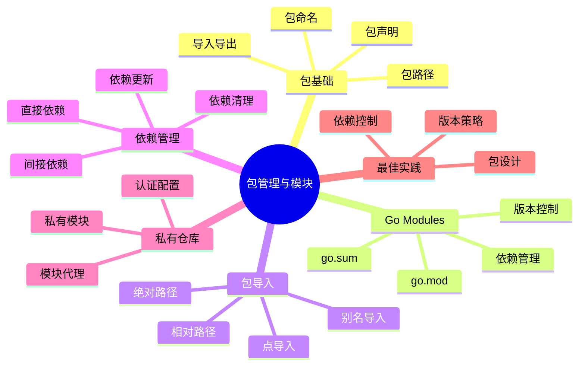
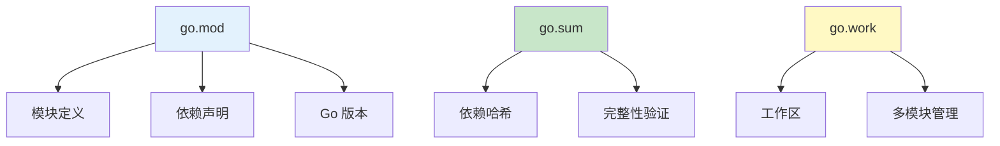
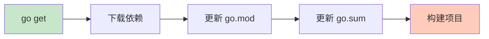
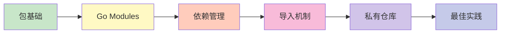

# 包管理与模块

Go 的包管理和模块系统是其依赖管理和代码组织的核心机制。

## 章节导航



## 知识体系

### Go Modules 架构



### 依赖管理流程



## 学习路线



## 快速预览

### 初始化模块

```bash
# 初始化新模块
go mod init example.com/myproject

# 下载依赖
go mod download

# 整理依赖
go mod tidy

# 查看依赖
go mod graph
```

### 导入包

```go
// 导入标准库
import "fmt"

// 导入第三方包
import "github.com/gin-gonic/gin"

// 导入本地包
import "example.com/myproject/utils"
```

## 核心概念

### Go Modules

```go
// go.mod 文件
module example.com/myproject

go 1.21

require (
    github.com/gin-gonic/gin v1.9.1
    gorm.io/gorm v1.25.5
)
```

### 依赖版本

```bash
# 指定版本
go get github.com/pkg/errors@v0.9.1

# 最新版本
go get github.com/pkg/errors@latest

# 特定分支
go get github.com/pkg/errors@main

# 提交哈希
go get github.com/pkg/errors@abc123
```

## 实践建议

::: tip 学习建议

1. **理解模块** - Go Modules 是现代依赖管理方式
2. **版本控制** - 使用语义化版本号
3. **依赖最小化** - 只引入必要的依赖
4. **私有模块** - 配置 GOPRIVATE 使用私有仓库
5. **go.sum** - 理解依赖校验机制

:::

## 学习检查

完成本章节学习后，您应该能够：

- [ ] 创建和管理 Go Modules
- [ ] 理解包的导入导出机制
- [ ] 管理项目依赖
- [ ] 配置私有模块仓库
- [ ] 理解版本控制策略
- [ ] 处理依赖冲突

## 下一步

让我们开始深入学习包管理与模块的各个部分！

::: v-pre

[包基础](./packages.md) → [Go Modules](./go-modules.md) → [导入机制](./imports.md) → [依赖管理](./dependencies.md) → [私有仓库](./private-repos.md) → [最佳实践](./best-practices.md)

:::
