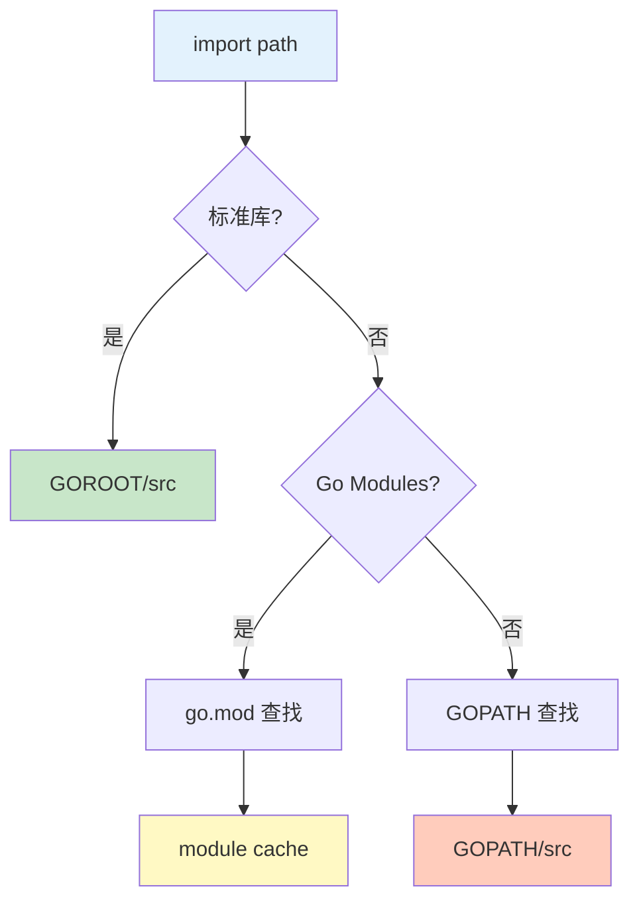

# 导入机制

Go 的导入机制决定了如何组织和引用代码，理解导入路径和解析机制很重要。

## 导入路径

### 标准库导入

```go
// 标准库不需要完整路径
import "fmt"
import "math"
import "net/http"
import "encoding/json"

// 标准库路径规则：
// - 只包名
// - 不包含域名
// - 官方维护
```

### 第三方库导入

```go
// 第三方库使用完整模块路径
import "github.com/gin-gonic/gin"
import "gorm.io/gorm"
import "go.uber.org/zap"

// 第三方库路径规则：
// - 包含托管平台
// - 包含组织或用户名
// - 包含项目名
```

### 本地包导入

```go
// 同模块内使用模块路径
import "example.com/myproject/utils"
import "example.com/myproject/models"

// 相对导入（不推荐）
import "./utils"
import "../models"

// 绝对导入（推荐）
import "example.com/myproject/services"
```

## 导入方式

### 常规导入

```go
import "fmt"

func main() {
    fmt.Println("Hello")  // 使用包名.函数名
}
```

### 别名导入

```go
import (
    stdfmt "fmt"              // 别名避免冲突
    myfmt "example.com/myfmt"  // 别名简化引用

    g "github.com/gin-gonic/gin"  // 短别名
)

func main() {
    stdfmt.Println("Standard fmt")
    myfmt.Println("Custom fmt")
    g.GET("/", handler)
}
```

### 点导入

```go
import (
    . "fmt"  // 点导入
)

func main() {
    // 直接使用，不需要包名前缀
    Println("Hello")
    Printf("Value: %d", 42)
}

// 警告：点导入可能引起命名冲突
// 建议只在测试中使用
```

### 空白导入

```go
import (
    _ "image/png"  // 注册 PNG 解码器
    _ "github.com/lib/pq"  // 注册 PostgreSQL 驱动
)

// 空白导入的作用：
// 1. 执行包的 init 函数
// 2. 注册驱动或编解码器
// 3. 副作用导入
```

### 分组导入

```go
import (
    // 标准库
    "fmt"
    "math"

    // 第三方库
    "github.com/gin-gonic/gin"
    "gorm.io/gorm"

    // 本地包
    "example.com/myproject/utils"
)

// 好处：
// 1. 清晰的组织结构
// 2. 更好的可读性
// 3. 易于维护
```

## 导入路径解析

### 模块路径



```go
// 导入路径解析顺序：

// 1. 检查是否是标准库
import "fmt"  // → $GOROOT/src/fmt

// 2. 检查 go.mod 中的模块
import "github.com/gin-gonic/gin"  // → go.mod 中的模块

// 3. 检查 GOPATH（旧模式）
import "github.com/myorg/mypkg"  // → $GOPATH/src/github.com/myorg/mypkg
```

### 相对路径

```go
// ❌ 不推荐：相对导入
import "../utils"
import "./models"

// 问题：
// 1. 不明确
// 2. 难以重构
// 3. 可能导致循环导入

// ✅ 推荐：绝对导入
import "example.com/myproject/utils"
import "example.com/myproject/models"
```

## 导入优化

### 未使用的导入

```go
// ❌ 未使用的导入
import "fmt"
import "os"  // 未使用

func main() {
    fmt.Println("Hello")
}

// 使用 goimports 自动修复
// go get golang.org/x/tools/cmd/goimports
// goimports -w main.go
```

### 导入排序

```go
// 推荐的导入顺序
import (
    // 1. 标准库
    "fmt"
    "math"

    // 2. 第三方库
    "github.com/gin-gonic/gin"
    "gorm.io/gorm"

    // 3. 本地包
    "example.com/myproject/utils"
)

// 使用 gofmt 或 goimports 自动格式化
```

### 避免导入循环

```go
// ❌ 循环导入

// packageA/a.go
package packageA

import "example.com/project/packageB"

func A() {
    packageB.B()
}

// packageB/b.go
package packageB

import "example.com/project/packageA"  // 错误！

func B() {
    packageA.A()
}

// ✅ 解决方案：创建共享包
// common/common.go
package common

func CommonFunc() {}

// packageA 和 packageB 都导入 common
```

## 包别名场景

### 避免命名冲突

```go
import (
    stdjson "encoding/json"  // 标准库 JSON
    "github.com/tidwall/gjson"  // 第三方 JSON 库
)

func processData(data []byte) {
    // 使用标准库
    var obj map[string]interface{}
    stdjson.Unmarshal(data, &obj)

    // 使用第三方库
    value := gjson.GetBytes(data, "user.name")
}
```

### 简化长包名

```go
import (
    api "github.com/myorg/myproject-api/pkg/api"
    client "github.com/myorg/myproject-client/pkg/client"
)

func main() {
    // 使用简短别名
    api.Call()
    client.Send()
}
```

### 测试别名

```go
package myapp_test

import (
    stdtesting "testing"

    mytesting "example.com/myproject/testing"
)

func TestWithHelper(t *stdtesting.T) {
    // 使用自定义测试工具
    mytesting.AssertEqual(t, 1, 1)
}
```

## 点导入场景

### 测试代码

```go
package myapp_test

import (
    . "testing"  // 测试中常用
)

func TestSimple(t *testing.T) {
    // 直接使用 t，无需 testing.T
    t.Log("Hello")
}

// 更多用于 testing 包
```

### 链式调用

```go
import . "github.com/stretchr/testify/assert"

func TestChain(t *testing.T) {
    // 直接使用 Assert 函数
    Equal(1, 1, "they should be equal")
    NotNil(value, "value should not be nil")
}
```

## 空白导入场景

### 注册驱动

```go
import (
    "database/sql"
    _ "github.com/go-sql-driver/mysql"  // 注册 MySQL 驱动
    _ "github.com/lib/pq"              // 注册 PostgreSQL 驱动
)

func openDB() *sql.DB {
    // 驱动已注册，可以直接使用
    db, err := sql.Open("mysql", "dsn")
    // 或
    db, err = sql.Open("postgres", "dsn")
    return db
}
```

### 注册编解码器

```go
import (
    "image"
    _ "image/jpeg"  // 注册 JPEG 解码器
    _ "image/png"   // 注册 PNG 解码器
)

func loadImage(data []byte) (image.Image, error) {
    return image.Decode(bytes.NewReader(data))
}
```

### 副作用导入

```go
import (
    _ "github.com/mycompany/app/initialized"  // 执行 init 函数
)

// initialized 包：
// package initialized
// func init() {
//     // 初始化全局状态
//     config.Load()
//     logging.Setup()
// }
```

## 导入限制

### 最小导入原则

```go
// ❌ 过度导入
import (
    "encoding/json"
    "fmt"
    "io"
    "math"
    "net/http"
    "os"
    "strings"
    "time"
)

// 只用了一个，却导入很多

// ✅ 按需导入
import "fmt"
```

### 接口隔离

```go
// io 包示例
import "io"

func copyData(src io.Reader, dst io.Writer) error {
    // io 包定义了 Reader 和 Writer 接口
    // 任何实现这些接口的类型都可以使用
    _, err := io.Copy(dst, src)
    return err
}
```

## 最佳实践

::: tip 使用建议

1. **使用 goimports** - 自动管理导入
2. **分组导入** - 标准库、第三方、本地
3. **避免循环** - 设计时避免循环导入
4. **谨慎点导入** - 只在测试中使用
5. **清晰的别名** - 有意义的别名

:::

```go
// ✅ 好的导入示例
package main

import (
    // 标准库
    "fmt"
    "log"

    // 第三方库
    "github.com/gin-gonic/gin"
    "gorm.io/gorm"

    // 本地包
    "example.com/myproject/config"
    "example.com/myproject/models"
)

func main() {
    cfg := config.Load()
    db := models.ConnectDB(cfg.Database)
    router := gin.Default()

    if err := router.Run(":8080"); err != nil {
        log.Fatal(err)
    }
}
```

## 总结

| 概念 | 关键点 |
|------|--------|
| **标准库** - 只包名 |
| **第三方** - 完整模块路径 |
| **别名** - 避免冲突或简化 |
| **点导入** - 直接访问成员 |
| **空白导入** - 执行 init 函数 |
| **分组** - 清晰组织导入 |

::: v-pre

[Go Modules](./go-modules.md) → [依赖管理](./dependencies.md)

:::
