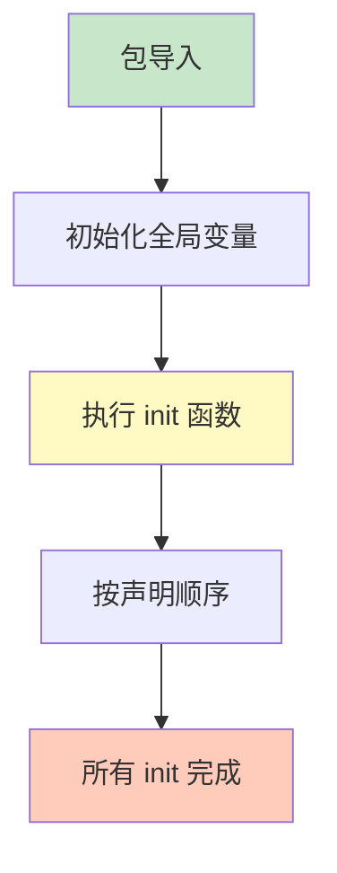

# 包基础

包是 Go 代码组织和复用的基本单位，理解包的工作方式是编写 Go 程序的基础。

## 包声明

### 基本语法

```go
// 每个 Go 文件必须声明所属的包
package main

package utils

package config
```

### 包命名规则

```go
// ✅ 好的包名：小写、简洁、描述性
package http
package json
package strings
package calculator

// ❌ 不好的包名
package myPackage      // 不要使用驼峰
package my_package     // 不要使用下划线
package calculatorUtil // 过长
package a              // 无意义
```

### main 包

```go
// main 包是可执行程序的入口
package main

import "fmt"

func main() {
    fmt.Println("Hello, World!")
}

// main 包必须包含 main() 函数
// 只有 main 包可以生成可执行文件
```

## 包目录结构

### 标准结构

```
project/
├── go.mod              # 模块定义
├── main.go             # main 包
├── calculator/         # calculator 包
│   └── calculator.go
├── utils/              # utils 包
│   ├── string.go
│   └── number.go
└── config/             # config 包
    └── config.go
```

### 同目录多文件

```
utils/
├── string.go           # package utils
├── number.go           # package utils
└── types.go            # package utils

// 同一目录下所有文件必须属于同一包
```

## 导入包

### 基本导入

```go
// 导入标准库
import "fmt"
import "math"

// 导入第三方包
import "github.com/gin-gonic/gin"

// 导入本地包
import "example.com/myproject/utils"
```

### 导入分组

```go
// 使用括号分组导入（推荐）
import (
    "fmt"
    "math"

    "github.com/gin-gonic/gin"
    "gorm.io/gorm"

    "example.com/myproject/utils"
)
```

### 导入别名

```go
import (
    stdjson "encoding/json"    // 别名避免冲突

    "github.com/go-sql-driver/mysql"
    _ "github.com/go-sql-driver/mysql"  // 只导入 init

    myfmt "example.com/myproject/fmt"  // 别名简化引用
)

func main() {
    // 使用别名
    data := stdjson.Marshal(nil)
    _ = data

    // 使用简化的别名
    myfmt.Println("custom format")
}
```

### 点导入

```go
import (
    . "fmt"  // 点导入：直接访问导出成员
)

func main() {
    // 不需要包名前缀
    Println("Hello")  // 直接使用 Println
}
```

### 空白导入

```go
import (
    _ "image/png"     // 只执行 init，不使用包
    _ "github.com/lib/pq"  // 注册数据库驱动
)

// 空白导入常用于：
// 1. 注册驱动
// 2. 执行包的 init 函数
// 3. 副作用导入
```

## 导出成员

### 导出规则

```go
package calculator

// ❌ 未导出：私有成员（小写开头）
func internalAdd(a, b int) int {
    return a + b
}

var counter int
type secretData struct{}

// ✅ 导出：公共成员（大写开头）
func Add(a, b int) int {
    return a + b
}

var Counter int
type PublicData struct{}
```

### 导出结构体

```go
package models

// User 是导出的结构体
type User struct {
    ID        int       // 导出字段
    Name      string    // 导出字段
    email     string    // 未导出字段
    password  string    // 未导出字段
    CreatedAt time.Time // 导出字段
}

// 导出的构造函数
func NewUser(name string) *User {
    return &User{
        Name: name,
    }
}

// 导出的方法
func (u *User) GetName() string {
    return u.Name
}

func (u *User) setEmail(email string) {
    u.email = email  // 可以访问未导出字段
}
```

### 导出接口

```go
package services

// UserService 是导出的接口
type UserService interface {
    CreateUser(name string) (*User, error)
    GetUser(id int) (*User, error)
}

// userService 是未导出的实现
type userService struct {
    db *Database
}

// NewUserService 返回导出接口类型
func NewUserService(db *Database) UserService {
    return &userService{db: db}
}
```

## 包初始化

### init 函数

```go
package config

import (
    "os"
    "sync"
)

var (
    apiKey string
    once   sync.Once
)

// init 在包加载时自动执行
func init() {
    fmt.Println("Initializing config package")

    apiKey = os.Getenv("API_KEY")
    if apiKey == "" {
        apiKey = "default-key"
    }
}

// 可以有多个 init 函数
// 按声明顺序执行
func init() {
    fmt.Println("Second init")
}

// 使用 sync.Once 确保只执行一次
func Init() {
    once.Do(func() {
        // 初始化逻辑
    })
}
```

### 初始化顺序



```go
// 初始化顺序示例
package main

import "fmt"

var x = initX()

func initX() int {
    fmt.Println("1. 变量初始化")
    return 1
}

func init() {
    fmt.Println("2. 第一个 init")
}

func init() {
    fmt.Println("3. 第二个 init")
}

func main() {
    fmt.Println("4. main 函数")
}

// 输出：
// 1. 变量初始化
// 2. 第一个 init
// 3. 第二个 init
// 4. main 函数
```

## 包作用域

### 可见性规则

```go
package mypackage

// 包级变量
var PackageVar int

const PackageConst = 100

// 包级函数
func PackageFunc() {}

// 包级类型
type PackageType struct{}

// 未导出成员只能在包内访问
func internalFunction() {
    PackageVar = 10
    internalVar = 20
}

var internalVar int
```

### 同包跨文件访问

```go
// file1.go
package mypackage

var sharedVar int

func file1Func() {
    sharedVar = 10
}

// file2.go
package mypackage

func file2Func() {
    // 可以访问 file1.go 中的导出和未导出成员
    sharedVar = 20
    file1Func()
}
```

## 包设计原则

### 单一职责

```go
// ✅ 好的设计：每个包有明确的职责
// strings/strings.go - 字符串操作
package strings

func Reverse(s string) string {}

// utils/math.go - 数学工具
package math

func Add(a, b int) int {}

// ❌ 不好的设计：混合不相关的功能
package utils

func ReverseString(s string) string {}
func AddNumbers(a, b int) int {}
func ConnectDB() error {}
```

### 最小化导出

```go
// ✅ 好的设计：只导出必要的成员
package user

type User struct {
    ID    int
    Name  string
    email string  // 未导出
}

func (u *User) SetEmail(email string) {
    u.email = validateEmail(email)
}

// ❌ 不好的设计：导出所有成员
package user

type User struct {
    ID      int
    Name    string
    Email   string  // 直接导出
    Password string  // 不应该导出
}
```

### 避免循环导入

```go
// ❌ 循环导入（编译错误）

// packageA/packageA.go
package packageA

import "example.com/project/packageB"

func A() {
    packageB.B()
}

// packageB/packageB.go
package packageB

import "example.com/project/packageA"  // 循环导入！

func B() {
    packageA.A()
}

// ✅ 解决方案：创建共享的 package
// common/common.go
package common

func AB() {}

// packageA 使用 common
// packageB 使用 common
```

## 常用标准库包

### 核心包

```go
// fmt - 格式化 I/O
import "fmt"
fmt.Println("Hello")
fmt.Printf("Value: %v", 42)

// strings - 字符串操作
import "strings"
strings.Contains("hello", "ell")
strings.ToUpper("hello")

// math - 数学函数
import "math"
math.Sqrt(16)
math.Pi

// time - 时间日期
import "time"
time.Now()
time.Sleep(time.Second)
```

### 容器包

```go
// container/list - 双向链表
import "container/list"
list := list.New()
list.PushBack(1)

// container/heap - 堆
import "container/heap"
heap.Push(&h, 3)

// container/ring - 环形链表
import "container/ring"
ring := ring.New(5)
```

### I/O 包

```go
// io - 基础 I/O 接口
import "io"
io.Copy(writer, reader)

// io/ioutil - 便捷 I/O 操作
import "io/ioutil"
data, _ := ioutil.ReadAll(reader)

// bufio - 缓冲 I/O
import "bufio"
scanner := bufio.NewScanner(reader)
```

## 最佳实践

::: tip 使用建议

1. **包名** - 使用小写、简洁的名称
2. **导出** - 只导出必要的成员
3. **避免循环** - 设计包时避免循环导入
4. **单一职责** - 每个包只做一件事
5. **文档** - 为导出成员添加文档注释

:::

```go
// ✅ 好的包设计
package user

// User represents a user in the system.
type User struct {
    ID   int
    Name string
}

// NewUser creates a new user with the given name.
func NewUser(name string) *User {
    return &User{Name: name}
}

// Validate checks if the user data is valid.
func (u *User) Validate() error {
    if u.Name == "" {
        return errors.New("name is required")
    }
    return nil
}
```

## 总结

| 概念 | 关键点 |
|------|--------|
| **包声明** - `package name` |
| **main 包** - 可执行程序入口 |
| **导入** - `import "path"` |
| **导出** - 大写字母开头 |
| **init** - 包初始化函数 |
| **可见性** - 包内共享，外包隔离 |

::: v-pre

[包管理总览](./README.md) → [Go Modules](./go-modules.md)

:::
