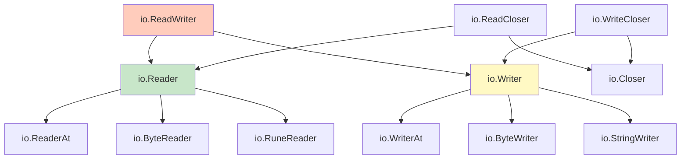
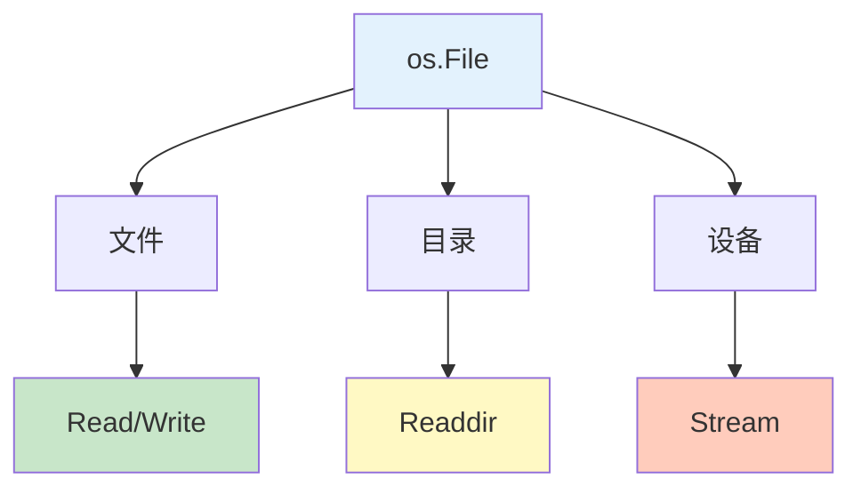

# 文件与 IO

Go 的 I/O 操作围绕 `io` 包的接口设计，提供了统一的读写抽象。

## 章节导航


## 知识体系

### IO 接口层次



### 文件系统



## 学习路线


## 快速预览

### 读取文件

```go
// 简单读取
data, err := os.ReadFile("config.json")
if err != nil {
    log.Fatal(err)
}
fmt.Println(string(data))
```

### 写入文件

```go
// 简单写入
err := os.WriteFile("output.txt", []byte("Hello"), 0644)
if err != nil {
    log.Fatal(err)
}
```

### 流式处理

```go
// 打开文件
file, err := os.Open("data.txt")
if err != nil {
    log.Fatal(err)
}
defer file.Close()

// 读取内容
scanner := bufio.NewScanner(file)
for scanner.Scan() {
    fmt.Println(scanner.Text())
}
```

## 核心概念

### Reader 接口

```go
type Reader interface {
    Read(p []byte) (n int, err error)
}

// Read 最多读取 len(p) 字节到 p
// 返回读取的字节数 n 和遇到的错误
```

### Writer 接口

```go
type Writer interface {
    Write(p []byte) (n int, err error)
}

// Write 从 p 写入数据
// 返回写入的字节数 n 和遇到的错误
```

### Closer 接口

```go
type Closer interface {
    Close() error
}

// Close 关闭资源并释放
```

## 实践建议

::: tip 学习建议

1. **理解接口** - 掌握 Reader/Writer 接口
2. **使用 defer** - 确保资源被正确关闭
3. **缓冲 I/O** - 使用 bufio 提高性能
4. **错误处理** - 始终检查和处理错误
5. **路径处理** - 使用 filepath 而非硬编码路径

:::

## 学习检查

完成本章节学习后，您应该能够：

- [ ] 使用 io.Reader 和 io.Writer 接口
- [ ] 读写文件和目录
- [ ] 使用 bufio 进行缓冲 I/O
- [ ] 格式化输入输出
- [ ] 处理文件路径
- [ ] 管理文件权限和属性
- [ ] 避免常见的 I/O 错误

## 下一步

让我们开始深入学习文件与 IO 的各个部分！

::: v-pre

[io 包](./io-package.md) → [文件操作](./files.md) → [bufio](./bufio.md) → [格式化IO](./fmt-io.md) → [文件系统](./filesystem.md) → [最佳实践](./io-best-practices.md)

:::
