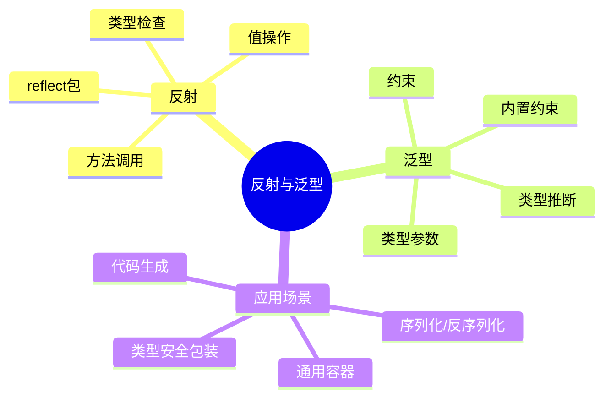

# 反射与泛型

Go 语言提供了强大的反射机制和自 Go 1.18 起引入的泛型支持，这两种特性让代码更加灵活和可复用。

## 概述



## 反射

反射是程序在运行时检查变量类型和值的能力，Go 的 `reflect` 包提供了完整的反射支持。

### 基本概念

```go
import "reflect"

// 反射三大要素
func reflectionBasics() {
    var x int = 42

    // 1. Type - 类型信息
    t := reflect.TypeOf(x)
    fmt.Println("Type:", t)  // int

    // 2. Value - 值信息
    v := reflect.ValueOf(x)
    fmt.Println("Value:", v)  // 42

    // 3. Kind - 种类（底层类别）
    fmt.Println("Kind:", v.Kind())  // int
}
```

### Type 和 Value

```go
// reflect.Type 接口
func examineType(v interface{}) {
    t := reflect.TypeOf(v)

    // 类型名称
    fmt.Println("Name:", t.Name())
    // 包路径
    fmt.Println("PkgPath:", t.PkgPath())
    // 类型种类
    fmt.Println("Kind:", t.Kind())
    // 是否实现接口
    fmt.Println("Implements Stringer:", t.Implements(
        reflect.TypeOf((*fmt.Stringer)(nil)).Elem()))
}

// reflect.Value 结构
func examineValue(v interface{}) {
    rv := reflect.ValueOf(v)

    // 获取值
    fmt.Println("Value:", rv.Interface())
    // 是否可设置
    fmt.Println("CanSet:", rv.CanSet())
    // 类型
    fmt.Println("Type:", rv.Type())
}
```

## 泛型

泛型允许编写与类型无关的代码，提高代码复用性同时保持类型安全。

### 基本语法

```go
// 泛型函数
func Print[T any](s []T) {
    for _, v := range s {
        fmt.Println(v)
    }
}

// 使用
Print([]int{1, 2, 3})
Print([]string{"a", "b", "c"})
```

### 类型参数

```go
// 多个类型参数
func Map[T, U any](s []T, f func(T) U) []U {
    result := make([]U, len(s))
    for i, v := range s {
        result[i] = f(v)
    }
    return result
}

// 使用示例
numbers := []int{1, 2, 3}
strings := Map(numbers, func(n int) string {
    return strconv.Itoa(n)
})
```

### 约束

```go
// 约束定义
type Number interface {
    int | int64 | float64
}

// 带约束的泛型函数
func Sum[T Number](numbers []T) T {
    var sum T
    for _, n := range numbers {
        sum += n
    }
    return sum
}
```

## 应用场景

### 反射应用

```go
// JSON 序列化
func Marshal(v interface{}) ([]byte, error) {
    // 使用反射检查类型
    val := reflect.ValueOf(v)
    switch val.Kind() {
    case reflect.Struct:
        return marshalStruct(val)
    case reflect.Map:
        return marshalMap(val)
    case reflect.Slice:
        return marshalSlice(val)
    default:
        return marshalPrimitive(val)
    }
}

// 深度复制
func DeepCopy(src interface{}) interface{} {
    // 使用反射创建新对象
    val := reflect.ValueOf(src)
    typ := val.Type()

    dst := reflect.New(typ).Elem()
    copyReflect(dst, val)
    return dst.Interface()
}
```

### 泛型应用

```go
// 通用栈
type Stack[T any] struct {
    items []T
}

func (s *Stack[T]) Push(v T) {
    s.items = append(s.items, v)
}

func (s *Stack[T]) Pop() (T, bool) {
    if len(s.items) == 0 {
        var zero T
        return zero, false
    }
    idx := len(s.items) - 1
    item := s.items[idx]
    s.items = s.items[:idx]
    return item, true
}

// 使用
stack := Stack[int]{}
stack.Push(1)
stack.Push(2)
val, _ := stack.Pop()
```

## 性能考虑

::: warning 性能提示

- **反射**: 比直接调用慢 10-100 倍
- **泛型**: 编译时类型检查，运行时无性能损失
- **优先泛型**: 在可能的情况下使用泛型而非反射

:::

```go
// ❌ 使用反射
func SumReflect(values interface{}) interface{} {
    v := reflect.ValueOf(values)
    var result float64
    for i := 0; i < v.Len(); i++ {
        result += v.Index(i).Float()
    }
    return result
}

// ✅ 使用泛型
func SumGeneric[T constraints.Float](values []T) T {
    var result T
    for _, v := range values {
        result += v
    }
    return result
}
```

## 最佳实践

::: tip 使用建议

1. **优先泛型** - 类型安全且性能好
2. **谨慎反射** - 只在必要时使用
3. **接口优先** - 优先使用接口而非反射
4. **文档清晰** - 泛型代码需要清晰的文档

:::

```go
// ✅ 好的模式：使用接口
type Printer interface {
    Print()
}

func PrintAll(items []Printer) {
    for _, item := range items {
        item.Print()
    }
}

// ❌ 不好的模式：过度使用反射
func PrintAllReflect(items interface{}) {
    v := reflect.ValueOf(items)
    for i := 0; i < v.Len(); i++ {
        method := v.Index(i).MethodByName("Print")
        method.Call(nil)
    }
}
```

## 内容导航

| 章节 | 内容 |
|------|------|
| [反射](./reflection.md) | reflect 包、类型检查、值操作 |
| [泛型](./generics.md) | 类型参数、约束、类型推断 |
| [类型推断](./type-inference.md) | 类型推断机制 |
| [最佳实践](./best-practices.md) | 反射与泛型最佳实践 |

::: v-pre

[IO操作](/langs/go/08-io/) → [反射](./reflection.md)

:::
