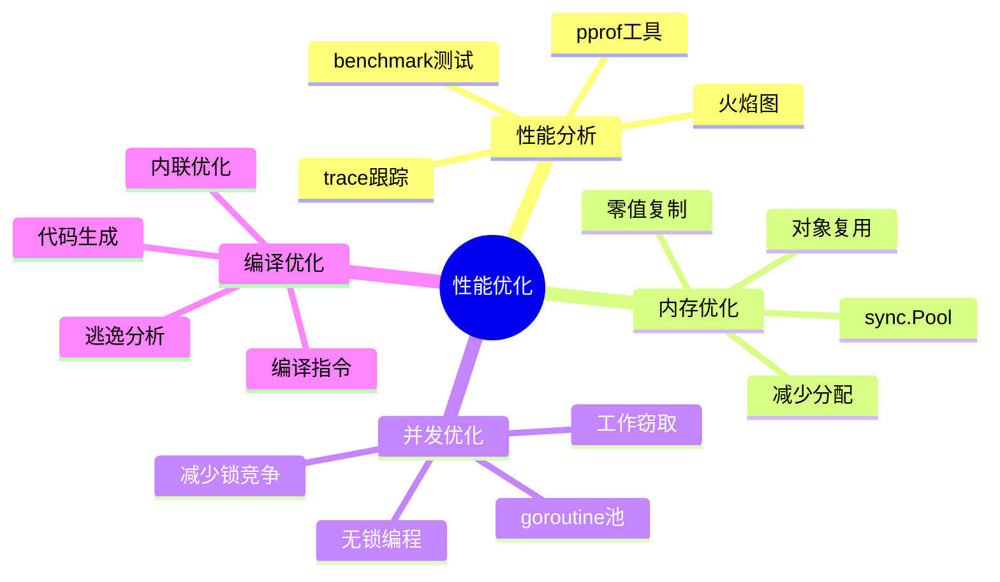

# 性能优化

Go 语言以其出色的性能表现而著称，通过合理的优化技巧可以让程序运行更高效。

## 概述



## 性能分析工具

### pprof

```go
import (
    _ "net/http/pprof"
    "net/http"
)

func main() {
    // 启动 pprof HTTP 服务器
    go func() {
        http.ListenAndServe("localhost:6060", nil)
    }()

    // 应用程序代码
    // ...
}

// 访问分析数据
// http://localhost:6060/debug/pprof/
```

### benchmark

```go
// 文件名: xxx_test.go
func BenchmarkFunction(b *testing.B) {
    for i := 0; i < b.N; i++ {
        // 要测试的代码
        Function()
    }
}

// 运行 benchmark
// go test -bench=. -benchmem
```

### trace

```go
import (
    "os"
    "runtime/trace"
)

func main() {
    // 开始跟踪
    f, _ := os.Create("trace.out")
    defer f.Close()
    trace.Start(f)
    defer trace.Stop()

    // 应用程序代码
    // ...
}

// 分析 trace
// go tool trace trace.out
```

## 内存优化

### 对象复用

```go
// ✅ 使用 sync.Pool 复用对象
var bufferPool = sync.Pool{
    New: func() interface{} {
        return new(bytes.Buffer)
    },
}

func processData() {
    // 从池中获取
    buf := bufferPool.Get().(*bytes.Buffer)
    defer func() {
        buf.Reset()
        bufferPool.Put(buf)
    }()

    // 使用 buffer
    buf.WriteString("data")
}

// ❌ 每次都创建新对象
func processDataBad() {
    buf := new(bytes.Buffer)
    buf.WriteString("data")
}
```

### 避免不必要的分配

```go
// ✅ 预分配容量
func growSlice(n int) []int {
    slice := make([]int, 0, n)
    for i := 0; i < n; i++ {
        slice = append(slice, i)
    }
    return slice
}

// ❌ 动态扩容
func growSliceBad(n int) []int {
    slice := make([]int, 0)
    for i := 0; i < n; i++ {
        slice = append(slice, i)  // 多次分配
    }
    return slice
}
```

### 字符串优化

```go
// ✅ 使用 strings.Builder
func buildString(parts []string) string {
    var builder strings.Builder
    builder.Grow(len(parts) * 10)  // 预分配
    for _, p := range parts {
        builder.WriteString(p)
    }
    return builder.String()
}

// ❌ 使用 + 拼接
func buildStringBad(parts []string) string {
    result := ""
    for _, p := range parts {
        result += p  // 每次都创建新字符串
    }
    return result
}
```

## 并发优化

### goroutine 池

```go
type WorkerPool struct {
    tasks   chan Task
    workers int
}

func NewWorkerPool(workers int) *WorkerPool {
    pool := &WorkerPool{
        tasks:   make(chan Task, workers*2),
        workers: workers,
    }
    pool.start()
    return pool
}

func (p *WorkerPool) start() {
    for i := 0; i < p.workers; i++ {
        go p.worker()
    }
}

func (p *WorkerPool) worker() {
    for task := range p.tasks {
        task.Execute()
    }
}

func (p *WorkerPool) Submit(task Task) {
    p.tasks <- task
}
```

### 减少锁竞争

```go
// ✅ 使用分片锁减少竞争
type ShardedMap struct {
    shards []*mapShard
    mu     []sync.RWMutex
}

type mapShard struct {
    data map[string]interface{}
}

func NewShardedMap(shards int) *ShardedMap {
    m := &ShardedMap{
        shards: make([]*mapShard, shards),
        mu:     make([]sync.RWMutex, shards),
    }
    for i := 0; i < shards; i++ {
        m.shards[i] = &mapShard{
            data: make(map[string]interface{}),
        }
    }
    return m
}

func (m *ShardedMap) getShard(key string) *mapShard {
    hash := fnv.New32()
    hash.Write([]byte(key))
    idx := uint(hash.Sum32()) % uint(len(m.shards))
    return m.shards[idx]
}

func (m *ShardedMap) Get(key string) (interface{}, bool) {
    shard := m.getShard(key)
    idx := uint(fnv.New32().Sum32()) % uint(len(m.shards))

    m.mu[idx].RLock()
    defer m.mu[idx].RUnlock()

    val, ok := shard.data[key]
    return val, ok
}

func (m *ShardedMap) Set(key string, value interface{}) {
    shard := m.getShard(key)
    idx := uint(fnv.New32().Sum32()) % uint(len(m.shards))

    m.mu[idx].Lock()
    defer m.mu[idx].Unlock()

    shard.data[key] = value
}
```

## CPU 优化

### 避免不必要的类型转换

```go
// ✅ 减少类型转换
func processBytes(data []byte) {
    // 直接使用 []byte
    hash := crc32.ChecksumIEEE(data)
    _ = hash
}

// ❌ 多次转换
func processBytesBad(data []byte) {
    // 转换为 string 再转换回来
    str := string(data)
    data2 := []byte(str)
    hash := crc32.ChecksumIEEE(data2)
    _ = hash
}
```

### 使用零值复制

```go
// ✅ 使用零值避免分配
func zeroCopy() {
    var buf [1024]byte  // 栈上分配
    // 使用 buf
}

// ❌ 堆分配
func heapAlloc() {
    buf := make([]byte, 1024)  // 堆分配
    // 使用 buf
}
```

## 编译优化

### 内联提示

```go
//go:noinline
func NoInlineFunc() {
    // 这个函数不会被内联
}

// 小函数会自动内联
func SmallFunc(x int) int {
    return x * 2
}

// 复杂函数不会被内联
func ComplexFunc(data []byte) {
    // 复杂逻辑
}
```

### 逃逸分析

```go
// ✅ 不逃逸到堆
func noEscape() *int {
    var i int
    return &i  // 实际会逃逸，这是示例
}

// 真正的不逃逸
func trulyNoEscape() {
    var i int
    process(&i)  // i 在栈上
}

func process(p *int) {
    *p = 42
}
```

## 性能测试

### 基准测试

```go
func BenchmarkConcat(b *testing.B) {
    b.Run("Plus", func(b *testing.B) {
        for i := 0; i < b.N; i++ {
            result := ""
            for j := 0; j < 100; j++ {
                result += "x"
            }
        }
    })

    b.Run("Builder", func(b *testing.B) {
        for i := 0; i < b.N; i++ {
            var builder strings.Builder
            for j := 0; j < 100; j++ {
                builder.WriteString("x")
            }
            _ = builder.String()
        }
    })
}
```

### 内存分析

```bash
# 运行带内存分析的测试
go test -bench=. -benchmem -memprofile=mem.prof

# 分析内存 profile
go tool pprof mem.prof

# 生成火焰图
go tool pprof -http=:8080 mem.prof
```

## 最佳实践

::: tip 优化建议

1. **先测量后优化** - 使用 pprof 定位瓶颈
2. **优先优化算法** - 算法优化比微优化更有效
3. **考虑可读性** - 不要过度优化牺牲可读性
4. **性能测试** - 编写基准测试验证优化效果
5. **持续监控** - 生产环境监控性能指标

:::

```go
// ✅ 好的模式：平衡性能和可读性
func ProcessData(data []int) int {
    sum := 0
    for _, v := range data {
        sum += v
    }
    return sum
}

// ❌ 不好的模式：过度优化
func ProcessDataOptimized(data []int) int {
    if len(data) == 0 {
        return 0
    }
    // 展开循环，难以维护
    sum := data[0]
    for i := 1; i < len(data)-3; i += 4 {
        sum += data[i] + data[i+1] + data[i+2] + data[i+3]
    }
    return sum
}
```

## 内容导航

| 章节 | 内容 |
|------|------|
| [性能分析](./profiling.md) | pprof、trace、benchmark |
| [内存优化](./memory.md) | sync.Pool、减少分配 |
| [优化技巧](./optimization.md) | 并发、CPU、编译优化 |
| [基准测试](./benchmarks.md) | 性能测试方法 |

::: v-pre

[反射与泛型](/langs/go/09-reflection-generics/) → [性能分析](./profiling.md)

:::
