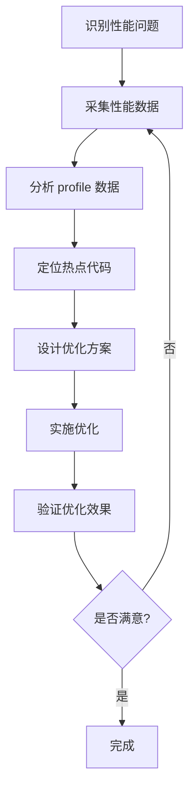

# 性能分析

Go 提供了强大的性能分析工具，帮助开发者定位和解决性能瓶颈。

## pprof 工具

### CPU 分析

```go
import (
    _ "net/http/pprof"
    "net/http"
)

func main() {
    // 启动 pprof HTTP 服务
    go func() {
        http.ListenAndServe("localhost:6060", nil)
    }()

    // 应用程序主逻辑
    runApplication()
}

func runApplication() {
    // 模拟 CPU 密集操作
    for i := 0; i < 1000000; i++ {
        _ = fib(20)
    }
}

func fib(n int) int {
    if n <= 1 {
        return n
    }
    return fib(n-1) + fib(n-2)
}
```

### 采集 CPU profile

```bash
# 使用 go tool pprof
go tool pprof http://localhost:6060/debug/pprof/profile?seconds=30

# 或在代码中采集
import (
    "os"
    "runtime/pprof"
)

func main() {
    // 开始 CPU profile
    f, _ := os.Create("cpu.prof")
    pprof.StartCPUProfile(f)
    defer pprof.StopCPUProfile()

    // 运行应用程序
    runApplication()
}
```

### 分析 CPU profile

```bash
# 交互式分析
go tool pprof cpu.prof

# 常用命令
(pprof) top        # 显示 top 函数
(pprof) list fib   # 列出函数代码
(pprof) web        # 生成可视化图
(pprof) pdf        # 生成 PDF

# 命令行直接分析
go tool pprof -text cpu.prof | head -20
go tool pprof -top cpu.prof
```

## 内存分析

### Heap profile

```go
import (
    "os"
    "runtime/pprof"
)

func main() {
    // 应用程序运行
    runApplication()

    // 采集内存 profile
    f, _ := os.Create("heap.prof")
    defer f.Close()
    pprof.WriteHeapProfile(f)
}
```

### HTTP 接口

```bash
# 查看当前堆信息
curl http://localhost:6060/debug/pprof/heap

# 采集 heap profile
go tool pprof http://localhost:6060/debug/pprof/heap

# 分析内存分配
go tool pprof -alloc_space heap.prof
go tool pprof -inuse_space heap.prof
```

### 内存泄漏检测

```go
// 定期检查内存使用
func monitorMemory() {
    var m runtime.MemStats
    for i := 0; ; i++ {
        runtime.ReadMemStats(&m)

        log.Printf(
            "Alloc: %vMB, TotalAlloc: %vMB, Sys: %vMB, NumGC: %v",
            m.Alloc/1024/1024,
            m.TotalAlloc/1024/1024,
            m.Sys/1024/1024,
            m.NumGC,
        )

        time.Sleep(10 * time.Second)
    }
}
```

## Goroutine 分析

### Goroutine profile

```bash
# 查看 goroutine 数量
curl http://localhost:6060/debug/pprof/

# 采集 goroutine profile
go tool pprof http://localhost:6060/debug/pprof/goroutine

# 分析 goroutine
(pprof) traces  # 显示所有 goroutine 的栈跟踪
(pprof) top     # 显示创建最多 goroutine 的函数
```

### Goroutine 泄漏检测

```go
// 检测 goroutine 泄漏
func checkGoroutineLeak() {
    initial := runtime.NumGoroutine()

    // 运行可能泄漏的代码
    potentiallyLeakingCode()

    // 等待一段时间
    time.Sleep(time.Second)

    final := runtime.NumGoroutine()
    if final > initial {
        log.Printf("可能的 goroutine 泄漏: %d -> %d\n", initial, final)
    }
}
```

## Trace 工具

### 采集 trace

```go
import (
    "os"
    "runtime/trace"
)

func main() {
    // 开始 trace
    f, _ := os.Create("trace.out")
    defer f.Close()

    trace.Start(f)
    defer trace.Stop()

    // 运行应用程序
    runApplication()
}
```

### 使用 task 和 region

```go
func processTask() {
    // 创建任务
    ctx, task := trace.NewTask(context.Background(), "processTask")
    defer task.End()

    // 创建区域
    trace.Log(ctx, "start", "开始处理")
    region := trace.StartRegion(ctx, "processing")
    defer region.End()

    // 模拟处理
    time.Sleep(100 * time.Millisecond)

    trace.Log(ctx, "complete", "处理完成")
}
```

### 分析 trace

```bash
# 在浏览器中查看 trace
go tool trace trace.out

# 或使用 HTTP 服务器
go tool trace -http=:8080 trace.out
```

## Benchmark 测试

### 编写 benchmark

```go
func BenchmarkFunction(b *testing.B) {
    for i := 0; i < b.N; i++ {
        Function()
    }
}

func BenchmarkParallel(b *testing.B) {
    b.RunParallel(func(pb *testing.PB) {
        for pb.Next() {
            Function()
        }
    })
}

// 子 benchmark
func BenchmarkOperations(b *testing.B) {
    b.Run("Add", func(b *testing.B) {
        for i := 0; i < b.N; i++ {
            _ = 1 + 1
        }
    })

    b.Run("Multiply", func(b *testing.B) {
        for i := 0; i < b.N; i++ {
            _ = 2 * 3
        }
    })
}
```

### 运行 benchmark

```bash
# 运行所有 benchmark
go test -bench=.

# 运行特定 benchmark
go test -bench=BenchmarkFunction

# 运行多次提高准确性
go test -bench=. -count=5

# 包含内存统计
go test -bench=. -benchmem

# CPU profile
go test -bench=. -cpuprofile=cpu.prof

# 内存 profile
go test -bench=. -memprofile=mem.prof
```

### 分析 benchmark 结果

```go
// 比较两个实现
func BenchmarkCompare(b *testing.B) {
    data := make([]int, 1000)

    b.Run("Old", func(b *testing.B) {
        for i := 0; i < b.N; i++ {
            OldImplementation(data)
        }
    })

    b.Run("New", func(b *testing.B) {
        for i := 0; i < b.N; i++ {
            NewImplementation(data)
        }
    })
}
```

## Block 和 Mutex 分析

### Block profile

```go
import (
    "runtime"
)

func main() {
    // 启用 block profiling
    runtime.SetBlockProfileRate(1)

    // 运行应用程序
    runApplication()

    // 采集 block profile
    f, _ := os.Create("block.prof")
    defer f.Close()
    pprof.Lookup("block").WriteTo(f, 0)
}
```

### Mutex profile

```go
func main() {
    // 启用 mutex profiling
    runtime.SetMutexProfileFraction(1)

    // 运行应用程序
    runApplication()

    // 采集 mutex profile
    f, _ := os.Create("mutex.prof")
    defer f.Close()
    pprof.Lookup("mutex").WriteTo(f, 0)
}
```

## 火焰图

### 生成火焰图

```bash
# 生成 CPU 火焰图
go tool pprof -http=:8080 cpu.prof

# 或使用 FlameGraph 脚本
go get -u github.com/uber/go-torch
go-torch -cpu cpu.prof

# 生成 SVG
go-torch -cpu cpu.prof -o flamegraph.svg
```

### 可视化选项

```bash
# 图形类型
(pprof) web          # 调用图
(pprof) func         # 函数图
(pprof) list         # 源码
(pprof) callgraph    # 调用图

# 粒度控制
(pprof) sample_index = inuse_space    # 使用内存
(pprof) sample_index = alloc_objects   # 分配对象
(pprof) sample_index = alloc_space     # 分配空间

# 聚焦函数
(pprof) focus functionName
(pprof) hide functionName
(pprof) show functionName
```

## 性能分析流程

### 分析步骤



### 实战示例

```go
// 性能分析示例
func analyzePerformance() {
    // 1. 基线测试
    baseline := benchmarkFunction()

    // 2. 优化
    optimized := benchmarkOptimized()

    // 3. 比较
    improvement := (baseline - optimized) / baseline * 100
    log.Printf("性能提升: %.2f%%\n", improvement)
}

func benchmarkFunction() time.Duration {
    start := time.Now()
    for i := 0; i < 10000; i++ {
        processData(generateData())
    }
    return time.Since(start)
}
```

## 最佳实践

::: tip 分析建议

1. **先测量后优化** - 使用数据驱动优化
2. **关注热点** - 优化最耗时的代码
3. **多次采样** - 确保结果可靠
4. **生产环境** - 在真实负载下分析
5. **持续监控** - 建立性能基线

:::

```go
// ✅ 好的模式：结构化分析
func ProfileAnalysis() {
    // CPU 分析
    if err := profileCPU(); err != nil {
        log.Printf("CPU profiling failed: %v", err)
    }

    // 内存分析
    if err := profileMemory(); err != nil {
        log.Printf("Memory profiling failed: %v", err)
    }

    // goroutine 分析
    if err := profileGoroutines(); err != nil {
        log.Printf("Goroutine profiling failed: %v", err)
    }
}
```

## 总结

| 工具 | 用途 |
|------|------|
| **pprof** - CPU 和内存分析 |
| **trace** - 执行跟踪 |
| **benchmark** - 性能测试 |
| **火焰图** - 可视化分析 |

::: v-pre

[概述](./README.md) → [内存优化](./memory.md)

:::
