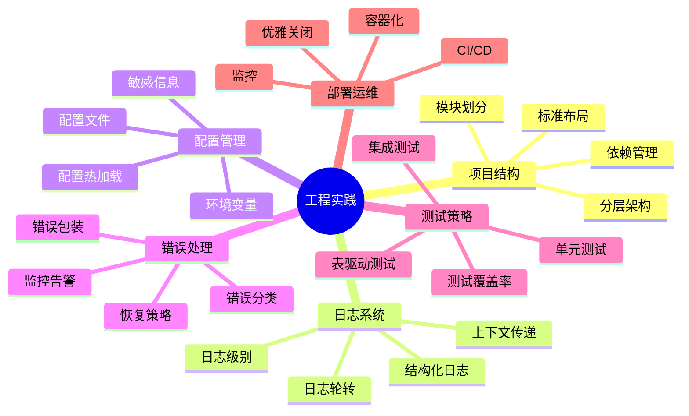

# 工程实践

良好的工程实践是构建可维护、可扩展 Go 应用的基础。

## 概述



## 项目结构

### 标准项目布局

```
myapp/
├── cmd/                    # 主应用程序
│   ├── myapp/             # 可执行文件
│   │   └── main.go
│   └── worker/            # 其他可执行文件
│       └── main.go
├── internal/              # 私有应用和库代码
│   ├── handler/          # HTTP 处理器
│   ├── service/          # 业务逻辑
│   ├── repository/       # 数据访问
│   └── model/            # 数据模型
├── pkg/                   # 可被外部使用的库
│   └── util/
├── api/                   # API 定义文件
│   ├── http/             # HTTP API
│   └── grpc/             # gRPC API
├── config/                # 配置文件
├── scripts/               # 构建和部署脚本
├── docs/                  # 文档
├── test/                  # 额外的测试数据
├── go.mod
├── go.sum
├── Makefile
└── README.md
```

### 分层架构

```go
// handler 层：处理 HTTP 请求
type Handler struct {
    service Service
}

func (h *Handler) Handle(c *gin.Context) {
    var req Request
    if err := c.ShouldBindJSON(&req); err != nil {
        c.JSON(400, ErrorResponse(err))
        return
    }

    result, err := h.service.Process(req)
    if err != nil {
        c.JSON(500, ErrorResponse(err))
        return
    }

    c.JSON(200, SuccessResponse(result))
}

// service 层：业务逻辑
type Service struct {
    repo Repository
    logger Logger
}

func (s *Service) Process(req Request) (Response, error) {
    // 业务逻辑
    data, err := s.repo.FindByID(req.ID)
    if err != nil {
        s.logger.Error("failed to find data", "id", req.ID, "error", err)
        return Response{}, err
    }

    // 处理数据
    return Response{Data: data}, nil
}

// repository 层：数据访问
type Repository struct {
    db *sql.DB
}

func (r *Repository) FindByID(id string) (Data, error) {
    var data Data
    err := r.db.QueryRow("SELECT * FROM data WHERE id = ?", id).Scan(
        &data.ID, &data.Name, &data.Value,
    )
    return data, err
}
```

## 日志系统

### 结构化日志

```go
import "go.uber.org/zap"

// 初始化日志器
func initLogger() *zap.Logger {
    logger, _ := zap.NewProduction()
    return logger
}

// 使用
func process(logger *zap.Logger) {
    logger.Info("Processing started",
        zap.String("user", "user123"),
        zap.Int("count", 10),
    )

    // 处理逻辑

    logger.Info("Processing completed",
        zap.Duration("elapsed", time.Since(start)),
    )
}
```

### 日志级别

```go
// 使用不同日志级别
func logExamples(logger *zap.Logger) {
    // Debug：详细的调试信息
    logger.Debug("Processing item",
        zap.String("item", "item1"),
        zap.Int("value", 42),
    )

    // Info：一般信息
    logger.Info("User logged in",
        zap.String("user", "alice"),
    )

    // Warn：警告信息
    logger.Warn("High memory usage",
        zap.Int64("usage", 1024*1024*1024),
    )

    // Error：错误信息
    logger.Error("Failed to process",
        zap.String("error", err.Error()),
    )

    // Fatal：致命错误后退出
    logger.Fatal("Cannot connect to database",
        zap.String("dsn", dsn),
    )
}
```

## 配置管理

### 配置结构

```go
type Config struct {
    Server   ServerConfig   `mapstructure:"server"`
    Database DatabaseConfig `mapstructure:"database"`
    Log      LogConfig      `mapstructure:"log"`
}

type ServerConfig struct {
    Host         string `mapstructure:"host"`
    Port         int    `mapstructure:"port"`
    ReadTimeout  int    `mapstructure:"read_timeout"`
    WriteTimeout int    `mapstructure:"write_timeout"`
}

type DatabaseConfig struct {
    Host     string `mapstructure:"host"`
    Port     int    `mapstructure:"port"`
    User     string `mapstructure:"user"`
    Password string `mapstructure:"password"`
    Database string `mapstructure:"database"`
}

type LogConfig struct {
    Level  string `mapstructure:"level"`
    Format string `mapstructure:"format"`
}
```

### 加载配置

```go
import "github.com/spf13/viper"

func LoadConfig(configPath string) (*Config, error) {
    v := viper.New()

    // 设置配置文件
    v.SetConfigFile(configPath)
    v.SetConfigType("yaml")

    // 读取环境变量
    v.AutomaticEnv()
    v.SetEnvPrefix("APP")
    v.SetEnvKeyReplacer(strings.NewReplacer(".", "_"))

    // 读取配置文件
    if err := v.ReadInConfig(); err != nil {
        return nil, err
    }

    // 解析配置
    var config Config
    if err := v.Unmarshal(&config); err != nil {
        return nil, err
    }

    return &config, nil
}
```

## 错误处理

### 错误包装

```go
// 包装错误提供上下文
func processUser(userID string) error {
    user, err := repo.FindUser(userID)
    if err != nil {
        return fmt.Errorf("failed to find user %s: %w", userID, err)
    }

    return nil
}

// 自定义错误
type ValidationError struct {
    Field   string
    Message string
}

func (e *ValidationError) Error() string {
    return fmt.Sprintf("validation error on field %s: %s", e.Field, e.Message)
}

func validateUser(user User) error {
    if user.Name == "" {
        return &ValidationError{
            Field:   "name",
            Message: "name is required",
        }
    }
    return nil
}
```

### 错误恢复

```go
func RecoverMiddleware(logger *zap.Logger) gin.RecoveryFunc {
    return func(c *gin.Context, recovered interface{}) {
        logger.Error("Panic recovered",
            zap.Any("error", recovered),
            zap.String("path", c.Request.URL.Path),
        )

        c.JSON(500, gin.H{
            "error": "Internal server error",
        })
    }
}
```

## 测试策略

### 单元测试

```go
func TestService_Process(t *testing.T) {
    tests := []struct {
        name    string
        input   Request
        want    Response
        wantErr bool
    }{
        {
            name: "success",
            input: Request{ID: "123"},
            want: Response{Data: Data{ID: "123"}},
            wantErr: false,
        },
        {
            name: "not found",
            input: Request{ID: "404"},
            wantErr: true,
        },
    }

    for _, tt := range tests {
        t.Run(tt.name, func(t *testing.T) {
            // 使用 mock repository
            mockRepo := &MockRepository{
                data: map[string]Data{
                    "123": {ID: "123", Name: "Test"},
                },
            }

            service := NewService(mockRepo, zap.NewNop())

            result, err := service.Process(tt.input)

            if (err != nil) != tt.wantErr {
                t.Errorf("Process() error = %v, wantErr %v", err, tt.wantErr)
                return
            }

            if !tt.wantErr && !reflect.DeepEqual(result, tt.want) {
                t.Errorf("Process() = %v, want %v", result, tt.want)
            }
        })
    }
}
```

### 集成测试

```go
func TestAPI_Integration(t *testing.T) {
    // 设置测试数据库
    db := setupTestDB(t)
    defer teardownTestDB(t, db)

    // 创建测试服务器
    router := setupRouter(db)
    server := httptest.NewServer(router)
    defer server.Close()

    // 测试请求
    resp, err := http.Post(server.URL+"/api/users", "application/json", bytes.NewReader([]byte(`{"name":"Alice"}`)))
    if err != nil {
        t.Fatalf("Failed to make request: %v", err)
    }
    defer resp.Body.Close()

    // 验证响应
    if resp.StatusCode != http.StatusOK {
        t.Errorf("Expected status 200, got %d", resp.StatusCode)
    }
}
```

## 部署运维

### Dockerfile

```dockerfile
# 多阶段构建
FROM golang:1.21-alpine AS builder

WORKDIR /app
COPY go.mod go.sum ./
RUN go mod download

COPY . .
RUN CGO_ENABLED=0 go build -o myapp ./cmd/myapp

# 运行时镜像
FROM alpine:latest

RUN apk --no-cache add ca-certificates

WORKDIR /root/

COPY --from=builder /app/myapp .

EXPOSE 8080

CMD ["./myapp"]
```

### 优雅关闭

```go
func main() {
    // 创建服务器
    server := &http.Server{
        Addr:    ":8080",
        Handler: router,
    }

    // 启动服务器
    go func() {
        if err := server.ListenAndServe(); err != nil && err != http.ErrServerClosed {
            log.Fatalf("Server failed: %v", err)
        }
    }()

    // 等待中断信号
    quit := make(chan os.Signal, 1)
    signal.Notify(quit, syscall.SIGINT, syscall.SIGTERM)
    <-quit

    log.Println("Shutting down server...")

    // 优雅关闭
    ctx, cancel := context.WithTimeout(context.Background(), 30*time.Second)
    defer cancel()

    if err := server.Shutdown(ctx); err != nil {
        log.Fatalf("Server forced to shutdown: %v", err)
    }

    log.Println("Server exited")
}
```

## 最佳实践

::: tip 工程实践建议

1. **遵循惯例** - 使用标准项目布局
2. **分层清晰** - handler、service、repository
3. **日志完善** - 结构化日志记录关键信息
4. **配置灵活** - 支持环境变量和配置文件
5. **测试充分** - 单元测试和集成测试
6. **优雅关闭** - 正确处理信号和清理

:::

```go
// ✅ 好的模式
func goodEngineering() {
    // 初始化
    logger := initLogger()
    config := loadConfig()
    db := connectDB(config.Database)

    // 依赖注入
    repo := repository.New(db)
    service := service.New(repo, logger)
    handler := handler.New(service)

    // 启动服务
    server := startServer(handler)

    // 优雅关闭
    waitForShutdown(server)
}
```

## 内容导航

| 章节 | 内容 |
|------|------|
| [项目结构](./project-structure.md) | 标准布局和分层架构 |
| [日志系统](./logging.md) | 结构化日志和日志级别 |
| [配置管理](./configuration.md) | 配置加载和环境变量 |
| [错误处理](./error-handling.md) | 错误包装和恢复策略 |
| [测试策略](./testing.md) | 单元测试和集成测试 |
| [部署运维](./deployment.md) | CI/CD 和容器化 |

::: v-pre

[性能优化](/langs/go/10-performance/) → [项目结构](./project-structure.md)

:::
