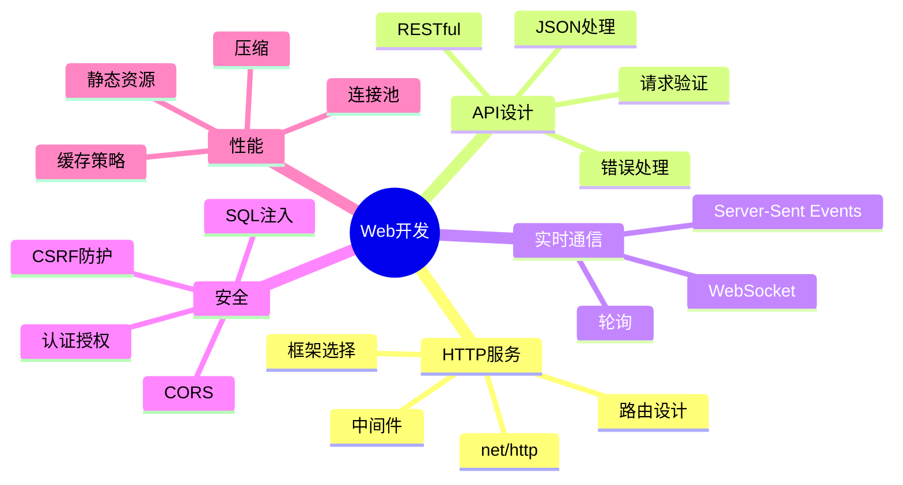

# Web 开发

Go 语言在 Web 开发领域表现出色，拥有丰富的生态系统和强大的标准库支持。

## 概述



## HTTP 服务器

### 标准 net/http

```go
package main

import (
    "fmt"
    "net/http"
)

func handler(w http.ResponseWriter, r *http.Request) {
    fmt.Fprintf(w, "Hello, %s!", r.URL.Path[1:])
}

func main() {
    http.HandleFunc("/", handler)

    fmt.Println("Server starting on :8080")
    http.ListenAndServe(":8080", nil)
}
```

### 使用 Gin 框架

```go
package main

import (
    "github.com/gin-gonic/gin"
)

func main() {
    r := gin.Default()

    r.GET("/ping", func(c *gin.Context) {
        c.JSON(200, gin.H{
            "message": "pong",
        })
    })

    r.Run(":8080")
}
```

## 路由设计

### RESTful 路由

```go
func setupRoutes(r *gin.Engine) {
    api := r.Group("/api/v1")

    // 用户资源
    users := api.Group("/users")
    {
        users.GET("", listUsers)      // GET /api/v1/users
        users.POST("", createUser)    // POST /api/v1/users
        users.GET("/:id", getUser)    // GET /api/v1/users/:id
        users.PUT("/:id", updateUser) // PUT /api/v1/users/:id
        users.DELETE("/:id", deleteUser) // DELETE /api/v1/users/:id
    }

    // 订单资源
    orders := api.Group("/orders")
    {
        orders.GET("", listOrders)
        orders.POST("", createOrder)
        orders.GET("/:id", getOrder)
    }
}
```

### 路径参数

```go
// 路径参数
func getUser(c *gin.Context) {
    id := c.Param("id")  // 获取路径参数

    user, err := userService.Get(id)
    if err != nil {
        c.JSON(404, gin.H{"error": "User not found"})
        return
    }

    c.JSON(200, user)
}

// 查询参数
func listUsers(c *gin.Context) {
    page := c.DefaultQuery("page", "1")
    limit := c.DefaultQuery("limit", "10")

    users := userService.List(page, limit)
    c.JSON(200, users)
}
```

## 中间件

### 日志中间件

```go
func LoggerMiddleware(logger *zap.Logger) gin.HandlerFunc {
    return func(c *gin.Context) {
        start := time.Now()
        path := c.Request.URL.Path
        raw := c.Request.URL.RawQuery

        c.Next()

        latency := time.Since(start)
        status := c.Writer.Status()

        logger.Info("Request",
            zap.String("method", c.Request.Method),
            zap.String("path", path),
            zap.String("query", raw),
            zap.Int("status", status),
            zap.Duration("latency", latency),
        )
    }
}
```

### 认证中间件

```go
func AuthMiddleware() gin.HandlerFunc {
    return func(c *gin.Context) {
        token := c.GetHeader("Authorization")

        if token == "" {
            c.JSON(401, gin.H{"error": "Authorization header required"})
            c.Abort()
            return
        }

        // 验证 token
        userID, err := validateToken(token)
        if err != nil {
            c.JSON(401, gin.H{"error": "Invalid token"})
            c.Abort()
            return
        }

        // 存储用户信息到上下文
        c.Set("user_id", userID)
        c.Next()
    }
}
```

### CORS 中间件

```go
func CORSMiddleware() gin.HandlerFunc {
    return func(c *gin.Context) {
        c.Writer.Header().Set("Access-Control-Allow-Origin", "*")
        c.Writer.Header().Set("Access-Control-Allow-Credentials", "true")
        c.Writer.Header().Set("Access-Control-Allow-Headers",
            "Content-Type, Content-Length, Accept-Encoding, X-CSRF-Token, Authorization, accept, origin, Cache-Control, X-Requested-With")
        c.Writer.Header().Set("Access-Control-Allow-Methods", "POST, OPTIONS, GET, PUT, DELETE")

        if c.Request.Method == "OPTIONS" {
            c.AbortWithStatus(204)
            return
        }

        c.Next()
    }
}
```

## JSON 处理

### 请求绑定

```go
type CreateUserRequest struct {
    Name  string `json:"name" binding:"required,min=3,max=50"`
    Email string `json:"email" binding:"required,email"`
    Age   int    `json:"age" binding:"min=1,max=120"`
}

func createUser(c *gin.Context) {
    var req CreateUserRequest

    // 绑定和验证
    if err := c.ShouldBindJSON(&req); err != nil {
        c.JSON(400, gin.H{"error": err.Error()})
        return
    }

    // 处理请求
    user := userService.Create(req)
    c.JSON(201, user)
}
```

### 响应格式

```go
type Response struct {
    Success bool        `json:"success"`
    Data    interface{} `json:"data,omitempty"`
    Error   *ErrorInfo  `json:"error,omitempty"`
}

type ErrorInfo struct {
    Code    string `json:"code"`
    Message string `json:"message"`
}

func SuccessResponse(c *gin.Context, data interface{}) {
    c.JSON(200, Response{
        Success: true,
        Data:    data,
    })
}

func ErrorResponse(c *gin.Context, code int, errCode, message string) {
    c.JSON(code, Response{
        Success: false,
        Error: &ErrorInfo{
            Code:    errCode,
            Message: message,
        },
    })
}
```

## 文件上传

### 单文件上传

```go
func uploadFile(c *gin.Context) {
    file, err := c.FormFile("file")
    if err != nil {
        c.JSON(400, gin.H{"error": "No file uploaded"})
        return
    }

    // 验证文件大小
    if file.Size > 10*1024*1024 { // 10MB
        c.JSON(400, gin.H{"error": "File too large"})
        return
    }

    // 保存文件
    filename := filepath.Join("./uploads", file.Filename)
    if err := c.SaveUploadedFile(file, filename); err != nil {
        c.JSON(500, gin.H{"error": "Failed to save file"})
        return
    }

    c.JSON(200, gin.H{
        "filename": file.Filename,
        "size":     file.Size,
    })
}
```

### 多文件上传

```go
func uploadFiles(c *gin.Context) {
    form, err := c.MultipartForm()
    if err != nil {
        c.JSON(400, gin.H{"error": err.Error()})
        return
    }

    files := form.File["files"]
    var uploadedFiles []string

    for _, file := range files {
        filename := filepath.Join("./uploads", file.Filename)
        if err := c.SaveUploadedFile(file, filename); err != nil {
            continue
        }
        uploadedFiles = append(uploadedFiles, file.Filename)
    }

    c.JSON(200, gin.H{
        "files": uploadedFiles,
    })
}
```

## WebSocket

### WebSocket 处理器

```go
var upgrader = websocket.Upgrader{
    ReadBufferSize:  1024,
    WriteBufferSize: 1024,
}

func wsHandler(c *gin.Context) {
    conn, err := upgrader.Upgrade(c.Writer, c.Request, nil)
    if err != nil {
        log.Printf("WebSocket upgrade failed: %v", err)
        return
    }
    defer conn.Close()

    for {
        var msg map[string]interface{}
        if err := conn.ReadJSON(&msg); err != nil {
            log.Printf("Read error: %v", err)
            break
        }

        // 处理消息
        response := map[string]interface{}{
            "type":    "echo",
            "payload": msg,
        }

        if err := conn.WriteJSON(response); err != nil {
            log.Printf("Write error: %v", err)
            break
        }
    }
}
```

## 内容协商

### 格式协商

```go
func getUserHandler(c *gin.Context) {
    user, err := userService.Get(c.Param("id"))
    if err != nil {
        c.JSON(404, gin.H{"error": "Not found"})
        return
    }

    // 根据 Accept 头返回不同格式
    switch c.GetHeader("Accept") {
    case "application/xml":
        c.XML(200, user)
    case "application/json":
        c.JSON(200, user)
    default:
        c.JSON(200, user)
    }
}
```

## 最佳实践

::: tip Web 开发建议

1. **RESTful** - 遵循 REST 设计原则
2. **版本控制** - API 使用版本号
3. **错误处理** - 统一的错误格式
4. **文档完善** - 使用 Swagger 文档
5. **安全第一** - 认证、授权、验证

:::

```go
// ✅ 好的模式
func goodWebHandler(c *gin.Context) {
    // 1. 验证请求
    var req Request
    if err := c.ShouldBindJSON(&req); err != nil {
        c.JSON(400, ErrorResponse("INVALID_REQUEST", err.Error()))
        return
    }

    // 2. 业务逻辑
    result, err := service.Process(req)
    if err != nil {
        c.JSON(500, ErrorResponse("INTERNAL_ERROR", "Processing failed"))
        return
    }

    // 3. 返回响应
    c.JSON(200, SuccessResponse(result))
}
```

## 内容导航

| 章节 | 内容 |
|------|------|
| [HTTP服务](./http-server.md) | net/http 和框架使用 |
| [路由](./routing.md) | 路由设计和中间件 |
| [验证](./validation.md) | 请求验证和绑定 |
| [JSON API](./json-api.md) | RESTful API 设计 |
| [WebSocket](./websockets.md) | 实时通信 |
| [安全](./security.md) | 认证授权和安全防护 |

::: v-pre

[工程实践](/langs/go/11-engineering/) → [HTTP服务](./http-server.md)

:::
