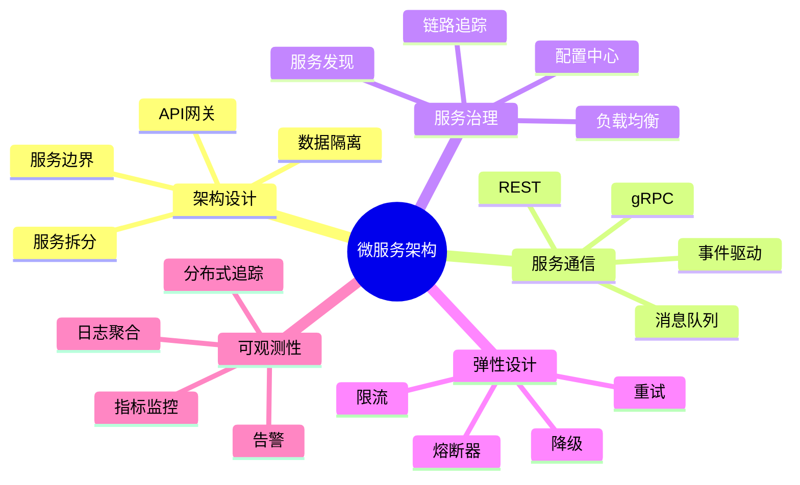

# 微服务架构

微服务架构将应用拆分为一组小型、独立的服务。

## 概述



## 架构模式

### 服务拆分

```go
// 用户服务
// services/user/main.go
package main

func main() {
    // 初始化依赖
    db := NewDatabase()
    userRepo := repository.NewUserRepository(db)
    userService := service.NewUserService(userRepo)
    userHandler := handler.NewUserHandler(userService)

    // 创建 HTTP 服务器
    r := gin.Default()

    // 注册路由
    userHandler.RegisterRoutes(r)

    // 启动服务
    r.Run(":8001")
}

// 订单服务
// services/order/main.go
package main

func main() {
    db := NewDatabase()
    orderRepo := repository.NewOrderRepository(db)

    // 用户服务客户端
    userClient := NewUserClient("http://user-service:8001")

    orderService := service.NewOrderService(orderRepo, userClient)
    orderHandler := handler.NewOrderHandler(orderService)

    r := gin.Default()
    orderHandler.RegisterRoutes(r)

    r.Run(":8002")
}
```

### API 网关

```go
// gateway/main.go
package main

type APIGateway struct {
    routers map[string]http.Handler
    mu      sync.RWMutex
}

func NewAPIGateway() *APIGateway {
    return &APIGateway{
        routers: make(map[string]http.Handler),
    }
}

func (g *APIGateway) RegisterService(path string, handler http.Handler) {
    g.mu.Lock()
    defer g.mu.Unlock()
    g.routers[path] = handler
}

func (g *APIGateway) ServeHTTP(w http.ResponseWriter, r *http.Request) {
    // 路由到对应服务
    for path, handler := range g.routers {
        if strings.HasPrefix(r.URL.Path, path) {
            // 移除服务前缀
            r.URL.Path = strings.TrimPrefix(r.URL.Path, path)
            handler.ServeHTTP(w, r)
            return
        }
    }

    http.NotFound(w, r)
}

func main() {
    gateway := NewAPIGateway()

    // 注册服务
    userService := NewUserServiceProxy("http://user-service:8001")
    orderService := NewOrderServiceProxy("http://order-service:8002")

    gateway.RegisterService("/api/users", userService)
    gateway.RegisterService("/api/orders", orderService)

    // 中间件
    handler := Chain(
        gateway,
        LoggingMiddleware,
        AuthMiddleware,
        CORSMiddleware,
    )

    http.ListenAndServe(":8080", handler)
}
```

## 服务通信

### REST 客户端

```go
type UserClient struct {
    baseURL    string
    httpClient *http.Client
}

func NewUserClient(baseURL string) *UserClient {
    return &UserClient{
        baseURL: baseURL,
        httpClient: &http.Client{
            Timeout: 10 * time.Second,
        },
    }
}

func (c *UserClient) GetUser(ctx context.Context, userID string) (*User, error) {
    url := fmt.Sprintf("%s/users/%s", c.baseURL, userID)

    req, err := http.NewRequestWithContext(ctx, "GET", url, nil)
    if err != nil {
        return nil, err
    }

    resp, err := c.httpClient.Do(req)
    if err != nil {
        return nil, err
    }
    defer resp.Body.Close()

    if resp.StatusCode != 200 {
        return nil, fmt.Errorf("user service returned: %d", resp.StatusCode)
    }

    var user User
    if err := json.NewDecoder(resp.Body).Decode(&user); err != nil {
        return nil, err
    }

    return &user, nil
}
```

### gRPC 客户端

```go
// proto/user.proto
syntax = "proto3";

service UserService {
    rpc GetUser(GetUserRequest) returns (GetUserResponse);
    rpc CreateUser(CreateUserRequest) returns (CreateUserResponse);
}

message GetUserRequest {
    string user_id = 1;
}

message GetUserResponse {
    User user = 1;
}

// client/user_client.go
type UserGRPCClient struct {
    client proto.UserServiceClient
}

func NewUserGRPCClient(addr string) (*UserGRPCClient, error) {
    conn, err := grpc.Dial(addr,
        grpc.WithTransportCredentials(insecure.NewCredentials()),
    )
    if err != nil {
        return nil, err
    }

    return &UserGRPCClient{
        client: proto.NewUserServiceClient(conn),
    }, nil
}

func (c *UserGRPCClient) GetUser(ctx context.Context, userID string) (*User, error) {
    resp, err := c.client.GetUser(ctx, &proto.GetUserRequest{
        UserId: userID,
    })
    if err != nil {
        return nil, err
    }

    return &User{
        ID:    resp.User.Id,
        Name:  resp.User.Name,
        Email: resp.User.Email,
    }, nil
}
```

### 消息队列

```go
type EventPublisher struct {
    conn *amqp.Connection
}

func NewEventPublisher(url string) (*EventPublisher, error) {
    conn, err := amqp.Dial(url)
    if err != nil {
        return nil, err
    }

    return &EventPublisher{conn: conn}, nil
}

func (p *EventPublisher) PublishUserCreated(ctx context.Context, user *User) error {
    ch, err := p.conn.Channel()
    if err != nil {
        return err
    }
    defer ch.Close()

    event := map[string]interface{}{
        "type": "user.created",
        "data": map[string]string{
            "user_id": user.ID,
            "name":    user.Name,
            "email":   user.Email,
        },
        "timestamp": time.Now().Unix(),
    }

    body, _ := json.Marshal(event)

    return ch.PublishWithContext(
        ctx,
        "user.events",
        "",
        false,
        false,
        amqp.Publishing{
            ContentType: "application/json",
            Body:        body,
        },
    )
}
```

## 服务发现

### 服务注册

```go
type ServiceRegistry struct {
    services map[string][]*ServiceInstance
    mu       sync.RWMutex
}

type ServiceInstance struct {
    ID       string
    Name     string
    Address  string
    Port     int
    Metadata map[string]string
}

func NewServiceRegistry() *ServiceRegistry {
    return &ServiceRegistry{
        services: make(map[string][]*ServiceInstance),
    }
}

func (r *ServiceRegistry) Register(instance *ServiceInstance) error {
    r.mu.Lock()
    defer r.mu.Unlock()

    r.services[instance.Name] = append(r.services[instance.Name], instance)
    return nil
}

func (r *ServiceRegistry) Deregister(serviceName, instanceID string) error {
    r.mu.Lock()
    defer r.mu.Unlock()

    instances := r.services[serviceName]
    for i, inst := range instances {
        if inst.ID == instanceID {
            r.services[serviceName] = append(instances[:i], instances[i+1:]...)
            return nil
        }
    }

    return fmt.Errorf("instance not found")
}

func (r *ServiceRegistry) Discover(serviceName string) (*ServiceInstance, error) {
    r.mu.RLock()
    defer r.mu.RUnlock()

    instances := r.services[serviceName]
    if len(instances) == 0 {
        return nil, fmt.Errorf("no instances found for %s", serviceName)
    }

    // 简单的轮询负载均衡
    idx := rand.Intn(len(instances))
    return instances[idx], nil
}
```

### 健康检查

```go
type HealthChecker struct {
    registry *ServiceRegistry
    interval time.Duration
}

func NewHealthChecker(registry *ServiceRegistry, interval time.Duration) *HealthChecker {
    return &HealthChecker{
        registry: registry,
        interval: interval,
    }
}

func (h *HealthChecker) Start() {
    ticker := time.NewTicker(h.interval)
    defer ticker.Stop()

    for range ticker.C {
        h.checkAllServices()
    }
}

func (h *HealthChecker) checkAllServices() {
    h.registry.mu.RLock()
    defer h.registry.mu.RUnlock()

    for serviceName, instances := range h.registry.services {
        for _, instance := range instances {
            go h.checkService(serviceName, instance)
        }
    }
}

func (h *HealthChecker) checkService(serviceName string, instance *ServiceInstance) {
    url := fmt.Sprintf("http://%s:%d/health", instance.Address, instance.Port)

    ctx, cancel := context.WithTimeout(context.Background(), 5*time.Second)
    defer cancel()

    req, _ := http.NewRequestWithContext(ctx, "GET", url, nil)
    resp, err := http.DefaultClient.Do(req)

    if err != nil || resp.StatusCode != 200 {
        // 服务不健康，注销实例
        h.registry.Deregister(serviceName, instance.ID)
    }
}
```

## 弹性模式

### 熔断器

```go
type CircuitState int

const (
    StateClosed CircuitState = iota
    StateHalfOpen
    StateOpen
)

type CircuitBreaker struct {
    mu                sync.Mutex
    state             CircuitState
    failureCount      int
    successCount      int
    failureThreshold  int
    successThreshold  int
    timeout           time.Duration
    lastFailureTime   time.Time
}

func NewCircuitBreaker(failureThreshold, successThreshold int, timeout time.Duration) *CircuitBreaker {
    return &CircuitBreaker{
        state:            StateClosed,
        failureThreshold: failureThreshold,
        successThreshold: successThreshold,
        timeout:          timeout,
    }
}

func (cb *CircuitBreaker) Execute(fn func() error) error {
    cb.mu.Lock()

    if cb.state == StateOpen {
        if time.Since(cb.lastFailureTime) > cb.timeout {
            cb.state = StateHalfOpen
            cb.successCount = 0
        } else {
            cb.mu.Unlock()
            return fmt.Errorf("circuit breaker is open")
        }
    }

    cb.mu.Unlock()

    err := fn()

    cb.mu.Lock()
    defer cb.mu.Unlock()

    if err != nil {
        cb.failureCount++
        cb.lastFailureTime = time.Now()

        if cb.failureCount >= cb.failureThreshold {
            cb.state = StateOpen
        }

        return err
    }

    cb.successCount++

    if cb.state == StateHalfOpen && cb.successCount >= cb.successThreshold {
        cb.state = StateClosed
        cb.failureCount = 0
    }

    return nil
}
```

### 重试机制

```go
type RetryPolicy struct {
    MaxAttempts int
    InitialDelay time.Duration
    MaxDelay     time.Duration
    Multiplier   float64
}

func RetryWithBackoff(policy *RetryPolicy, fn func() error) error {
    delay := policy.InitialDelay

    for attempt := 0; attempt < policy.MaxAttempts; attempt++ {
        err := fn()
        if err == nil {
            return nil
        }

        if attempt == policy.MaxAttempts-1 {
            return err
        }

        time.Sleep(delay)
        delay = time.Duration(float64(delay) * policy.Multiplier)

        if delay > policy.MaxDelay {
            delay = policy.MaxDelay
        }
    }

    return fmt.Errorf("max retries exceeded")
}
```

## 最佳实践

::: tip 微服务建议

1. **服务边界** - 按业务领域拆分
2. **独立部署** - 每个服务独立部署
3. **数据隔离** - 每个服务独立数据库
4. **异步通信** - 使用消息队列解耦
5. **可观测性** - 日志、指标、追踪

:::

```go
// ✅ 好的微服务模式
func microserviceMain() {
    // 1. 初始化配置
    config := loadConfig()

    // 2. 初始化依赖
    db := NewDatabase(config.DB)
    redis := NewRedis(config.Redis)

    // 3. 初始化服务层
    repo := repository.New(db)
    service := service.New(repo, redis)

    // 4. 初始化处理器
    handler := NewHandler(service)

    // 5. 注册服务
    RegisterService(config.ServiceName, config.ServicePort)

    // 6. 启动健康检查
    StartHealthCheck(config.HealthPort)

    // 7. 启动服务器
    StartServer(config.ServicePort, handler)
}
```

## 内容导航

| 章节 | 内容 |
|------|------|
| [架构设计](./architecture.md) | 服务拆分和设计模式 |
| [服务通信](./communication.md) | REST、gRPC、消息队列 |
| [服务发现](./discovery.md) | 注册中心和健康检查 |
| [弹性设计](./resilience.md) | 熔断、限流、重试 |
| [可观测性](./monitoring.md) | 日志、指标、追踪 |
| [部署实践](./deployment.md) | 容器化和编排 |

::: v-pre

[Web开发](/langs/go/12-web/) → [架构设计](./architecture.md)

:::
