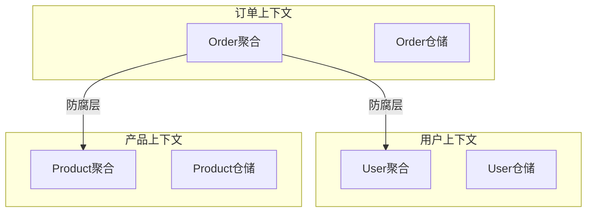

# 架构设计

良好的微服务架构设计确保系统可扩展、可维护。

## 服务拆分原则

### 按业务能力拆分

```go
// 认证服务 - 处理用户认证和授权
// services/auth/main.go
package main

type AuthService struct {
    userClient   *UserClient
    tokenManager *TokenManager
}

func (s *AuthService) Login(ctx context.Context, username, password string) (*TokenResponse, error) {
    // 1. 验证用户凭据
    user, err := s.userClient.ValidateUser(ctx, username, password)
    if err != nil {
        return nil, err
    }

    // 2. 生成 Token
    token, err := s.tokenManager.Generate(user.ID, user.Role)
    if err != nil {
        return nil, err
    }

    return &TokenResponse{
        AccessToken: token.AccessToken,
        RefreshToken: token.RefreshToken,
        ExpiresIn:   3600,
    }, nil
}
```

### 按数据子域拆分

```go
// 用户服务 - 管理用户基本信息
// services/user/domain/user.go
package domain

type User struct {
    ID        string
    Username  string
    Email     string
    Password  string
    CreatedAt time.Time
    UpdatedAt time.Time
}

type UserRepository interface {
    Save(ctx context.Context, user *User) error
    FindByID(ctx context.Context, id string) (*User, error)
    FindByEmail(ctx context.Context, email string) (*User, error)
}

// 订单服务 - 管理订单和交易
// services/order/domain/order.go
package domain

type Order struct {
    ID          string
    UserID      string
    Items       []OrderItem
    TotalAmount float64
    Status      OrderStatus
    CreatedAt   time.Time
}

type OrderRepository interface {
    Save(ctx context.Context, order *Order) error
    FindByID(ctx context.Context, id string) (*Order, error)
    FindByUserID(ctx context.Context, userID string) ([]*Order, error)
}

// 产品服务 - 管理产品目录
// services/product/domain/product.go
package domain

type Product struct {
    ID          string
    Name        string
    Description string
    Price       float64
    Stock       int
    CategoryID  string
}

type ProductRepository interface {
    Save(ctx context.Context, product *Product) error
    FindByID(ctx context.Context, id string) (*Product, error)
    Search(ctx context.Context, query string) ([]*Product, error)
}
```

## 领域驱动设计

### 聚合根

```go
// 订单聚合根
type Order struct {
    id          OrderID
    userID      UserID
    items       []*OrderItem
    status      OrderStatus
    version     int
    domainEvents []DomainEvent
}

func NewOrder(userID UserID) *Order {
    order := &Order{
        id:     NewOrderID(),
        userID: userID,
        status: OrderStatusPending,
    }

    order.raiseEvent(&OrderCreatedEvent{
        OrderID: order.id,
        UserID:  userID,
    })

    return order
}

func (o *Order) AddItem(productID ProductID, quantity int, price float64) error {
    if o.status != OrderStatusPending {
        return fmt.Errorf("cannot add items to %s order", o.status)
    }

    item := NewOrderItem(productID, quantity, price)
    o.items = append(o.items, item)

    o.raiseEvent(&OrderItemAddedEvent{
        OrderID:   o.id,
        ProductID: productID,
        Quantity:  quantity,
    })

    return nil
}

func (o *Order) Confirm() error {
    if o.status != OrderStatusPending {
        return fmt.Errorf("order is not pending")
    }

    if len(o.items) == 0 {
        return fmt.Errorf("cannot confirm empty order")
    }

    o.status = OrderStatusConfirmed

    o.raiseEvent(&OrderConfirmedEvent{
        OrderID: o.id,
        Items:   o.items,
    })

    return nil
}

func (o *Order) raiseEvent(event DomainEvent) {
    o.domainEvents = append(o.domainEvents, event)
}

func (o *Order) GetEvents() []DomainEvent {
    events := o.domainEvents
    o.domainEvents = nil
    return events
}
```

### 值对象

```go
// 值对象：Money
type Money struct {
    amount   float64
    currency string
}

func NewMoney(amount float64, currency string) (*Money, error) {
    if amount < 0 {
        return nil, fmt.Errorf("amount cannot be negative")
    }

    if !isValidCurrency(currency) {
        return nil, fmt.Errorf("invalid currency: %s", currency)
    }

    return &Money{
        amount:   amount,
        currency: currency,
    }, nil
}

func (m *Money) Amount() float64 {
    return m.amount
}

func (m *Money) Currency() string {
    return m.currency
}

func (m *Money) Add(other *Money) (*Money, error) {
    if m.currency != other.currency {
        return nil, fmt.Errorf("cannot add different currencies")
    }

    return NewMoney(m.amount+other.amount, m.currency)
}

// 值对象：Email
type Email struct {
    value string
}

func NewEmail(value string) (*Email, error) {
    if !isValidEmail(value) {
        return nil, fmt.Errorf("invalid email format")
    }

    return &Email{value: value}, nil
}

func (e *Email) Value() string {
    return e.value
}

func isValidEmail(email string) bool {
    re := regexp.MustCompile(`^[a-zA-Z0-9._%+-]+@[a-zA-Z0-9.-]+\.[a-zA-Z]{2,}$`)
    return re.MatchString(email)
}
```

### 仓储模式

```go
// 仓储接口
type OrderRepository interface {
    Save(ctx context.Context, order *Order) error
    FindByID(ctx context.Context, id OrderID) (*Order, error)
    FindByUserID(ctx context.Context, userID UserID) ([]*Order, error)
}

// 仓储实现
type PostgresOrderRepository struct {
    db *gorm.DB
}

func NewPostgresOrderRepository(db *gorm.DB) *PostgresOrderRepository {
    return &PostgresOrderRepository{db: db}
}

func (r *PostgresOrderRepository) Save(ctx context.Context, order *Order) error {
    orderDO := r.toDataObject(order)

    return r.db.WithContext(ctx).Transaction(func(tx *gorm.DB) error {
        // 保存订单
        if err := tx.Save(orderDO).Error; err != nil {
            return err
        }

        // 保存订单项
        for _, item := range order.Items() {
            itemDO := r.itemToDataObject(item, order.ID())
            if err := tx.Save(itemDO).Error; err != nil {
                return err
            }
        }

        return nil
    })
}

func (r *PostgresOrderRepository) FindByID(ctx context.Context, id OrderID) (*Order, error) {
    var orderDO OrderDataObject
    if err := r.db.WithContext(ctx).Where("id = ?", id).First(&orderDO).Error; err != nil {
        return nil, err
    }

    return r.toDomain(&orderDO)
}
```

## 边界上下文

### 上下文映射



### 防腐层

```go
// 订单服务的防腐层
// services/order/infrastructure/client/user_client.go
package client

type UserClient struct {
    httpClient *http.Client
    baseURL    string
}

// 外部用户响应
type ExternalUserResponse struct {
    ID    string `json:"id"`
    Name  string `json:"name"`
    Email string `json:"email"`
    Role  string `json:"role"`
}

// 内部用户值对象
type User struct {
    ID   UserID
    Name string
}

func (c *UserClient) GetUser(ctx context.Context, userID UserID) (*User, error) {
    url := fmt.Sprintf("%s/users/%s", c.baseURL, userID)

    req, _ := http.NewRequestWithContext(ctx, "GET", url, nil)
    resp, err := c.httpClient.Do(req)
    if err != nil {
        return nil, err
    }
    defer resp.Body.Close()

    if resp.StatusCode != 200 {
        return nil, fmt.Errorf("user service error: %d", resp.StatusCode)
    }

    var extUser ExternalUserResponse
    if err := json.NewDecoder(resp.Body).Decode(&extUser); err != nil {
        return nil, err
    }

    // 转换为内部模型
    return &User{
        ID:   NewUserID(extUser.ID),
        Name: extUser.Name,
    }, nil
}
```

## API 设计

### RESTful API

```go
// services/order/interfaces/http/handler.go
package http

type OrderHandler struct {
    orderService *OrderService
}

func (h *OrderHandler) RegisterRoutes(r *gin.Engine) {
    orders := r.Group("/api/orders")
    {
        orders.POST("", h.CreateOrder)
        orders.GET("/:id", h.GetOrder)
        orders.GET("/users/:userId", h.GetUserOrders)
        orders.PUT("/:id/confirm", h.ConfirmOrder)
        orders.PUT("/:id/cancel", h.CancelOrder)
    }
}

func (h *OrderHandler) CreateOrder(c *gin.Context) {
    var req CreateOrderRequest
    if err := c.ShouldBindJSON(&req); err != nil {
        c.JSON(400, gin.H{"error": err.Error()})
        return
    }

    userID := GetUserIDFromContext(c)

    // 创建订单
    order, err := h.orderService.CreateOrder(c.Request.Context(), userID, req.Items)
    if err != nil {
        c.JSON(500, gin.H{"error": err.Error()})
        return
    }

    c.JSON(201, gin.H{
        "order_id": order.ID(),
        "status":   order.Status(),
    })
}
```

### gRPC API

```go
// services/order/interfaces/grpc/server.go
package grpc

type OrderGRPCServer struct {
    orderService *OrderService
}

func (s *OrderGRPCServer) CreateOrder(ctx context.Context, req *pb.CreateOrderRequest) (*pb.CreateOrderResponse, error) {
    userID := UserID(req.UserId)

    items := make([]*OrderItemRequest, len(req.Items))
    for i, item := range req.Items {
        items[i] = &OrderItemRequest{
            ProductID: ProductID(item.ProductId),
            Quantity:  int(item.Quantity),
        }
    }

    order, err := s.orderService.CreateOrder(ctx, userID, items)
    if err != nil {
        return nil, status.Error(codes.Internal, err.Error())
    }

    return &pb.CreateOrderResponse{
        OrderId: string(order.ID()),
        Status:  string(order.Status()),
    }, nil
}
```

## 数据一致性

### Saga 模式

```go
// 订单创建 Saga
type CreateOrderSaga struct {
    steps []SagaStep
    currentStep int
}

type SagaStep struct {
    Execute    func(ctx context.Context) error
    Compensate func(ctx context.Context) error
}

func NewCreateOrderSaga(orderService *OrderService, inventoryService *InventoryService, paymentService *PaymentService) *CreateOrderSaga {
    return &CreateOrderSaga{
        steps: []SagaStep{
            {
                // 1. 创建订单
                Execute: func(ctx context.Context) error {
                    return orderService.CreateOrder(ctx)
                },
                Compensate: func(ctx context.Context) error {
                    return orderService.CancelOrder(ctx)
                },
            },
            {
                // 2. 扣减库存
                Execute: func(ctx context.Context) error {
                    return inventoryService.ReserveStock(ctx)
                },
                Compensate: func(ctx context.Context) error {
                    return inventoryService.ReleaseStock(ctx)
                },
            },
            {
                // 3. 处理支付
                Execute: func(ctx context.Context) error {
                    return paymentService.ProcessPayment(ctx)
                },
                Compensate: func(ctx context.Context) error {
                    return paymentService.RefundPayment(ctx)
                },
            },
        },
    }
}

func (s *CreateOrderSaga) Execute(ctx context.Context) error {
    for i := range s.steps {
        s.currentStep = i

        if err := s.steps[i].Execute(ctx); err != nil {
            // 执行失败，执行补偿
            s.Compensate(ctx)
            return err
        }
    }

    return nil
}

func (s *CreateOrderSaga) Compensate(ctx context.Context) {
    // 从当前步骤反向补偿
    for i := s.currentStep; i >= 0; i-- {
        s.steps[i].Compensate(ctx)
    }
}
```

### 最终一致性

```go
// 订单服务发布事件
func (s *OrderService) ConfirmOrder(ctx context.Context, orderID OrderID) error {
    order, err := s.repo.FindByID(ctx, orderID)
    if err != nil {
        return err
    }

    if err := order.Confirm(); err != nil {
        return err
    }

    // 保存聚合
    if err := s.repo.Save(ctx, order); err != nil {
        return err
    }

    // 发布领域事件
    events := order.GetEvents()
    for _, event := range events {
        if err := s.eventPublisher.Publish(ctx, event); err != nil {
            // 记录失败，后续重试
            log.Printf("Failed to publish event: %v", err)
        }
    }

    return nil
}

// 库存服务监听订单确认事件
func (s *InventoryService) OnOrderConfirmed(event *OrderConfirmedEvent) error {
    ctx := context.Background()

    // 扣减库存
    for _, item := range event.Items {
        if err := s DeductStock(ctx, item.ProductID, item.Quantity); err != nil {
            return err
        }
    }

    return nil
}
```

## 最佳实践

::: tip 架构设计建议

1. **单一职责** - 每个服务专注一个业务领域
2. **独立数据库** - 每个服务拥有自己的数据存储
3. **异步通信** - 使用事件驱动架构解耦
4. **防腐层** - 隔离外部服务变化
5. **DDD 模式** - 使用聚合根和值对象

:::

```go
// ✅ 好的架构模式
// 1. 领域层 - 业务逻辑
type Order struct {
    id     OrderID
    items  []*OrderItem
    status OrderStatus
}

func (o *Order) Confirm() error {
    // 业务规则
}

// 2. 应用层 - 用例编排
type OrderService struct {
    repo   OrderRepository
    publisher EventPublisher
}

func (s *OrderService) CreateOrder(ctx context.Context, cmd CreateOrderCommand) error {
    // 用例逻辑
}

// 3. 接口层 - 适配器
type OrderHandler struct {
    service *OrderService
}
```

## 总结

| 方面 | 关键点 |
|------|--------|
| **服务拆分** - 按业务能力拆分 |
| **DDD** - 聚合根和值对象 |
| **防腐层** - 隔离外部依赖 |
| **Saga** - 分布式事务处理 |
| **最终一致性** - 事件驱动 |

::: v-pre

[概述](./README.md) → [服务通信](./communication.md)

:::
