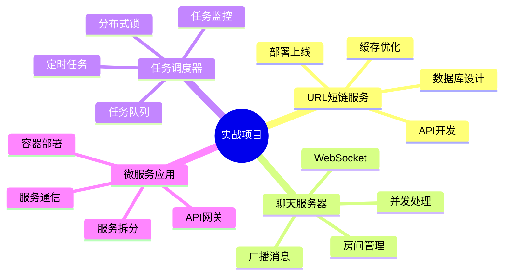
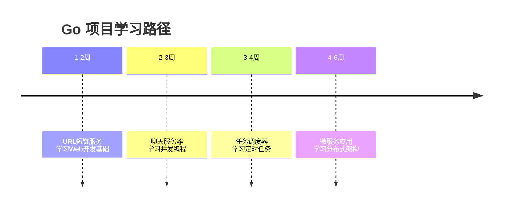

# 实战项目

通过实际项目巩固 Go 语言知识。

## 项目概述



## 项目列表

| 项目 | 难度 | 技术栈 | 学习重点 |
|------|------|--------|----------|
| **URL短链服务** | 入门 | Gin/MySQL/Redis | Web开发、缓存 |
| **聊天服务器** | 中级 | WebSocket/Goroutine | 并发编程 |
| **任务调度器** | 中高级 | Cron/Redis/锁 | 定时任务、分布式 |
| **微服务应用** | 高级 | gRPC/K8s/Docker | 微服务架构 |

## URL短链服务

### 项目功能

- 短链生成和重定向
- 自定义短码
- 访问统计
- API限流
- 缓存优化

### 技术栈

```
- Web框架: Gin
- 数据库: MySQL
- 缓存: Redis
- 配置: Viper
- 日志: Zap
```

### 核心代码

```go
// 短链生成
func (s *Service) CreateShortenURL(req *CreateURLRequest) (*ShortenURL, error) {
    // 检查URL是否已存在
    if existing, err := s.repo.FindByURL(req.URL); err == nil {
        return existing, nil
    }

    // 生成短码
    shortCode := generateShortCode(req.CustomCode)

    // 创建短链
    shortenURL := &ShortenURL{
        ID:        generateID(),
        URL:       req.URL,
        ShortCode: shortCode,
        CreatedAt: time.Now(),
    }

    // 保存到数据库
    if err := s.repo.Save(shortenURL); err != nil {
        return nil, err
    }

    return shortenURL, nil
}
```

## 聊天服务器

### 项目功能

- 实时消息通信
- 用户认证
- 房间管理
- 消息广播
- 在线状态

### 技术栈

```
- WebSocket: gorilla/websocket
- 并发: Goroutine/Channel
- 存储: Redis
- 认证: JWT
```

### 核心代码

```go
// Hub 管理所有客户端
type Hub struct {
    clients    map[*Client]bool
    register   chan *Client
    unregister chan *Client
    broadcast  chan *Message
}

func (h *Hub) Run() {
    for {
        select {
        case client := <-h.register:
            h.clients[client] = true

        case client := <-h.unregister:
            delete(h.clients, client)
            close(client.send)

        case message := <-h.broadcast:
            for client := range h.clients {
                select {
                case client.send <- message:
                default:
                    close(client.send)
                    delete(h.clients, client)
                }
            }
        }
    }
}
```

## 任务调度器

### 项目功能

- 定时任务执行
- Cron表达式支持
- 任务队列管理
- 分布式锁
- 任务监控

### 技术栈

```
- 调度: robfig/cron
- 队列: Redis/Channel
- 锁: Redlock
- 存储: MySQL
- 监控: Prometheus
```

### 核心代码

```go
// 任务调度器
type Scheduler struct {
    cron      *cron.Cron
    tasks     map[string]*Task
    queue     chan *Task
    workerNum int
    lock      *redislock.RedLock
}

func (s *Scheduler) Start() {
    // 启动调度器
    s.cron.Start()

    // 启动工作协程
    for i := 0; i < s.workerNum; i++ {
        go s.worker()
    }
}

func (s *Scheduler) worker() {
    for task := range s.queue {
        // 获取分布式锁
        lock, err := s.lock.Lock(task.ID, 10*time.Second)
        if err != nil {
            continue
        }

        // 执行任务
        s.executeTask(task)

        // 释放锁
        lock.Unlock()
    }
}
```

## 微服务应用

### 项目功能

- 用户服务
- 订单服务
- 产品服务
- API网关
- 服务发现

### 技术栈

```
- 框架: gRPC/Gin
- 服务发现: Consul
- 配置: etcd
- 容器: Docker
- 编排: Kubernetes
```

### 核心代码

```go
// gRPC 服务
type Server struct {
    pb.UnimplementedUserServiceServer
    userRepo UserRepository
}

func (s *Server) GetUser(ctx context.Context, req *pb.GetUserRequest) (*pb.GetUserResponse, error) {
    user, err := s.userRepo.FindByID(ctx, req.UserId)
    if err != nil {
        return nil, status.Error(codes.NotFound, "user not found")
    }

    return &pb.GetUserResponse{
        User: &pb.User{
            Id:    user.ID,
            Name:  user.Name,
            Email: user.Email,
        },
    }, nil
}
```

## 开发流程

### 项目初始化

```bash
# 1. 创建项目目录
mkdir myproject && cd myproject

# 2. 初始化 Go 模块
go mod init github.com/username/myproject

# 3. 创建标准项目结构
mkdir -p cmd/myapp
mkdir -p internal/{config,handler,service,repository}
mkdir -p pkg/{logger,middleware}
mkdir -p configs
mkdir -p scripts

# 4. 添加依赖
go get -u github.com/gin-gonic/gin
go get -u github.com/spf13/viper
go get -u go.uber.org/zap
go get -u gorm.io/gorm
go get -u gorm.io/driver/mysql
```

### 开发步骤

1. **需求分析**
   - 明确功能需求
   - 设计数据模型
   - 规划 API 接口

2. **项目结构**
   - 遵循标准布局
   - 分层设计
   - 接口抽象

3. **编码实现**
   - 编写测试
   - 代码审查
   - 重构优化

4. **部署上线**
   - Docker 镜像
   - CI/CD 配置
   - 监控告警

## 最佳实践

### 代码组织

```go
// ✅ 好的代码组织
// cmd/myapp/main.go
package main

func main() {
    // 1. 加载配置
    config := loadConfig()

    // 2. 初始化依赖
    db := initDB(config.Database)
    logger := initLogger(config.Log)
    cache := initCache(config.Redis)

    // 3. 初始化层
    repo := repository.New(db)
    service := service.New(repo, cache, logger)
    handler := handler.New(service)

    // 4. 启动服务
    server := NewServer(config.Server, handler)
    server.Start()
}
```

### 错误处理

```go
// ✅ 好的错误处理
func (s *Service) CreateUser(ctx context.Context, req *CreateUserRequest) error {
    // 1. 验证输入
    if err := req.Validate(); err != nil {
        return fmt.Errorf("validation failed: %w", err)
    }

    // 2. 业务逻辑
    user, err := s.repo.FindByEmail(ctx, req.Email)
    if err == nil {
        return ErrUserAlreadyExists
    }

    // 3. 保存数据
    user = &User{
        ID:    generateID(),
        Name:  req.Name,
        Email: req.Email,
    }

    if err := s.repo.Save(ctx, user); err != nil {
        return fmt.Errorf("failed to save user: %w", err)
    }

    return nil
}
```

## 学习路径

::: tip 学习建议

1. **从简单开始** - 先完成 URL 短链服务
2. **逐步深入** - 学习并发和微服务
3. **代码实践** - 动手编写和运行
4. **阅读源码** - 学习优秀项目
5. **持续优化** - 重构和改进代码

:::



## 内容导航

| 章节 | 内容 |
|------|------|
| [URL短链服务](./url-shortener.md) | 完整的短链服务实现 |
| [聊天服务器](./chat-server.md) | WebSocket 实时通信 |
| [任务调度器](./task-scheduler.md) | 定时任务系统 |
| [微服务应用](./microservices-app.md) | 微服务架构实践 |

::: v-pre

[微服务架构](/langs/go/13-microservices/) → [URL短链服务](./url-shortener.md)

:::
