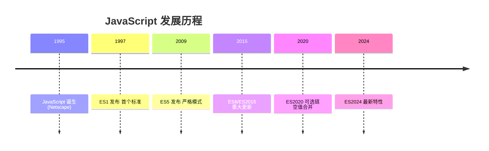

# 概述与环境

JavaScript 是 Web 开发的核心语言，本模块介绍 JavaScript 的历史、特点及开发环境搭建。

## 学习内容

- [JavaScript 概述](./js-overview.md) - JavaScript 的历史、特点与应用
- [开发环境配置](./js-env.md) - Node.js、浏览器开发工具配置
- [Hello World](./hello-world.md) - 第一个 JavaScript 程序

## 为什么选择 JavaScript？

::: tip JavaScript 优势

1. **浏览器原生**：无需编译，直接在浏览器运行
2. **生态丰富**：npm 是世界上最大的包管理器
3. **全栈开发**：前端 + Node.js 后端
4. **社区活跃**：持续演进，每年都有新特性
5. **就业机会**：Web 开发必备技能

:::

## JavaScript 发展史

