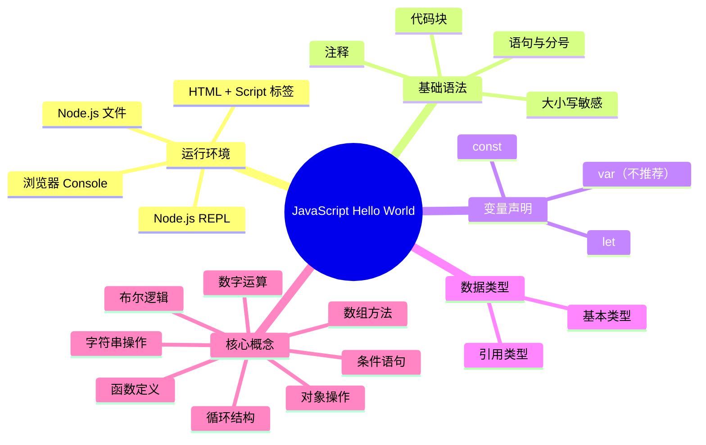

# Hello World

让我们开始编写第一个 JavaScript 程序！

## 在浏览器中运行

### 方式一：控制台

1. 打开浏览器（推荐 Chrome）
2. 按 `F12` 打开开发者工具
3. 切换到 **Console** 标签
4. 输入以下代码并按回车：

```javascript
console.log('Hello, World!');
```

::: tip 快捷方式

在控制台中输入代码后，按 `Enter` 执行。
如果要输入多行代码，按 `Shift + Enter` 换行。
:::

### 方式二：HTML 文件

创建一个 HTML 文件 `hello.html`：

```html
<!DOCTYPE html>
<html lang="zh-CN">
<head>
    <meta charset="UTF-8">
    <meta name="viewport" content="width=device-width, initial-scale=1.0">
    <title>Hello JavaScript</title>
</head>
<body>
    <h1 id="greeting">等待加载...</h1>

    <script>
        // 在控制台输出
        console.log('Hello, World!');

        // 修改页面内容
        document.getElementById('greeting').textContent = 'Hello, JavaScript!';

        // 弹出提示（不推荐用于生产环境）
        // alert('Hello, World!');
    </script>
</body>
</html>
```

双击 HTML 文件在浏览器中打开。

### 方式三：外部 JS 文件

创建项目目录：

```
hello-project/
├── index.html
└── script.js
```

**index.html**：

```html
<!DOCTYPE html>
<html lang="zh-CN">
<head>
    <meta charset="UTF-8">
    <meta name="viewport" content="width=device-width, initial-scale=1.0">
    <title>Hello JavaScript</title>
</head>
<body>
    <h1 id="greeting"></h1>

    <!-- 引入外部 JS 文件 -->
    <script src="script.js"></script>
</body>
</html>
```

**script.js**：

```javascript
// 这是注释，用于说明代码

// 在控制台输出
console.log('Hello, World!');

// 修改页面内容
document.getElementById('greeting').textContent = 'Hello, JavaScript!';
```

## 在 Node.js 中运行

### 方式一：REPL 交互式环境

REPL (Read-Eval-Print Loop) 是一个交互式命令行环境。

```bash
# 在终端输入 node 进入 REPL
node

# 在 REPL 中输入代码
> console.log('Hello, World!');
Hello, World!
undefined

> 1 + 1
2

> const name = 'JavaScript';
undefined

> `Hello, ${name}!`;
'Hello, JavaScript!'

# 退出 REPL
> .exit
```

::: tip REPL 快捷键

- `Ctrl + C` - 取消当前输入
- `Ctrl + D` - 退出 REPL
- `上/下箭头` - 浏览历史命令
- `Tab` - 自动补全

:::

### 方式二：运行 JS 文件

创建文件 `hello.js`：

```javascript
// hello.js
console.log('Hello, World!');

// 使用模板字符串
const name = 'JavaScript';
console.log(`Hello, ${name}!`);

// 简单的计算
console.log('1 + 1 =', 1 + 1);
```

在终端运行：

```bash
node hello.js
```

输出：

```
Hello, World!
Hello, JavaScript!
1 + 1 = 2
```

## JavaScript 基础语法

### 注释

```javascript
// 单行注释

/*
多行注释
可以跨越多行
*/

/**
 * 文档注释
 * 用于生成 API 文档
 * @param {string} name - 名称
 */
```

### 语句与分号

```javascript
// JavaScript 语句通常以分号结尾（推荐）
console.log('Hello');

// 分号可以省略（不推荐）
console.log('World')

// 一行多条语句需要分号
console.log('Hello'); console.log('World');
```

::: warning 分号规则

虽然 JavaScript 可以自动插入分号（ASI），但建议始终使用分号，避免一些难以发现的错误。
:::

### 大小写敏感

```javascript
// 大小写不同，变量也不同
const name = 'Alice';
const Name = 'Bob';  // 这是另一个变量
const NAME = 'Charlie';  // 又是另一个变量
```

### 代码块

```javascript
// 代码块用花括号包围
if (true) {
    console.log('这段代码会执行');
}

// 可以在代码块中声明变量
{
    const x = 10;
    console.log(x);  // 10
}

// console.log(x);  // 报错：x 未定义（块级作用域）
```

## 变量声明

```javascript
// var - 函数作用域，可重复声明（不推荐）
var oldWay = '旧方式';

// let - 块级作用域，可重新赋值
let name = 'Alice';
name = 'Bob';  // 可以重新赋值

// const - 块级作用域，不可重新赋值（推荐）
const pi = 3.14159;
// pi = 3.14;  // 报错：不能重新赋值

// 声明常量对象
const person = { name: 'Alice', age: 25 };
person.age = 26;  // 可以修改对象属性
// person = {};  // 报错：不能重新赋值
```

## 数据类型

```javascript
// 基本类型
let str = '字符串';        // string
let num = 42;              // number
let bool = true;           // boolean
let empty = null;          // null
let nothing = undefined;   // undefined
let unique = Symbol('id'); // symbol
let big = 9007199254740991n; // bigint

// 引用类型
let arr = [1, 2, 3];        // array
let obj = { key: 'value' }; // object
let func = function() {};   // function

// 检查类型
console.log(typeof str);     // "string"
console.log(typeof num);     // "number"
console.log(typeof arr);     // "object"（数组也是对象）
console.log(Array.isArray(arr)); // true（检查是否为数组）
```

## 字符串操作

```javascript
// 字符串拼接
const name = 'Alice';
const greeting = 'Hello, ' + name + '!';
console.log(greeting); // Hello, Alice!

// 模板字符串（推荐）
const greeting2 = `Hello, ${name}!`;
console.log(greeting2); // Hello, Alice!

// 多行字符串
const message = `这是一行
这是另一行
还是一行`;
console.log(message);

// 字符串方法
console.log(name.length);        // 5
console.log(name.toUpperCase()); // ALICE
console.log(name.toLowerCase()); // alice
console.log(name.indexOf('li')); // 2
console.log(name.slice(0, 3));   // Ali
```

## 数字与运算

```javascript
// 基本运算
console.log(1 + 1);    // 2 加法
console.log(10 - 3);   // 7 减法
console.log(2 * 3);    // 6 乘法
console.log(10 / 3);   // 3.333... 除法
console.log(10 % 3);   // 1 取模（余数）
console.log(2 ** 3);   // 8 幂运算

// 自增自减
let count = 0;
count++;  // count = 1
count--;  // count = 0

// 复合赋值
let x = 10;
x += 5;  // x = x + 5 = 15
x -= 3;  // x = x - 3 = 12
x *= 2;  // x = x * 2 = 24
x /= 4;  // x = x / 4 = 6

// 数学方法
console.log(Math.round(3.7));   // 4 四舍五入
console.log(Math.floor(3.7));   // 3 向下取整
console.log(Math.ceil(3.2));    // 4 向上取整
console.log(Math.random());     // 0.123... 随机数
console.log(Math.max(1, 3, 2)); // 3 最大值
console.log(Math.min(1, 3, 2)); // 1 最小值
```

## 布尔值与逻辑运算

```javascript
// 布尔值
let isTrue = true;
let isFalse = false;

// 逻辑运算符
console.log(true && false); // false 逻辑与
console.log(true || false); // true  逻辑或
console.log(!true);         // false 逻辑非

// 比较运算符
console.log(1 == 1);   // true  相等（类型转换）
console.log(1 === 1);  // true  严格相等（推荐）
console.log(1 == '1'); // true  类型转换后相等
console.log(1 === '1'); // false 类型不同
console.log(1 != 2);   // true  不等
console.log(1 !== '1'); // true  严格不等

console.log(5 > 3);    // true  大于
console.log(5 >= 5);   // true  大于等于
console.log(3 < 5);    // true  小于
console.log(3 <= 5);   // true  小于等于
```

## 数组操作

```javascript
// 创建数组
const fruits = ['apple', 'banana', 'orange'];

// 访问元素
console.log(fruits[0]); // apple

// 修改元素
fruits[1] = 'grape';
console.log(fruits); // ['apple', 'grape', 'orange']

// 获取长度
console.log(fruits.length); // 3

// 添加元素
fruits.push('pear');        // 添加到末尾
fruits.unshift('mango');    // 添加到开头

// 删除元素
fruits.pop();    // 删除末尾元素
fruits.shift();  // 删除开头元素

// 数组方法
console.log(fruits.indexOf('apple')); // 0
console.log(fruits.includes('banana')); // true
console.log(fruits.join(', ')); // "apple, grape, orange"
console.log(fruits.slice(0, 2)); // ['apple', 'grape']

// 遍历数组
fruits.forEach(function(fruit, index) {
    console.log(`${index}: ${fruit}`);
});
```

## 对象操作

```javascript
// 创建对象
const person = {
    name: 'Alice',
    age: 25,
    city: 'Beijing',
    greet: function() {
        console.log(`Hello, I'm ${this.name}`);
    }
};

// 访问属性
console.log(person.name);      // Alice
console.log(person['age']);    // 25

// 修改属性
person.age = 26;
person.city = 'Shanghai';

// 添加属性
person.email = 'alice@example.com';

// 删除属性
delete person.email;

// 调用方法
person.greet(); // Hello, I'm Alice

// 遍历对象
for (let key in person) {
    console.log(`${key}: ${person[key]}`);
}

// 对象解构
const { name, age } = person;
console.log(name, age); // Alice 26
```

## 条件语句

```javascript
// if...else
const score = 85;

if (score >= 90) {
    console.log('优秀');
} else if (score >= 80) {
    console.log('良好');
} else if (score >= 60) {
    console.log('及格');
} else {
    console.log('不及格');
}

// 三元运算符
const result = score >= 60 ? '及格' : '不及格';
console.log(result);

// switch
const day = 3;
let dayName;

switch (day) {
    case 1:
        dayName = '星期一';
        break;
    case 2:
        dayName = '星期二';
        break;
    case 3:
        dayName = '星期三';
        break;
    default:
        dayName = '未知';
}
console.log(dayName); // 星期三
```

## 循环

```javascript
// for 循环
for (let i = 0; i < 5; i++) {
    console.log(i); // 0, 1, 2, 3, 4
}

// while 循环
let count = 0;
while (count < 3) {
    console.log(count); // 0, 1, 2
    count++;
}

// for...of（遍历数组）
const fruits = ['apple', 'banana', 'orange'];
for (const fruit of fruits) {
    console.log(fruit);
}

// for...in（遍历对象）
const obj = { a: 1, b: 2, c: 3 };
for (const key in obj) {
    console.log(`${key}: ${obj[key]}`);
}
```

## 函数

```javascript
// 函数声明
function greet(name) {
    return `Hello, ${name}!`;
}

// 函数调用
console.log(greet('Alice')); // Hello, Alice!

// 函数表达式
const greet2 = function(name) {
    return `Hello, ${name}!`;
};

// 箭头函数（ES6）
const greet3 = (name) => {
    return `Hello, ${name}!`;
};

// 简化箭头函数
const greet4 = name => `Hello, ${name}!`;

// 默认参数
function greet5(name = 'World') {
    return `Hello, ${name}!`;
}
console.log(greet5()); // Hello, World!
```

## 完整示例

创建一个简单的计算器：

```javascript
// calculator.js

// 加法函数
function add(a, b) {
    return a + b;
}

// 减法函数
function subtract(a, b) {
    return a - b;
}

// 乘法函数
function multiply(a, b) {
    return a * b;
}

// 除法函数
function divide(a, b) {
    if (b === 0) {
        return '错误：除数不能为零';
    }
    return a / b;
}

// 使用示例
console.log('5 + 3 =', add(5, 3));
console.log('10 - 4 =', subtract(10, 4));
console.log('6 * 7 =', multiply(6, 7));
console.log('15 / 3 =', divide(15, 3));
console.log('10 / 0 =', divide(10, 0));
```

运行结果：

```bash
$ node calculator.js
5 + 3 = 8
10 - 4 = 6
6 * 7 = 42
15 / 3 = 5
10 / 0 = 错误：除数不能为零
```

## 总结



::: tip 你已经学会了

✅ JavaScript 的多种运行方式
✅ 基本语法和数据类型
✅ 变量声明和作用域
✅ 常用操作和方法
✅ 控制流和函数

:::

::: tip 下一步

深入学习 JavaScript 基础语法 → [基础语法](../01-basics/README.md)
:::
