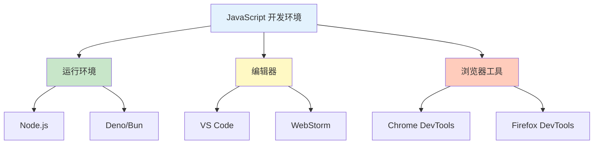
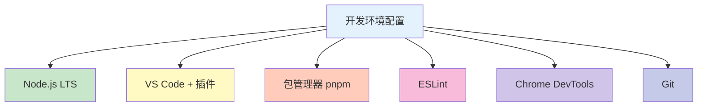

# 开发环境配置

工欲善其事，必先利其器。本节介绍 JavaScript 开发环境的配置。

## 核心工具



## 1. 安装 Node.js

[Node.js](https://nodejs.org/) 是 JavaScript 在服务器端的运行环境，也是现代前端开发的基石。

### 版本选择

Node.js 遵循 **LTS**（Long Term Support）和 **Current** 两种发布策略：

| 版本类型 | 说明 | 推荐场景 |
|----------|------|----------|
| **LTS** | 长期支持版，稳定 | 生产环境、新手 |
| **Current** | 最新特性，可能不稳定 | 尝试新特性 |

::: tip 推荐版本
建议安装 **LTS 版本**（如 v20.x），稳定性更好。
:::

### 安装方法

#### macOS

```bash
# 使用 Homebrew 安装（推荐）
brew install node

# 验证安装
node -v
npm -v
```

#### Windows

1. 访问 [nodejs.org](https://nodejs.org/)
2. 下载 LTS 版本安装包
3. 运行安装程序，按提示完成

#### Linux

```bash
# Ubuntu/Debian
curl -fsSL https://deb.nodesource.com/setup_lts.x | sudo -E bash -
sudo apt-get install -y nodejs

# 验证安装
node -v
npm -v
```

### 版本管理

使用 **nvm** (Node Version Manager) 管理多个 Node.js 版本：

```bash
# 安装 nvm（macOS/Linux）
curl -o- https://raw.githubusercontent.com/nvm-sh/nvm/v0.39.0/install.sh | bash

# 安装最新 LTS 版本
nvm install --lts

# 切换版本
nvm use 20

# 查看已安装版本
nvm ls
```

## 2. 包管理器

Node.js 内置 **npm**（Node Package Manager），也可以选择 **yarn** 或 **pnpm**。

### npm

```bash
# 设置 npm 镜像（可选，提升国内下载速度）
npm config set registry https://registry.npmmirror.com

# 初始化项目
npm init -y

# 安装依赖
npm install

# 安装生产依赖
npm install lodash

# 安装开发依赖
npm install -D typescript

# 全局安装工具
npm install -g pnpm

# 运行脚本
npm run dev
```

### pnpm（推荐）

pnpm 更快、更节省磁盘空间：

```bash
# 安装 pnpm
npm install -g pnpm

# 或使用安装脚本（macOS/Linux）
curl -fsSL https://get.pnpm.io/install.sh | sh -

# 基本使用
pnpm install
pnpm add lodash
pnpm add -D typescript
pnpm run dev
```

### 对比常用命令

| 操作 | npm | yarn | pnpm |
|------|-----|------|------|
| 安装依赖 | `npm install` | `yarn` | `pnpm install` |
| 添加依赖 | `npm add pkg` | `yarn add pkg` | `pnpm add pkg` |
| 添加开发依赖 | `npm add -D pkg` | `yarn add -D pkg` | `pnpm add -D pkg` |
| 全局安装 | `npm install -g pkg` | `yarn global add pkg` | `pnpm add -g pkg` |
| 运行脚本 | `npm run test` | `yarn test` | `pnpm test` |

## 3. 代码编辑器

### Visual Studio Code

[VS Code](https://code.visualstudio.com/) 是最流行的 JavaScript 编辑器。

#### 安装

```bash
# macOS
brew install --cask visual-studio-code

# 或访问官网下载安装
```

#### 推荐插件

| 插件名称 | 用途 |
|----------|------|
| **ESLint** | 代码检查 |
| **Prettier** | 代码格式化 |
| **JavaScript (ES6) code snippets** | 代码片段 |
| **Path Intellisense** | 路径智能提示 |
| **Auto Rename Tag** | 自动重命名标签 |
| **Bracket Pair Colorizer** | 括号配对高亮 |

#### VS Code 配置

创建 `.vscode/settings.json`：

```json
{
  "editor.formatOnSave": true,
  "editor.defaultFormatter": "esbenp.prettier-vscode",
  "editor.codeActionsOnSave": {
    "source.fixAll.eslint": true
  },
  "javascript.preferences.quoteStyle": "single",
  "typescript.preferences.quoteStyle": "single"
}
```

### WebStorm

[WebStorm](https://www.jetbrains.com/webstorm/) 是 JetBrains 出品的专业 IDE，功能强大但需付费。

## 4. 浏览器开发工具

现代浏览器都内置开发者工具，以 **Chrome DevTools** 最为强大。

### Chrome DevTools 打开方式

- 快捷键：`F12` 或 `Cmd/Ctrl + Shift + I`
- 右键菜单：右键点击页面 → 检查

### 主要功能

#### 1. Console（控制台）

```javascript
// 基本输出
console.log('Hello');
console.error('Error!');
console.warn('Warning');

// 分组输出
console.group('User Info');
console.log('Name: Alice');
console.log('Age: 25');
console.groupEnd();

// 表格输出
console.table([
    { name: 'Alice', age: 25 },
    { name: 'Bob', age: 30 }
]);

// 计时
console.time('Timer');
// ... 代码 ...
console.timeEnd('Timer');
```

#### 2. Elements（元素检查）

- 查看 DOM 结构
- 实时修改样式
- 查看盒模型

#### 3. Sources（源代码调试）

- **断点调试**：点击行号设置断点
- **单步执行**：F10（单步跳过）、F11（单步进入）
- **监视变量**：Watch 面板查看变量值

#### 4. Network（网络请求）

- 查看 XHR/Fetch 请求
- 分析请求头、响应头
- 查看响应内容

#### 5. Performance（性能分析）

- 记录页面运行性能
- 分析 CPU 使用情况
- 识别性能瓶颈

## 5. 项目初始化

### 创建新项目

```bash
# 创建项目目录
mkdir my-project
cd my-project

# 初始化 npm
npm init -y

# 创建基础目录结构
mkdir src
touch src/index.js
```

### package.json

```json
{
  "name": "my-project",
  "version": "1.0.0",
  "description": "My JavaScript Project",
  "main": "src/index.js",
  "scripts": {
    "start": "node src/index.js",
    "dev": "nodemon src/index.js",
    "test": "echo \"Error: no test specified\" && exit 1"
  },
  "keywords": ["javascript", "project"],
  "author": "Your Name",
  "license": "MIT",
  "devDependencies": {
    "nodemon": "^3.0.0"
  }
}
```

### 运行项目

```bash
# 运行入口文件
node src/index.js

# 或使用 npm 脚本
npm start
```

## 6. 开发服务器

### 使用 Live Server（前端开发）

Live Server 可以自动刷新浏览器：

```bash
# 安装
npm install -g live-server

# 运行
live-server
```

### 使用 Vite（现代前端项目）

```bash
# 创建 Vite 项目
npm create vite@latest my-app -- --template vanilla

# 进入目录
cd my-app

# 安装依赖
npm install

# 启动开发服务器
npm run dev
```

## 7. ESLint 配置

ESLint 是 JavaScript 代码检查工具。

```bash
# 安装 ESLint
npm install -D eslint

# 初始化配置
npx eslint --init
```

### .eslintrc.json

```json
{
  "env": {
    "browser": true,
    "es2021": true,
    "node": true
  },
  "extends": "eslint:recommended",
  "parserOptions": {
    "ecmaVersion": "latest",
    "sourceType": "module"
  },
  "rules": {
    "no-console": "warn",
    "no-unused-vars": "error",
    "semi": ["error", "always"],
    "quotes": ["error", "single"]
  }
}
```

### 运行 ESLint

```bash
# 检查文件
npx eslint src/index.js

# 自动修复
npx eslint src/index.js --fix
```

## 8. Git 配置

版本控制是开发必备：

```bash
# 初始化仓库
git init

# 配置用户信息
git config user.name "Your Name"
git config user.email "your@email.com"

# 创建 .gitignore
echo "node_modules/
dist/
.env
*.log" > .gitignore

# 提交代码
git add .
git commit -m "Initial commit"
```

## 环境配置清单



::: tip 快速开始

1. 安装 Node.js LTS
2. 安装 VS Code 和推荐插件
3. 配置 ESLint 和 Prettier
4. 熟悉 Chrome DevTools

:::

::: tip 下一步

编写你的第一个 JavaScript 程序 → [Hello World](./hello-world.md)
:::
