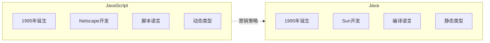
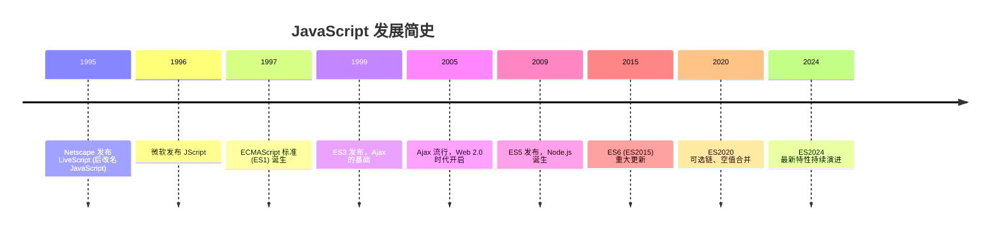
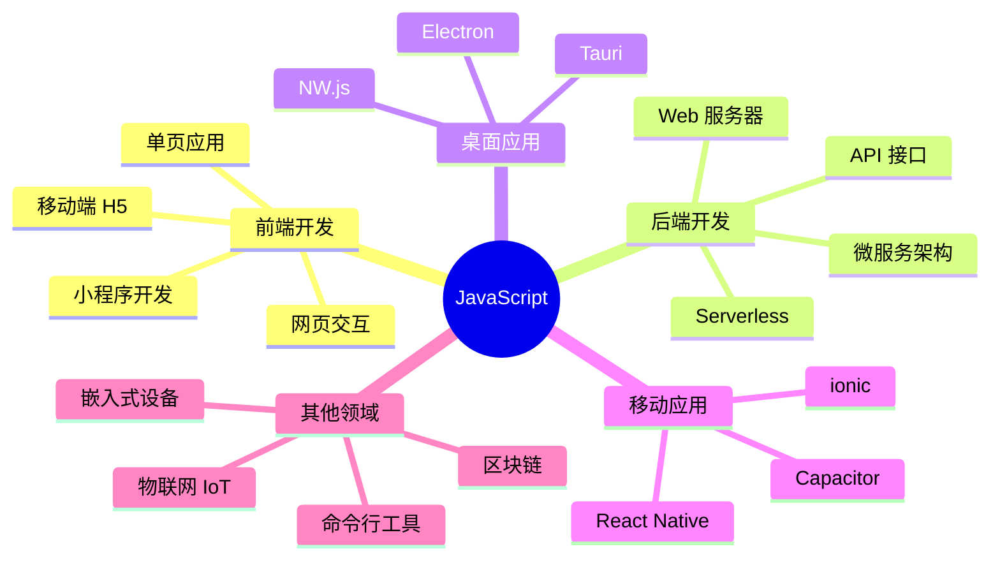
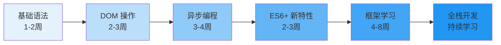
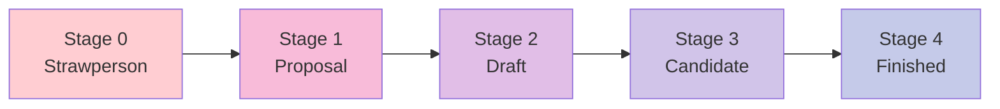

# JavaScript 概述

JavaScript 是一种轻量级的解释型编程语言，最初设计用于网页交互，现已发展成为全栈开发的核心语言。

## 什么是 JavaScript？

JavaScript 是一种**动态类型**、**基于原型**的编程语言，支持多种编程范式（面向对象、命令式、函数式）。

### 语言特点

| 特性 | 说明 |
|------|------|
| **解释执行** | 无需编译，浏览器直接解析执行 |
| **动态类型** | 变量类型在运行时确定 |
| **弱类型** | 支持隐式类型转换 |
| **基于原型** | 继承通过原型链实现 |
| **事件驱动** | 支持事件循环和异步编程 |
| **跨平台** | 浏览器、Node.js、嵌入式设备 |

### JavaScript ≠ Java



::: tip 为什么名字相似？

1995年 Netscape 将 LiveScript 改名为 JavaScript，是为了借助 Java 的热度进行营销。两者本质上是完全不同的语言。
:::

## JavaScript 的历史



### 关键里程碑

#### 1995年 - JavaScript 诞生

**背景**：Netscape 浏览器需要一种脚本语言让网页动起来

**创造者**：Brendan Eich 仅用 10 天设计了 JavaScript

**原始名称**：Mocha → LiveScript → JavaScript

#### 1997年 - ECMAScript 标准化

为了避免商标纠纷，ECMA 国际组织制定了 **ECMAScript** 标准：

- **ES1** (1997)：首个标准版本
- **ES2** (1998)：编辑性修改
- **ES3** (1999)：正则、try-catch
- **ES4** (被废弃)：过于激进的变革
- **ES5** (2009)：严格模式、JSON
- **ES6/ES2015**：重大更新
- **ES2016+**：年度发布

#### 2009年 - Node.js 诞生

Ryan Dahl 将 Chrome V8 引擎移植到服务器端，创建了 **Node.js**，使 JavaScript 可以用于：

- Web 服务器
- 命令行工具
- 桌面应用 (Electron)
- 嵌入式开发

#### 2015年 - ES6 重大更新

ES6 (ES2015) 是 JavaScript 历史上最重要的更新：

```javascript
// ES6 之前
var name = "JavaScript";
function greet(name) {
    return "Hello, " + name;
}

// ES6 之后
const name = "JavaScript";
const greet = (name) => `Hello, ${name}`;
```

**主要特性**：

- `let` / `const` 块级作用域
- 箭头函数
- 模板字符串
- 解构赋值
- `class` 语法
- `Promise`
- 模块化 (`import` / `export`)

## JavaScript 的应用领域



### 前端开发

**核心技术栈**：HTML + CSS + JavaScript

```javascript
// DOM 操作
document.querySelector('button').addEventListener('click', () => {
    alert('Hello JavaScript!');
});

// 数据请求
fetch('/api/data')
    .then(response => response.json())
    .then(data => console.log(data));
```

### 后端开发 (Node.js)

```javascript
// HTTP 服务器
import { createServer } from 'http';

const server = createServer((req, res) => {
    res.writeHead(200, { 'Content-Type': 'application/json' });
    res.end(JSON.stringify({ message: 'Hello from Node.js' }));
});

server.listen(3000);
```

### 桌面应用

- **VS Code** - 基于 Electron
- **Discord** - 基于 Electron
- **Figma** - 基于 Electron
- **1Password** - 基于 Electron

### 移动应用

- **React Native** - Meta 出品
- **Ionic** - 基于 Web 技术
- **NativeScript** - 原生性能

## JavaScript 的生态

### 包管理器

| 工具 | 说明 | 仓库 |
|------|------|------|
| **npm** | Node.js 默认包管理器 | npmjs.com |
| **yarn** | Facebook 开发，性能更好 | yarnpkg.com |
| **pnpm** | 节省磁盘空间，安装更快 | pnpm.io |

**包数量**：npm 上有超过 **200 万** 个包（2024年数据）

### 运行环境

| 环境 | 说明 | 用途 |
|------|------|------|
| **浏览器** | Chrome、Firefox、Safari | 前端开发 |
| **Node.js** | 服务器端运行时 | 后端开发 |
| **Deno** | 更安全的运行时 | 现代开发 |
| **Bun** | 极快的运行时 | 高性能应用 |

### 框架和库

#### 前端框架

- **React** - Meta 出品，组件化思想
- **Vue** - 渐进式框架，易学易用
- **Angular** - Google 出品，企业级应用
- **Svelte** - 编译时框架，无虚拟 DOM

#### 后端框架

- **Express** - 简洁灵活
- **Koa** - 中间件模式
- **NestJS** - 企业级框架
- **Fastify** - 高性能框架

## JavaScript 的优势

::: tip 为什么选择 JavaScript？

1. **无所不能**：一个语言搞定前端、后端、移动端、桌面端
2. **生态丰富**：npm 是世界上最大的包管理器
3. **就业机会**：Web 开发必备技能，需求量巨大
4. **学习友好**：入门简单，无需复杂环境配置
5. **持续演进**：每年都有新特性，语言不断完善
6. **社区活跃**：Stack Overflow 最热门的标签之一

:::

### 学习曲线



## JavaScript 的未来

### 正在发展的方向

1. **性能提升**：V8 引擎持续优化
2. **类型安全**：TypeScript 成为标准
3. **新特性**：装饰器、模式匹配、管道操作符
4. **跨平台**：WebAssembly 让浏览器运行更多语言
5. **AI 集成**：TensorFlow.js 让浏览器运行 AI 模型

### ECMAScript 提案流程



## 总结

JavaScript 是现代 Web 开发的核心语言：

- **历史**：从简单的脚本语言发展为全栈语言
- **应用**：前端、后端、移动、桌面、嵌入式
- **生态**：npm 包管理、丰富的框架和工具
- **未来**：持续演进，性能和特性不断完善

::: tip 下一步

配置你的 JavaScript 开发环境 → [开发环境配置](./js-env.md)
:::
