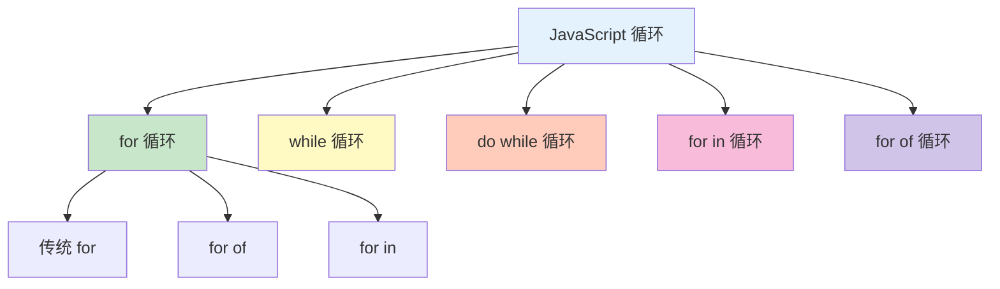
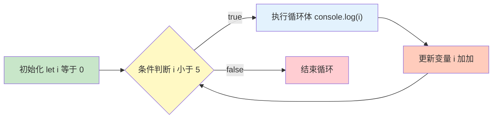

# 循环结构

循环用于重复执行代码块，是处理重复任务的核心机制。

## 循环类型



## for 循环

### 基本语法

```javascript
// 语法：for (初始化; 条件; 更新) { 循环体 }
for (let i = 0; i < 5; i++) {
    console.log(i);
}
// 输出: 0, 1, 2, 3, 4
```

### 执行顺序



### 实际示例

```javascript
// 计数循环
for (let i = 1; i <= 10; i++) {
    console.log(i);
}

// 倒序循环
for (let i = 10; i >= 1; i--) {
    console.log(i);
}

// 遍历数组
const fruits = ['apple', 'banana', 'orange'];
for (let i = 0; i < fruits.length; i++) {
    console.log(`${i}: ${fruits[i]}`);
}
// 0: apple
// 1: banana
// 2: orange

// 省略初始化（在循环外声明）
let i = 0;
for (; i < 5; i++) {
    console.log(i);
}

// 省略条件（需要内部 break）
for (let i = 0; ; i++) {
    console.log(i);
    if (i >= 5) break;
}

// 省略更新（在循环体内更新）
for (let i = 0; i < 5; ) {
    console.log(i);
    i++;
}

// 无限循环（需要内部 break）
let j = 0;
for (;;) {
    console.log(j);
    j++;
    if (j >= 5) break;
}
```

### 多变量循环

```javascript
// 使用逗号操作多个变量
for (let i = 0, j = 10; i < 5; i++, j--) {
    console.log(`i=${i}, j=${j}`);
}
// i=0, j=10
// i=1, j=9
// i=2, j=8
// i=3, j=7
// i=4, j=6
```

## while 循环

### 基本语法

```javascript
// 语法：while (条件) { 循环体 }
let i = 0;
while (i < 5) {
    console.log(i);
    i++;
}
// 输出: 0, 1, 2, 3, 4
```

### 实际示例

```javascript
// 计算阶乘
let n = 5;
let factorial = 1;
let i = 1;

while (i <= n) {
    factorial *= i;
    i++;
}
console.log(`${n}! = ${factorial}`);  // 5! = 120

// 用户输入验证（示例）
let password;
while (!password || password.length < 6) {
    password = prompt('请输入至少6位密码:');
    // 实际应用中可能需要限制尝试次数
}

// 数据处理直到满足条件
let sum = 0;
let num = 1;
while (sum < 100) {
    sum += num;
    num++;
}
console.log(`sum=${sum}, num=${num}`);  // sum=105, num=15
```

::: tip while vs for

- **for**：已知循环次数
- **while**：不确定循环次数，根据条件决定

:::

## do...while 循环

### 基本语法

```javascript
// 语法：do { 循环体 } while (条件);
let i = 0;
do {
    console.log(i);
    i++;
} while (i < 5);
// 输出: 0, 1, 2, 3, 4
```

### while vs do...while

```javascript
// while：先判断后执行（可能一次都不执行）
let a = 10;
while (a < 5) {
    console.log('while 执行');
}
// 不会输出任何内容

// do...while：先执行后判断（至少执行一次）
let b = 10;
do {
    console.log('do...while 执行');
} while (b < 5);
// 输出: do...while 执行
```

### 实际示例

```javascript
// 至少执行一次的场景
let userInput;
do {
    userInput = prompt('请输入 yes 或 no:');
} while (userInput !== 'yes' && userInput !== 'no');

// 菜单选择
let choice;
do {
    console.log('1. 选项一');
    console.log('2. 选项二');
    console.log('3. 退出');
    choice = prompt('请选择 (1-3):');
} while (choice !== '3');

// 随机数生成直到满足条件
let randomNum;
do {
    randomNum = Math.floor(Math.random() * 100);
    console.log(`生成的数字: ${randomNum}`);
} while (randomNum < 90);
```

## for...in 循环

### 遍历对象属性

```javascript
// 遍历对象的可枚举属性
const person = {
    name: 'Alice',
    age: 25,
    city: 'Beijing'
};

for (let key in person) {
    console.log(`${key}: ${person[key]}`);
}
// name: Alice
// age: 25
// city: Beijing
```

### 遍历数组索引

```javascript
// 遍历数组索引（不推荐用于数组）
const fruits = ['apple', 'banana', 'orange'];

for (let index in fruits) {
    console.log(`${index}: ${fruits[index]}`);
}
// 0: apple
// 1: banana
// 2: orange

// 注意：index 是字符串类型
for (let index in fruits) {
    console.log(typeof index);  // 'string'
}
```

::: warning for...in 的陷阱

```javascript
// ❌ 不要用于遍历数组
// 1. 会遍历原型链上的属性
Array.prototype.extra = 'extra';
const arr = [1, 2, 3];
for (let i in arr) {
    console.log(i);  // 0, 1, 2, 'extra'
}

// 2. 索引是字符串，不是数字
for (let i in arr) {
    console.log(i + 1);  // '01', '11', '21', 'extra1'
}

// ✅ 使用 for...of 或 forEach 遍历数组
for (let item of arr) {
    console.log(item);  // 1, 2, 3
}
```

:::

## for...of 循环

### 遍历可迭代对象

```javascript
// 遍历数组
const fruits = ['apple', 'banana', 'orange'];
for (let fruit of fruits) {
    console.log(fruit);
}
// apple, banana, orange

// 遍历字符串
const str = 'Hello';
for (let char of str) {
    console.log(char);
}
// H, e, l, l, o

// 遍历 Map
const map = new Map([
    ['name', 'Alice'],
    ['age', 25]
]);
for (let [key, value] of map) {
    console.log(`${key}: ${value}`);
}
// name: Alice
// age: 25

// 遍历 Set
const set = new Set([1, 2, 3, 2, 1]);
for (let item of set) {
    console.log(item);
}
// 1, 2, 3

// 遍历 NodeList（DOM 操作）
const divs = document.querySelectorAll('div');
for (let div of divs) {
    console.log(div);
}
```

### 获取索引

```javascript
// 使用 entries()
const fruits = ['apple', 'banana', 'orange'];
for (let [index, fruit] of fruits.entries()) {
    console.log(`${index}: ${fruit}`);
}
// 0: apple
// 1: banana
// 2: orange

// 使用传统 for（性能更好）
for (let i = 0; i < fruits.length; i++) {
    console.log(`${i}: ${fruits[i]}`);
}
```

## break 和 continue

### break - 跳出循环

```javascript
// 跳出循环
for (let i = 0; i < 10; i++) {
    if (i === 5) {
        break;  // 跳出循环
    }
    console.log(i);
}
// 输出: 0, 1, 2, 3, 4

// 查找元素
const numbers = [1, 2, 3, 4, 5];
let target = 3;
let found = false;
for (let num of numbers) {
    if (num === target) {
        found = true;
        break;
    }
}
console.log(found);  // true

// 嵌套循环中的 break
for (let i = 0; i < 3; i++) {
    for (let j = 0; j < 3; j++) {
        console.log(`i=${i}, j=${j}`);
        if (i === 1 && j === 1) {
            break;  // 只跳出内层循环
        }
    }
}
```

### continue - 跳过本次迭代

```javascript
// 跳过偶数
for (let i = 0; i < 10; i++) {
    if (i % 2 === 0) {
        continue;  // 跳过本次迭代
    }
    console.log(i);
}
// 输出: 1, 3, 5, 7, 9

// 过滤数据
const numbers = [1, -2, 3, -4, 5];
let sum = 0;
for (let num of numbers) {
    if (num < 0) {
        continue;  // 跳过负数
    }
    sum += num;
}
console.log(sum);  // 9
```

### 标签（Label）

```javascript
// 跳出多层循环
outer: for (let i = 0; i < 3; i++) {
    for (let j = 0; j < 3; j++) {
        console.log(`i=${i}, j=${j}`);
        if (i === 1 && j === 1) {
            break outer;  // 跳出外层循环
        }
    }
}
// 输出: i=0, j=0; i=0, j=1; i=0, j=2; i=1, j=0; i=1, j=1

// continue 也可以使用标签
outer: for (let i = 0; i < 3; i++) {
    for (let j = 0; j < 3; j++) {
        if (j === 1) {
            continue outer;  // 跳到外层循环的下一次迭代
        }
        console.log(`i=${i}, j=${j}`);
    }
}
// 输出: i=0, j=0; i=1, j=0; i=2, j=0
```

## 数组高阶方法

### forEach

```javascript
// 遍历数组
const fruits = ['apple', 'banana', 'orange'];

fruits.forEach(function(fruit, index, array) {
    console.log(`${index}: ${fruit}`);
});

// 使用箭头函数
fruits.forEach((fruit, index) => {
    console.log(`${index}: ${fruit}`);
});

// 注意：无法中途退出
fruits.forEach((fruit) => {
    console.log(fruit);
    // return 无法退出循环
    // break 不允许使用
});
```

### map

```javascript
// 映射：对每个元素操作，返回新数组
const numbers = [1, 2, 3, 4, 5];
const doubled = numbers.map(num => num * 2);
console.log(doubled);  // [2, 4, 6, 8, 10]

// 转换数据
const users = [
    { name: 'Alice', age: 25 },
    { name: 'Bob', age: 30 }
];
const names = users.map(user => user.name);
console.log(names);  // ['Alice', 'Bob']
```

### filter

```javascript
// 过滤：保留符合条件的元素
const numbers = [1, 2, 3, 4, 5, 6];
const evens = numbers.filter(num => num % 2 === 0);
console.log(evens);  // [2, 4, 6]

// 过滤对象
const products = [
    { name: 'Apple', price: 5 },
    { name: 'Banana', price: 2 },
    { name: 'Orange', price: 8 }
];
const expensive = products.filter(p => p.price > 5);
console.log(expensive);  // [{ name: 'Orange', price: 8 }]
```

### reduce

```javascript
// 归约：将数组归约为单个值
const numbers = [1, 2, 3, 4, 5];
const sum = numbers.reduce((acc, num) => acc + num, 0);
console.log(sum);  // 15

// 计算平均值
const average = numbers.reduce((acc, num) => acc + num, 0) / numbers.length;
console.log(average);  // 3

// 扁平化数组
const nested = [[1, 2], [3, 4], [5, 6]];
const flat = nested.reduce((acc, arr) => acc.concat(arr), []);
console.log(flat);  // [1, 2, 3, 4, 5, 6]

// 统计频率
const words = ['apple', 'banana', 'apple', 'orange', 'banana', 'apple'];
const frequency = words.reduce((acc, word) => {
    acc[word] = (acc[word] || 0) + 1;
    return acc;
}, {});
console.log(frequency);  // { apple: 3, banana: 2, orange: 1 }
```

### find 和 findIndex

```javascript
// find：查找第一个符合条件的元素
const numbers = [1, 2, 3, 4, 5];
const found = numbers.find(num => num > 3);
console.log(found);  // 4

// findIndex：查找第一个符合条件的元素索引
const index = numbers.findIndex(num => num > 3);
console.log(index);  // 3

// 查找对象
const users = [
    { id: 1, name: 'Alice' },
    { id: 2, name: 'Bob' },
    { id: 3, name: 'Charlie' }
];
const user = users.find(u => u.id === 2);
console.log(user);  // { id: 2, name: 'Bob' }
```

### some 和 every

```javascript
// some：是否有元素满足条件
const numbers = [1, 2, 3, 4, 5];
const hasEven = numbers.some(num => num % 2 === 0);
console.log(hasEven);  // true

const hasNegative = numbers.some(num => num < 0);
console.log(hasNegative);  // false

// every：是否所有元素都满足条件
const allPositive = numbers.every(num => num > 0);
console.log(allPositive);  // true

const allLessThanTen = numbers.every(num => num < 10);
console.log(allLessThanTen);  // true
```

## 循环最佳实践

```javascript
// ✅ 推荐做法

// 1. 遍历数组优先使用 for...of
for (const item of array) {
    // 处理 item
}

// 2. 需要索引使用传统 for
for (let i = 0; i < array.length; i++) {
    // 使用 i 和 array[i]
}

// 3. 遍历对象使用 for...in
for (const key in object) {
    if (object.hasOwnProperty(key)) {
        // 处理 key 和 object[key]
    }
}

// 4. 数组变换使用高阶方法
const mapped = array.map(item => transform(item));
const filtered = array.filter(item => condition(item));

// 5. 避免在循环中修改数组长度
for (let i = 0; i < array.length; i++) {
    // 不要：array.push(newItem) 或 array.splice(...)
}

// ❌ 不推荐做法

// 1. 使用 for...in 遍历数组
for (let i in array) { }  // 不推荐

// 2. 在循环条件中计算数组长度
for (let i = 0; i < array.length; i++) { }
// 更好：const len = array.length; for (let i = 0; i < len; i++)

// 3. 无限循环
while (true) { }  // 危险！

// 4. 过度嵌套循环
for (let i = 0; i < 1000; i++) {
    for (let j = 0; j < 1000; j++) {
        for (let k = 0; k < 1000; k++) {
            // 性能问题
        }
    }
}
```

## 性能对比

```javascript
// 传统 for 循环（最快）
console.time('for');
for (let i = 0; i < 1000000; i++) { }
console.timeEnd('for');  // ~2ms

// for...of（较慢）
console.time('for...of');
const arr = new Array(1000000);
for (const item of arr) { }
console.timeEnd('for...of');  // ~10ms

// forEach（更慢）
console.time('forEach');
arr.forEach(() => { });
console.timeEnd('forEach');  // ~15ms

// 结论：性能敏感场景使用传统 for，一般场景使用 for...of 或 forEach
```

::: tip 循环选择指南

- **for...of**：遍历数组（推荐）
- **传统 for**：需要索引或性能敏感
- **for...in**：遍历对象
- **forEach/map/filter**：函数式编程
- **while/do...while**：不确定循环次数

:::
