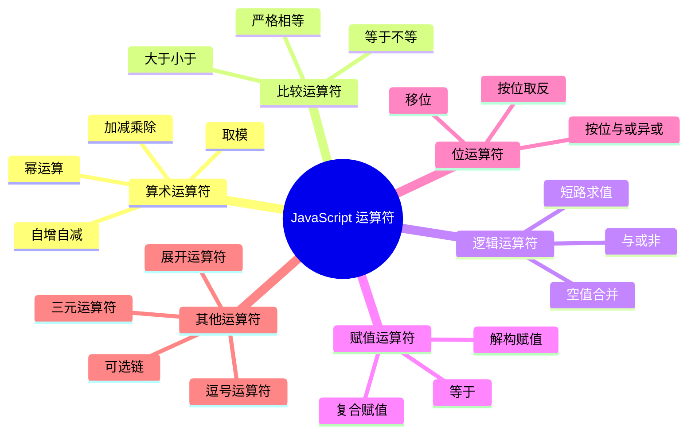
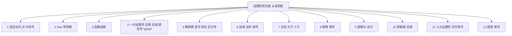

# 运算符

运算符是用于执行特定操作的符号，JavaScript 提供了丰富的运算符。

## 运算符分类



## 算术运算符

### 基本算术运算

```javascript
// 加法
console.log(5 + 3);        // 8
console.log('5' + 3);      // '53'（字符串拼接）
console.log('Hello' + ' ' + 'World');  // 'Hello World'

// 减法
console.log(10 - 4);       // 6
console.log('10' - 4);     // 6（字符串转为数字）

// 乘法
console.log(6 * 7);        // 42

// 除法
console.log(15 / 3);       // 5
console.log(15 / 2);       // 7.5
console.log(15 / 0);       // Infinity

// 取模（余数）
console.log(10 % 3);       // 1
console.log(11 % 3);       // 2
console.log(12 % 3);       // 0

// 判断奇偶
function isEven(num) {
    return num % 2 === 0;
}
console.log(isEven(4));    // true
console.log(isEven(5));    // false

// 幂运算
console.log(2 ** 3);       // 8（2 的 3 次方）
console.log(10 ** 2);      // 100
console.log(Math.pow(2, 3)); // 8（等价写法）
```

### 自增自减

```javascript
let count = 0;

// 后置自增：先返回值，再自增
console.log(count++);  // 0
console.log(count);    // 1

// 前置自增：先自增，再返回值
console.log(++count);  // 2
console.log(count);    // 2

// 后置自减
console.log(count--);  // 2
console.log(count);    // 1

// 前置自减
console.log(--count);  // 0
console.log(count);    // 0
```

::: tip 自增自减陷阱

```javascript
// ❌ 容易出错的写法
let x = 5;
let y = x++ + ++x;
console.log(y);  // 12 (5 + 7)

// ✅ 清晰的写法
let x = 5;
x++;  // x = 6
++x;  // x = 7
let y = x + x;  // 14
```

:::

### 一元运算符

```javascript
// 一元加号（转为数字）
console.log(+'5');      // 5
console.log(+'hello');  // NaN
console.log(+true);     // 1

// 一元减号（取负）
console.log(-5);        // -5
console.log(-'5');      // -5
```

## 比较运算符

### 相等比较

```javascript
// 相等（允许类型转换）
console.log(5 == 5);       // true
console.log(5 == '5');     // true（字符串转为数字）
console.log(0 == '');      // true（空字符串转为 0）
console.log(0 == false);   // true（false 转为 0）
console.log(null == undefined);  // true

// 不等
console.log(5 != 3);       // true
console.log(5 != '5');     // false

// 严格相等（不转换类型）
console.log(5 === 5);      // true
console.log(5 === '5');    // false（类型不同）
console.log(0 === '0');    // false
console.log(null === undefined); // false

// 严格不等
console.log(5 !== '5');    // true
console.log(5 !== 5);      // false
```

::: warning 始终使用严格相等

```javascript
// ❌ 不推荐
if (x == 5) { }

// ✅ 推荐
if (x === 5) { }
```

:::

### 大小比较

```javascript
// 大于
console.log(10 > 5);       // true
console.log(10 > '5');     // true

// 小于
console.log(5 < 10);       // true

// 大于等于
console.log(10 >= 10);     // true

// 小于等于
console.log(5 <= 5);       // true

// 字符串比较（按字典序）
console.log('a' < 'b');    // true
console.log('A' < 'a');    // true（大写字母 ASCII 码更小）
console.log('10' > '9');    // false（按字符比较）
```

## 逻辑运算符

### 逻辑与、或、非

```javascript
// 逻辑与（&&）
console.log(true && true);   // true
console.log(true && false);  // false
console.log(false && true);  // false
console.log(false && false); // false

// 逻辑或（||）
console.log(true || true);   // true
console.log(true || false);  // true
console.log(false || true);  // true
console.log(false || false); // false

// 逻辑非（!）
console.log(!true);          // false
console.log(!false);         // true
console.log(!0);             // true
console.log(!'hello');       // false
```

### 短路求值

```javascript
// 逻辑与短路：第一个为 false，返回第一个值
let result = 0 && 'hello';
console.log(result);  // 0

result = 1 && 'hello';
console.log(result);  // 'hello'

// 逻辑或短路：第一个为 true，返回第一个值
let x = 5 || 10;
console.log(x);  // 5

let y = 0 || 10;
console.log(y);  // 10

// 实际应用：默认值
function greet(name) {
    name = name || 'Guest';  // 如果 name 为假值，使用默认值
    console.log(`Hello, ${name}!`);
}
greet();           // Hello, Guest!
greet('Alice');    // Hello, Alice!
```

### 空值合并运算符（??）

```javascript
// 只在左侧为 null 或 undefined 时返回右侧
let value = null ?? 'default';
console.log(value);  // 'default'

value = undefined ?? 'default';
console.log(value);  // 'default'

value = 0 ?? 'default';
console.log(value);  // 0（0 不是 null/undefined）

value = '' ?? 'default';
console.log(value);  // ''（空字符串不是 null/undefined）

value = false ?? 'default';
console.log(value);  // false

// 与 || 的区别
console.log(0 || 10);      // 10
console.log(0 ?? 10);      // 0
console.log('' || 'default');   // 'default'
console.log('' ?? 'default');   // ''

// 实际应用
function getConfig(config) {
    return {
        timeout: config.timeout ?? 3000,
        retries: config.retries ?? 3
    };
}
```

### 逻辑空赋值（??=）

```javascript
let x = null;
x ??= 10;
console.log(x);  // 10

let y = 5;
y ??= 10;
console.log(y);  // 5（y 不是 null/undefined，不赋值）
```

## 赋值运算符

### 基本赋值

```javascript
let x = 10;
let y = x;  // y = 10
```

### 复合赋值

```javascript
let x = 10;

x += 5;   // x = x + 5  = 15
x -= 3;   // x = x - 3  = 12
x *= 2;   // x = x * 2  = 24
x /= 4;   // x = x / 4  = 6
x %= 4;   // x = x % 4  = 2

// 字符串拼接
let str = 'Hello';
str += ' World';  // str = 'Hello World'
str += '!';       // str = 'Hello World!'

// 幂运算赋值
let num = 2;
num **= 3;  // num = 2 ** 3 = 8
```

### 解构赋值

```javascript
// 数组解构
const [a, b, c] = [1, 2, 3];
console.log(a, b, c);  // 1 2 3

// 对象解构
const { name, age } = { name: 'Alice', age: 25 };
console.log(name, age);  // Alice 25

// 交换变量
let x = 1;
let y = 2;
[x, y] = [y, x];
console.log(x, y);  // 2 1
```

## 三元运算符

```javascript
// 语法：条件 ? 表达式1 : 表达式2
const age = 18;
const status = age >= 18 ? '成年' : '未成年';
console.log(status);  // '成年'

// 嵌套三元运算符
const score = 85;
const grade = score >= 90 ? 'A' :
              score >= 80 ? 'B' :
              score >= 70 ? 'C' : 'D';
console.log(grade);  // 'B'

// 实际应用
function getFee(isMember) {
    return isMember ? '$5.00' : '$10.00';
}
console.log(getFee(true));   // '$5.00'
console.log(getFee(false));  // '$10.00'
```

::: tip 三元运算符 vs if...else

```javascript
// ✅ 简单条件用三元运算符
const max = a > b ? a : b;

// ✅ 复杂逻辑用 if...else
let result;
if (condition1 && condition2) {
    result = 'A';
} else if (condition3) {
    result = 'B';
} else {
    result = 'C';
}
```

:::

## 可选链运算符（?.）

```javascript
// 安全访问嵌套属性
const user = {
    profile: {
        name: 'Alice'
    }
};

// 传统方式
console.log(user.profile && user.profile.name);  // 'Alice'

// 可选链
console.log(user.profile?.name);  // 'Alice'
console.log(user.address?.city);  // undefined（不会报错）

// 可选方法调用
const obj = {
    method() { return 'Hello'; }
};
console.log(obj.method?.());  // 'Hello'
console.log(obj.unknown?.()); // undefined

// 可选数组访问
const arr = [1, 2, 3];
console.log(arr?.[0]);  // 1
console.log(arr?.[10]); // undefined
```

## 逗号运算符

```javascript
// 逗号运算符：从左到右求值，返回最右边的值
let x = (1, 2, 3);
console.log(x);  // 3

// 常用于 for 循环
for (let i = 0, j = 10; i < 5; i++, j--) {
    console.log(i, j);
}
// 0 10
// 1 9
// 2 8
// 3 7
// 4 6
```

## typeof 运算符

```javascript
console.log(typeof 42);           // 'number'
console.log(typeof 'hello');      // 'string'
console.log(typeof true);         // 'boolean'
console.log(typeof undefined);    // 'undefined'
console.log(typeof null);         // 'object'（历史原因）
console.log(typeof {});           // 'object'
console.log(typeof []);           // 'object'
console.log(typeof function(){}); // 'function'
console.log(typeof Symbol());     // 'symbol'
console.log(typeof 42n);          // 'bigint'

// 实际应用：类型检查
function process(value) {
    if (typeof value === 'string') {
        console.log('处理字符串');
    } else if (typeof value === 'number') {
        console.log('处理数字');
    } else {
        console.log('未知类型');
    }
}
```

## instanceof 运算符

```javascript
// 检查对象是否是某个构造函数的实例
class Person {}
const person = new Person();

console.log(person instanceof Person);  // true
console.log(person instanceof Object);  // true
console.log([] instanceof Array);       // true
console.log([] instanceof Object);      // true
console.log(function(){} instanceof Function);  // true
```

## 运算符优先级



```javascript
// 优先级示例
let result = 2 + 3 * 4;
console.log(result);  // 14（先乘后加）

result = (2 + 3) * 4;
console.log(result);  // 20（括号优先）

// 混合运算
console.log(true && false || true);  // true（&& 优先于 ||）
console.log(1 + 2 === 3 && 4 > 3);  // true

// 使用括号明确优先级（推荐）
result = ((1 + 2) * 3) - 4;
console.log(result);  // 5
```

## 实战示例

```javascript
// 计算器
function calculator(a, b, operator) {
    switch (operator) {
        case '+': return a + b;
        case '-': return a - b;
        case '*': return a * b;
        case '/': return b !== 0 ? a / b : '除数不能为零';
        case '%': return a % b;
        case '**': return a ** b;
        default: return '未知运算符';
    }
}

// 数据验证
function validateUser(user) {
    const name = user.name ?? '未知用户';
    const age = user.age ?? 0;
    const isActive = user.isActive ?? true;

    return age >= 18 && isActive
        ? `${name} 是活跃成年用户`
        : `${name} 不符合条件`;
}

// 安全访问
function getUserCity(user) {
    return user?.address?.city ?? '未知城市';
}
```

::: tip 最佳实践

1. 使用 `===` 而非 `==`
2. 复杂表达式使用括号明确优先级
3. 使用 `??` 处理 null/undefined
4. 使用 `?.` 安全访问嵌套属性
5. 简单条件用三元运算符，复杂逻辑用 if...else

:::
