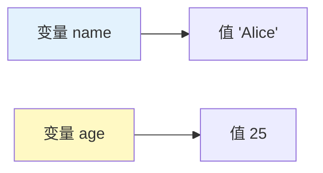
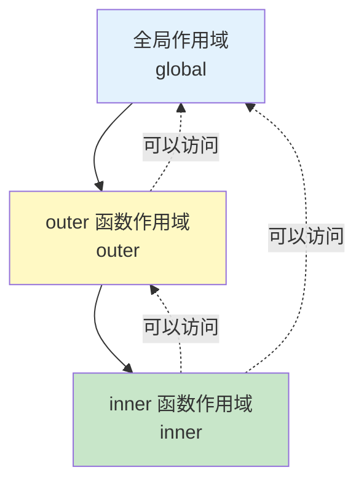

# 变量与声明

变量是存储数据的容器，理解变量的声明方式和作用域是 JavaScript 编程的基础。

## 变量的本质

变量就像一个容器，用来存储数据值：

```javascript
// 创建一个名为 name 的变量，存储字符串 "Alice"
let name = "Alice";

// 创建一个名为 age 的变量，存储数字 25
let age = 25;

// 使用变量
console.log(name);  // 输出: Alice
console.log(age);   // 输出: 25
```



## 三种声明方式

### var - 传统方式（不推荐）

```javascript
var message = "Hello";

// var 的特点：
// 1. 函数作用域
// 2. 可以重复声明
// 3. 存在变量提升

function test() {
    var x = 10;
    if (true) {
        var x = 20;  // 同一个 x
        console.log(x);  // 20
    }
    console.log(x);  // 20
}
```

::: danger 为什么不推荐 var？

1. **作用域混乱**：函数作用域容易导致变量泄漏
2. **重复声明**：同一变量可以多次声明，容易出错
3. **变量提升**：变量可在声明前使用，行为不直观

:::

### let - 现代推荐

```javascript
let message = "Hello";

// let 的特点：
// 1. 块级作用域
// 2. 不可重复声明
// 3. 可以重新赋值
// 4. 不存在变量提升（有暂时性死区）

function test() {
    let x = 10;
    if (true) {
        let x = 20;  // 不同的 x
        console.log(x);  // 20
    }
    console.log(x);  // 10
}

// 重新赋值
let count = 0;
count = count + 1;  // OK
count = 10;         // OK
```

### const - 常量声明（推荐优先使用）

```javascript
const PI = 3.14159;

// const 的特点：
// 1. 块级作用域
// 2. 不可重复声明
// 3. 不可重新赋值
// 4. 声明时必须初始化

// PI = 3.14;  // 报错：不能重新赋值

// 对象和数组
const person = { name: "Alice", age: 25 };
person.age = 26;        // OK：可以修改属性
person.city = "Beijing"; // OK：可以添加属性

// person = {};          // 报错：不能重新赋值

const numbers = [1, 2, 3];
numbers.push(4);         // OK：可以修改数组内容
numbers[0] = 10;         // OK：可以修改元素
// numbers = [];         // 报错：不能重新赋值
```

::: tip 优先使用 const

**黄金法则**：
1. 默认使用 `const`
2. 需要重新赋值时使用 `let`
3. 永远不要使用 `var`

```javascript
// 好的做法
const name = "Alice";
const age = 25;
let score = 0;
score = score + 10;
```

:::

## 命名规则

### 有效命名

```javascript
// ✅ 可以包含字母、数字、下划线、美元符号
let userName = "alice";
let user_name = "alice";
let userName123 = "alice";
let $special = "special";

// ✅ 区分大小写
let name = "Alice";
let Name = "Bob";      // 不同的变量
let NAME = "Charlie";  // 又一个不同的变量

// ✅ 驼峰命名法（推荐）
let firstName = "Alice";
let lastName = "Smith";
let userAge = 25;
let isLoggedIn = true;
```

### 无效命名

```javascript
// ❌ 不能以数字开头
// let 1name = "alice";  // 语法错误

// ❌ 不能包含空格
// let user name = "alice";  // 语法错误

// ❌ 不能使用保留字
// let let = "test";      // 语法错误
// let const = "test";    // 语法错误
// let function = "test"; // 语法错误
// let return = "test";   // 语法错误
```

### 命名最佳实践

```javascript
// ✅ 使用有意义的名称
let userName = "alice";          // 好
let x = "alice";                 // 差：不够明确

let isActive = true;             // 好：布尔值用 is/has 开头
let flag = true;                 // 差：不够明确

let maxCount = 100;              // 好：表示最大值
let count = 100;                 // 一般：不够明确

// ✅ 常量使用全大写
const MAX_SIZE = 100;
const API_URL = "https://api.example.com";
const DEFAULT_TIMEOUT = 5000;

// ✅ 私有变量用下划线前缀（约定俗成）
let _privateVar = "private";
```

## 变量声明位置

### 变量提升（Hoisting）

```javascript
// var 存在变量提升
console.log(x);  // undefined（不会报错）
var x = 10;

// 等价于：
var x;           // 声明被提升
console.log(x);  // undefined
x = 10;          // 赋值留在原地

// let 和 const 不存在变量提升（有暂时性死区）
// console.log(y);  // 报错：Cannot access 'y' before initialization
let y = 10;
```

### 暂时性死区（TDZ）

```javascript
// 从块开始到 let/const 声明之间的区域是"暂时性死区"
{
    // TDZ 开始
    // console.log(x);  // 报错：x 在 TDZ 中
    let x = 10;        // TDZ 结束
    console.log(x);    // OK: 10
}
```

## 作用域

### 全局作用域

```javascript
// 在函数外声明的变量是全局变量
let globalVar = "全局变量";

function test() {
    console.log(globalVar);  // 可以访问
}

test();  // "全局变量"
console.log(globalVar);  // "全局变量"
```

### 函数作用域（var）

```javascript
function test() {
    var functionScoped = "函数作用域";
    console.log(functionScoped);  // OK
}

test();
// console.log(functionScoped);  // 报错：未定义
```

### 块级作用域（let、const）

```javascript
{
    let blockScoped = "块级作用域";
    const constant = "常量";
    console.log(blockScoped);  // OK
    console.log(constant);     // OK
}

// console.log(blockScoped);  // 报错：未定义
// console.log(constant);     // 报错：未定义

// if 语句块
if (true) {
    let x = 10;
    console.log(x);  // OK: 10
}
// console.log(x);   // 报错：未定义

// for 循环块
for (let i = 0; i < 3; i++) {
    console.log(i);  // 0, 1, 2
}
// console.log(i);   // 报错：未定义
```

## 嵌套作用域与作用域链

```javascript
let global = "全局";

function outer() {
    let outer = "外层";

    function inner() {
        let inner = "内层";
        console.log(inner);  // "内层"（当前作用域）
        console.log(outer);  // "外层"（外层作用域）
        console.log(global); // "全局"（全局作用域）
    }

    inner();
    // console.log(inner);  // 报错：内层变量不可访问
}

outer();
// console.log(outer);  // 报错：外层变量不可访问
```



## 变量解构

### 数组解构

```javascript
// 基本解构
const numbers = [1, 2, 3];
const [a, b, c] = numbers;
console.log(a, b, c);  // 1 2 3

// 跳过元素
const [first, , third] = numbers;
console.log(first, third);  // 1 3

// 剩余元素
const [head, ...tail] = numbers;
console.log(head);  // 1
console.log(tail);  // [2, 3]

// 默认值
const [x, y, z = 30] = [10, 20];
console.log(x, y, z);  // 10 20 30
```

### 对象解构

```javascript
// 基本解构
const person = { name: "Alice", age: 25, city: "Beijing" };
const { name, age } = person;
console.log(name, age);  // Alice 25

// 重命名
const { name: userName, age: userAge } = person;
console.log(userName, userAge);  // Alice 25

// 默认值
const { name: n, country = "China" } = person;
console.log(n, country);  // Alice China

// 嵌套解构
const user = {
    info: {
        name: "Alice",
        contact: {
            email: "alice@example.com"
        }
    }
};
const { info: { name, contact: { email } } } = user;
console.log(name, email);  // Alice alice@example.com
```

## 最佳实践总结

```javascript
// ✅ 推荐做法

// 1. 优先使用 const
const MAX_SIZE = 100;
const API_URL = "https://api.example.com";

// 2. 需要重新赋值时使用 let
let count = 0;
count = count + 1;

// 3. 有意义的命名
let userName = "alice";
let isLoggedIn = true;
const MAX_RETRY_COUNT = 3;

// 4. 就近声明
function processData() {
    let result = [];
    // ... 处理逻辑
    return result;
}

// 5. 使用解构
const { name, age } = person;
const [first, second] = array;
```

```javascript
// ❌ 不推荐做法

// 1. 使用 var
var oldStyle = "过时了";

// 2. 无意义的命名
let x = "alice";
let flag = true;

// 3. 到处声明全局变量
global1 = "value1";
global2 = "value2";

// 4. 变量提升导致的问题
console.log(x);  // undefined
var x = 10;
```

::: tip 变量声明检查清单

- [ ] 默认使用 `const`，需要重新赋值时使用 `let`
- [ ] 不使用 `var`
- [ ] 使用有意义的变量名
- [ ] 布尔值用 `is`/`has` 开头
- [ ] 常量使用全大写
- [ ] 变量在需要时才声明
- [ ] 避免全局变量污染

:::
