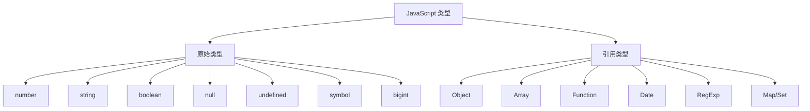

# 数据类型与结构

JavaScript 有 7 种原始类型和多种引用类型，理解它们是编写健壮代码的基础。

## 学习内容

- [原始类型](./primitives.md) - number、string、boolean、null、undefined、symbol、bigint
- [对象基础](./objects.md) - 对象创建、属性访问
- [数组](./arrays.md) - 数组方法、遍历、操作
- [字符串](./strings.md) - 字符串方法、模板字符串
- [类型转换](./types-conversion.md) - 显式与隐式转换

## 类型系统图

