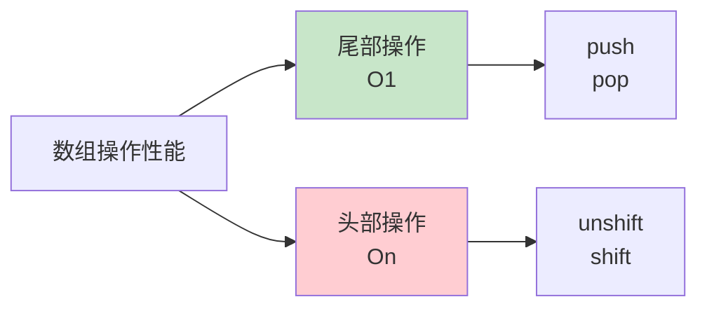

# 数组

数组是有序的数据集合，可以存储多个值。

## 创建数组

### 数组字面量（推荐）

```javascript
// 空数组
const empty = [];

// 带元素的数组
const fruits = ['apple', 'banana', 'orange'];

// 不同类型的元素
const mixed = [1, 'hello', true, null, undefined];

// 多维数组
const matrix = [
    [1, 2, 3],
    [4, 5, 6],
    [7, 8, 9]
];

// 尾部逗号（允许）
const numbers = [1, 2, 3, ];
```

### Array 构造函数

```javascript
// 传递元素
const arr1 = new Array(1, 2, 3);
console.log(arr1);  // [1, 2, 3]

// 传递单个数字（创建指定长度的空数组）
const arr2 = new Array(5);
console.log(arr2.length);  // 5
console.log(arr2);  // [empty × 5]（5 个空位）

// 传递单个非数字
const arr3 = new Array('5');
console.log(arr3);  // ['5']

// ⚠️ 注意：避免使用 Array 构造函数
```

### Array.of() 和 Array.from()

```javascript
// Array.of：创建包含指定元素的数组
const arr1 = Array.of(5);
console.log(arr1);  // [5]

const arr2 = Array.of(1, 2, 3);
console.log(arr2);  // [1, 2, 3]

// Array.from：从类数组或可迭代对象创建数组
const str = 'hello';
const arr3 = Array.from(str);
console.log(arr3);  // ['h', 'e', 'l', 'l', 'o']

// 带映射函数
const arr4 = Array.from([1, 2, 3], x => x * 2);
console.log(arr4);  // [2, 4, 6]

// 从 Set 创建数组
const set = new Set([1, 2, 2, 3]);
const arr5 = Array.from(set);
console.log(arr5);  // [1, 2, 3]
```

## 访问和修改元素

### 索引访问

```javascript
const fruits = ['apple', 'banana', 'orange'];

// 访问元素（索引从 0 开始）
console.log(fruits[0]);  // 'apple'
console.log(fruits[1]);  // 'banana'
console.log(fruits[2]);  // 'orange'

// 访问不存在的索引
console.log(fruits[3]);  // undefined

// 负数索引（不工作）
console.log(fruits[-1]);  // undefined（不像 Python）
```

### 修改元素

```javascript
const fruits = ['apple', 'banana', 'orange'];

// 修改元素
fruits[1] = 'grape';
console.log(fruits);  // ['apple', 'grape', 'orange']

// 添加元素到超出长度的索引
fruits[5] = 'mango';
console.log(fruits);
// ['apple', 'grape', 'orange', empty × 2, 'mango']
console.log(fruits.length);  // 6
```

### length 属性

```javascript
const fruits = ['apple', 'banana', 'orange'];

// 获取长度
console.log(fruits.length);  // 3

// 修改长度
fruits.length = 5;
console.log(fruits);  // ['apple', 'banana', 'orange', empty × 2]

fruits.length = 2;
console.log(fruits);  // ['apple', 'banana']

// 清空数组
fruits.length = 0;
console.log(fruits);  // []
```

## 添加和删除元素

### 尾部操作

```javascript
const fruits = ['apple', 'banana'];

// push：添加到末尾
fruits.push('orange');
console.log(fruits);  // ['apple', 'banana', 'orange']

// push 多个元素
fruits.push('grape', 'mango');
console.log(fruits);  // ['apple', 'banana', 'orange', 'grape', 'mango']

// pop：删除末尾元素
const last = fruits.pop();
console.log(last);    // 'mango'
console.log(fruits);  // ['apple', 'banana', 'orange', 'grape']
```

### 头部操作

```javascript
const fruits = ['banana', 'orange'];

// unshift：添加到开头
fruits.unshift('apple');
console.log(fruits);  // ['apple', 'banana', 'orange']

// shift：删除开头元素
const first = fruits.shift();
console.log(first);   // 'apple'
console.log(fruits);  // ['banana', 'orange']
```

### 性能对比



```javascript
// 头部操作需要移动所有元素，性能较差
// 对于大数组，避免使用 unshift/shift
const large = new Array(100000).fill(0);

// ❌ 慢
console.time('unshift');
large.unshift(1);
console.timeEnd('unshift');  // ~5ms

// ✅ 快
console.time('push');
large.push(1);
console.timeEnd('push');  // <0.1ms
```

## 查找元素

### indexOf 和 lastIndexOf

```javascript
const fruits = ['apple', 'banana', 'orange', 'banana'];

// indexOf：首次出现的索引
console.log(fruits.indexOf('banana'));  // 1
console.log(fruits.indexOf('grape'));   // -1（不存在）

// lastIndexOf：最后出现的索引
console.log(fruits.lastIndexOf('banana'));  // 3

// 起始位置
console.log(fruits.indexOf('banana', 2));  // 3（从索引 2 开始查找）
```

### includes

```javascript
const fruits = ['apple', 'banana', 'orange'];

// 检查是否包含元素
console.log(fruits.includes('banana'));  // true
console.log(fruits.includes('grape'));   // false

// 检查 NaN
const arr = [1, NaN, 2];
console.log(arr.includes(NaN));  // true（indexOf 无法做到）
```

### find 和 findIndex

```javascript
const users = [
    { id: 1, name: 'Alice' },
    { id: 2, name: 'Bob' },
    { id: 3, name: 'Charlie' }
];

// find：查找第一个符合条件的元素
const user = users.find(u => u.id === 2);
console.log(user);  // { id: 2, name: 'Bob' }

// findIndex：查找第一个符合条件的元素索引
const index = users.findIndex(u => u.name === 'Charlie');
console.log(index);  // 2

// 找不到返回 undefined/-1
console.log(users.find(u => u.id === 999));  // undefined
console.log(users.findIndex(u => u.id === 999));  // -1
```

## 遍历数组

### forEach

```javascript
const fruits = ['apple', 'banana', 'orange'];

// forEach：遍历数组
fruits.forEach(function(fruit, index, array) {
    console.log(`${index}: ${fruit}`);
});

// 使用箭头函数
fruits.forEach((fruit, index) => {
    console.log(`${index}: ${fruit}`);
});

// ⚠️ 无法中途退出
fruits.forEach(fruit => {
    console.log(fruit);
    return; // 只是跳过当前元素，不退出循环
    // break 不允许使用
});
```

### map

```javascript
const numbers = [1, 2, 3, 4, 5];

// map：映射到新数组
const doubled = numbers.map(num => num * 2);
console.log(doubled);  // [2, 4, 6, 8, 10]

// 原数组不变
console.log(numbers);  // [1, 2, 3, 4, 5]

// 转换数据
const users = [
    { firstName: 'Alice', lastName: 'Smith' },
    { firstName: 'Bob', lastName: 'Johnson' }
];

const fullNames = users.map(user => `${user.firstName} ${user.lastName}`);
console.log(fullNames);  // ['Alice Smith', 'Bob Johnson']
```

### filter

```javascript
const numbers = [1, 2, 3, 4, 5, 6];

// filter：过滤元素
const evens = numbers.filter(num => num % 2 === 0);
console.log(evens);  // [2, 4, 6]

const odds = numbers.filter(num => num % 2 !== 0);
console.log(odds);  // [1, 3, 5]

// 过滤对象
const products = [
    { name: 'Apple', price: 5 },
    { name: 'Banana', price: 2 },
    { name: 'Orange', price: 8 }
];

const expensive = products.filter(p => p.price > 5);
console.log(expensive);  // [{ name: 'Orange', price: 8 }]
```

### reduce

```javascript
const numbers = [1, 2, 3, 4, 5];

// reduce：归约为单个值
const sum = numbers.reduce((acc, num) => acc + num, 0);
console.log(sum);  // 15

// 不提供初始值（使用第一个元素作为初始值）
const sum2 = numbers.reduce((acc, num) => acc + num);
console.log(sum2);  // 15

// 查找最大值
const max = numbers.reduce((acc, num) => Math.max(acc, num));
console.log(max);  // 5

// 计算平均值
const avg = numbers.reduce((acc, num) => acc + num, 0) / numbers.length;
console.log(avg);  // 3

// 分组
const fruits = ['apple', 'banana', 'apple', 'orange', 'banana', 'apple'];
const frequency = fruits.reduce((acc, fruit) => {
    acc[fruit] = (acc[fruit] || 0) + 1;
    return acc;
}, {});
console.log(frequency);  // { apple: 3, banana: 2, orange: 1 }
```

### some 和 every

```javascript
const numbers = [1, 2, 3, 4, 5];

// some：是否有元素满足条件
const hasEven = numbers.some(num => num % 2 === 0);
console.log(hasEven);  // true

const hasNegative = numbers.some(num => num < 0);
console.log(hasNegative);  // false

// every：是否所有元素都满足条件
const allPositive = numbers.every(num => num > 0);
console.log(allPositive);  // true

const allLessThanTen = numbers.every(num => num < 10);
console.log(allLessThanTen);  // true
```

## 数组方法

### slice

```javascript
const fruits = ['apple', 'banana', 'orange', 'grape', 'mango'];

// slice：提取子数组（不修改原数组）
console.log(fruits.slice(1, 3));  // ['banana', 'orange']
console.log(fruits.slice(2));     // ['orange', 'grape', 'mango']
console.log(fruits.slice(-2));    // ['grape', 'mango']
console.log(fruits.slice());      // ['apple', 'banana', 'orange', 'grape', 'mango']（复制）

// 原数组不变
console.log(fruits);  // ['apple', 'banana', 'orange', 'grape', 'mango']
```

### splice

```javascript
const fruits = ['apple', 'banana', 'orange', 'grape', 'mango'];

// splice：删除/插入/替换（修改原数组）
// splice(start, deleteCount, ...items)

// 删除元素
const removed = fruits.splice(2, 2);
console.log(removed);  // ['orange', 'grape']
console.log(fruits);   // ['apple', 'banana', 'mango']

// 插入元素
fruits.splice(1, 0, 'kiwi');
console.log(fruits);   // ['apple', 'kiwi', 'banana', 'mango']

// 替换元素
fruits.splice(1, 1, 'pear');
console.log(fruits);   // ['apple', 'pear', 'banana', 'mango']
```

### concat

```javascript
const arr1 = [1, 2];
const arr2 = [3, 4];

// concat：连接数组（不修改原数组）
const arr3 = arr1.concat(arr2);
console.log(arr3);  // [1, 2, 3, 4]

// 连接多个数组
const arr4 = arr1.concat(arr2, [5, 6]);
console.log(arr4);  // [1, 2, 3, 4, 5, 6]

// 原数组不变
console.log(arr1);  // [1, 2]
console.log(arr2);  // [3, 4]

// 展开嵌套数组（不使用 flat）
const nested = [1, [2, [3, [4]]]];
const flat = nested.flat(Infinity);
console.log(flat);  // [1, 2, 3, 4]
```

### join

```javascript
const fruits = ['apple', 'banana', 'orange'];

// join：连接为字符串
console.log(fruits.join());       // 'apple,banana,orange'
console.log(fruits.join(', '));   // 'apple, banana, orange'
console.log(fruits.join(' | '));  // 'apple | banana | orange'
console.log(fruits.join(''));     // 'applebananaorange'
```

### reverse 和 sort

```javascript
// reverse：反转数组（修改原数组）
const numbers = [1, 2, 3];
numbers.reverse();
console.log(numbers);  // [3, 2, 1]

// sort：排序（修改原数组）
const fruits = ['orange', 'apple', 'banana'];
fruits.sort();
console.log(fruits);  // ['apple', 'banana', 'orange']

// 数字排序（需要比较函数）
const nums = [10, 2, 100, 1, 20];
nums.sort((a, b) => a - b);  // 升序
console.log(nums);  // [1, 2, 10, 20, 100]

nums.sort((a, b) => b - a);  // 降序
console.log(nums);  // [100, 20, 10, 2, 1]

// 对象排序
const users = [
    { name: 'Alice', age: 25 },
    { name: 'Bob', age: 20 },
    { name: 'Charlie', age: 30 }
];
users.sort((a, b) => a.age - b.age);
console.log(users);
// [{ name: 'Bob', age: 20 }, { name: 'Alice', age: 25 }, { name: 'Charlie', age: 30 }]
```

## 数组解构

### 基本解构

```javascript
const fruits = ['apple', 'banana', 'orange'];

// 解构赋值
const [first, second, third] = fruits;
console.log(first, second, third);  // 'apple' 'banana' 'orange'

// 跳过元素
const [first2, , third2] = fruits;
console.log(first2, third2);  // 'apple' 'orange'

// 剩余元素
const [head, ...tail] = fruits;
console.log(head);  // 'apple'
console.log(tail);  // ['banana', 'orange']
```

### 默认值

```javascript
const fruits = ['apple'];

// 设置默认值
const [first, second = 'banana', third = 'orange'] = fruits;
console.log(first, second, third);  // 'apple' 'banana' 'orange'
```

### 交换变量

```javascript
let a = 1;
let b = 2;

// 使用解构交换
[a, b] = [b, a];
console.log(a, b);  // 2 1
```

## 展开和剩余

### 展开语法

```javascript
const arr1 = [1, 2];
const arr2 = [3, 4];

// 展开数组
const combined = [...arr1, ...arr2];
console.log(combined);  // [1, 2, 3, 4]

// 复制数组
const copy = [...arr1];
console.log(copy);  // [1, 2]

// 展开字符串
const chars = [...'hello'];
console.log(chars);  // ['h', 'e', 'l', 'l', 'o']

// 函数参数
function sum(a, b, c) {
    return a + b + c;
}
const numbers = [1, 2, 3];
console.log(sum(...numbers));  // 6
```

### 剩余语法

```javascript
// 收集剩余元素
const [first, ...rest] = [1, 2, 3, 4, 5];
console.log(first);  // 1
console.log(rest);   // [2, 3, 4, 5]

// 函数参数
function sum(...numbers) {
    return numbers.reduce((acc, num) => acc + num, 0);
}
console.log(sum(1, 2, 3));  // 6
console.log(sum(1, 2, 3, 4, 5));  // 15
```

## 多维数组

### 创建多维数组

```javascript
// 二维数组
const matrix = [
    [1, 2, 3],
    [4, 5, 6],
    [7, 8, 9]
];

// 访问元素
console.log(matrix[0][0]);  // 1
console.log(matrix[1][2]);  // 6

// 修改元素
matrix[2][1] = 0;
console.log(matrix[2]);  // [7, 0, 9]
```

### 扁平化

```javascript
const nested = [1, [2, [3, [4, 5]]]];

// flat：扁平化
console.log(nested.flat());     // [1, 2, [3, [4, 5]]]
console.log(nested.flat(2));    // [1, 2, 3, [4, 5]]
console.log(nested.flat(Infinity));  // [1, 2, 3, 4, 5]

// flatMap：映射后扁平化
const arr = [1, 2, 3];
const result = arr.flatMap(x => [x, x * 2]);
console.log(result);  // [1, 2, 2, 4, 3, 6]
```

## 数组最佳实践

```javascript
// ✅ 推荐做法

// 1. 使用字面量创建数组
const arr = [1, 2, 3];

// 2. 使用展开语法复制数组
const copy = [...arr];

// 3. 使用高阶方法而非循环
const doubled = arr.map(x => x * 2);
const evens = arr.filter(x => x % 2 === 0);

// 4. 使用 Array.from 转换类数组
const arrayLike = { 0: 'a', 1: 'b', length: 2 };
const arr2 = Array.from(arrayLike);

// 5. 使用解构赋值
const [first, ...rest] = arr;

// ❌ 不推荐做法

// 1. 使用 Array 构造函数
const arr3 = new Array(5);  // 容易混淆

// 2. 使用 for 循环遍历（可用 forEach/map/for...of）
for (let i = 0; i < arr.length; i++) { }

// 3. 直接修改数组长度
arr.length = 0;  // 清空（小心）
```

::: tip 下一步

了解字符串操作 → [字符串](./strings.md)
:::
