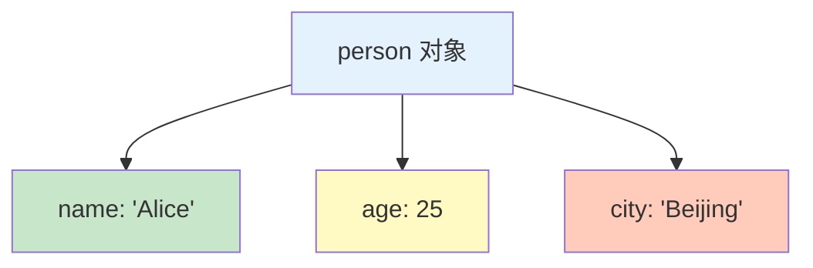

# 对象基础

对象是 JavaScript 中最复杂的数据类型，用于存储键值对和更复杂的数据结构。

## 什么是对象

对象是**属性**的集合，每个属性都是一个键值对：

```javascript
// 对象字面量
const person = {
    name: 'Alice',
    age: 25,
    city: 'Beijing'
};
```



## 创建对象

### 对象字面量（推荐）

```javascript
// 空对象
const empty = {};

// 带属性的对象
const person = {
    name: 'Alice',
    age: 25
};

// 多词属性名（需要引号）
const user = {
    'first name': 'Alice',
    'last name': 'Smith'
};

// 计算属性名（ES6）
const key = 'dynamic';
const obj = {
    [key]: 'value',
    [`prop_${Date.now()}`]: 'timestamp'
};
```

### new Object()（不推荐）

```javascript
// 使用 Object 构造函数
const person = new Object();
person.name = 'Alice';
person.age = 25;

// 等价于对象字面量（更推荐）
const person2 = {
    name: 'Alice',
    age: 25
};
```

### Object.create()

```javascript
// 创建指定原型的对象
const proto = {
    greet() {
        console.log(`Hello, I'm ${this.name}`);
    }
};

const person = Object.create(proto);
person.name = 'Alice';
person.greet();  // "Hello, I'm Alice"

// 创建空对象（无原型）
const pureObject = Object.create(null);
console.log(Object.getPrototypeOf(pureObject));  // null
```

## 访问属性

### 点表示法

```javascript
const person = {
    name: 'Alice',
    age: 25
};

console.log(person.name);  // 'Alice'
console.log(person.age);   // 25

// 不能用于多词属性名
// person.first name;  // 语法错误
```

### 方括号表示法

```javascript
const person = {
    name: 'Alice',
    'first name': 'Alice'
};

// 使用字符串
console.log(person['name']);  // 'Alice'

// 必须用于多词属性名
console.log(person['first name']);  // 'Alice'

// 使用变量
const key = 'name';
console.log(person[key]);  // 'Alice'

// 使用表达式
console.log(person['na' + 'me']);  // 'Alice'
```

### 属性访问最佳实践

```javascript
const obj = {
    name: 'Alice',
    'user name': 'alice123',
    '123': 'number key'
};

// ✅ 点表示法：已知属性名、有效标识符
obj.name;

// ✅ 方括号：变量、多词属性、特殊字符
obj['user name'];
obj[variable];
obj['123'];

// ❌ 避免无效标识符用点表示法
// obj.user name;  // 语法错误
// obj.123;        // 语法错误
```

## 添加和修改属性

```javascript
const person = {
    name: 'Alice'
};

// 添加新属性
person.age = 25;
person.city = 'Beijing';

// 修改现有属性
person.name = 'Bob';
person.age = 30;

// 方括号语法
person['email'] = 'bob@example.com';

console.log(person);
// {
//     name: 'Bob',
//     age: 30,
//     city: 'Beijing',
//     email: 'bob@example.com'
// }
```

## 删除属性

```javascript
const person = {
    name: 'Alice',
    age: 25,
    city: 'Beijing'
};

// delete 操作符
delete person.city;
console.log(person.city);  // undefined

// 删除不存在的属性（不会报错）
delete person.nonExistent;

// delete 返回值
console.log(delete person.age);   // true（删除成功）
console.log(delete person.name);  // true

// 不可删除的属性
const config = {};
Object.defineProperty(config, 'readonly', {
    value: 'cannot delete',
    configurable: false
});
delete config.readonly;  // false（删除失败）
```

::: warning delete 的陷阱

```javascript
// delete 只删除自身属性，不删除原型链上的属性
const obj = Object.create({ inherited: 'value' });
obj.own = 'own value';

delete obj.inherited;  // true（但属性仍然存在）
console.log(obj.inherited);  // 'value'

delete obj.own;  // true
console.log(obj.own);  // undefined
```

:::

## 属性描述符

### 获取属性描述符

```javascript
const person = {
    name: 'Alice'
};

// 获取属性描述符
const descriptor = Object.getOwnPropertyDescriptor(person, 'name');
console.log(descriptor);
// {
//     value: 'Alice',
//     writable: true,
//     enumerable: true,
//     configurable: true
// }
```

### 定义属性

```javascript
const person = {};

Object.defineProperty(person, 'name', {
    value: 'Alice',
    writable: true,      // 可写
    enumerable: true,    // 可枚举
    configurable: true   // 可配置
});

// 只读属性
Object.defineProperty(person, 'id', {
    value: 123,
    writable: false
});
person.id = 456;  // 严格模式下会报错
console.log(person.id);  // 123

// 不可枚举属性
Object.defineProperty(person, 'secret', {
    value: 'hidden',
    enumerable: false
});
console.log(Object.keys(person));  // ['name', 'id']（不包含 secret）

// 不可删除属性
Object.defineProperty(person, 'permanent', {
    value: 'stays',
    configurable: false
});
delete person.permanent;  // false
console.log(person.permanent);  // 'stays'
```

### Getter 和 Setter

```javascript
const person = {
    firstName: 'Alice',
    lastName: 'Smith',

    // Getter
    get fullName() {
        return `${this.firstName} ${this.lastName}`;
    },

    // Setter
    set fullName(name) {
        const parts = name.split(' ');
        this.firstName = parts[0];
        this.lastName = parts[1];
    }
};

console.log(person.fullName);  // 'Alice Smith'
person.fullName = 'Bob Johnson';
console.log(person.firstName);  // 'Bob'
console.log(person.lastName);   // 'Johnson'
```

```javascript
// 使用 Object.defineProperty
const person = {
    firstName: 'Alice',
    lastName: 'Smith'
};

Object.defineProperty(person, 'fullName', {
    get() {
        return `${this.firstName} ${this.lastName}`;
    },
    set(name) {
        const parts = name.split(' ');
        this.firstName = parts[0];
        this.lastName = parts[1];
    }
});
```

## 对象方法

### Object.keys()

```javascript
const person = {
    name: 'Alice',
    age: 25,
    city: 'Beijing'
};

// 获取所有可枚举属性（键）
console.log(Object.keys(person));
// ['name', 'age', 'city']
```

### Object.values()

```javascript
// 获取所有可枚举属性的值
console.log(Object.values(person));
// ['Alice', 25, 'Beijing']
```

### Object.entries()

```javascript
// 获取所有可枚举属性的键值对数组
console.log(Object.entries(person));
// [['name', 'Alice'], ['age', 25], ['city', 'Beijing']]

// 遍历对象
Object.entries(person).forEach(([key, value]) => {
    console.log(`${key}: ${value}`);
});
```

### Object.assign()

```javascript
// 复制对象（浅拷贝）
const target = { a: 1 };
const source1 = { b: 2 };
const source2 = { c: 3 };

const result = Object.assign(target, source1, source2);
console.log(result);  // { a: 1, b: 2, c: 3 }

// 注意：target 被修改
console.log(target === result);  // true

// 创建新对象（避免修改原对象）
const newObj = Object.assign({}, person, { age: 30 });
console.log(newObj);  // { name: 'Alice', age: 30, city: 'Beijing' }
console.log(person);  // 原对象不变
```

### Object.freeze()

```javascript
// 冻结对象（不能添加、删除、修改属性）
const person = {
    name: 'Alice',
    age: 25
};

Object.freeze(person);

// 修改属性（无效）
person.age = 30;
console.log(person.age);  // 25

// 添加属性（无效）
person.city = 'Beijing';
console.log(person.city);  // undefined

// 删除属性（无效）
delete person.name;
console.log(person.name);  // 'Alice'

// 检查是否冻结
console.log(Object.isFrozen(person));  // true
```

### Object.seal()

```javascript
// 密封对象（不能添加、删除属性，但可以修改现有属性）
const person = {
    name: 'Alice',
    age: 25
};

Object.seal(person);

// 修改属性（有效）
person.age = 30;
console.log(person.age);  // 30

// 添加属性（无效）
person.city = 'Beijing';
console.log(person.city);  // undefined

// 删除属性（无效）
delete person.name;
console.log(person.name);  // 'Alice'

// 检查是否密封
console.log(Object.isSealed(person));  // true
```

## 遍历对象

### for...in 循环

```javascript
const person = {
    name: 'Alice',
    age: 25,
    city: 'Beijing'
};

// 遍历可枚举属性（包括原型链）
for (let key in person) {
    console.log(`${key}: ${person[key]}`);
}

// 使用 hasOwnProperty 过滤
for (let key in person) {
    if (person.hasOwnProperty(key)) {
        console.log(`${key}: ${person[key]}`);
    }
}
```

### Object.keys() + forEach

```javascript
// 只遍历自身可枚举属性
Object.keys(person).forEach(key => {
    console.log(`${key}: ${person[key]}`);
});
```

### Object.entries() + for...of

```javascript
// 获取键值对并遍历
for (const [key, value] of Object.entries(person)) {
    console.log(`${key}: ${value}`);
}
```

## 比较对象

```javascript
const obj1 = { name: 'Alice' };
const obj2 = { name: 'Alice' };
const obj3 = obj1;

// 对象是引用类型
console.log(obj1 === obj2);  // false（不同引用）
console.log(obj1 === obj3);  // true（同一引用）

// 浅比较
function shallowEqual(obj1, obj2) {
    const keys1 = Object.keys(obj1);
    const keys2 = Object.keys(obj2);

    if (keys1.length !== keys2.length) return false;

    for (let key of keys1) {
        if (obj1[key] !== obj2[key]) return false;
    }

    return true;
}

console.log(shallowEqual(obj1, obj2));  // true
```

## 对象解构

### 基本解构

```javascript
const person = {
    name: 'Alice',
    age: 25,
    city: 'Beijing'
};

// 解构属性
const { name, age } = person;
console.log(name, age);  // 'Alice' 25

// 重命名
const { name: userName, age: userAge } = person;
console.log(userName, userAge);  // 'Alice' 25
```

### 默认值

```javascript
const person = {
    name: 'Alice'
};

// 设置默认值
const { name, age = 18, city = 'Unknown' } = person;
console.log(name, age, city);  // 'Alice' 18 'Unknown'
```

### 嵌套解构

```javascript
const user = {
    profile: {
        name: 'Alice',
        address: {
            city: 'Beijing',
            country: 'China'
        }
    }
};

// 嵌套解构
const { profile: { name, address: { city } } } = user;
console.log(name, city);  // 'Alice' 'Beijing'

// 保留中间对象
const { profile, profile: { address } } = user;
console.log(profile);  // { name: 'Alice', address: {...} }
```

## 属性简写

```javascript
// ES6 属性简写
const name = 'Alice';
const age = 25;

// 等价于 { name: name, age: age }
const person = {
    name,
    age,
    greet() {
        console.log(`Hello, I'm ${this.name}`);
    }
};

// 方法简写（省略 : function）
const obj = {
    // 传统写法
    // method: function() {},

    // 简写
    method() {
        return 'value';
    }
};
```

## 属性名表达式

```javascript
// 计算属性名
const key = 'dynamic';
const prefix = 'user_';

const obj = {
    [key]: 'value1',           // 'dynamic': 'value1'
    [`${prefix}id`]: 123,      // 'user_id': 123
    [`${prefix}name`]: 'Alice' // 'user_name': 'Alice'
};

console.log(obj);
// { dynamic: 'value1', user_id: 123, user_name: 'Alice' }
```

::: tip 下一步

了解数组操作 → [数组](./arrays.md)
:::
