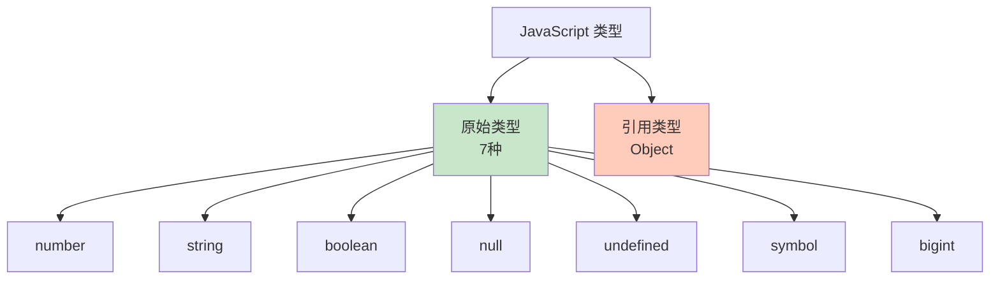

# 原始类型

JavaScript 有 7 种原始类型（Primitive Types），它们是不可变的值类型。

## 类型概览



## 检查类型

### typeof 运算符

```javascript
console.log(typeof 42);           // 'number'
console.log(typeof 'hello');      // 'string'
console.log(typeof true);         // 'boolean'
console.log(typeof undefined);    // 'undefined'
console.log(typeof null);         // 'object'（历史遗留问题）
console.log(typeof Symbol());     // 'symbol'
console.log(typeof 42n);          // 'bigint'
```

::: warning null 的 typeof

```javascript
console.log(typeof null);  // 'object'（这是 JavaScript 的一个历史 bug）

// 正确判断 null 的方法
console.log(null === null);  // true
console.log(value === null);  // 推荐
```

:::

## Number 类型

### 数字字面量

```javascript
// 整数
let integer = 42;
let negative = -10;

// 浮点数
let float = 3.14;
let negativeFloat = -2.5;

// 科学计数法
let scientific = 1.5e3;    // 1500
let scientific2 = 1.5e-3;  // 0.001

// 特殊数字值
let infinity = Infinity;
let negInfinity = -Infinity;
let notANumber = NaN;

// 不同进制
let binary = 0b1010;      // 二进制：10
let octal = 0o755;        // 八进制：493
let hex = 0xFF;           // 十六进制：255
```

### 特殊值

```javascript
// Infinity
console.log(1 / 0);        // Infinity
console.log(-1 / 0);       // -Infinity
console.log(Infinity * 2); // Infinity
console.log(Infinity + 1); // Infinity

// NaN (Not a Number)
console.log(0 / 0);        // NaN
console.log('hello' * 2);  // NaN
console.log(Math.sqrt(-1)); // NaN

// NaN 的特殊性质
console.log(NaN === NaN);  // false（NaN 不等于任何值，包括自己）
console.log(isNaN(NaN));   // true（使用 isNaN 检查）

// Number.isNaN（更严格）
console.log(isNaN('hello'));      // true（会转换类型）
console.log(Number.isNaN('hello')); // false（不转换类型）
console.log(Number.isNaN(NaN));   // true
```

### 安全整数

```javascript
// 安全整数范围：-(2^53 - 1) 到 2^53 - 1
console.log(Number.MAX_SAFE_INTEGER);  // 9007199254740991
console.log(Number.MIN_SAFE_INTEGER);  // -9007199254740991

// 检查是否为安全整数
console.log(Number.isSafeInteger(42));  // true
console.log(Number.isSafeInteger(9007199254740992)); // false

// 数字范围
console.log(Number.MAX_VALUE);  // 1.7976931348623157e+308
console.log(Number.MIN_VALUE);  // 5e-324
```

### Number 方法

```javascript
// 转换为数字
console.log(Number('42'));      // 42
console.log(Number('hello'));   // NaN
console.log(Number(''));        // 0

// parseInt
console.log(parseInt('42'));        // 42
console.log(parseInt('42px'));      // 42
console.log(parseInt('3.14'));      // 3
console.log(parseInt('0xFF'));      // 255
console.log(parseInt('hello', 10)); // NaN

// parseFloat
console.log(parseFloat('3.14'));    // 3.14
console.log(parseFloat('42px'));    // 42
console.log(parseFloat('3.14.15')); // 3.14

// isNaN
console.log(isNaN(NaN));        // true
console.log(isNaN(42));         // false

// isFinite
console.log(isFinite(42));      // true
console.log(isFinite(Infinity)); // false
console.log(isFinite(NaN));     // false
```

### 精度问题

```javascript
// 浮点数精度问题
console.log(0.1 + 0.2);        // 0.30000000000000004
console.log(0.1 + 0.2 === 0.3); // false

// 解决方案：使用 toFixed
console.log((0.1 + 0.2).toFixed(2));  // "0.30"
console.log(parseFloat((0.1 + 0.2).toFixed(2))); // 0.3

// 整数运算通常精确
console.log(0.5 + 0.5);        // 1
console.log(1 + 2);            // 3

// 大整数精度问题
console.log(9007199254740992 + 1); // 9007199254740992（丢失精度）
console.log(9007199254740992 + 2); // 9007199254740994
```

## String 类型

### 字符串字面量

```javascript
// 单引号
let str1 = 'Hello';

// 双引号
let str2 = "World";

// 模板字符串（ES6）
let name = "Alice";
let str3 = `Hello, ${name}!`;

// 多行字符串
let multiline = `第一行
第二行
第三行`;

// 转义字符
let escape = 'It\'s a beautiful day!\n"Hello"\tWorld';
```

### 字符串属性

```javascript
let str = "Hello";

// length 属性
console.log(str.length);  // 5

// 字符串是不可变的
str[0] = 'h';  // 不生效
console.log(str);  // "Hello"

// 访问字符
console.log(str[0]);     // 'H'
console.log(str.charAt(0)); // 'H'
console.log(str.charCodeAt(0)); // 72（ASCII 码）
```

### 字符串方法

```javascript
let str = "Hello, World!";

// 大小写转换
console.log(str.toUpperCase());  // "HELLO, WORLD!"
console.log(str.toLowerCase());  // "hello, world!"

// 查找子串
console.log(str.indexOf('World'));  // 7
console.log(str.lastIndexOf('l'));  // 10
console.log(str.includes('World')); // true
console.log(str.startsWith('Hello')); // true
console.log(str.endsWith('!'));  // true

// 提取子串
console.log(str.slice(0, 5));    // "Hello"
console.log(str.substring(7, 12)); // "World"
console.log(str.substr(7, 5));   // "World"

// 去除空格
let padded = "  hello  ";
console.log(padded.trim());      // "hello"
console.log(padded.trimStart()); // "hello  "
console.log(padded.trimEnd());   // "  hello"

// 分割和连接
console.log(str.split(', '));    // ["Hello", "World!"]
console.log(['a', 'b', 'c'].join('-')); // "a-b-c"

// 替换
console.log(str.replace('World', 'Alice')); // "Hello, Alice!"
console.log(str.replaceAll('l', 'L'));     // "HeLLo, WorLd!"

// 重复
console.log('ha'.repeat(3));  // "hahaha"
```

## Boolean 类型

### 布尔字面量

```javascript
let isTrue = true;
let isFalse = false;
```

### 假值列表

以下值在布尔上下文中会被视为 `false`：

```javascript
Boolean(false);     // false
Boolean(0);         // false
Boolean(-0);        // false
Boolean(0n);        // false
Boolean("");        // false（空字符串）
Boolean(null);      // false
Boolean(undefined); // false
Boolean(NaN);       // false
```

### 真值

**除了假值列表中的值，其他所有值都是真值**：

```javascript
Boolean(true);      // true
Boolean(1);         // true
Boolean(-1);        // true
Boolean(3.14);      // true
Boolean("hello");   // true
Boolean("0");       // true（字符串 "0" 是真值）
Boolean("false");   // true
Boolean([]);        // true（空数组是真值）
Boolean({});        // true（空对象是真值）
```

### Boolean 方法

```javascript
// Boolean 构造函数
console.log(Boolean(1));        // true
console.log(Boolean(0));        // false

// !! 转换为布尔值（常用技巧）
console.log(!!1);               // true
console.log(!!0);               // false

// 注意：使用 Boolean() 而非 new Boolean()
const bool = Boolean(true);     // 基本类型
const boolObj = new Boolean(true); // 对象类型（不推荐）
console.log(typeof bool);       // 'boolean'
console.log(typeof boolObj);    // 'object'
```

## Null 类型

```javascript
// null 表示"无值"或"空值"
let empty = null;

// null 的类型
console.log(typeof null);  // 'object'（历史遗留问题）
console.log(null === null); // true

// null 与 undefined 的区别
console.log(null == undefined);  // true
console.log(null === undefined); // false

// 使用场景
let person = null;
// person 可能稍后被赋值为对象
person = { name: 'Alice' };
```

## Undefined 类型

```javascript
// undefined 表示变量已声明但未赋值
let x;
console.log(x);  // undefined

// 函数无返回值
function foo() {}
console.log(foo());  // undefined

// 访问不存在的属性
const obj = {};
console.log(obj.name);  // undefined

// 函数参数未传递
function greet(name) {
    console.log(name);  // undefined
}
greet();

// 显式赋值 undefined
let y = undefined;
console.log(y);  // undefined
```

### null vs undefined

```javascript
// null：主动设置空值
let data = null;
if (data === null) {
    console.log('数据为空');
}

// undefined：未定义
let value;
if (value === undefined) {
    console.log('变量未定义');
}

// 最佳实践：使用 null 表示空值
function findUser(id) {
    const user = users.find(u => u.id === id);
    return user !== undefined ? user : null;
}
```

## Symbol 类型

### 创建 Symbol

```javascript
// 创建 Symbol
const sym1 = Symbol();
const sym2 = Symbol('description');
const sym3 = Symbol('description');

// 每个 Symbol 都是唯一的
console.log(sym1 === sym1);  // true
console.log(sym2 === sym3);  // false（即使描述相同）

// Symbol 不能使用 new
// const sym = new Symbol();  // TypeError
```

### Symbol 用途

```javascript
// 1. 对象属性（避免属性名冲突）
const id = Symbol('id');
const user = {
    name: 'Alice',
    [id]: 123
};
console.log(user[id]);  // 123
console.log(Object.keys(user));  // ['name']（Symbol 属性不被枚举）

// 2. 定义常量
const STATUS = {
    PENDING: Symbol('pending'),
    SUCCESS: Symbol('success'),
    ERROR: Symbol('error')
};

// 3. 内置 Symbol
// Symbol.iterator：定义对象的默认迭代器
// Symbol.toStringTag：自定义 Object.prototype.toString() 的返回值
// Symbol.toPrimitive：定义对象转换为原始值的行为
```

### Symbol 方法

```javascript
// Symbol.for：在全局 Symbol 注册表中查找或创建
const globalSym1 = Symbol.for('key');
const globalSym2 = Symbol.for('key');
console.log(globalSym1 === globalSym2);  // true

// Symbol.keyFor：获取全局 Symbol 的 key
console.log(Symbol.keyFor(globalSym1));  // 'key'
```

## BigInt 类型

### 创建 BigInt

```javascript
// 使用 n 后缀
const big1 = 9007199254740991n;
const big2 = 9007199254740992n;

// 使用 BigInt() 构造函数
const big3 = BigInt('9007199254740993');
const big4 = BigInt(0xFF);

// 不能使用 new
// const big = new BigInt(42);  // TypeError
```

### BigInt 运算

```javascript
// 基本运算
const a = 100n;
const b = 50n;

console.log(a + b);   // 150n
console.log(a - b);   // 50n
console.log(a * b);   // 5000n
console.log(a / b);   // 2n（舍去小数部分）
console.log(a % b);   // 0n
console.log(a ** 2n); // 10000n

// 不能与普通数字混合运算
// console.log(100n + 50);  // TypeError

// 需要显式转换
console.log(100n + BigInt(50));  // 150n

// 比较
console.log(100n > 50);    // true
console.log(100n === 100); // false（类型不同）
console.log(100n == 100);  // true（宽松相等）
```

### 使用场景

```javascript
// 处理大整数
const maxSafe = Number.MAX_SAFE_INTEGER;  // 9007199254740991
const bigger = maxSafe + 1;               // 9007199254740992（精度丢失）
console.log(bigger === maxSafe + 2);      // true

// 使用 BigInt 避免精度丢失
const big = BigInt(maxSafe) + 1n;        // 9007199254740992n
const big2 = BigInt(maxSafe) + 2n;       // 9007199254740993n
console.log(big === big2);                // false

// 大数计算
const factorial = (n) => {
    return n <= 1n ? 1n : n * factorial(n - 1n);
};
console.log(factorial(50n));  // 30414093201713378043612608166064768844377641568960512000000000000n
```

## 类型转换

### 转换为字符串

```javascript
// String()
console.log(String(42));      // "42"
console.log(String(true));    // "true"
console.log(String(null));    // "null"
console.log(String(undefined)); // "undefined"

// toString()
console.log((42).toString());  // "42"
console.log((true).toString()); // "true"

// 模板字符串
console.log(`${42}`);         // "42"
console.log(`${true}`);       // "true"
```

### 转换为数字

```javascript
// Number()
console.log(Number('42'));    // 42
console.log(Number('hello')); // NaN
console.log(Number(''));      // 0
console.log(Number(true));    // 1
console.log(Number(false));   // 0

// parseInt
console.log(parseInt('42'));  // 42
console.log(parseInt('42px')); // 42

// parseFloat
console.log(parseFloat('3.14')); // 3.14

// 一元操作符
console.log(+'42');           // 42
console.log(+'hello');        // NaN
```

### 转换为布尔值

```javascript
// Boolean()
console.log(Boolean(42));     // true
console.log(Boolean(0));      // false
console.log(Boolean('hello')); // true
console.log(Boolean(''));     // false

// !!（双重否定）
console.log(!!42);            // true
console.log(!!0);             // false
```

::: tip 类型转换总结

```javascript
// 字符串 → 数字
Number('42')    → 42
Number('')      → 0
Number('hello') → NaN

// 数字 → 字符串
String(42)  → "42"
(42).toString()  → "42"

// 任意 → 布尔
Boolean(0)     → false
Boolean('')    → false
Boolean(null)  → false
Boolean(undefined) → false
Boolean(NaN)   → false

// 其他都是 true
```

:::

## 原始类型的不可变性

```javascript
// 原始类型是不可变的
let str = "hello";
str.toUpperCase();  // 返回新字符串，不修改原字符串
console.log(str);  // "hello"

// 必须重新赋值
str = str.toUpperCase();
console.log(str);  // "HELLO"

// 对比：引用类型是可变的
let arr = [1, 2, 3];
arr.push(4);  // 修改原数组
console.log(arr);  // [1, 2, 3, 4]
```

::: tip 下一步

了解对象基础 → [对象基础](./objects.md)
:::
