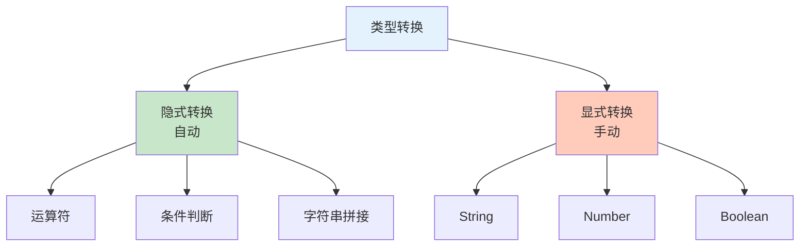

# 类型转换

JavaScript 是弱类型语言，支持隐式和显式类型转换。

## 转换类型



## 转换为字符串

### String() 函数

```javascript
// String()：显式转换为字符串
console.log(String(123));         // '123'
console.log(String(true));        // 'true'
console.log(String(false));       // 'false'
console.log(String(null));        // 'null'
console.log(String(undefined));   // 'undefined'
console.log(String({}));          // '[object Object]'
console.log(String([1, 2, 3]));    // '1,2,3'

// 对象的 toString()
const obj = {
    toString() {
        return 'Custom Object';
    }
};
console.log(String(obj));  // 'Custom Object'
```

### toString() 方法

```javascript
// 基本类型的 toString()
console.log((123).toString());    // '123'
console.log((true).toString());   // 'true'
console.log((false).toString());  // 'false'

// 数字的 toString() 可以指定进制
console.log((10).toString(2));  // '1010'（二进制）
console.log((10).toString(8));  // '12'（八进制）
console.log((10).toString(16)); // 'a'（十六进制）

// null 和 undefined 没有 toString()
// null.toString();    // TypeError
// undefined.toString(); // TypeError

// 数组的 toString()
console.log([1, 2, 3].toString());  // '1,2,3'
console.log(['a', 'b', 'c'].toString());  // 'a,b,c'
```

### 模板字符串

```javascript
// 模板字符串会自动转换为字符串
const num = 42;
const str = `${num}`;
console.log(str);  // '42'

const bool = true;
console.log(`${bool}`);  // 'true'

const obj = { name: 'Alice' };
console.log(`${obj}`);  // '[object Object]'
```

### 隐式字符串转换

```javascript
// 字符串拼接会触发转换
console.log('5' + 1);    // '51'（数字转字符串）
console.log('5' + true); // '5true'
console.log('5' + null); // '5null'
console.log('5' + undefined); // '5undefined'

// ⚠️ 注意：加号的特殊性
console.log(1 + 2 + '3');  // '33'（先计算 1+2=3，然后 '3'+3='33'）
console.log('1' + 2 + 3);  // '123'（都是字符串拼接）
```

## 转换为数字

### Number() 函数

```javascript
// Number()：显式转换为数字
console.log(Number('123'));       // 123
console.log Number('123.45'));    // 123.45
console.log(Number(''));          // 0（空字符串）
console.log(Number('hello'));     // NaN
console.log(Number(true));        // 1
console.log(Number(false));       // 0
console.log(Number(null));        // 0
console.log(Number(undefined));   // NaN

// 对象
console.log(Number({}));          // NaN
console.log(Number([1, 2, 3]));   // 3（特殊情况）
console.log(Number([]));          // 0（空数组）
console.log(Number([1]));         // 1
console.log(Number([null]));      // 0
console.log(Number([undefined])); // 0
console.log(Number(['hello']));   // NaN
```

### parseInt()

```javascript
// parseInt()：解析整数
console.log(parseInt('123'));       // 123
console.log(parseInt('123.45'));    // 123（丢弃小数部分）
console.log(parseInt('123px'));     // 123（解析到非数字字符停止）
console.log(parseInt('px123'));     // NaN（开头不是数字）

// 指定进制
console.log(parseInt('10', 2));     // 2（二进制）
console.log(parseInt('10', 8));     // 8（八进制）
console.log(parseInt('10', 10));    // 10（十进制）
console.log(parseInt('10', 16));    // 16（十六进制）
console.log(parseInt('0xFF'));      // 255（自动识别）

// ⚠️ 注意：0 开头的字符串
console.log(parseInt('010'));      // 10（现代 JS 不视为八进制）
console.log(parseInt('010', 8));   // 8（明确指定八进制）
```

::: warning parseInt 的陷阱

```javascript
// ⚠️ 不要用 parseInt 转换非字符串
console.log(parseInt(1.23));        // 1（可以工作）
console.log(parseInt(1e21));       // 1（丢失精度）
console.log(parseInt(Infinity));   // NaN

// 推荐：对于数字使用 Math.floor 或 Math.trunc
console.log(Math.trunc(1.23));     // 1
```

:::

### parseFloat()

```javascript
// parseFloat()：解析浮点数
console.log(parseFloat('123.45'));   // 123.45
console.log(parseFloat('123.45.67')); // 123.45
console.log(parseFloat('123px'));    // 123
console.log(parseFloat('px123'));    // NaN

// 科学计数法
console.log(parseFloat('1.23e4'));   // 12300
console.log(parseFloat('1.23e-4'));  // 0.000123

// 始终视为十进制
console.log(parseFloat('0xFF'));     // 0（不是 255）
```

### 一元操作符

```javascript
// 一元加号：快速转换为数字
console.log(+'123');      // 123
console.log(+'123.45');   // 123.45
console.log(+'');         // 0
console.log(+'hello');    // NaN
console.log(+true);       // 1
console.log(+false);      // 0

// 一元减号：转换为数字并取负
console.log(-'123');      // -123
console.log(-'hello');    // NaN

// 对比
console.log(+'5' + 3);    // 8（先转数字，再相加）
console.log('5' + 3);     // '53'（字符串拼接）
```

### 隐式数字转换

```javascript
// 数学运算符会触发转换
console.log('5' * 2);     // 10
console.log('5' / 2);     // 2.5
console.log('5' - 2);     // 3
console.log('5' % 3);     // 2

// ⚠️ 注意：加号例外
console.log('5' + 2);     // '52'（字符串拼接）

// 比较运算符
console.log('5' > 3);     // true
console.log('5' < 10);    // true

// 一元算术运算符
console.log(-'5');        // -5
console.log(+'5');        // 5
```

## 转换为布尔值

### Boolean() 函数

```javascript
// Boolean()：显式转换为布尔值
console.log(Boolean(1));         // true
console.log(Boolean(0));         // false
console.log(Boolean(-1));        // true
console.log(Boolean('hello'));   // true
console.log(Boolean(''));        // false
console.log(Boolean('0'));       // true（字符串 '0' 是真值）
console.log(Boolean('false'));   // true（字符串 'false' 是真值）
console.log(Boolean(null));      // false
console.log(Boolean(undefined)); // false
console.log(Boolean({}));        // true（空对象是真值）
console.log(Boolean([]));        // true（空数组是真值）
```

### !! 操作符

```javascript
// !!：双重否定，快速转换为布尔值
console.log(!!1);          // true
console.log(!!0);          // false
console.log(!!'hello');    // true
console.log(!!'');         // false
console.log(!!{});         // true
console.log(!![]);         // true
console.log(!!null);       // false
console.log(!!undefined);  // false

// 工作原理
console.log(!'hello');     // false（取反）
console.log(!!'hello');    // true（再次取反）
```

### 隐式布尔转换

```javascript
// 条件语句会触发布尔转换
if (1) {
    console.log('1 是真值');
}

if (0) {
    // 不会执行
}

// 逻辑运算符
console.log(0 || 'default');  // 'default'
console.log(1 || 'default');  // 1

console.log(1 && 'value');    // 'value'
console.log(0 && 'value');    // 0

// 三元运算符
const result = 1 ? 'true' : 'false';
console.log(result);  // 'true'
```

## 真值与假值

### 假值列表

只有 **6 个假值**：

```javascript
false      // 布尔 false
0          // 数字 0
-0         // 负零
0n         // BigInt 0
""         // 空字符串
null       // null
undefined  // undefined
NaN        // Not a Number

// 验证
console.log(Boolean(false));     // false
console.log(Boolean(0));         // false
console.log(Boolean(""));        // false
console.log(Boolean(null));      // false
console.log(Boolean(undefined)); // false
console.log(Boolean(NaN));       // false
```

### 真值列表

**除了假值列表中的值，其他所有值都是真值**：

```javascript
true       // 布尔 true
1          // 非零数字
-1         // 负数
3.14       // 浮点数
Infinity   // 无穷大
"hello"    // 非空字符串
"0"        // 字符串 "0"
"false"    // 字符串 "false"
[]         // 空数组
{}         // 空对象
function(){} // 函数
```

::: warning 常见陷阱

```javascript
// ❌ 错误判断数组是否为空
let arr = [];
if (arr) {
    console.log('数组有元素');  // 会执行！空数组是真值
}

// ✅ 正确判断
if (arr.length > 0) {
    console.log('数组有元素');
}

// ❌ 错误判断对象是否为空
let obj = {};
if (obj) {
    console.log('对象有属性');  // 会执行！空对象是真值
}

// ✅ 正确判断
if (Object.keys(obj).length > 0) {
    console.log('对象有属性');
}
```

:::

## 相等比较

### 松散相等（==）

```javascript
// 类型转换规则：
// 1. null == undefined → true
// 2. 数字与字符串比较：字符串转数字
// 3. 布尔值与其他类型比较：布尔值转数字
// 4. 对象与原始类型比较：对象转原始类型

// null 和 undefined
console.log(null == undefined);  // true
console.log(null == null);        // true
console.log(undefined == undefined); // true

// 数字和字符串
console.log(5 == '5');    // true（'5' 转为 5）
console.log(0 == '');     // true（'' 转为 0）
console.log(0 == '0');    // true
console.log(1 == true);   // true（true 转为 1）
console.log(0 == false);  // true（false 转为 0）

// 对象与原始类型
console.log([1] == 1);    // true（[1] 转为 '1'，再转为 1）
console.log([1, 2] == '1,2'); // true

// ⚠️ 危险的比较
console.log('' == false);  // true
console.log([] == false);  // true（[] 转为 ''，再转为 0，false 转为 0）
console.log([0] == false); // true
```

### 严格相等（===）

```javascript
// 严格相等：不进行类型转换
console.log(5 === '5');    // false（类型不同）
console.log(0 === '');     // false
console.log(null === undefined); // false
console.log(5 === 5);      // true

// 推荐：始终使用严格相等
if (x === 5) {
    // ...
}
```

::: tip 为什么使用严格相等？

```javascript
// ❌ 使用松散相等的问题
if (x == 0) {
    // x 可能是 0、''、false、[]、'0' 等
}

// ✅ 使用严格相等
if (x === 0) {
    // x 只能是数字 0
}
```

:::

## Object() 转换

```javascript
// Object()：将原始值转换为对象
console.log(Object(1));          // Number {1}
console.log(Object('hello'));    // String {'hello'}
console.log(Object(true));       // Boolean {true}

// null 和 undefined 返回空对象
console.log(Object(null));       // {}
console.log(Object(undefined));  // {}
```

## valueOf() 和 toString()

### 对象转原始值

```javascript
// 对象转原始值的规则：
// 1. 优先调用 valueOf()
// 2. 如果 valueOf() 返回对象，调用 toString()
// 3. 如果 toString() 返回对象，抛出错误

// 示例 1：Date 对象
const date = new Date();
console.log(+date);  // 时间戳（valueOf()）
console.log(date + '');  // 日期字符串（toString()）

// 示例 2：自定义对象
const obj = {
    valueOf() {
        return 42;
    },
    toString() {
        return 'custom';
    }
};

console.log(Number(obj));  // 42（使用 valueOf）
console.log(String(obj));  // 'custom'（使用 toString）
console.log(obj + '');     // '42'（使用 valueOf）
console.log(`${obj}`);     // 'custom'（使用 toString）
```

## 转换表

### 原始类型转换表

| 原始值 | String() | Number() | Boolean() |
|--------|----------|----------|-----------|
| `123` | `'123'` | `123` | `true` |
| `'123'` | `'123'` | `123` | `true` |
| `'hello'` | `'hello'` | `NaN` | `true` |
| `''` | `''` | `0` | `false` |
| `true` | `'true'` | `1` | `true` |
| `false` | `'false'` | `0` | `false` |
| `null` | `'null'` | `0` | `false` |
| `undefined` | `'undefined'` | `NaN` | `false` |

### 对象类型转换表

| 对象 | String() | Number() | Boolean() |
|------|----------|----------|-----------|
| `{}` | `'[object Object]'` | `NaN` | `true` |
| `[]` | `''` | `0` | `true` |
| `[1]` | `'1'` | `1` | `true` |
| `[1,2]` | `'1,2'` | `NaN` | `true` |
| `function(){}` | `'function(){}` | `NaN` | `true` |

## 实战示例

```javascript
// 用户输入处理
function processInput(input) {
    // 转为字符串并去除空格
    const str = String(input).trim();

    // 如果为空，返回默认值
    if (!str) {
        return 'default';
    }

    // 尝试转为数字
    const num = Number(str);
    if (!isNaN(num)) {
        return num;
    }

    // 返回原字符串
    return str;
}

console.log(processInput(123));    // 123
console.log(processInput(' 456 ')); // 456
console.log(processInput('hello')); // 'hello'
console.log(processInput(''));      // 'default'

// 安全的数字转换
function toNumber(value) {
    const num = Number(value);
    return isNaN(num) ? 0 : num;
}

console.log(toNumber('123'));    // 123
console.log(toNumber('hello'));  // 0
console.log(toNumber(null));     // 0

// 布尔值判断
function isTrue(value) {
    // 使用 !! 确保返回布尔值
    return !!value && value !== 'false' && value !== '0';
}

console.log(isTrue(1));        // true
console.log(isTrue(0));        // false
console.log(isTrue('false'));  // false
console.log(isTrue('0'));      // false
console.log(isTrue([]));       // true（可能需要特殊处理）
```

## 最佳实践

```javascript
// ✅ 推荐做法

// 1. 使用严格相等
if (x === 5) { }

// 2. 使用显式转换
const num = Number(str);
const str = String(num);
const bool = Boolean(value);

// 3. 使用 !! 快速转布尔值
const isValid = !!value;

// 4. 使用 + 快速转数字
const num2 = +str;

// 5. 转换前检查类型
if (typeof value === 'string') {
    const num = Number(value);
}

// ❌ 不推荐做法

// 1. 使用松散相等
if (x == 5) { }

// 2. 依赖隐式转换
if (value) { } // 不够明确

// 3. 混合类型运算
'5' + 3  // 容易混淆
```

::: tip 类型转换检查清单

- [ ] 使用严格相等（===）
- [ ] 明确需要进行转换时使用显式转换
- [ ] 数字转换：Number()、parseInt()、parseFloat()、+
- [ ] 字符串转换：String()、toString()、模板字符串
- [ ] 布尔转换：Boolean()、!!
- [ ] 注意空数组、空对象的真值判断

:::
