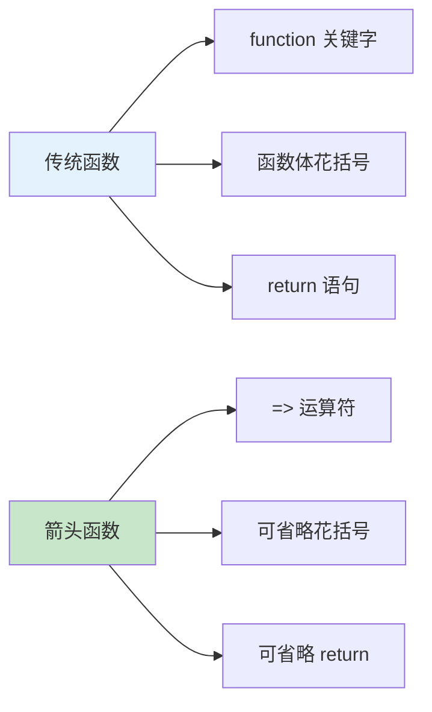

# 箭头函数

箭头函数是 ES6 引入的函数简写语法，提供更简洁的写法和独特的 this 绑定。

## 基本语法

### 语法对比

```javascript
// 传统函数
function add(a, b) {
    return a + b;
}

// 箭头函数
const add = (a, b) => {
    return a + b;
};

// 简化：单行返回
const add2 = (a, b) => a + b;
```



### 不同形式的箭头函数

```javascript
// 无参数
const sayHello = () => 'Hello!';
console.log(sayHello());  // 'Hello!'

// 单个参数（省略括号）
const greet = name => `Hello, ${name}!`;
console.log(greet('Alice'));  // 'Hello, Alice!'

// 多个参数（需要括号）
const add = (a, b) => a + b;
console.log(add(1, 2));  // 3

// 返回对象字面量（需要括号）
const createUser = name => ({ name, id: Date.now() });
console.log(createUser('Alice'));  // { name: 'Alice', id: ... }

// 多行函数体（需要花括号和 return）
const calculate = (a, b) => {
    const sum = a + b;
    const product = a * b;
    return { sum, product };
};
console.log(calculate(2, 3));  // { sum: 5, product: 6 }
```

## 与传统函数的区别

### 1. 没有 arguments 对象

```javascript
// 传统函数
function traditional() {
    console.log(arguments);
}
traditional(1, 2, 3);  // [1, 2, 3]

// 箭头函数
const arrow = () => {
    console.log(arguments);  // ReferenceError: arguments is not defined
};

// 使用剩余参数替代
const arrow2 = (...args) => {
    console.log(args);  // [1, 2, 3]
};
arrow2(1, 2, 3);
```

### 2. 没有 prototype

```javascript
// 传统函数
function Traditional() {}
console.log(Traditional.prototype);  // {}

// 箭头函数
const Arrow = () => {};
console.log(Arrow.prototype);  // undefined

// 不能作为构造函数
// new Arrow();  // TypeError
```

### 3. this 绑定

```javascript
// 传统函数：this 动态绑定
const obj = {
    name: 'Alice',
    traditional: function() {
        console.log(this.name);  // 'Alice'
        setTimeout(function() {
            console.log(this.name);  // undefined（this 指向全局）
        }, 100);
    }
};

// 箭头函数：this 词法绑定
const obj2 = {
    name: 'Alice',
    arrow: function() {
        console.log(this.name);  // 'Alice'
        setTimeout(() => {
            console.log(this.name);  // 'Alice'（继承外层 this）
        }, 100);
    }
};

obj2.arrow();
```

::: tip this 绑定的关键区别

- **传统函数**：this 调用时确定（动态绑定）
- **箭头函数**：this 定义时确定（词法绑定）

:::

### 4. 不能使用 new

```javascript
// 传统函数可以作为构造函数
function Person(name) {
    this.name = name;
}
const person = new Person('Alice');  // ✅ 有效

// 箭头函数不能作为构造函数
const Person2 = (name) => {
    this.name = name;
};
// const person2 = new Person2('Alice');  // ❌ TypeError
```

### 5. 没有 super 和 new.target

```javascript
// 箭头函数没有 super 和 new.target
class Parent {
    method() {
        const arrow = () => {
            console.log(super);  // ReferenceError
        };
    }
}
```

## this 绑定详解

### 词法 this 绑定

```javascript
// 箭头函数的 this 在定义时确定
const obj = {
    name: 'Alice',
    friends: ['Bob', 'Charlie'],

    // 传统函数需要 bind
    printFriendsTraditional: function() {
        this.friends.forEach(function(friend) {
            console.log(`${this.name} knows ${friend}`);  // undefined knows...
        }.bind(this));
    },

    // 箭头函数自动继承外层 this
    printFriendsArrow: function() {
        this.friends.forEach(friend => {
            console.log(`${this.name} knows ${friend}`);  // Alice knows...
        });
    }
};

obj.printFriendsTraditional();
// Alice knows Bob
// Alice knows Charlie

obj.printFriendsArrow();
// Alice knows Bob
// Alice knows Charlie
```

### 方法中的箭头函数

```javascript
const obj = {
    name: 'Alice',

    // ❌ 箭头函数作为方法（this 不指向对象）
    greet: () => {
        console.log(this.name);  // undefined
    },

    // ✅ 传统函数或简写方法
    greet2() {
        console.log(this.name);  // 'Alice'
    }
};

obj.greet();   // undefined
obj.greet2();  // 'Alice'
```

::: warning 不要用箭头函数定义方法

```javascript
const obj = {
    name: 'Alice',

    // ❌ 箭头函数作为方法
    greet: () => {
        console.log(this);  // Window 或 global
    },

    // ✅ 使用简写方法
    greet2() {
        console.log(this);  // { name: 'Alice', greet: ..., greet2: ... }
    }
};
```

:::

## 常见使用场景

### 1. 回调函数

```javascript
// 数组方法
const numbers = [1, 2, 3, 4, 5];

const doubled = numbers.map(x => x * 2);
console.log(doubled);  // [2, 4, 6, 8, 10]

const evens = numbers.filter(x => x % 2 === 0);
console.log(evens);  // [2, 4]

const sum = numbers.reduce((acc, x) => acc + x, 0);
console.log(sum);  // 15
```

### 2. Promise 链

```javascript
fetch('/api/user')
    .then(response => response.json())
    .then(data => console.log(data))
    .catch(error => console.error(error));
```

### 3. 事件处理

```javascript
// React 组件中（箭头函数保持 this）
class Button extends React.Component {
    handleClick = () => {
        console.log(this);  // 组件实例
    };

    render() {
        return <button onClick={this.handleClick}>Click</button>;
    }
}
```

### 4. 定时器

```javascript
const obj = {
    name: 'Alice',
    start() {
        // 箭头函数保持 this
        setTimeout(() => {
            console.log(this.name);  // 'Alice'
        }, 1000);
    }
};

obj.start();
```

## 箭头函数的陷阱

### 1. 不能作为构造函数

```javascript
const Person = (name) => {
    this.name = name;
};

// const alice = new Person('Alice');  // TypeError: Person is not a constructor
```

### 2. 不能作为对象方法

```javascript
const obj = {
    name: 'Alice',
    greet: () => {
        console.log(this.name);  // undefined
    }
};

obj.greet();  // undefined

// 解决：使用简写方法
const obj2 = {
    name: 'Alice',
    greet() {
        console.log(this.name);  // 'Alice'
    }
};
```

### 3. 不能使用 yield

```javascript
// 箭头函数不能用作生成器函数
// const gen = *() => {};  // SyntaxError

// 需要使用传统函数
function* gen() {
    yield 1;
    yield 2;
}
```

## 性能考虑

```javascript
// 箭头函数的性能特点

// 1. 箭头函数更轻量（没有 prototype、arguments 等）
const Arrow = () => {};
const Traditional = function() {};

console.log(Arrow.prototype);  // undefined
console.log(Traditional.prototype);  // {}

// 2. 箭头函数的 this 绑定在定义时确定（性能更好）

// 3. 但箭头函数不能被优化（可能有闭包开销）

// 结论：性能差异通常可以忽略，优先考虑代码清晰度
```

## 最佳实践

```javascript
// ✅ 推荐用法

// 1. 短回调函数
const doubled = [1, 2, 3].map(x => x * 2);

// 2. Promise 链
fetch(url).then(res => res.json());

// 3. 保持 this 上下文
class Component {
    handleClick = () => {
        console.log(this);  // 组件实例
    };
}

// 4. 简洁的函数表达式
const add = (a, b) => a + b;

// ❌ 不推荐用法

// 1. 作为对象方法
const obj = {
    method: () => {}  // ❌ this 绑定错误
};

// 2. 作为构造函数
const Constructor = () => {};
// new Constructor();  // ❌ TypeError

// 3. 复杂逻辑（影响可读性）
const complex = (data) => {
    // 太多逻辑
    // 应该使用传统函数
};

// 4. 需要重用 this 的场景
const button = document.querySelector('button');
button.addEventListener('click', () => {
    // this 不指向 button
    console.log(this);  // Window 或全局
});

button.addEventListener('click', function() {
    // this 指向 button
    console.log(this);  // <button>
});
```

::: tip 箭头函数检查清单

- [ ] 单行函数优先使用箭头函数
- [ ] 多行逻辑使用传统函数（提高可读性）
- [ ] 对象方法使用简写方法语法
- [ ] 需要动态 this 时使用传统函数
- [ ] 构造函数使用传统函数或 class
- [ ] 回调函数优先使用箭头函数

:::

::: tip 下一步

了解闭包原理 → [闭包](./closures.md)
:::
