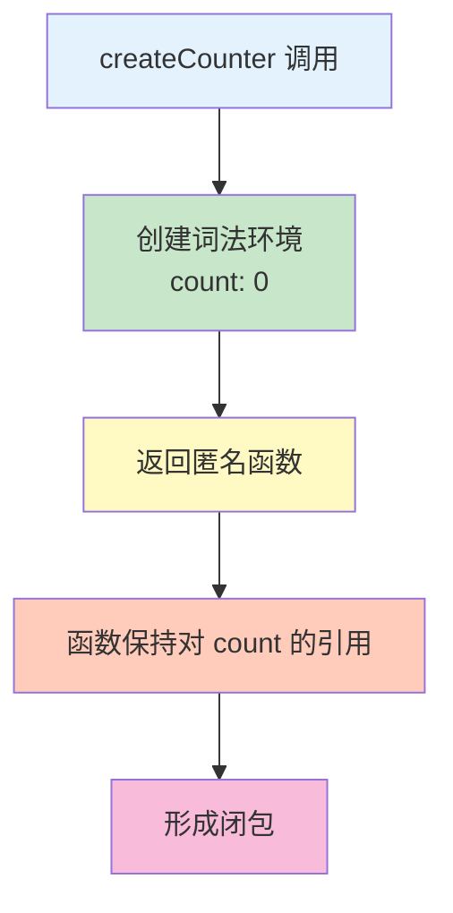

# 闭包

闭包是 JavaScript 最重要的概念之一，是函数和词法环境的组合。

## 什么是闭包

闭包是指**函数能够记住并访问其定义时所在的词法作用域**，即使函数在其词法作用域之外执行。

```javascript
// 基本闭包示例
function createCounter() {
    let count = 0;  // 私有变量

    return function() {
        count++;  // 访问外层变量
        return count;
    };
}

const counter = createCounter();
console.log(counter());  // 1
console.log(counter());  // 2
console.log(counter());  // 3
```



## 闭包的原理

### 词法作用域

```javascript
// 词法作用域：函数在定义时确定作用域
function outer() {
    const outerVar = 'outer';

    function inner() {
        console.log(outerVar);  // 访问外层变量
    }

    return inner;
}

const closure = outer();
closure();  // 'outer'

// 即使 outer 函数已执行完毕
// inner 仍然可以访问 outer 的变量
```

### 作用域链

```javascript
// 作用域链：多个嵌套的作用域
function level1() {
    const v1 = 'level1';

    function level2() {
        const v2 = 'level2';

        function level3() {
            const v3 = 'level3';

            // 可以访问所有外层变量
            console.log(v1, v2, v3);  // 'level1' 'level2' 'level3'
        }

        return level3;
    }

    return level2();
}

const closure = level1();
closure();  // 'level1' 'level2' 'level3'
```

## 闭包的应用

### 1. 数据私有化

```javascript
// 创建私有变量
function createUser(name) {
    let _name = name;  // 私有变量

    return {
        getName() {
            return _name;
        },
        setName(newName) {
            _name = newName;
        }
    };
}

const user = createUser('Alice');
console.log(user.getName());  // 'Alice'
user.setName('Bob');
console.log(user.getName());  // 'Bob'
console.log(user._name);  // undefined（无法直接访问）
```

### 2. 函数工厂

```javascript
// 返回定制化的函数
function createMultiplier(multiplier) {
    return function(value) {
        return value * multiplier;
    };
}

const double = createMultiplier(2);
const triple = createMultiplier(3);

console.log(double(5));  // 10
console.log(triple(5));  // 15

// 创建不同功能的函数
function createGreeter(greeting) {
    return function(name) {
        return `${greeting}, ${name}!`;
    };
}

const sayHello = createGreeter('Hello');
const sayHi = createGreeter('Hi');

console.log(sayHello('Alice'));  // 'Hello, Alice!'
console.log(sayHi('Bob'));       // 'Hi, Bob!'
```

### 3. 状态保持

```javascript
// 函数调用间保持状态
function createCounter(start = 0) {
    let count = start;

    return {
        increment() {
            count++;
            return count;
        },
        decrement() {
            count--;
            return count;
        },
        getCount() {
            return count;
        }
    };
}

const counter = createCounter(10);
console.log(counter.increment());  // 11
console.log(counter.increment());  // 12
console.log(counter.decrement());  // 11
console.log(counter.getCount());   // 11
```

### 4. 柯里化（Currying）

```javascript
// 柯里化：将多参数函数转为单参数函数序列
function curry(fn) {
    return function curried(...args) {
        if (args.length >= fn.length) {
            return fn.apply(this, args);
        }
        return function(...more) {
            return curried.apply(this, [...args, ...more]);
        };
    };
}

function add(a, b, c) {
    return a + b + c;
}

const curriedAdd = curry(add);
console.log(curriedAdd(1)(2)(3));  // 6
console.log(curriedAdd(1, 2)(3));  // 6
console.log(curriedAdd(1)(2, 3));  // 6
```

### 5. 防抖与节流

```javascript
// 防抖：延迟执行，如果在延迟时间内再次调用则重新计时
function debounce(fn, delay) {
    let timer = null;

    return function(...args) {
        clearTimeout(timer);
        timer = setTimeout(() => {
            fn.apply(this, args);
        }, delay);
    };
}

// 节流：固定时间间隔执行
function throttle(fn, delay) {
    let lastCall = 0;

    return function(...args) {
        const now = Date.now();
        if (now - lastCall >= delay) {
            lastCall = now;
            fn.apply(this, args);
        }
    };
}

// 使用示例
const handleInput = debounce((value) => {
    console.log('搜索:', value);
}, 300);

const handleScroll = throttle(() => {
    console.log('滚动位置:', window.scrollY);
}, 100);
```

### 6. 模块模式

```javascript
// 模块模式：创建私有和公开接口
const Module = (function() {
    let privateVar = 'private';

    function privateFunc() {
        console.log('私有函数');
    }

    return {
        publicMethod() {
            console.log('公开方法');
            privateFunc();
        },
        getPrivateVar() {
            return privateVar;
        }
    };
})();

Module.publicMethod();  // '公开方法' '私有函数'
console.log(Module.getPrivateVar());  // 'private'
// Module.privateFunc();  // TypeError: Module.privateFunc is not a function
```

## 闭包的陷阱

### 1. 循环中的闭包

```javascript
// ❌ 错误示例
for (var i = 1; i <= 5; i++) {
    setTimeout(function() {
        console.log(i);  // 6, 6, 6, 6, 6
    }, 100);
}

// 原因：var 是函数作用域，所有回调共享同一个 i

// ✅ 解决方案 1：使用 let（块级作用域）
for (let i = 1; i <= 5; i++) {
    setTimeout(function() {
        console.log(i);  // 1, 2, 3, 4, 5
    }, 100);
}

// ✅ 解决方案 2：使用 IIFE
for (var i = 1; i <= 5; i++) {
    (function(j) {
        setTimeout(function() {
            console.log(j);  // 1, 2, 3, 4, 5
        }, 100);
    })(i);
}

// ✅ 解决方案 3：使用 bind
for (var i = 1; i <= 5; i++) {
    setTimeout(function(j) {
        console.log(j);  // 1, 2, 3, 4, 5
    }.bind(null, i), 100);
}
```

### 2. 内存泄漏

```javascript
// ⚠️ 闭包可能导致内存泄漏
function createHandler() {
    const largeData = new Array(1000000).fill('data');

    return function() {
        // 即使不使用 largeData，闭包仍然保持对它的引用
        console.log('Handler called');
    };
}

const handler = createHandler();
// largeData 不会被垃圾回收

// ✅ 解决方案：及时释放引用
function createHandler() {
    const largeData = new Array(1000000).fill('data');

    return function() {
        console.log('Handler called');
        // 使用完后清除不需要的引用
    };
}

let handler = createHandler();
handler = null;  // 释放闭包
```

### 3. 性能问题

```javascript
// ⚠️ 每次调用都创建闭包（性能开销）
function inefficient() {
    const heavy = new Array(10000);
    return function() {
        // 使用 heavy
    };
}

// ✅ 优化：减少闭包创建
function efficient() {
    // 只在需要时创建闭包
    let cache = null;
    return function() {
        if (!cache) {
            cache = new Array(10000);
        }
        return cache;
    };
}
```

## 闭包与 this

```javascript
// 闭包中的 this
const obj = {
    name: 'Alice',
    friends: ['Bob', 'Charlie'],

    printFriends() {
        this.friends.forEach(friend => {
            // 箭头函数继承外层 this
            console.log(`${this.name} knows ${friend}`);
        });
    }
};

obj.printFriends();
// Alice knows Bob
// Alice knows Charlie

// 传统函数需要绑定 this
const obj2 = {
    name: 'Alice',
    friends: ['Bob', 'Charlie'],

    printFriends() {
        this.friends.forEach(function(friend) {
            console.log(`${this.name} knows ${friend}`);  // undefined knows...
        }.bind(this));
    }
};
```

## 闭包的最佳实践

```javascript
// ✅ 推荐做法

// 1. 使用闭包实现数据私有化
function createStack() {
    const items = [];

    return {
        push(item) {
            items.push(item);
        },
        pop() {
            return items.pop();
        },
        isEmpty() {
            return items.length === 0;
        }
    };
}

// 2. 使用闭包缓存计算结果
function memoize(fn) {
    const cache = new Map();

    return function(...args) {
        const key = JSON.stringify(args);
        if (cache.has(key)) {
            return cache.get(key);
        }
        const result = fn.apply(this, args);
        cache.set(key, result);
        return result;
    };
}

const slowCompute = memoize((n) => {
    console.log('计算中...');
    return n * n;
});

console.log(slowCompute(5));  // '计算中...' 25
console.log(slowCompute(5));  // 25（缓存）

// 3. 使用闭包创建配置函数
function configure(options) {
    const config = { ...options };

    return function(key) {
        return config[key];
    };
}

const getConfig = configure({ api: 'https://api.example.com', timeout: 5000 });
console.log(getConfig('api'));  // 'https://api.example.com'

// ❌ 避免做法

// 1. 不必要的闭包
function unnecessary() {
    const unused = 'data';  // 不使用的闭包变量
    return function() {
        return 'value';
    };
}

// 2. 过度使用闭包
function overkill() {
    // 太多闭包嵌套
    return function() {
        return function() {
            return function() {
                // ...
            };
        };
    };
}
```

## 实战示例

### 私有计数器

```javascript
function createCounter() {
    let count = 0;
    let initialValue = 0;

    return {
        increment() {
            count++;
        },
        decrement() {
            count--;
        },
        reset() {
            count = initialValue;
        },
        getValue() {
            return count;
        }
    };
}

const counter = createCounter();
counter.increment();
counter.increment();
console.log(counter.getValue());  // 2
counter.reset();
console.log(counter.getValue());  // 0
```

### 函数记忆化

```javascript
function memoize(fn) {
    const cache = {};

    return function(...args) {
        const key = args.toString();
        if (key in cache) {
            console.log('从缓存获取');
            return cache[key];
        }
        const result = fn(...args);
        cache[key] = result;
        return result;
    };
}

function fibonacci(n) {
    if (n <= 1) return n;
    return fibonacci(n - 1) + fibonacci(n - 2);
}

const memoFib = memoize(fibonacci);
console.log(memoFib(40));  // 第一次计算
console.log(memoFib(40));  // 从缓存获取
```

::: tip 闭包检查清单

- [ ] 理解闭包的词法作用域原理
- [ ] 使用闭包实现数据私有化
- [ ] 注意循环中的闭包问题
- [ ] 避免闭包导致的内存泄漏
- [ ] 合理使用闭包进行状态管理
- [ ] 使用闭包实现函数柯里化

:::

::: tip 下一步

了解作用域 → [作用域](./scope.md)
:::
