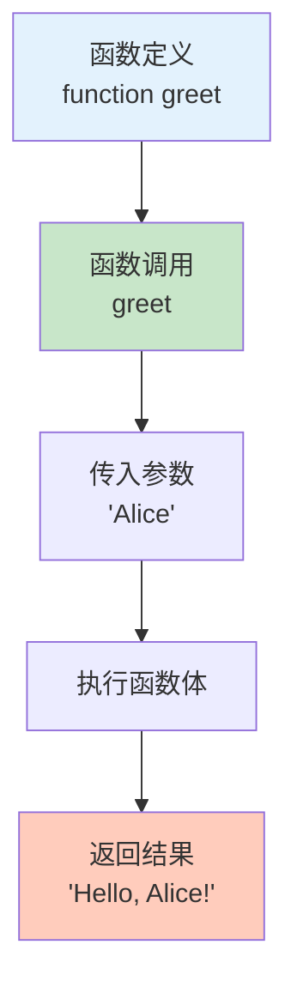

# 函数基础

函数是 JavaScript 的一等公民，是可重复使用的代码块。

## 什么是函数

函数是一段可以重复调用的代码块，可以接收参数并返回结果：

```javascript
// 函数定义
function greet(name) {
    return `Hello, ${name}!`;
}

// 函数调用
console.log(greet('Alice'));  // 'Hello, Alice!'
```



## 定义函数

### 函数声明

```javascript
// 函数声明（推荐）
function greet(name) {
    return `Hello, ${name}!`;
}

// 函数提升：可以在声明前调用
console.log(greet('Alice'));  // 'Hello, Alice!'

function greet(name) {
    return `Hello, ${name}!`;
}
```

### 函数表达式

```javascript
// 函数表达式
const greet = function(name) {
    return `Hello, ${name}!`;
};

// ⚠️ 不能在赋值前调用
// console.log(greet('Bob'));  // ReferenceError

console.log(greet('Bob'));  // 'Hello, Bob!'

// 匿名函数
const greet = function(name) {
    return `Hello, ${name}!`;
};

// 命名函数表达式
const greet = function greetFunction(name) {
    return `Hello, ${name}!`;
};

// 递归调用
const factorial = function fact(n) {
    return n <= 1 ? 1 : n * fact(n - 1);
};
console.log(factorial(5));  // 120
```

### 箭头函数（ES6）

```javascript
// 箭头函数
const greet = (name) => {
    return `Hello, ${name}!`;
};

// 简化：单个参数可省略括号
const greet2 = name => {
    return `Hello, ${name}!`;
};

// 简化：单行返回可省略花括号和 return
const greet3 = name => `Hello, ${name}!`;

// 无参数
const sayHello = () => 'Hello!';

// 多个参数
const add = (a, b) => a + b;

// ⚠️ 箭头函数与普通函数的区别：
// 1. 没有 arguments 对象
// 2. 没有 prototype
// 3. 不能作为构造函数
// 4. this 绑定外层作用域
```

### Function 构造函数（不推荐）

```javascript
// Function 构造函数
const greet = new Function('name', 'return `Hello, ${name}!`');
console.log(greet('Alice'));  // 'Hello, Alice!'

// ⚠️ 不推荐使用
// 1. 性能差（每次调用都重新编译）
// 2. 安全问题（类似 eval）
// 3. 可读性差
```

## 参数

### 默认参数

```javascript
// ES6 默认参数
function greet(name = 'Guest') {
    return `Hello, ${name}!`;
}

console.log(greet());        // 'Hello, Guest!'
console.log(greet('Alice')); // 'Hello, Alice!'

// 表达式作为默认值
function greet(name = getDefaultName()) {
    return `Hello, ${name}!`;
}

function getDefaultName() {
    return 'Guest';
}

console.log(greet());  // 'Hello, Guest!'

// ⚠️ 默认参数只在 undefined 时生效
console.log(greet(undefined));  // 'Hello, Guest!'
console.log(greet(null));       // 'Hello, null!'
console.log(greet(''));         // 'Hello, !'
```

### 剩余参数

```javascript
// 剩余参数：收集多个参数为数组
function sum(...numbers) {
    return numbers.reduce((acc, num) => acc + num, 0);
}

console.log(sum(1, 2, 3));        // 6
console.log(sum(1, 2, 3, 4, 5));  // 15

// 与其他参数结合
function greet(greeting, ...names) {
    return `${greeting}, ${names.join(', ')}!`;
}

console.log(greet('Hello', 'Alice', 'Bob', 'Charlie'));
// 'Hello, Alice, Bob, Charlie!'

// ⚠️ 剩余参数必须是最后一个参数
// function wrong(...args, last) { }  // SyntaxError
```

### 参数解构

```javascript
// 对象参数解构
function createUser({ name, age, city = 'Unknown' }) {
    return { name, age, city };
}

console.log(createUser({ name: 'Alice', age: 25 }));
// { name: 'Alice', age: 25, city: 'Unknown' }

// 数组参数解构
function swap([first, second]) {
    return [second, first];
}

console.log(swap([1, 2]));  // [2, 1]

// 默认值与解构
function greet({ name = 'Guest', age = 0 } = {}) {
    return `Hello, ${name} (${age})`;
}

console.log(greet());                             // 'Hello, Guest (0)'
console.log(greet({ name: 'Alice' }));            // 'Hello, Alice (0)'
console.log(greet({ name: 'Bob', age: 30 }));     // 'Hello, Bob (30)'
```

## 返回值

### return 语句

```javascript
// return 返回值并结束函数
function add(a, b) {
    return a + b;
    console.log('不会执行');
}

console.log(add(1, 2));  // 3

// 无 return 返回 undefined
function noReturn() {
    console.log('执行');
}
console.log(noReturn());  // undefined

// return 单独使用返回 undefined
function returnOnly() {
    return;
}
console.log(returnOnly());  // undefined
```

### 返回多个值

```javascript
// 返回数组
function getMinMax(arr) {
    return [Math.min(...arr), Math.max(...arr)];
}

const [min, max] = getMinMax([1, 2, 3, 4, 5]);
console.log(min, max);  // 1 5

// 返回对象
function getUserInfo(user) {
    return {
        name: user.name,
        email: user.email,
        isAdmin: user.role === 'admin'
    };
}

const { name, isAdmin } = getUserInfo({ name: 'Alice', email: 'a@b.com', role: 'admin' });
console.log(name, isAdmin);  // 'Alice' true
```

### 早期返回

```javascript
// 提前返回（Early Return）
function divide(a, b) {
    // 处理边界情况
    if (b === 0) {
        return '错误：除数不能为零';
    }

    // 主要逻辑
    return a / b;
}

console.log(divide(10, 2));  // 5
console.log(divide(10, 0));  // '错误：除数不能为零'

// 避免深层嵌套
function processUser(user) {
    // ❌ 深层嵌套
    if (user) {
        if (user.isActive) {
            if (user.hasPermission) {
                // 执行操作
            }
        }
    }

    // ✅ 提前返回
    if (!user) return '用户不存在';
    if (!user.isActive) return '用户未激活';
    if (!user.hasPermission) return '没有权限';

    // 执行操作
    return '操作成功';
}
```

## 函数调用

### 直接调用

```javascript
function greet(name) {
    return `Hello, ${name}!`;
}

// 直接调用
console.log(greet('Alice'));  // 'Hello, Alice!'
```

### 方法调用

```javascript
const obj = {
    name: 'Alice',
    greet() {
        return `Hello, ${this.name}!`;
    }
};

// 方法调用
console.log(obj.greet());  // 'Hello, Alice!'
```

### call/apply/bind

```javascript
function greet(greeting) {
    return `${greeting}, ${this.name}!`;
}

const person = { name: 'Alice' };

// call：逐个传递参数
console.log(greet.call(person, 'Hello'));  // 'Hello, Alice!'

// apply：传递参数数组
console.log(greet.apply(person, ['Hi']));  // 'Hi, Alice!'

// bind：返回新函数
const boundGreet = greet.bind(person);
console.log(boundGreet('Hey'));  // 'Hey, Alice!'
```

### 立即执行函数

```javascript
// IIFE：立即执行函数表达式
(function() {
    console.log('立即执行');
})();

// 带参数
(function(name) {
    console.log(`Hello, ${name}!`);
})('Alice');

// 返回值
const result = (function(a, b) {
    return a + b;
})(1, 2);
console.log(result);  // 3

// 创建作用域
const x = 10;
(function() {
    const x = 20;
    console.log(x);  // 20
})();
console.log(x);  // 10
```

## 函数作为值

### 赋值给变量

```javascript
// 函数是值，可以赋值给变量
const greet = function(name) {
    return `Hello, ${name}!`;
};

console.log(greet('Alice'));  // 'Hello, Alice!'

// 箭头函数
const greet2 = name => `Hello, ${name}!`;
```

### 作为参数

```javascript
// 函数作为参数
function calculate(a, b, operation) {
    return operation(a, b);
}

function add(a, b) {
    return a + b;
}

function multiply(a, b) {
    return a * b;
}

console.log(calculate(5, 3, add));       // 8
console.log(calculate(5, 3, multiply));  // 15

// 使用箭头函数
console.log(calculate(5, 3, (a, b) => a - b));  // 2
```

### 作为返回值

```javascript
// 函数作为返回值
function createGreeting(greeting) {
    return function(name) {
        return `${greeting}, ${name}!`;
    };
}

const sayHello = createGreeting('Hello');
const sayHi = createGreeting('Hi');

console.log(sayHello('Alice'));  // 'Hello, Alice!'
console.log(sayHi('Bob'));       // 'Hi, Bob!'

// 箭头函数版本
const createGreeting2 = greeting => name => `${greeting}, ${name}!`;
```

## 高阶函数

### 什么是高阶函数

接收函数作为参数或返回函数的函数：

```javascript
// 接收函数作为参数
function map(arr, fn) {
    const result = [];
    for (let i = 0; i < arr.length; i++) {
        result.push(fn(arr[i], i, arr));
    }
    return result;
}

const doubled = map([1, 2, 3], x => x * 2);
console.log(doubled);  // [2, 4, 6]

// 返回函数
function createMultiplier(multiplier) {
    return function(value) {
        return value * multiplier;
    };
}

const double = createMultiplier(2);
const triple = createMultiplier(3);

console.log(double(5));  // 10
console.log(triple(5));  // 15
```

### 常用高阶函数

```javascript
// forEach
[1, 2, 3].forEach(x => console.log(x));  // 1, 2, 3

// map
const doubled = [1, 2, 3].map(x => x * 2);  // [2, 4, 6]

// filter
const evens = [1, 2, 3, 4, 5].filter(x => x % 2 === 0);  // [2, 4]

// reduce
const sum = [1, 2, 3, 4, 5].reduce((acc, x) => acc + x, 0);  // 15

// find
const found = [1, 2, 3, 4, 5].find(x => x > 3);  // 4

// some
const hasEven = [1, 2, 3, 4, 5].some(x => x % 2 === 0);  // true

// every
const allPositive = [1, 2, 3, 4, 5].every(x => x > 0);  // true
```

## 递归

### 基本递归

```javascript
// 递归：函数调用自身
function factorial(n) {
    // 基准情况
    if (n <= 1) {
        return 1;
    }
    // 递归情况
    return n * factorial(n - 1);
}

console.log(factorial(5));  // 120

// 斐波那契数列
function fibonacci(n) {
    if (n <= 1) {
        return n;
    }
    return fibonacci(n - 1) + fibonacci(n - 2);
}

console.log(fibonacci(10));  // 55
```

### 尾递归优化

```javascript
// ❌ 非尾递归
function factorial(n) {
    if (n <= 1) return 1;
    return n * factorial(n - 1);  // 递归调用后还有乘法操作
}

// ✅ 尾递归（JavaScript 引擎不一定优化）
function factorialTail(n, acc = 1) {
    if (n <= 1) return acc;
    return factorialTail(n - 1, n * acc);  // 递归调用是最后操作
}

console.log(factorialTail(5));  // 120
```

## 函数最佳实践

```javascript
// ✅ 推荐做法

// 1. 函数命名使用动词
function getUserData(id) { }
function calculateTotal(price, tax) { }
function validateEmail(email) { }

// 2. 单一职责原则
function validateEmail(email) {
    // 只验证邮箱
}

function sendEmail(to, subject, body) {
    // 只发送邮件
}

// 3. 使用默认参数
function greet(name = 'Guest') { }

// 4. 早期返回
function process(data) {
    if (!data) return null;
    // ...
}

// 5. 纯函数（无副作用）
function add(a, b) {
    return a + b;
}

// ❌ 不推荐做法

// 1. 函数过长（超过 50 行）
function hugeFunction() {
    // 太多逻辑
}

// 2. 过多参数（超过 5 个）
function bad(a, b, c, d, e, f, g) { }

// 3. 副作用过多
function messy(data) {
    data.value = 1;
    console.log(data);
    saveToDatabase(data);
    sendEmail(data);
}
```

::: tip 下一步

了解箭头函数 → [箭头函数](./arrow-functions.md)
:::
