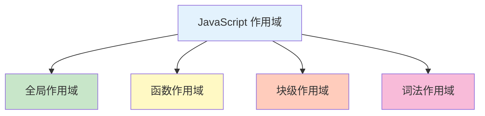
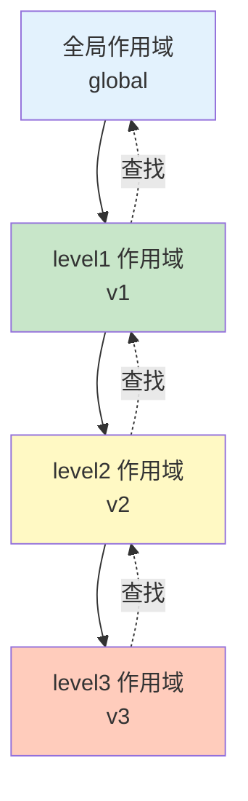

# 作用域

作用域是变量和函数的可访问范围，决定了代码中标识符的可见性和生命周期。

## 作用域类型



## 全局作用域

### 什么是全局作用域

```javascript
// 在任何函数外部声明的变量拥有全局作用域
var globalVar = 'global';
let globalLet = 'global';
const globalConst = 'global';

function test() {
    console.log(globalVar);  // 'global'
    console.log(globalLet);  // 'global'
    console.log(globalConst);  // 'global'
}

test();
console.log(globalVar);  // 'global'
```

### 全局对象的属性

```javascript
// 浏览器环境
var windowVar = 'window';
let scriptLet = 'script';
const scriptConst = 'script';

console.log(window.windowVar);  // 'window'（var 声明的变量成为全局对象属性）
console.log(window.scriptLet);  // undefined
console.log(window.scriptConst); // undefined

// Node.js 环境
global.globalVar = 'global';
```

### 全局作用域的污染

```javascript
// ❌ 避免全局变量污染
var counter = 0;

function increment() {
    counter++;
}

function reset() {
    counter = 0;
}

// ✅ 使用 IIFE 避免污染
const App = (function() {
    let counter = 0;

    return {
        increment() {
            counter++;
        },
        reset() {
            counter = 0;
        },
        getCount() {
            return counter;
        }
    };
})();

App.increment();
console.log(App.getCount());  // 1
```

## 函数作用域

### var 的函数作用域

```javascript
function test() {
    var functionScoped = 'function';

    if (true) {
        var functionScoped2 = 'also function';
    }

    console.log(functionScoped);  // 'function'
    console.log(functionScoped2);  // 'also function'
}

test();
// console.log(functionScoped);  // ReferenceError
```

### 函数作用域的特点

```javascript
// 1. 函数内部可以访问外部变量
let outer = 'outer';

function test() {
    console.log(outer);  // 'outer'
}

// 2. 函数外部不能访问内部变量
function test2() {
    let inner = 'inner';
}
// console.log(inner);  // ReferenceError

// 3. 内层函数可以访问外层函数的变量
function outer() {
    let outerVar = 'outer';

    function inner() {
        console.log(outerVar);  // 'outer'
    }

    inner();
}
outer();
```

## 块级作用域

### let 和 const 的块级作用域

```javascript
// if 语句块
if (true) {
    let blockLet = 'block';
    const blockConst = 'block';
    var functionVar = 'function';  // 函数作用域
}

// console.log(blockLet);  // ReferenceError
// console.log(blockConst); // ReferenceError
console.log(functionVar);  // 'function'

// for 循环块
for (let i = 0; i < 3; i++) {
    console.log(i);  // 0, 1, 2
}
// console.log(i);  // ReferenceError

// while 循环块
let j = 0;
while (j < 3) {
    let temp = j * 2;
    j++;
}
// console.log(temp);  // ReferenceError
```

### 块级作用域的优势

```javascript
// ❌ var 的作用域问题
for (var i = 0; i < 3; i++) {
    setTimeout(function() {
        console.log(i);  // 3, 3, 3（共享同一个 i）
    }, 100);
}

// ✅ let 的块级作用域
for (let i = 0; i < 3; i++) {
    setTimeout(function() {
        console.log(i);  // 0, 1, 2（每次循环都有独立的 i）
    }, 100);
}
```

## 词法作用域

### 什么是词法作用域

```javascript
// 词法作用域（静态作用域）：作用域在函数定义时确定
function outer() {
    const outerVar = 'outer';

    function inner() {
        console.log(outerVar);  // 'outer'
    }

    inner();
}

outer();  // 'outer'

// 即使在其他地方调用
function getInner() {
    const outerVar = 'different';

    function inner() {
        // 这里仍然访问定义时的 outerVar
        // 但本例中没有 outerVar，会向外查找
        console.log(outerVar);  // ReferenceError 或 'different'
    }

    return inner;
}
```

### 作用域链

```javascript
// 作用域链：多个嵌套的作用域
const global = 'global';

function level1() {
    const v1 = 'level1';

    function level2() {
        const v2 = 'level2';

        function level3() {
            const v3 = 'level3';
            console.log(global, v1, v2, v3);  // 'global' 'level1' 'level2' 'level3'
        }

        level3();
    }

    level2();
}

level1();

// 查找顺序：level3 → level2 → level1 → 全局
```

### 作用域链示意图



## 变量遮蔽

### 同名变量

```javascript
// 内层作用域可以遮蔽外层作用域的同名变量
const x = 'global';

function test() {
    const x = 'function';
    console.log(x);  // 'function'

    if (true) {
        const x = 'block';
        console.log(x);  // 'block'
    }

    console.log(x);  // 'function'
}

test();
console.log(x);  // 'global'
```

### 函数参数遮蔽

```javascript
const x = 'global';

function test(x) {
    console.log(x);  // 'undefined' 或传入的值

    const x = 'local';  // SyntaxError（不能重复声明）
}

// ✅ 正确做法
function test(param) {
    const x = 'local';  // 使用不同的变量名
    console.log(param, x);
}
```

## 作用域与闭包

### 闭包保持作用域

```javascript
function createCounter() {
    let count = 0;  // 私有变量

    return {
        increment() {
            count++;
            return count;
        },
        decrement() {
            count--;
            return count;
        }
    };
}

const counter = createCounter();
console.log(counter.increment());  // 1
console.log(counter.increment());  // 2
console.log(counter.decrement());  // 1
// count 无法直接访问
```

### 闭包与循环

```javascript
// ❌ 错误示例：所有回调共享同一个变量
for (var i = 1; i <= 3; i++) {
    setTimeout(function() {
        console.log(i);  // 4, 4, 4
    }, 100);
}

// ✅ 解决方案 1：使用 let
for (let i = 1; i <= 3; i++) {
    setTimeout(function() {
        console.log(i);  // 1, 2, 3
    }, 100);
}

// ✅ 解决方案 2：使用 IIFE
for (var i = 1; i <= 3; i++) {
    (function(j) {
        setTimeout(function() {
            console.log(j);  // 1, 2, 3
        }, 100);
    })(i);
}
```

## 暂时性死区（TDZ）

### TDZ 的概念

```javascript
// 从块开始到 let/const 声明之间的区域是暂时性死区
{
    // TDZ 开始
    // console.log(x);  // ReferenceError: Cannot access 'x' before initialization
    let x = 'value';  // TDZ 结束
    console.log(x);  // 'value'
}

// 函数参数的 TDZ
function test(x = y, y = 2) {
    return [x, y];
}
// test();  // ReferenceError: y 在初始化前访问

// ✅ 正确顺序
function test2(y = 2, x = y) {
    return [x, y];
}
console.log(test2());  // [2, 2]
```

### typeof 的 TDZ

```javascript
// 在 TDZ 中，typeof 也会报错
{
    // console.log(typeof x);  // ReferenceError
    let x = 10;
    console.log(typeof x);  // 'number'
}

// ⚠️ 对比：未声明的变量
// console.log(typeof y);  // 'undefined'（不会报错）
```

## 作用域最佳实践

```javascript
// ✅ 推荐做法

// 1. 使用 let 和 const
function test() {
    const constant = 'constant';
    let variable = 'variable';
    variable = 'new value';
}

// 2. 最小化作用域
function process(data) {
    // ✅ 在需要时才声明
    const result = transform(data);
    return result;
}

// 3. 避免全局变量污染
const App = (function() {
    let privateVar = 'private';
    return {
        getPrivate() {
            return privateVar;
        }
    };
})();

// 4. 使用块级作用域
function process(items) {
    const results = [];
    for (const item of items) {
        const processed = item.toUpperCase();
        results.push(processed);
    }
    return results;
}

// ❌ 不推荐做法

// 1. 使用 var
function test() {
    var old = 'old style';
}

// 2. 变量提升导致的混乱
function test() {
    console.log(x);  // undefined（不会报错）
    var x = 10;
}

// 3. 过度使用全局变量
var global1 = 'value1';
var global2 = 'value2';
var global3 = 'value3';

// 4. 作用域嵌套过深
function outer() {
    function middle() {
        function inner() {
            function veryInner() {
                // 过度嵌套
            }
        }
    }
}
```

::: tip 作用域检查清单

- [ ] 优先使用 let 和 const
- [ ] 最小化变量作用域
- [ ] 避免全局变量污染
- [ ] 理解暂时性死区
- [ ] 注意变量遮蔽问题
- [ ] 合理使用闭包保持状态

:::

::: tip 下一步

了解 this 绑定 → [this 与上下文](./this-context.md)
:::
