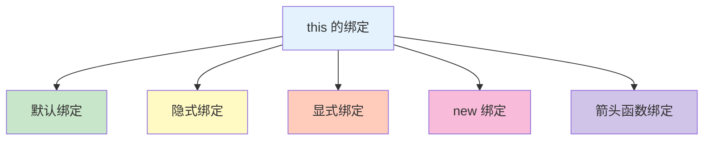

# this 与上下文

this 是 JavaScript 中一个特殊的关键字，指向函数执行时的上下文对象。

## this 的本质

### 什么是 this

```javascript
// this 是函数执行时自动生成的内部对象
// this 的值取决于函数如何被调用

function showThis() {
    console.log(this);
}

showThis();  // Window 或 global（取决于环境）
```



## this 的绑定规则

### 1. 默认绑定

```javascript
// 独立函数调用：this 指向全局对象
function test() {
    console.log(this);
}

test();  // Window 或 global

// 严格模式：this 为 undefined
'use strict';
function test2() {
    console.log(this);  // undefined
}
test2();

// 嵌套函数中的 this
const obj = {
    name: 'Alice',
    outer() {
        console.log(this.name);  // 'Alice'

        function inner() {
            console.log(this);  // Window 或 undefined
        }

        inner();
    }
};

obj.outer();
```

### 2. 隐式绑定

```javascript
// 方法调用：this 指向调用对象
const obj = {
    name: 'Alice',
    greet() {
        console.log(`Hello, ${this.name}!`);  // 'Hello, Alice!'
    }
};

obj.greet();

// 隐式丢失
const greet = obj.greet;
greet();  // 'Hello, undefined!'（this 指向全局）

// 回调函数中的隐式丢失
function doCallback(callback) {
    callback();
}

doCallback(obj.greet);  // 'Hello, undefined!'
```

### 3. 显式绑定

```javascript
// call：逐个传递参数
function greet(greeting, punctuation) {
    console.log(`${greeting}, ${this.name}${punctuation}`);
}

const person = { name: 'Alice' };

greet.call(person, 'Hello', '!');  // 'Hello, Alice!'
greet.call(person, 'Hi', '.');    // 'Hi, Alice.'

// apply：传递参数数组
greet.apply(person, ['Hey', '~']);  // 'Hey, Alice~'

// bind：返回新函数
const boundGreet = greet.bind(person, 'Hello');
boundGreet('!');  // 'Hello, Alice!'
boundGreat('...'); // 'Hello, Alice...'
```

### 4. new 绑定

```javascript
// 构造函数调用：this 指向新创建的对象
function Person(name) {
    this.name = name;
}

const person = new Person('Alice');
console.log(person.name);  // 'Alice'

// 构造函数返回值
function Person2(name) {
    this.name = name;
    return { other: 'value' };
}

const person2 = new Person2('Alice');
console.log(person2.name);  // undefined（返回的对象覆盖了 this）
console.log(person2.other);  // 'value'
```

### 5. 箭头函数绑定

```javascript
// 箭头函数：this 在定义时确定（词法绑定）
const obj = {
    name: 'Alice',
    greet: function() {
        // 传统函数的 this
        console.log(this.name);  // 'Alice'

        // 箭头函数继承外层 this
        const arrow = () => {
            console.log(this.name);  // 'Alice'
        };

        arrow();
    }
};

obj.greet();

// 箭头函数不能改变 this
const obj2 = { name: 'Bob' };
const arrow = () => {
    console.log(this.name);  // undefined 或全局
};
arrow.call(obj2);  // 仍然是 undefined 或全局（不改变）
```

## this 的常见场景

### 对象方法

```javascript
const person = {
    name: 'Alice',
    age: 25,

    // 简写方法语法
    greet() {
        console.log(`Hello, I'm ${this.name}`);  // 'Hello, I'm Alice'
    },

    // 传统方法
    introduce: function() {
        console.log(`I'm ${this.age} years old`);  // 'I'm 25 years old'
    }
};

person.greet();
person.introduce();
```

### 回调函数中的 this

```javascript
const obj = {
    name: 'Alice',
    friends: ['Bob', 'Charlie'],

    showFriends() {
        this.friends.forEach(function(friend) {
            // this 不指向 obj
            console.log(`${this.name} knows ${friend}`);  // undefined knows...
        });
    },

    // 解决方案 1：使用箭头函数
    showFriendsArrow() {
        this.friends.forEach(friend => {
            // this 继承外层
            console.log(`${this.name} knows ${friend}`);  // 'Alice knows...'
        });
    },

    // 解决方案 2：bind this
    showFriendsBind() {
        this.friends.forEach(function(friend) {
            console.log(`${this.name} knows ${friend}`);  // 'Alice knows...'
        }.bind(this));
    }
};

obj.showFriendsArrow();
obj.showFriendsBind();
```

### 事件处理中的 this

```javascript
// DOM 事件处理
const button = document.querySelector('button');

// 传统函数：this 指向事件触发元素
button.addEventListener('click', function() {
    console.log(this);  // <button>
    console.log(this.tagName);  // 'BUTTON'
});

// 箭头函数：this 继承外层作用域
const obj = {
    name: 'Alice',
    init() {
        button.addEventListener('click', () => {
            console.log(this.name);  // 'Alice'
        });
    }
};
obj.init();
```

### 类中的 this

```javascript
class Person {
    constructor(name) {
        this.name = name;
    }

    // 方法中的 this 指向实例
    greet() {
        console.log(`Hello, ${this.name}`);
    }

    // 箭头函数属性（自动绑定 this）
    introduce = () => {
        console.log(`I'm ${this.name}`);
    };
}

const person = new Person('Alice');
person.greet();      // 'Hello, Alice'
person.introduce();  // 'I'm Alice'

const greet = person.greet;
const introduce = person.introduce;

greet();       // undefined（this 丢失）
introduce();   // 'I'm Alice'（箭头函数保持 this）
```

## 改变 this 的方法

### call

```javascript
// call：立即调用函数，this 指向第一个参数
function greet(greeting, punctuation) {
    console.log(`${greeting}, ${this.name}${punctuation}`);
}

const person = { name: 'Alice' };

greet.call(person, 'Hello', '!');  // 'Hello, Alice!'

// 借用方法
const obj1 = { name: 'Alice', greet() { console.log(this.name); } };
const obj2 = { name: 'Bob' };

obj1.greet.call(obj2);  // 'Bob'

// 实现继承
function Parent(name) {
    this.name = name;
}

function Child(name, age) {
    Parent.call(this, name);  // 继承属性
    this.age = age;
}

const child = new Child('Alice', 25);
console.log(child);  // { name: 'Alice', age: 25 }
```

### apply

```javascript
// apply：立即调用函数，this 指向第一个参数，参数作为数组
function greet(greeting, punctuation) {
    console.log(`${greeting}, ${this.name}${punctuation}`);
}

const person = { name: 'Alice' };

greet.apply(person, ['Hello', '!']);  // 'Hello, Alice!'

// 找数组最大值
const numbers = [1, 2, 3, 4, 5];
console.log(Math.max.apply(null, numbers));  // 5
console.log(Math.max(...numbers));          // 5（ES6 展开）
```

### bind

```javascript
// bind：返回新函数，this 永久绑定到指定对象
function greet(greeting, punctuation) {
    console.log(`${greeting}, ${this.name}${punctuation}`);
}

const person = { name: 'Alice' };
const boundGreet = greet.bind(person, 'Hello');

boundGreet('!');  // 'Hello, Alice!'
boundGreet('...'); // 'Hello, Alice...'

// 无法改变 bind 后的 this
boundGreet.call({ name: 'Bob' }, 'Hi', '!');  // 'Hello, Alice!'

// 偏函数应用
function multiply(a, b) {
    return a * b;
}

const double = multiply.bind(null, 2);
console.log(double(5));  // 10
console.log(double(10)); // 20
```

## 箭头函数的 this

### 词法绑定

```javascript
// 箭头函数的 this 在定义时确定
const obj = {
    name: 'Alice',

    // 传统函数：this 动态绑定
    traditional: function() {
        console.log(this.name);  // 'Alice'
        setTimeout(function() {
            console.log(this.name);  // undefined（全局）
        }, 100);
    },

    // 箭头函数：this 词法绑定
    arrow: function() {
        console.log(this.name);  // 'Alice'
        setTimeout(() => {
            console.log(this.name);  // 'Alice'（继承外层）
        }, 100);
    }
};

obj.traditional();
obj.arrow();
```

### 不能作为构造函数

```javascript
// 箭头函数不能作为构造函数
const Person = (name) => {
    this.name = name;
};

// const alice = new Person('Alice');  // TypeError: Person is not a constructor

// 箭头函数没有 prototype
console.log(Person.prototype);  // undefined
```

### 没有 arguments 对象

```javascript
// 箭头函数没有 arguments
const traditional = function() {
    console.log(arguments);
};

traditional(1, 2, 3);  // [1, 2, 3]

const arrow = () => {
    // console.log(arguments);  // ReferenceError
    console.log(...arguments);  // TypeError
};

// 使用剩余参数替代
const arrow2 = (...args) => {
    console.log(args);  // [1, 2, 3]
};

arrow2(1, 2, 3);
```

## this 的优先级

```javascript
// 优先级：new > bind/call/apply > 对象方法调用 > 默认绑定

// 1. new 绑定（最高）
function Person(name) {
    this.name = name;
}

const alice = new Person('Alice');  // this 指向新对象

// 2. 显式绑定
const person = { name: 'Alice' };
function greet() {
    console.log(this.name);
}

const boundGreet = greet.bind(person);
boundGreet();  // 'Alice'

// 3. new 优先于 bind
function Person2(name) {
    this.name = name;
}

const BoundPerson = Person2.bind(null);  // 无效
const bob = new BoundPerson('Bob');  // this 仍指向新对象
console.log(bob.name);  // 'Bob'

// 4. 对象方法调用
const obj = {
    name: 'Alice',
    greet() {
        console.log(this.name);
    }
};
obj.greet();  // 'Alice'

// 5. 默认绑定（最低）
function test() {
    console.log(this);  // Window 或 undefined
}
test();
```

## this 的最佳实践

```javascript
// ✅ 推荐做法

// 1. 对象方法使用简写语法
const obj = {
    name: 'Alice',
    greet() {
        console.log(this.name);
    }
};

// 2. 回调函数使用箭头函数
const obj2 = {
    name: 'Alice',
    init() {
        setTimeout(() => {
            console.log(this.name);  // 'Alice'
        }, 100);
    }
};

// 3. 类中使用箭头函数属性
class Component {
    constructor(name) {
        this.name = name;
    }

    handleClick = () => {
        console.log(this.name);  // 保持 this
    };
}

// 4. 明确绑定 this
const obj3 = {
    name: 'Alice',
    methods: {
        greet: function() {
            console.log(this.name);  // 'Alice'
        }.bind(obj3)
    }
};

// ❌ 不推荐做法

// 1. 使用箭头函数定义方法
const obj4 = {
    name: 'Alice',
    greet: () => {
        console.log(this.name);  // undefined
    }
};

// 2. 随意使用 call/apply/bind
greet.call(obj);  // 需要有明确理由

// 3. 混用 this 绑定方式
function mixed() {
    // 容易混乱
}
```

::: tip this 检查清单

- [ ] 理解 this 的绑定规则
- [ ] 对象方法使用简写语法
- [ ] 回调函数使用箭头函数保持 this
- [ ] 类方法使用箭头函数属性
- [ ] 明确需要时使用 bind/call/apply
- [ ] 避免在箭头函数中使用 this

:::
