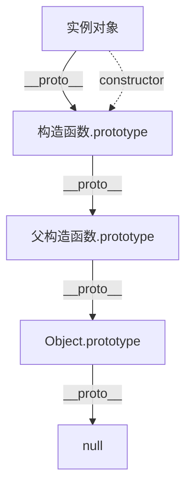

# 对象与原型

JavaScript 是基于原型的语言，理解原型链是掌握继承的关键。

## 学习内容

- [对象进阶](./object-advanced.md) - 对象创建模式、属性描述符
- [原型链](./prototypes.md) - prototype、__proto__、原型继承
- [继承](./inheritance.md) - 原型链继承、构造函数继承
- [类与面向对象](./class-oop.md) - ES6 class 语法、OOP 实现

## 原型链示意

