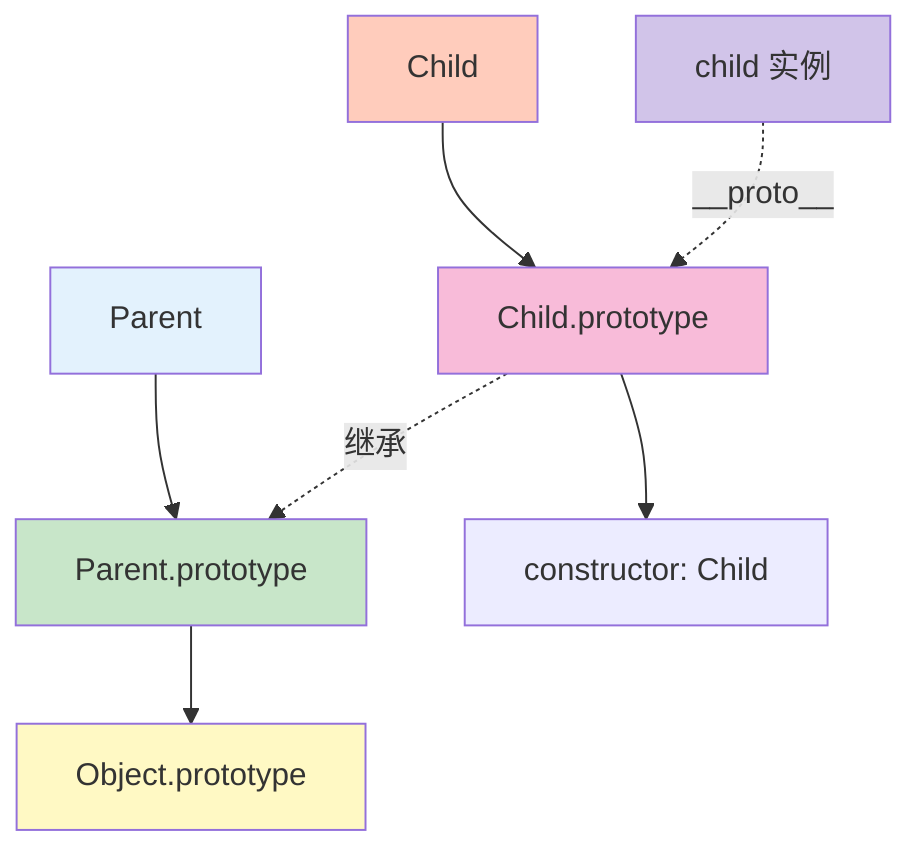

# 继承

继承是面向对象编程的核心概念，JavaScript 通过原型链实现继承。

## 原型链继承

### 基本原理

```javascript
// 父构造函数
function Parent(name) {
    this.name = name;
}

Parent.prototype.greet = function() {
    console.log(`Hello, I'm ${this.name}`);
};

// 子构造函数
function Child(name, age) {
    Parent.call(this, name);  // 继承属性
    this.age = age;
}

// 继承原型方法
Child.prototype = Object.create(Parent.prototype);
Child.prototype.constructor = Child;

// 添加子类方法
Child.prototype.introduce = function() {
    console.log(`I'm ${this.name}, ${this.age} years old`);
};

const child = new Child('Alice', 25);
child.greet();      // 'Hello, I'm Alice'
child.introduce(); // 'I'm Alice, 25 years old'
```



### 原型链继承的问题

```javascript
// ⚠️ 问题 1：引用类型属性共享
function Parent() {
    this.colors = ['red', 'blue'];
}

function Child() {}

Child.prototype = new Parent();

const child1 = new Child();
const child2 = new Child();

child1.colors.push('green');
console.log(child2.colors);  // ['red', 'blue', 'green']（共享了）

// ✅ 解决：使用构造函数继承
function Child() {
    Parent.call(this);
}

const child3 = new Child();
const child4 = new Child();
child3.colors.push('green');
console.log(child4.colors);  // ['red', 'blue']（独立）
```

## 构造函数继承

### 基本原理

```javascript
// 父构造函数
function Parent(name) {
    this.name = name;
    this.colors = ['red', 'blue'];
}

Parent.prototype.greet = function() {
    console.log(`Hello, I'm ${this.name}`);
};

// 子构造函数
function Child(name, age) {
    Parent.call(this, name);  // 继承属性
    this.age = age;
}

const child = new Child('Alice', 25);
console.log(child.name);   // 'Alice'
console.log(child.colors); // ['red', 'blue']
child.colors.push('green');

const child2 = new Child('Bob', 30);
console.log(child2.colors); // ['red', 'blue']（独立）

// ⚠️ 问题：无法继承原型方法
// child.greet();  // TypeError
```

### 构造函数继承的问题

```javascript
// ⚠️ 问题：方法在构造函数中定义（浪费内存）
function Parent(name) {
    this.name = name;
    this.greet = function() {
        console.log(`Hello, I'm ${this.name}`);
    };
}

function Child(name, age) {
    Parent.call(this, name);
    this.age = age;
}

const child1 = new Child('Alice', 25);
const child2 = new Child('Bob', 30);

// 每个实例都有自己的 greet 方法
console.log(child1.greet === child2.greet);  // false（浪费内存）
```

## 组合继承

### 基本原理

```javascript
// 父构造函数
function Parent(name) {
    this.name = name;
    this.colors = ['red', 'blue'];
}

Parent.prototype.greet = function() {
    console.log(`Hello, I'm ${this.name}`);
};

// 子构造函数
function Child(name, age) {
    Parent.call(this, name);  // 继承属性
    this.age = age;
}

// 继承原型方法
Child.prototype = new Parent();
Child.prototype.constructor = Child;

// 添加子类方法
Child.prototype.introduce = function() {
    console.log(`I'm ${this.name}, ${this.age} years old`);
};

const child = new Child('Alice', 25);
child.greet();      // 'Hello, I'm Alice'
child.introduce(); // 'I'm Alice, 25 years old'

// 引用类型属性独立
child.colors.push('green');
const child2 = new Child('Bob', 30);
console.log(child2.colors); // ['red', 'blue']（独立）
```

### 组合继承的问题

```javascript
// ⚠️ 问题：调用了两次父构造函数
function Parent(name) {
    this.name = name;
    console.log('Parent constructor called');
}

function Child(name, age) {
    Parent.call(this, name);  // 第 1 次
    this.age = age;
}

Child.prototype = new Parent();  // 第 2 次
Child.prototype.constructor = Child;

const child = new Child('Alice', 25);
// 输出：
// 'Parent constructor called'（第 2 次）
// 'Parent constructor called'（第 1 次）
```

## 寄生组合继承

### 基本原理

```javascript
// 父构造函数
function Parent(name) {
    this.name = name;
    console.log('Parent constructor called');
}

Parent.prototype.greet = function() {
    console.log(`Hello, I'm ${this.name}`);
};

// 子构造函数
function Child(name, age) {
    Parent.call(this, name);  // 继承属性
    this.age = age;
}

// 继承原型方法（不调用父构造函数）
Child.prototype = Object.create(Parent.prototype);
Child.prototype.constructor = Child;

// 添加子类方法
Child.prototype.introduce = function() {
    console.log(`I'm ${this.name}, ${this.age} years old`);
};

const child = new Child('Alice', 25);
// 输出：
// 'Parent constructor called'（只调用 1 次）

child.greet();      // 'Hello, I'm Alice'
child.introduce(); // 'I'm Alice, 25 years old'
```

### 寄生组合继承的优势

```javascript
// ✅ 优势：
// 1. 只调用一次父构造函数
// 2. 原型链保持完整
// 3. 引用类型属性独立

// 验证原型链
console.log(child instanceof Parent);   // true
console.log(child instanceof Child);    // true
console.log(child instanceof Object);   // true

// 验证 constructor
console.log(child.constructor === Child);  // true
console.log(Child.prototype.constructor === Child);  // true

// 验证原型
console.log(Object.getPrototypeOf(Child.prototype) === Parent.prototype);  // true
```

## ES6 class 继承

### 基本语法

```javascript
// 父类
class Parent {
    constructor(name) {
        this.name = name;
    }

    greet() {
        console.log(`Hello, I'm ${this.name}`);
    }
}

// 子类
class Child extends Parent {
    constructor(name, age) {
        super(name);  // 调用父构造函数
        this.age = age;
    }

    introduce() {
        console.log(`I'm ${this.name}, ${this.age} years old`);
    }
}

const child = new Child('Alice', 25);
child.greet();      // 'Hello, I'm Alice'
child.introduce(); // 'I'm Alice, 25 years old'
```

### 继承静态方法

```javascript
class Parent {
    static staticMethod() {
        console.log('Parent static method');
    }

    instanceMethod() {
        console.log('Parent instance method');
    }
}

class Child extends Parent {
    static staticMethod() {
        super.staticMethod();  // 调用父静态方法
        console.log('Child static method');
    }

    instanceMethod() {
        super.instanceMethod();  // 调用父实例方法
        console.log('Child instance method');
    }
}

Child.staticMethod();
// 'Parent static method'
// 'Child static method'

const child = new Child();
child.instanceMethod();
// 'Parent instance method'
// 'Child instance method'
```

### 类的本质

```javascript
// class 只是语法糖
class Parent {
    constructor(name) {
        this.name = name;
    }

    greet() {
        console.log(`Hello, I'm ${this.name}`);
    }
}

// 等价于
function Parent(name) {
    this.name = name;
}

Parent.prototype.greet = function() {
    console.log(`Hello, I'm ${this.name}`);
};

console.log(typeof Parent);  // 'function'
console.log(Parent.prototype.constructor === Parent);  // true
```

## 继承的模式总结

### 继承模式对比

```javascript
// 1. 原型链继承
// 优点：简单
// 缺点：引用类型属性共享、无法传参

// 2. 构造函数继承
// 优点：可以传参、引用类型独立
// 缺点：无法继承原型方法

// 3. 组合继承
// 优点：综合前两者优点
// 缺点：调用两次父构造函数

// 4. 寄生组合继承（最佳）
// 优点：只调用一次父构造函数、原型链完整
// 缺点：写法稍复杂

// 5. ES6 class 继承（推荐）
// 优点：语法简洁、自动处理继承细节
// 缺点：需要理解 class 语法
```

## 继承的最佳实践

```javascript
// ✅ 推荐做法

// 1. 使用 ES6 class 语法
class Parent {
    constructor(name) {
        this.name = name;
    }

    greet() {
        console.log(`Hello, ${this.name}`);
    }
}

class Child extends Parent {
    constructor(name, age) {
        super(name);
        this.age = age;
    }
}

// 2. 需要兼容时使用寄生组合继承
function Child(name, age) {
    Parent.call(this, name);
    this.age = age;
}

Child.prototype = Object.create(Parent.prototype);
Child.prototype.constructor = Child;

// 3. 遵循"里氏替换原则"
// 子类可以替换父类使用，不应破坏父类功能

// 4. 合理使用 super
class Child2 extends Parent {
    constructor(name, age) {
        super(name);  // 必须在使用 this 前调用 super
        this.age = age;
    }

    greet() {
        super.greet();  // 可以调用父方法
        console.log(`and I'm ${this.age}`);
    }
}

// ❌ 不推荐做法

// 1. 过度使用继承
// 应该优先考虑组合

// 2. 深层继承
// class A extends B extends C extends D {}
// 避免超过 3 层继承

// 3. 忘记调用 super
class Bad extends Parent {
    constructor(name) {
        // 忘记 super(name)
        this.name = name;  // ReferenceError
    }
}
```

::: tip 继承检查清单

- [ ] 理解原型链继承原理
- [ ] 使用 ES6 class 语法
- [ ] 子类构造函数必须调用 super
- [ ] 合理使用 super 调用父方法
- [ ] 避免深层继承（不超过 3 层）
- [ ] 优先考虑组合而非继承

:::

::: tip 下一步

了解类与面向对象 → [类与面向对象](./class-oop.md)
:::
