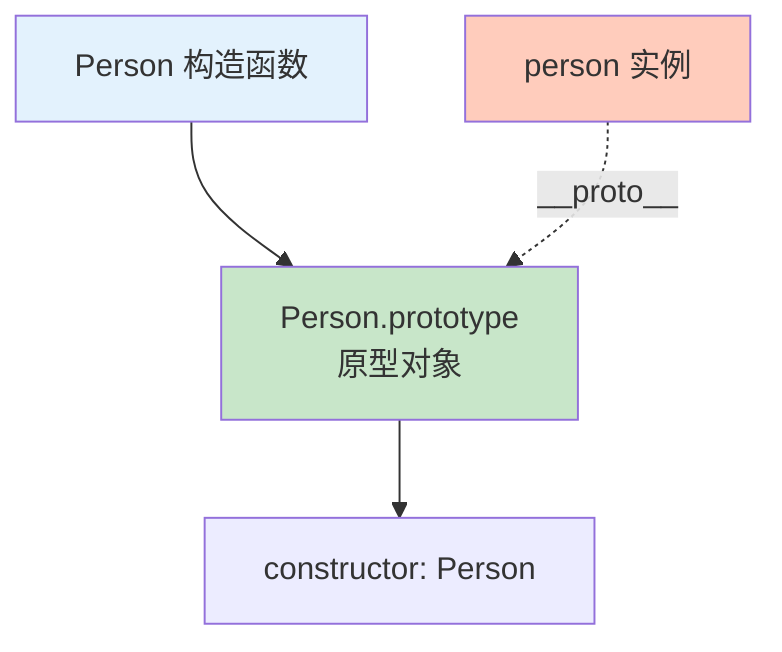
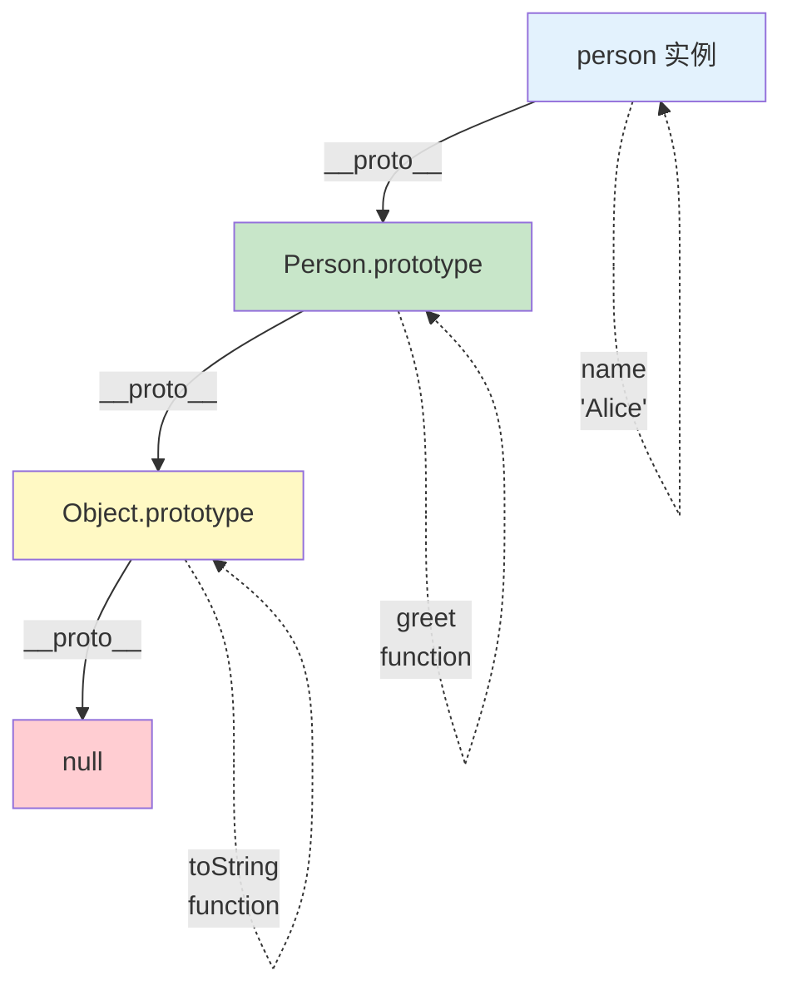
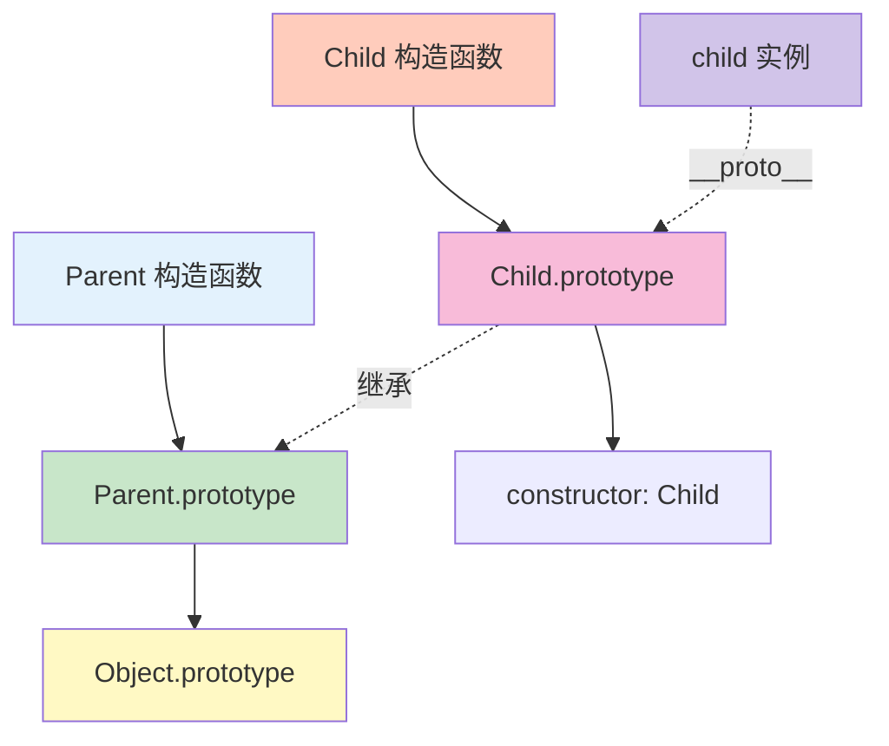

# 原型链

原型链是 JavaScript 实现继承的核心机制，理解它对于掌握 JavaScript 至关重要。

## 什么是原型

### prototype 与 __proto__

```javascript
// 每个函数都有 prototype 属性
function Person(name) {
    this.name = name;
}

console.log(Person.prototype);  // Person {}（原型对象）

// 每个对象都有 __proto__ 属性（指向原型）
const person = new Person('Alice');
console.log(person.__proto__ === Person.prototype);  // true

// prototype 的 constructor 指回构造函数
console.log(Person.prototype.constructor === Person);  // true
```



## 原型链

### 链式查找

```javascript
function Person(name) {
    this.name = name;
}

Person.prototype.greet = function() {
    console.log(`Hello, I'm ${this.name}`);
};

const person = new Person('Alice');

// 查找属性：
// 1. 先在实例自身查找
// 2. 找不到则沿着原型链向上查找
console.log(person.name);    // 'Alice'（实例属性）
person.greet();              // 'Hello, I'm Alice'（原型方法）
console.log(person.toString()); // '[object Object]'（来自 Object.prototype）

// 原型链示意：
// person → Person.prototype → Object.prototype → null
```

### 原型链示意图



### 查看原型链

```javascript
function Person(name) {
    this.name = name;
}

const person = new Person('Alice');

// 查看对象原型
console.log(Object.getPrototypeOf(person) === Person.prototype);  // true

// 查看原型的原型
console.log(Object.getPrototypeOf(Person.prototype) === Object.prototype);  // true

// 查看最顶层原型
console.log(Object.getPrototypeOf(Object.prototype));  // null

// 使用 __proto__（非标准，但广泛支持）
console.log(person.__proto__ === Person.prototype);  // true
```

## 属性查找

### 原型链查找过程

```javascript
function Person(name) {
    this.name = name;
}

Person.prototype.age = 25;
Person.prototype.greet = function() {
    console.log(`Hello, I'm ${this.name}, ${this.age} years old`);
};

Object.prototype.hello = function() {
    console.log('Hello from Object.prototype');
};

const person = new Person('Alice');

// 1. 查找 name（实例属性）
console.log(person.name);  // 'Alice'

// 2. 查找 age（原型属性）
console.log(person.age);   // 25

// 3. 查找 greet（原型方法）
person.greet();  // 'Hello, I'm Alice, 25 years old'

// 4. 查找 hello（Object.prototype 方法）
person.hello();  // 'Hello from Object.prototype'

// 5. 查找不存在的属性
// console.log(person.nonExistent);  // undefined（到达原型链顶端 null）
```

### 属性遮蔽

```javascript
function Person(name) {
    this.name = name;
}

Person.prototype.name = 'Prototype';
Person.prototype.age = 25;

const person = new Person('Alice');

// 实例属性遮蔽原型属性
console.log(person.name);  // 'Alice'（实例属性，遮蔽了 'Prototype'）
console.log(person.age);   // 25（原型属性）

// 删除实例属性后，原型属性可见
delete person.name;
console.log(person.name);  // 'Prototype'
```

## 修改原型

### 添加原型属性

```javascript
function Person(name) {
    this.name = name;
}

// 添加原型方法
Person.prototype.greet = function() {
    console.log(`Hello, I'm ${this.name}`);
};

Person.prototype.introduce = function() {
    console.log(`I'm ${this.name}`);
};

const person = new Person('Alice');
person.greet();      // 'Hello, I'm Alice'
person.introduce(); // 'I'm Alice'

// 已有实例也能访问新添加的原型方法
const person2 = new Person('Bob');
person2.greet();  // 'Hello, I'm Bob'
```

### 重写原型

```javascript
function Person(name) {
    this.name = name;
}

Person.prototype = {
    greet() {
        console.log(`Hello, I'm ${this.name}`);
    }
};

// ⚠️ 重写原型会失去 constructor 属性
const person = new Person('Alice');
console.log(person.constructor === Person);  // false
console.log(person.constructor === Object);  // true

// 重写原型时添加 constructor
Person.prototype = {
    constructor: Person,  // 手动添加
    greet() {
        console.log(`Hello, I'm ${this.name}`);
    }
};

const person2 = new Person('Bob');
console.log(person2.constructor === Person);  // true
```

::: warning 重写原型的注意事项

```javascript
// ⚠️ 重写原型后，之前创建的实例仍然指向旧原型
function Person(name) {
    this.name = name;
}

const person1 = new Person('Alice');

Person.prototype.greet = function() {
    console.log(`Hello, I'm ${this.name}`);
};

// 此时 person1 可以访问 greet
person1.greet();  // 'Hello, I'm Alice'

// 重写原型
Person.prototype = {
    introduce() {
        console.log(`I'm ${this.name}`);
    }
};

// person1 仍然指向旧原型
person1.greet();      // 'Hello, I'm Alice'
// person1.introduce(); // TypeError

// 新实例使用新原型
const person2 = new Person('Bob');
person2.introduce(); // 'I'm Bob'
// person2.greet();    // TypeError
```

:::

## 原型继承

### 原型继承原理

```javascript
// 父构造函数
function Parent(name) {
    this.name = name;
}

Parent.prototype.greet = function() {
    console.log(`Hello, I'm ${this.name}`);
};

// 子构造函数
function Child(name, age) {
    Parent.call(this, name);  // 继承属性
    this.age = age;
}

// 继承方法
Child.prototype = Object.create(Parent.prototype);
Child.prototype.constructor = Child;

// 添加子类方法
Child.prototype.introduce = function() {
    console.log(`I'm ${this.name}, ${this.age} years old`);
};

const child = new Child('Alice', 25);
child.greet();      // 'Hello, I'm Alice'（父类方法）
child.introduce(); // 'I'm Alice, 25 years old'（子类方法）
```

### 原型继承链示意图



## 原型方法的检测

### instanceof

```javascript
// instanceof：检查对象是否是某个构造函数的实例
function Person(name) {
    this.name = name;
}

const person = new Person('Alice');

console.log(person instanceof Person);   // true
console.log(person instanceof Object);   // true（原型链顶端）
console.log(person instanceof Array);    // false

// 工作原理：检查 constructor.prototype 是否在对象的原型链中
console.log(person.__proto__ === Person.prototype);  // true
console.log(person.__proto__.__proto__ === Object.prototype);  // true
```

### isPrototypeOf

```javascript
// isPrototypeOf：检查对象是否在另一个对象的原型链中
function Parent() {}
function Child() {}

Child.prototype = Object.create(Parent.prototype);

const child = new Child();

console.log(Parent.prototype.isPrototypeOf(child));  // true
console.log(Object.prototype.isPrototypeOf(child));  // true
console.log(Child.prototype.isPrototypeOf(child));   // true
```

### hasOwnProperty

```javascript
function Person(name) {
    this.name = name;
}

Person.prototype.age = 25;

const person = new Person('Alice');

// hasOwnProperty：检查属性是否是对象自身的属性
console.log(person.hasOwnProperty('name'));  // true
console.log(person.hasOwnProperty('age'));   // false（原型属性）

// in 操作符：检查自身和原型链中的属性
console.log('name' in person);  // true
console.log('age' in person);   // true

// 遍历自身属性
for (let key in person) {
    if (person.hasOwnProperty(key)) {
        console.log(key);  // 'name'
    }
}
```

## 原型的最佳实践

```javascript
// ✅ 推荐做法

// 1. 使用 Object.create 继承原型
Child.prototype = Object.create(Parent.prototype);
Child.prototype.constructor = Child;

// 2. 将方法添加到原型上
function Person(name) {
    this.name = name;
}

Person.prototype.greet = function() {
    console.log(`Hello, ${this.name}`);
};

// 3. 不要遍历原型链
for (let key in obj) {
    if (obj.hasOwnProperty(key)) {
        // 只处理自身属性
    }
}

// 4. 使用 Object.getPrototypeOf 获取原型
const proto = Object.getPrototypeOf(obj);

// ❌ 不推荐做法

// 1. 使用 __proto__（非标准）
// obj.__proto__ = newObj;

// 2. 重写已有对象的原型
// function Parent() {}
// const child = new Parent();
// Child.prototype = child;  // 混乱

// 3. 在原型上定义基本类型的属性
// Person.prototype.name = 'Default';  // 所有实例共享
```

::: tip 下一步

了解继承 → [继承](./inheritance.md)
:::
