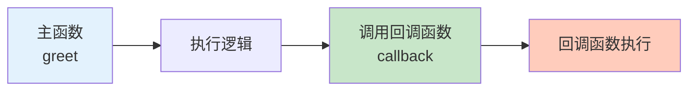

# 回调函数

回调函数是 JavaScript 异步编程的基础，理解它对掌握异步编程至关重要。

## 什么是回调函数

### 基本概念

```javascript
// 回调函数：作为参数传递给另一个函数的函数
function greet(name, callback) {
    const message = `Hello, ${name}!`;
    callback(message);
}

function logMessage(message) {
    console.log(message);
}

greet('Alice', logMessage);  // 'Hello, Alice!'
```



### 同步回调

```javascript
// 同步回调：立即执行
function map(arr, callback) {
    const result = [];
    for (let i = 0; i < arr.length; i++) {
        result.push(callback(arr[i], i, arr));
    }
    return result;
}

const doubled = map([1, 2, 3], x => x * 2);
console.log(doubled);  // [2, 4, 6]

// forEach 同步回调
[1, 2, 3].forEach(x => console.log(x));  // 1, 2, 3
```

### 异步回调

```javascript
// 异步回调：延迟执行
function delay(callback) {
    setTimeout(() => {
        callback('Hello after delay');
    }, 1000);
}

delay(message => {
    console.log(message);  // 1 秒后执行
});

console.log('First');  // 先执行
```

## 回调地狱

### 问题示例

```javascript
// ⚠️ 回调地狱：多层嵌套回调
function getData(callback) {
    setTimeout(() => {
        const data = { id: 1, name: 'Alice' };
        callback(data);
    }, 1000);
}

function getPosts(userId, callback) {
    setTimeout(() => {
        const posts = [
            { id: 101, title: 'Post 1', userId },
            { id: 102, title: 'Post 2', userId }
        ];
        callback(posts);
    }, 1000);
}

function getComments(postId, callback) {
    setTimeout(() => {
        const comments = [
            { id: 1001, text: 'Great!', postId },
            { id: 1002, text: 'Thanks!', postId }
        ];
        callback(comments);
    }, 1000);
}

// 回调地狱
getData(user => {
    console.log('User:', user);

    getPosts(user.id, posts => {
        console.log('Posts:', posts);

        getComments(posts[0].id, comments => {
            console.log('Comments:', comments);

            // 还可以继续嵌套...
        });
    });
});
```

### 解决方案 1：命名函数

```javascript
// 使用命名函数减少嵌套
function handleComments(comments) {
    console.log('Comments:', comments);
}

function handlePosts(posts) {
    console.log('Posts:', posts);
    getComments(posts[0].id, handleComments);
}

function handleUser(user) {
    console.log('User:', user);
    getPosts(user.id, handlePosts);
}

getData(handleUser);
```

### 解决方案 2：Promise 链

```javascript
// 使用 Promise 链（推荐）
function getData() {
    return new Promise(resolve => {
        setTimeout(() => {
            resolve({ id: 1, name: 'Alice' });
        }, 1000);
    });
}

function getPosts(userId) {
    return new Promise(resolve => {
        setTimeout(() => {
            resolve([
                { id: 101, title: 'Post 1', userId },
                { id: 102, title: 'Post 2', userId }
            ]);
        }, 1000);
    });
}

function getComments(postId) {
    return new Promise(resolve => {
        setTimeout(() => {
            resolve([
                { id: 1001, text: 'Great!', postId },
                { id: 1002, text: 'Thanks!', postId }
            ]);
        }, 1000);
    });
}

// Promise 链式调用
getData()
    .then(user => {
        console.log('User:', user);
        return getPosts(user.id);
    })
    .then(posts => {
        console.log('Posts:', posts);
        return getComments(posts[0].id);
    })
    .then(comments => {
        console.log('Comments:', comments);
    });
```

## 错误处理

### 错误优先回调

```javascript
// Node.js 风格：错误优先回调
function fetchData(callback) {
    setTimeout(() => {
        const error = null;
        const data = { id: 1, name: 'Alice' };

        // 模拟错误
        // const error = new Error('Network error');
        // const data = null;

        callback(error, data);
    }, 1000);
}

fetchData((error, data) => {
    if (error) {
        console.error('Error:', error.message);
        return;
    }
    console.log('Data:', data);
});
```

### try-catch（不适用于异步回调）

```javascript
// ⚠️ try-catch 无法捕获异步错误
try {
    setTimeout(() => {
        throw new Error('Async error');
    }, 1000);
} catch (e) {
    console.log('Caught:', e.message);  // 不会执行
}

// ✅ 使用回调的错误处理
function asyncOperation(success, callback) {
    setTimeout(() => {
        if (success) {
            callback(null, 'Success');
        } else {
            callback(new Error('Failed'));
        }
    }, 1000);
}

asyncOperation(true, (error, result) => {
    if (error) {
        console.error('Error:', error.message);
    } else {
        console.log('Result:', result);
    }
});
```

## 回调的高级模式

### 发布订阅模式

```javascript
class EventEmitter {
    constructor() {
        this.events = {};
    }

    // 订阅事件
    on(event, callback) {
        if (!this.events[event]) {
            this.events[event] = [];
        }
        this.events[event].push(callback);
    }

    // 触发事件
    emit(event, data) {
        if (this.events[event]) {
            this.events[event].forEach(callback => {
                callback(data);
            });
        }
    }

    // 取消订阅
    off(event, callback) {
        if (this.events[event]) {
            this.events[event] = this.events[event].filter(cb => cb !== callback);
        }
    }
}

// 使用示例
const emitter = new EventEmitter();

emitter.on('data', data => {
    console.log('Data received:', data);
});

emitter.on('error', error => {
    console.error('Error occurred:', error.message);
});

emitter.emit('data', { id: 1, name: 'Alice' });
emitter.emit('error', new Error('Something went wrong'));
```

### 防抖与节流

```javascript
// 防抖：延迟执行，如果在延迟时间内再次调用则重新计时
function debounce(callback, delay) {
    let timer = null;

    return function(...args) {
        clearTimeout(timer);
        timer = setTimeout(() => {
            callback.apply(this, args);
        }, delay);
    };
}

// 节流：固定时间间隔执行
function throttle(callback, delay) {
    let lastCall = 0;

    return function(...args) {
        const now = Date.now();
        if (now - lastCall >= delay) {
            lastCall = now;
            callback.apply(this, args);
        }
    };
}

// 使用示例
const handleInput = debounce(value => {
    console.log('Search:', value);
}, 300);

const handleScroll = throttle(() => {
    console.log('Scroll position:', window.scrollY);
}, 100);

// 模拟输入
handleInput('a');
handleInput('ab');
handleInput('abc');  // 只有最后一次会执行
```

## 回调的最佳实践

```javascript
// ✅ 推荐做法

// 1. 遵循错误优先回调模式
function fetchData(id, callback) {
    setTimeout(() => {
        try {
            const data = { id, name: 'Alice' };
            callback(null, data);
        } catch (error) {
            callback(error);
        }
    }, 1000);
}

// 2. 使用 Promise 避免回调地狱
fetchData(1)
    .then(data => console.log(data))
    .catch(error => console.error(error));

// 3. 使用 async/await 使异步代码更清晰
async function loadData() {
    try {
        const data = await fetchData(1);
        console.log(data);
    } catch (error) {
        console.error(error);
    }
}

// 4. 使用命名函数提高可读性
function handleUser(user) {
    console.log('User:', user);
}

function handleError(error) {
    console.error('Error:', error);
}

// ❌ 不推荐做法

// 1. 过深的回调嵌套
getData(data => {
    getPosts(data.id, posts => {
        getComments(posts[0].id, comments => {
            // 太深了！
        });
    });
});

// 2. 不处理错误
fetchData(id, data => {
    console.log(data);
    // 没有错误处理
});

// 3. 在回调中使用 this（不绑定上下文）
const obj = {
    name: 'Alice',
    fetchData() {
        setTimeout(function() {
            console.log(this.name);  // undefined
        }, 1000);
    }
};
```

::: tip 回调检查清单

- [ ] 理解同步和异步回调的区别
- [ ] 使用 Promise 避免回调地狱
- [ ] 遵循错误优先回调模式
- [ ] 正确处理异步错误
- [ ] 使用命名函数提高可读性
- [ ] 考虑使用发布订阅模式

:::

::: tip 下一步

了解 Promise → [Promise](./promises.md)
:::
