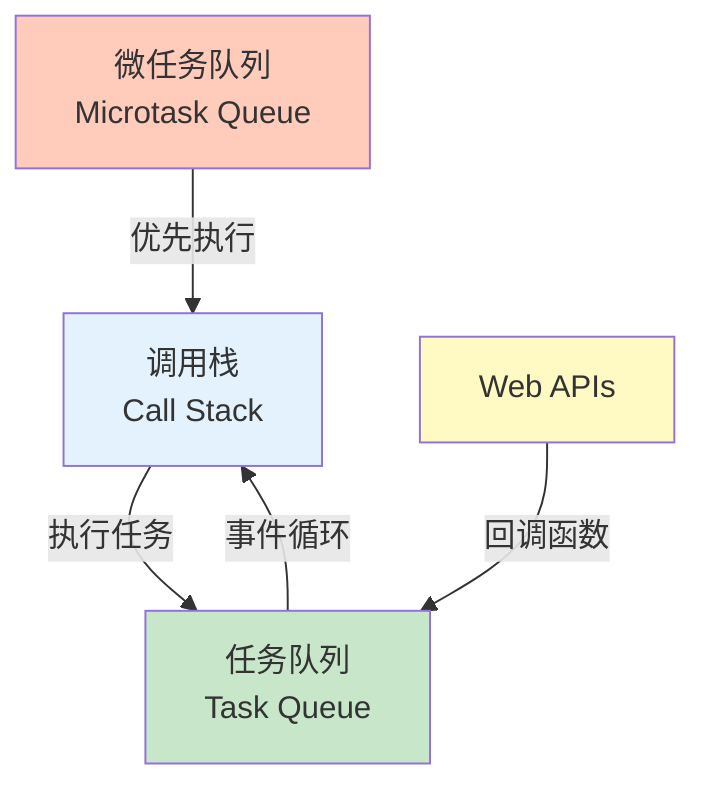
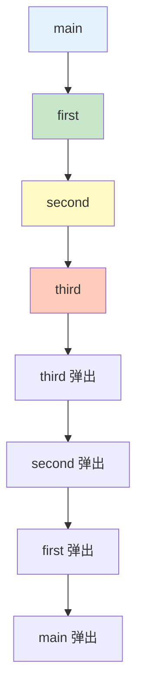
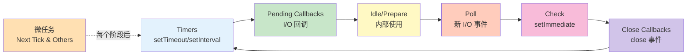

# 事件循环

事件循环是 JavaScript 实现异步的核心机制，理解它对掌握异步编程至关重要。

## 什么是事件循环

### 基本概念

```javascript
// JavaScript 是单线程的
console.log('Start');

setTimeout(() => {
    console.log('Timeout');
}, 0);

console.log('End');

// 输出顺序：
// 'Start'
// 'End'
// 'Timeout'
```



### 为什么需要事件循环

```javascript
// JavaScript 主线程用途：
// 1. 执行 JavaScript 代码
// 2. 处理 DOM 事件
// 3. 处理定时器
// 4. 处理网络请求

// 如果所有操作都是同步的：
console.log('Step 1');
// 模拟耗时操作（会阻塞）
const start = Date.now();
while (Date.now() - start < 3000) {}
console.log('Step 2');  // 3 秒后才执行

// 使用事件循环实现异步：
console.log('Step 1');
setTimeout(() => {
    console.log('Async operation');
}, 3000);
console.log('Step 2');  // 立即执行
```

## 调用栈

### 栈结构

```javascript
// 调用栈：函数调用的 LIFO（后进先出）结构
function first() {
    console.log('First');
    second();
}

function second() {
    console.log('Second');
    third();
}

function third() {
    console.log('Third');
}

first();

// 调用栈变化：
// []
// [first]
// [first, second]
// [first, second, third]
// [first, second]
// [first]
// []
```



### 栈溢出

```javascript
// ⚠️ 递归过深导致栈溢出
function recursion() {
    recursion();
}

// recursion();  // RangeError: Maximum call stack size exceeded

// ✅ 使用尾递归优化（ES6）
function factorial(n, acc = 1) {
    if (n === 0) return acc;
    return factorial(n - 1, n * acc);  // 尾调用
}

// 或使用迭代
function factorialIterative(n) {
    let result = 1;
    for (let i = 2; i <= n; i++) {
        result *= i;
    }
    return result;
}
```

## 任务队列

### 宏任务（Macrotask）

```javascript
// 宏任务来源：
// 1. setTimeout
// 2. setInterval
// 3. setImmediate（Node.js）
// 4. I/O 操作
// 5. UI 渲染

console.log('Start');

setTimeout(() => console.log('Timeout 1'), 0);
setTimeout(() => console.log('Timeout 2'), 0);

console.log('End');

// 输出：
// 'Start'
// 'End'
// 'Timeout 1'
// 'Timeout 2'
```

### 微任务（Microtask）

```javascript
// 微任务来源：
// 1. Promise.then/catch/finally
// 2. MutationObserver
// 3. queueMicrotask
// 4. process.nextTick（Node.js）

console.log('Start');

Promise.resolve().then(() => console.log('Promise 1'));
Promise.resolve().then(() => console.log('Promise 2'));

console.log('End');

// 输出：
// 'Start'
// 'End'
// 'Promise 1'
// 'Promise 2'
```

## 事件循环执行顺序

### 基本规则

```javascript
// 执行顺序：
// 1. 执行同步代码
// 2. 执行所有微任务
// 3. 执行一个宏任务
// 4. 重复步骤 2-3

console.log('1. 同步代码');

setTimeout(() => console.log('2. 宏任务：setTimeout'), 0);

Promise.resolve()
    .then(() => console.log('3. 微任务：Promise 1'))
    .then(() => console.log('4. 微任务：Promise 2'));

console.log('5. 同步代码');

// 输出：
// '1. 同步代码'
// '5. 同步代码'
// '3. 微任务：Promise 1'
// '4. 微任务：Promise 2'
// '2. 宏任务：setTimeout'
```

### 微任务优先级

```javascript
// 微任务在宏任务之前执行
console.log('Start');

setTimeout(() => {
    console.log('Macro: setTimeout');

    Promise.resolve().then(() => {
        console.log('Micro: Promise in setTimeout');
    });
}, 0);

Promise.resolve().then(() => {
    console.log('Micro: Promise 1');

    setTimeout(() => {
        console.log('Macro: setTimeout in Promise');
    }, 0);
});

Promise.resolve().then(() => {
    console.log('Micro: Promise 2');
});

console.log('End');

// 输出：
// 'Start'
// 'End'
// 'Micro: Promise 1'
// 'Micro: Promise 2'
// 'Macro: setTimeout'
// 'Micro: Promise in setTimeout'
// 'Macro: setTimeout in Promise'
```

### 复杂示例

```javascript
console.log('1. Start');

setTimeout(() => console.log('2. setTimeout 1'), 0);

Promise.resolve()
    .then(() => {
        console.log('3. Promise 1');
        return Promise.resolve();
    })
    .then(() => {
        console.log('4. Promise 2');
    });

setTimeout(() => console.log('5. setTimeout 2'), 0);

Promise.resolve().then(() => console.log('6. Promise 3'));

console.log('7. End');

// 输出顺序：
// '1. Start'
// '7. End'
// '3. Promise 1'
// '6. Promise 3'
// '4. Promise 2'
// '2. setTimeout 1'
// '5. setTimeout 2'
```

## 异步操作流程

### 定时器执行

```javascript
// setTimeout 的执行过程
console.log('1. Script start');

const timeout = setTimeout(() => {
    console.log('2. Timeout callback');
}, 1000);

console.log('3. Script end');

// 时间轴：
// 0ms: 执行同步代码，注册定时器
// 0ms: 输出 '1. Script start'
// 0ms: 输出 '3. Script end'
// 1000ms: 定时器到期，回调进入宏任务队列
// [空闲时]: 从队列取出回调执行，输出 '2. Timeout callback'
```

### Promise 执行

```javascript
// Promise 的执行过程
console.log('1. Script start');

const promise = new Promise((resolve) => {
    console.log('2. Promise executor');
    resolve('3. Promise resolved');
});

promise.then((value) => {
    console.log(value);
});

console.log('4. Script end');

// 输出：
// '1. Script start'
// '2. Promise executor'（同步执行）
// '4. Script end'
// '3. Promise resolved'（微任务）
```

### 网络请求

```javascript
// fetch 的执行过程
console.log('1. Script start');

fetch('/api/data')
    .then(response => {
        console.log('2. Response received');
        return response.json();
    })
    .then(data => {
        console.log('3. Data parsed:', data);
    })
    .catch(error => {
        console.error('4. Error:', error);
    });

console.log('5. Script end');

// 执行顺序：
// 1. 同步代码执行
// 2. 发起网络请求（不阻塞）
// 3. 继续执行同步代码
// 4. 等待响应...
// 5. 响应到达，微任务进入队列
// 6. 执行微任务
```

## Node.js 事件循环

### 阶段概述

```javascript
// Node.js 事件循环的 6 个阶段
// libuv 库实现

console.log('1. Start');

setTimeout(() => console.log('2. Timers'), 0);

setImmediate(() => console.log('3. Check'));

Promise.resolve().then(() => console.log('4. Microtask'));

console.log('5. End');

// 输出（可能）：
// '1. Start'
// '5. End'
// '4. Microtask'
// '2. Timers' 或 '3. Check'（顺序不确定）
```



### process.nextTick

```javascript
// process.nextTick：微任务，优先级高于 Promise
console.log('1. Start');

process.nextTick(() => {
    console.log('2. nextTick 1');
});

Promise.resolve().then(() => {
    console.log('3. Promise 1');
});

process.nextTick(() => {
    console.log('4. nextTick 2');
});

console.log('5. End');

// 输出：
// '1. Start'
// '5. End'
// '2. nextTick 1'
// '4. nextTick 2'
// '3. Promise 1'
```

### setImmediate vs setTimeout

```javascript
// setImmediate：在 Check 阶段执行
// setTimeout：在 Timers 阶段执行

// 在 I/O 回调中，setImmediate 总是先执行
const fs = require('fs');

fs.readFile(__filename, () => {
    setTimeout(() => console.log('setTimeout'), 0);
    setImmediate(() => console.log('setImmediate'));
    // 输出：setImmediate 然后 setTimeout
});

// 在主模块中，顺序不确定
setTimeout(() => console.log('setTimeout'), 0);
setImmediate(() => console.log('setImmediate'));
// 输出顺序不确定
```

## 常见误区

### 误区 1：setTimeout 时间不准确

```javascript
// ⚠️ setTimeout 不保证精确延迟
console.log('Start:', Date.now());

setTimeout(() => {
    console.log('Timeout:', Date.now());
}, 1000);

// 阻塞主线程
const start = Date.now();
while (Date.now() - start < 2000) {}

// 实际延迟可能超过 1000ms
```

### 误区 2：微任务会一直执行

```javascript
// ⚠️ 微任务队列不会无限增长
Promise.resolve().then(() => {
    Promise.resolve().then(() => {
        Promise.resolve().then(() => {
            console.log('Nested microtasks');
        });
    });
});

// 所有微任务在下一个宏任务前执行完毕
```

### 误区 3：return 阻止异步执行

```javascript
// ⚠️ return 不会阻止已注册的异步操作
function fetch() {
    setTimeout(() => {
        console.log('Async callback');
    }, 1000);

    return;  // 不会阻止 setTimeout
}

fetch();
console.log('After fetch');
```

## 事件循环的最佳实践

```javascript
// ✅ 推荐做法

// 1. 使用 Promise 处理异步
Promise.resolve()
    .then(() => console.log('Microtask'))
    .catch(err => console.error(err));

// 2. 使用 queueMicrotask 创建微任务
queueMicrotask(() => {
    console.log('Custom microtask');
});

// 3. 避免长时间阻塞主线程
function heavyTask(data) {
    return new Promise(resolve => {
        // 分块处理
        setTimeout(() => {
            const result = processChunk(data);
            resolve(result);
        }, 0);
    });
}

// 4. 使用 requestAnimationFrame 处理动画
requestAnimationFrame(() => {
    console.log('Animation frame');
});

// ❌ 不推荐做法

// 1. 在循环中创建大量宏任务
for (let i = 0; i < 10000; i++) {
    setTimeout(() => {}, 0);  // 堆积队列
}

// 2. 混合使用宏任务和微任务导致混乱
setTimeout(() => {
    Promise.resolve().then(() => {
        setTimeout(() => {
            Promise.resolve().then(() => {
                // 嵌套过深
            });
        }, 0);
    });
}, 0);

// 3. 阻塞事件循环
function blocking() {
    while (true) {
        // 永远阻塞
    }
}
```

::: tip 事件循环检查清单

- [ ] 理解调用栈的 LIFO 结构
- [ ] 理解微任务优先于宏任务
- [ ] 知道 Promise 是微任务
- [ ] 知道 setTimeout/setInterval 是宏任务
- [ ] 避免阻塞主线程
- [ ] 使用分块处理大任务

:::

::: tip 异步编程回顾

恭喜！你已掌握 JavaScript 异步编程的核心知识：

- [x] 回调函数
- [x] Promise
- [x] async/await
- [x] 事件循环

接下来学习 DOM 操作 → [DOM 操作](../06-dom-events/dom-manipulation.md)
:::
