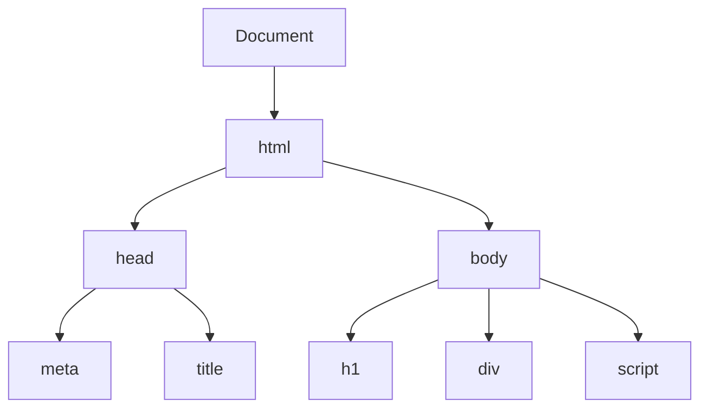

# DOM 与事件

DOM（文档对象模型）是 JavaScript 与 HTML 交互的桥梁。

## 学习内容

- [DOM 基础](./dom-basics.md) - DOM 树、节点类型、选择器
- [DOM 操作](./dom-manipulation.md) - 增删改查、样式操作
- [事件处理](./events.md) - 事件绑定、事件对象、事件冒泡
- [事件委托](./event-delegation.md) - 事件委托原理与应用

## DOM 树结构

