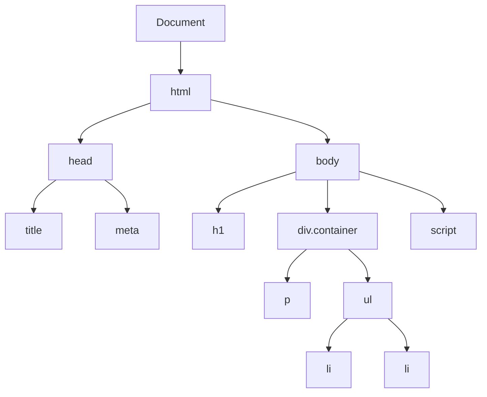

# DOM 基础

DOM（文档对象模型）是 HTML 和 XML 文档的编程接口，将文档表示为节点树。

## DOM 树结构

```html
<!DOCTYPE html>
<html>
<head>
    <title>页面标题</title>
    <meta charset="UTF-8">
</head>
<body>
    <h1>标题</h1>
    <div class="container">
        <p>段落文本</p>
        <ul>
            <li>列表项 1</li>
            <li>列表项 2</li>
        </ul>
    </div>
    <script src="app.js"></script>
</body>
</html>
```



## 节点类型

### Node 类型

```javascript
// 节点类型常量
console.log(Node.ELEMENT_NODE);       // 1 - 元素节点
console.log(Node.ATTRIBUTE_NODE);      // 2 - 属性节点
console.log(Node.TEXT_NODE);           // 3 - 文本节点
console.log(Node.COMMENT_NODE);        // 8 - 注释节点
console.log(Node.DOCUMENT_NODE);       // 9 - 文档节点
console.log(Node.DOCUMENT_TYPE_NODE);  // 10 - 文档类型节点

// 判断节点类型
const element = document.querySelector('div');
console.log(element.nodeType === Node.ELEMENT_NODE);  // true

const text = element.firstChild;
console.log(text.nodeType === Node.TEXT_NODE);  // true
```

### 元素节点

```javascript
// 获取元素
const div = document.querySelector('div');
const divs = document.querySelectorAll('div');

// 元素属性
console.log(div.tagName);        // 'DIV'
console.log(div.nodeName);       // 'DIV'
console.log(div.nodeValue);      // null（元素节点没有值）
console.log(div.nodeType);       // 1

// 元素方法
console.log(div.id);             // ID
console.log(div.className);      // 类名
console.log(div.classList);      // 类名列表
```

### 文本节点

```javascript
// 文本节点
const p = document.querySelector('p');
const text = p.firstChild;

console.log(text.nodeType);           // 3
console.log(text.nodeName);            // '#text'
console.log(text.nodeValue);           // '段落文本'
console.log(text.textContent);         // '段落文本'

// 修改文本
text.textContent = '新文本';

// 创建文本节点
const newText = document.createTextNode('新文本节点');
p.appendChild(newText);
```

### 注释节点

```javascript
// 注释节点
const comment = document.createComment('这是注释');
document.body.appendChild(comment);

// 查找注释
const allComments = [];
const walker = document.createTreeWalker(
    document.body,
    NodeFilter.SHOW_COMMENT
);

let node;
while (node = walker.nextNode()) {
    allComments.push(node);
}

console.log(allComments.length);  // 注释数量
```

## DOM 选择器

### querySelector 系列

```javascript
// querySelector：返回第一个匹配的元素
const div = document.querySelector('.container');
const h1 = document.querySelector('h1');
const firstLi = document.querySelector('ul li:first-child');

// querySelectorAll：返回所有匹配的元素（NodeList）
const allDivs = document.querySelectorAll('div');
const items = document.querySelectorAll('ul li');

// NodeList vs Array
console.log(allDivs instanceof NodeList);  // true
console.log(allDivs instanceof Array);     // false

// NodeList 转数组
const divArray = Array.from(allDivs);
const divArray2 = [...allDivs];

// 遍历 NodeList
allDivs.forEach((div, index) => {
    console.log(`Div ${index}:`, div.className);
});

// forEach 在 NodeList 上的支持（现代浏览器）
items.forEach(item => {
    console.log(item.textContent);
});
```

### getElementBy 系列

```javascript
// getElementById：通过 ID 获取元素
const app = document.getElementById('app');

// getElementsByClassName：通过类名获取（HTMLCollection）
const containers = document.getElementsByClassName('container');

// getElementsByTagName：通过标签名获取（HTMLCollection）
const divs = document.getElementsByTagName('div');

// getElementsByName：通过 name 属性获取
const radioButtons = document.getElementsByName('gender');

// HTMLCollection vs NodeList
console.log(containers instanceof HTMLCollection);  // true
console.log(containers instanceof NodeList);        // false

// HTMLCollection 是实时的（DOM 变化会自动更新）
// querySelectorAll 返回的 NodeList 是静态的
```

### 选择器性能对比

```javascript
// 性能：getElementById > querySelector
const container1 = document.getElementById('container');
const container2 = document.querySelector('#container');

// 性能：getElementsByClassName > querySelectorAll
const items1 = document.getElementsByClassName('item');
const items2 = document.querySelectorAll('.item');

// 性能建议：
// 1. 优先使用 ID 选择器（最快）
// 2. 其次使用类选择器
// 3. 避免使用通配符选择器
// 4. 避免复杂的选择器嵌套

// ❌ 慢
const verySlow = document.querySelectorAll('body div ul li a');

// ✅ 快
const fast = document.querySelectorAll('.item-link');
```

## 节点遍历

### 父子节点关系

```javascript
const container = document.querySelector('.container');

// 子节点
console.log(container.children);           // HTMLCollection（只包含元素节点）
console.log(container.childNodes);         // NodeList（包含所有节点类型）

// firstChild / lastChild：所有节点
console.log(container.firstChild);         // 第一个子节点（可能是文本节点）
console.log(container.lastChild);          // 最后一个子节点

// firstElementChild / lastElementChild：元素节点
console.log(container.firstElementChild);  // 第一个元素子节点
console.log(container.lastElementChild);   // 最后一个元素子节点

// childNodes：所有子节点
container.childNodes.forEach(node => {
    console.log(node.nodeType, node.nodeName);
});

// children：元素子节点
container.children.forEach((child, index) => {
    console.log(`Child ${index}:`, child.tagName);
});
```

### 兄弟节点关系

```javascript
const item = document.querySelector('.item');

// 上一个/下一个兄弟节点
console.log(item.previousSibling);       // 上一个兄弟节点（所有类型）
console.log(item.nextSibling);           // 下一个兄弟节点（所有类型）

// 上一个/下一个兄弟元素
console.log(item.previousElementSibling); // 上一个兄弟元素
console.log(item.nextElementSibling);     // 下一个兄弟元素

// 所有兄弟元素
const siblings = [...item.parentElement.children].filter(child => child !== item);

// 前面的所有兄弟
const previousSiblings = [];
let current = item.previousElementSibling;
while (current) {
    previousSiblings.push(current);
    current = current.previousElementSibling;
}
```

### 父节点关系

```javascript
const item = document.querySelector('.item');

// parentNode：父节点
console.log(item.parentNode);              // 父节点
console.log(item.parentElement);           // 父元素（总是元素节点）

// 向上遍历
let element = item;
while (element && element.tagName !== 'BODY') {
    console.log(element.className);
    element = element.parentElement;
}

// offsetParent：定位父元素
console.log(item.offsetParent);  // 用于定位的父元素
```

### 节点检查

```javascript
const container = document.querySelector('.container');

// hasChildNodes：是否有子节点
console.log(container.hasChildNodes());  // true

// childElementCount：元素子节点数量
console.log(container.childElementCount);  // 只计算元素节点

// contains：是否包含指定节点
const item = container.querySelector('.item');
console.log(container.contains(item));  // true

// 检查父子关系
console.log(item.parentNode === container);  // true

// compareDocumentPosition：比较节点位置
const div1 = document.querySelector('.div1');
const div2 = document.querySelector('.div2');
const position = div1.compareDocumentPosition(div2);

console.log(position & Node.DOCUMENT_POSITION_FOLLOWING);  // div2 在 div1 后面
console.log(position & Node.DOCUMENT_POSITION_CONTAINED_BY); // div1 包含 div2
```

## DOM 修改

### 创建节点

```javascript
// 创建元素节点
const div = document.createElement('div');
div.id = 'app';
div.className = 'container';

// 创建文本节点
const text = document.createTextNode('Hello World');

// 创建注释节点
const comment = document.createComment('This is a comment');

// 创建文档片段
const fragment = document.createDocumentFragment();
fragment.appendChild(div);
fragment.appendChild(text);
```

### 插入节点

```javascript
const container = document.querySelector('.container');

// appendChild：追加到末尾
const newDiv = document.createElement('div');
container.appendChild(newDiv);

// insertBefore：插入到指定节点前
const referenceNode = container.firstElementChild;
container.insertBefore(newDiv, referenceNode);

// 现代 API
container.append(newDiv);           // 追加（可多个）
container.prepend(newDiv);          // 开头插入

newDiv.before(container);           // 元素前插入
newDiv.after(container);            // 元素后插入

newDiv.replaceWith(newDiv2);        // 替换元素
```

### 删除节点

```javascript
const item = document.querySelector('.item');

// remove：删除自身
item.remove();

// removeChild：删除子节点（旧 API）
const container = document.querySelector('.container');
const child = container.firstElementChild;
container.removeChild(child);

// 清空子节点
container.innerHTML = '';           // 方法 1
container.textContent = '';         // 方法 2
while (container.firstChild) {      // 方法 3
    container.removeChild(container.firstChild);
}
container.replaceChildren();        // 方法 4（现代 API）
```

### 替换节点

```javascript
const oldItem = document.querySelector('.old-item');
const newItem = document.createElement('div');
newItem.textContent = 'New Item';

// replaceWith：替换自身（现代 API）
oldItem.replaceWith(newItem);

// replaceChild：替换子节点（旧 API）
const container = document.querySelector('.container');
container.replaceChild(newItem, oldItem);
```

## 属性操作

### 标准属性

```javascript
const button = document.querySelector('button');

// 直接属性访问
button.id = 'submit-btn';
button.className = 'btn btn-primary';
button.disabled = false;
button.type = 'submit';

// 表单元素
const input = document.querySelector('input');
input.value = 'Hello';
input.checked = true;
input.selected = true;

// 获取属性
console.log(button.id);           // 'submit-btn'
console.log(button.className);    // 'btn btn-primary'
console.log(button.disabled);     // false
```

### getAttribute/setAttribute

```javascript
const element = document.querySelector('.element');

// 设置属性
element.setAttribute('data-id', '123');
element.setAttribute('aria-label', 'Element');
element.setAttribute('role', 'button');

// 获取属性
const dataId = element.getAttribute('data-id');
console.log(dataId);  // '123'

// 检查属性
const hasId = element.hasAttribute('id');
console.log(hasId);  // false

// 删除属性
element.removeAttribute('data-id');

// 所有属性
const attrs = element.attributes;
for (let i = 0; i < attrs.length; i++) {
    console.log(attrs[i].name, attrs[i].value);
}
```

### data-* 属性

```javascript
const button = document.querySelector('button');

// dataset：data-* 属性
button.dataset.userId = '123';
button.dataset.userName = 'Alice';
button.dataset.isActive = 'true';

// 获取
console.log(button.dataset.userId);     // '123'
console.log(button.dataset.userName);   // 'Alice'

// 转换规则
// data-user-id → dataset.userId
// data-userName → dataset.userName

// 删除
delete button.dataset.isActive;

// 遍历所有 data-* 属性
for (const key in button.dataset) {
    console.log(key, button.dataset[key]);
}
```

## CSS 类操作

### className

```javascript
const div = document.querySelector('div');

// 设置类名
div.className = 'container active';

// 追加类名
div.className += ' visible';

// 替换类名
div.className = div.className.replace('active', 'inactive');

// 检查类名
const hasClass = div.className.includes('active');

// 注意：className 是字符串，操作比较麻烦
```

### classList

```javascript
const div = document.querySelector('div');

// add：添加类名
div.classList.add('active');
div.classList.add('class1', 'class2', 'class3');  // 多个

// remove：移除类名
div.classList.remove('active');
div.classList.remove('class1', 'class2');  // 多个

// toggle：切换类名
div.classList.toggle('visible');  // 有则删，无则加

// contains：检查类名
const hasActive = div.classList.contains('active');

// replace：替换类名
div.classList.replace('old-class', 'new-class');

// 遍历类名
div.classList.forEach((className, index) => {
    console.log(`Class ${index}:`, className);
});

// 类名数量
console.log(div.classList.length);

// 索引访问
console.log(div.classList[0]);  // 第一个类名
console.log(div.classList.item(0));  // 同上
```

## 样式操作

### 行内样式

```javascript
const div = document.querySelector('div');

// 设置单个样式
div.style.color = 'red';
div.style.backgroundColor = 'blue';
div.style.fontSize = '16px';

// CSS 属性名转换
// background-color → backgroundColor
// font-size → fontSize
// border-radius → borderRadius

// 批量设置
div.style.cssText = 'color: red; background: blue; font-size: 16px;';

// 获取样式
console.log(div.style.color);  // 'red'

// 删除样式
div.style.color = '';
```

### getComputedStyle

```javascript
const div = document.querySelector('div');

// 获取计算后的样式（所有 CSS 规则）
const computed = window.getComputedStyle(div);

// 获取单个样式
console.log(computed.color);           // 'rgb(255, 0, 0)'
console.log(computed.backgroundColor); // 'rgb(0, 0, 255)'
console.log(computed.fontSize);        // '16px'

// 伪元素样式
const pseudo = window.getComputedStyle(div, '::before');
console.log(pseudo.content);

// 注意：computedStyle 是只读的
// computed.color = 'blue';  // 无效
```

### CSS 变量

```javascript
// 设置 CSS 变量
const root = document.documentElement;
root.style.setProperty('--primary-color', '#007bff');
root.style.setProperty('--font-size', '16px');

// 获取 CSS 变量
const color = root.style.getPropertyValue('--primary-color');
console.log(color);  // '#007bff'

// 获取计算后的 CSS 变量
const computedColor = getComputedStyle(root)
    .getPropertyValue('--primary-color');
console.log(computedColor);

// 删除 CSS 变量
root.style.removeProperty('--primary-color');

// 在元素上使用
const button = document.querySelector('button');
button.style.setProperty('--button-color', 'green');
```

## DOM 尺寸和位置

### offset 系列

```javascript
const element = document.querySelector('.element');

// offsetWidth / offsetHeight：元素宽高（含 border、padding）
console.log(element.offsetWidth);   // 100
console.log(element.offsetHeight);  // 100

// offsetLeft / offsetTop：相对于 offsetParent 的位置
console.log(element.offsetLeft);    // 10
console.log(element.offsetTop);     // 10

// offsetParent：定位父元素
console.log(element.offsetParent);
```

### client 系列

```javascript
const element = document.querySelector('.element');

// clientWidth / clientHeight：元素宽高（不含 border，含 padding）
console.log(element.clientWidth);   // 80
console.log(element.clientHeight);  // 80

// clientLeft / clientTop：左边框和上边框宽度
console.log(element.clientLeft);    // 10
console.log(element.clientTop);     // 10
```

### scroll 系列

```javascript
const element = document.querySelector('.element');

// scrollWidth / scrollHeight：滚动内容的总宽高
console.log(element.scrollWidth);   // 500
console.log(element.scrollHeight);  // 500

// scrollLeft / scrollTop：已滚动的距离
console.log(element.scrollLeft);    // 0
console.log(element.scrollTop);     // 0

// 滚动到指定位置
element.scrollLeft = 100;
element.scrollTop = 100;

// 滚动到视图
element.scrollIntoView({ behavior: 'smooth', block: 'start' });
```

### getBoundingClientRect

```javascript
const element = document.querySelector('.element');

// 获取元素相对于视口的位置
const rect = element.getBoundingClientRect();

console.log(rect.top);     // 距离视口顶部的距离
console.log(rect.right);   // 距离视口左侧的距离
console.log(rect.bottom);  // 距离视口底部的距离
console.log(rect.left);    // 距离视口左侧的距离
console.log(rect.width);   // 元素宽度
console.log(rect.height);  // 元素高度

// 检查元素是否在视口中
const isVisible = (
    rect.top >= 0 &&
    rect.left >= 0 &&
    rect.bottom <= window.innerHeight &&
    rect.right <= window.innerWidth
);
console.log(isVisible);

// 检查元素是否与视口相交
const isIntersecting = (
    rect.top < window.innerHeight &&
    rect.bottom > 0 &&
    rect.left < window.innerWidth &&
    rect.right > 0
);
console.log(isIntersecting);
```

## 最佳实践

::: tip DOM 操作建议

1. **缓存选择结果** - 避免重复查询 DOM
2. **使用 classList** - 替代 className 操作
3. **批量操作** - 使用 DocumentFragment
4. **避免布局抖动** - 批量读取和写入
5. **使用现代 API** - append、prepend、remove

:::

```javascript
// ✅ 好的做法
const container = document.querySelector('.container');

// 1. 缓存 DOM 查询
const items = container.querySelectorAll('.item');
items.forEach(item => {
    item.classList.add('active');
});

// 2. 使用 DocumentFragment
const fragment = document.createDocumentFragment();
for (let i = 0; i < 100; i++) {
    const div = document.createElement('div');
    fragment.appendChild(div);
}
container.appendChild(fragment);

// 3. 批量读取和写入
const rects = [];
items.forEach(item => rects.push(item.getBoundingClientRect()));
rects.forEach((rect, i) => {
    items[i].style.left = rect.left + 'px';
});

// ❌ 不好的做法
for (let i = 0; i < 100; i++) {
    document.querySelector('.item').classList.add('active');
}
```

## 总结

| 方法 | 用途 | 返回值 |
|------|------|--------|
| **querySelector** | 选择单个元素 | Element / null |
| **querySelectorAll** | 选择多个元素 | NodeList（静态） |
| **getElementById** | ID 选择 | Element / null |
| **createElement** | 创建元素 | Element |
| **appendChild** | 追加子节点 | Node |
| **classList** | 类名操作 | DOMTokenList |

::: v-pre

[DOM 操作](./dom-manipulation.md) → [事件处理](./events.md)

:::
