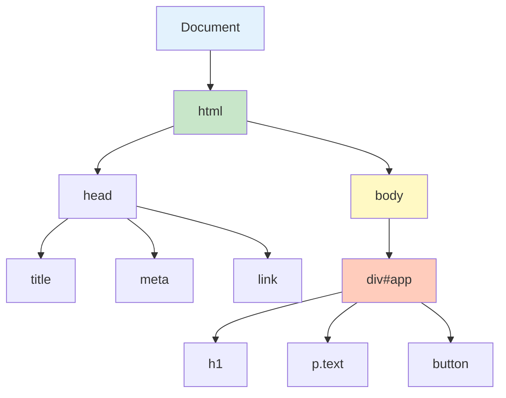

# DOM 简介

DOM（Document Object Model，文档对象模型）是 JavaScript 操作 HTML 和 XML 文档的接口。

## 什么是 DOM

### 基本概念

```javascript
// DOM 将 HTML 文档表示为树结构
/*
<html>
  <head>
    <title>DOM 示例</title>
  </head>
  <body>
    <div id="app">
      <h1>标题</h1>
      <p class="text">段落</p>
    </div>
  </body>
</html>
*/

// DOM 树：
// Document
//   ├── html
//   │   ├── head
//   │   │   └── title
//   │   └── body
//   │       └── div#app
//   │           ├── h1
//   │           └── p.text
```



### Node 接口

```javascript
// DOM 中所有节点都继承自 Node 接口
console.log(Node.prototype);  // Node 接口的方法

// Node 类型常量
console.log(Node.ELEMENT_NODE);       // 1 - 元素节点
console.log(Node.TEXT_NODE);          // 3 - 文本节点
console.log(Node.COMMENT_NODE);       // 8 - 注释节点
console.log(Node.DOCUMENT_NODE);      // 9 - 文档节点
console.log(Node.DOCUMENT_TYPE_NODE); // 10 - 文档类型节点

// 检查节点类型
const element = document.body;
console.log(element.nodeType);  // 1
console.log(element.nodeName);  // 'BODY'
```

## 节点类型

### 元素节点

```javascript
// 元素节点：HTML 标签
const div = document.createElement('div');
div.textContent = 'Hello';

console.log(div.nodeType);  // 1 (ELEMENT_NODE)
console.log(div.nodeName);  // 'DIV'
console.log(div.tagName);   // 'DIV'

// 常见元素节点
const p = document.querySelector('p');
const h1 = document.querySelector('h1');
const button = document.querySelector('button');
```

### 文本节点

```javascript
// 文本节点：元素内的文本
const div = document.createElement('div');
div.textContent = 'Hello World';

const textNode = div.firstChild;
console.log(textNode.nodeType);  // 3 (TEXT_NODE)
console.log(textNode.nodeValue); // 'Hello World'

// 文本内容
const p = document.querySelector('p');
console.log(p.textContent);  // 获取纯文本
console.log(p.innerText);    // 获取渲染后的文本
```

### 注释节点

```javascript
// 注释节点：HTML 注释
const div = document.createElement('div');
div.innerHTML = '<!-- 这是注释 --><span>内容</span>';

const comment = div.firstChild;
console.log(comment.nodeType);   // 8 (COMMENT_NODE)
console.log(comment.nodeValue);  // ' 这是注释 '
```

### 文档节点

```javascript
// 文档节点：整个 HTML 文档的根节点
console.log(document.nodeType);  // 9 (DOCUMENT_NODE)
console.log(document.nodeName);  // '#document'

// document.documentElement：html 元素
const html = document.documentElement;
console.log(html.nodeType);  // 1 (ELEMENT_NODE)

// document.body：body 元素
const body = document.body;
console.log(body.nodeType);  // 1 (ELEMENT_NODE)

// document.head：head 元素
const head = document.head;
console.log(head.nodeType);  // 1 (ELEMENT_NODE)
```

## DOM 树遍历

### 父子节点

```javascript
// parentNode：父节点
const p = document.querySelector('p');
console.log(p.parentNode);        // 父节点
console.log(p.parentElement);     // 父元素（只能是元素节点）

// childNodes：所有子节点（包括文本、注释等）
const div = document.querySelector('div');
console.log(div.childNodes);      // NodeList [text, h1, text, p, text]

// children：所有子元素（只包含元素节点）
console.log(div.children);        // HTMLCollection [h1, p]

// firstChild / lastChild：第一个/最后一个子节点
console.log(div.firstChild);      // 可能是文本节点
console.log(div.lastChild);       // 可能是文本节点

// firstElementChild / lastElementChild：第一个/最后一个子元素
console.log(div.firstElementChild);  // h1
console.log(div.lastElementChild);   // p
```

### 兄弟节点

```javascript
// previousSibling / nextSibling：前一个/后一个兄弟节点
const h1 = document.querySelector('h1');
console.log(h1.previousSibling);   // 可能是文本节点
console.log(h1.nextSibling);       // 可能是文本节点

// previousElementSibling / nextElementSibling：前一个/后一个兄弟元素
console.log(h1.previousElementSibling);  // null
console.log(h1.nextElementSibling);      // p
```

### 遍历示例

```javascript
// 递归遍历 DOM 树
function traverse(node, depth = 0) {
    const indent = '  '.repeat(depth);
    console.log(`${indent}${node.nodeName}`);

    // 遍历子节点
    for (let i = 0; i < node.childNodes.length; i++) {
        traverse(node.childNodes[i], depth + 1);
    }
}

traverse(document.body);

// 只遍历元素节点
function traverseElements(element, depth = 0) {
    const indent = '  '.repeat(depth);
    console.log(`${indent}${element.tagName}`);

    for (const child of element.children) {
        traverseElements(child, depth + 1);
    }
}

traverseElements(document.body);
```

## 选择器

### querySelector

```javascript
// querySelector：返回第一个匹配的元素
const element1 = document.querySelector('#app');           // ID
const element2 = document.querySelector('.text');           // Class
const element3 = document.querySelector('div');             // 标签
const element4 = document.querySelector('div p.text');      // 后代
const element5 = document.querySelector('div > p');         // 子元素
const element6 = document.querySelector('input[type="text"]'); // 属性

// 复杂选择器
const element7 = document.querySelector('ul > li:first-child');
const element8 = document.querySelector('a[href^="https"]');
const element9 = document.querySelector('.container.active');
```

### querySelectorAll

```javascript
// querySelectorAll：返回所有匹配的元素
const items1 = document.querySelectorAll('li');
const items2 = document.querySelectorAll('.item');
const items3 = document.querySelectorAll('ul > li');

// NodeList：类数组，可迭代
console.log(items1.length);
items1.forEach(item => console.log(item));

// 转换为数组
const itemsArray = Array.from(document.querySelectorAll('li'));
const itemsSpread = [...document.querySelectorAll('li')];
```

### 其他选择方法

```javascript
// getElementById：通过 ID 选择
const element = document.getElementById('app');

// getElementsByClassName：通过 Class 选择
const elements = document.getElementsByClassName('text');

// getElementsByTagName：通过标签名选择
const divs = document.getElementsByTagName('div');

// getElementsByName：通过 name 属性选择
const inputs = document.getElementsByName('username');

// HTMLCollection：实时更新（DOM 变化时自动更新）
console.log(elements instanceof HTMLCollection);  // true
console.log(elements instanceof NodeList);        // false
```

### 选择器对比

```javascript
// querySelector vs getElementById

// 1. 返回类型
const byId = document.getElementById('app');       // 元素或 null
const byQuery = document.querySelector('#app');   // 元素或 null

// 2. 性能
// getElementById 更快（直接查找）
// querySelector 更灵活（支持复杂选择器）

// 3. 多个元素
const byClass = document.getElementsByClassName('item');  // HTMLCollection（实时）
const byQueryAll = document.querySelectorAll('.item');  // NodeList（静态）

// 静态 vs 实时
const list = document.querySelector('ul');
const items1 = list.getElementsByTagName('li');   // 实时
const items2 = list.querySelectorAll('li');      // 静态

// 添加新 li 元素
const newItem = document.createElement('li');
list.appendChild(newItem);

console.log(items1.length);  // 增加（实时）
console.log(items2.length);  // 不变（静态）
```

## 文档结构

### 获取元素

```javascript
// document.documentElement：html 元素
const html = document.documentElement;

// document.body：body 元素
const body = document.body;

// document.head：head 元素
const head = document.head;

// 获取表单
const forms = document.forms;
const form1 = document.forms[0];
const form2 = document.forms['login-form'];

// 获取图片
const images = document.images;

// 获取链接
const links = document.links;

// 获取脚本
const scripts = document.scripts;
```

### 文档信息

```javascript
// document.title：页面标题
console.log(document.title);
document.title = '新标题';

// document.URL：完整 URL
console.log(document.URL);

// document.domain：域名
console.log(document.domain);

// document.referrer：来源页面
console.log(document.referrer);

// document.lastModified：最后修改时间
console.log(document.lastModified);

// document.cookie：Cookie
console.log(document.cookie);
```

### 文档状态

```javascript
// document.readyState：文档加载状态
console.log(document.readyState);
// 'loading'：正在加载
// 'interactive'：DOM 构建完成
// 'complete'：资源加载完成

// 监听加载状态
document.addEventListener('readystatechange', () => {
    console.log(document.readyState);
});

// DOMContentLoaded：DOM 构建完成
document.addEventListener('DOMContentLoaded', () => {
    console.log('DOM ready');
});

// load：所有资源加载完成
window.addEventListener('load', () => {
    console.log('Page fully loaded');
});
```

## DOM 的最佳实践

```javascript
// ✅ 推荐做法

// 1. 使用 querySelector/querySelectorAll
const element = document.querySelector('.item');
const elements = document.querySelectorAll('.item');

// 2. 缓存 DOM 查询结果
const container = document.querySelector('#container');
container.addEventListener('click', handleClick);
container.appendChild(newElement);

// 3. 使用 DocumentFragment 批量操作
const fragment = document.createDocumentFragment();
for (let i = 0; i < 100; i++) {
    const li = document.createElement('li');
    fragment.appendChild(li);
}
document.querySelector('ul').appendChild(fragment);

// 4. 使用事件委托
document.querySelector('ul').addEventListener('click', (e) => {
    if (e.target.matches('li')) {
        console.log('Clicked:', e.target.textContent);
    }
});

// ❌ 不推荐做法

// 1. 重复查询 DOM
for (let i = 0; i < 100; i++) {
    document.querySelector('.item').textContent = i;
}

// 2. 在循环中直接操作 DOM
const ul = document.querySelector('ul');
for (let i = 0; i < 1000; i++) {
    const li = document.createElement('li');
    ul.appendChild(li);  // 每次都触发重排
}

// 3. 使用过时的选择方法
// document.all  // 已废弃
```

::: tip DOM 检查清单

- [ ] 理解 DOM 树结构
- [ ] 掌握节点类型和遍历方法
- [ ] 使用 querySelector/querySelectorAll
- [ ] 缓存 DOM 查询结果
- [ ] 使用 DocumentFragment 批量操作
- [ ] 使用事件委托减少监听器

:::

::: tip 下一步

学习 DOM 操作 → [DOM 操作](./dom-manipulation.md)
:::
