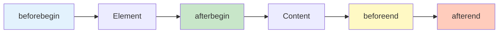

# DOM 操作

DOM 操作是 JavaScript 与页面交互的核心，包括创建、修改、删除元素等。

## 创建元素

### createElement

```javascript
// 创建元素
const div = document.createElement('div');
const p = document.createElement('p');
const button = document.createElement('button');

// 设置内容
div.textContent = 'Hello World';
p.innerHTML = '<strong>粗体</strong>文本';
button.textContent = '点击';

// 设置属性
div.id = 'app';
div.className = 'container';
button.disabled = true;

// 添加到页面
document.body.appendChild(div);
div.appendChild(p);
div.appendChild(button);
```

### createTextNode

```javascript
// 创建文本节点
const text = document.createTextNode('Hello World');
const p = document.createElement('p');
p.appendChild(text);
document.body.appendChild(p);

// 等价于
const p2 = document.createElement('p');
p2.textContent = 'Hello World';
document.body.appendChild(p2);
```

### createDocumentFragment

```javascript
// DocumentFragment：文档片段（轻量级文档）
const fragment = document.createDocumentFragment();

// 批量添加元素
const ul = document.createElement('ul');
for (let i = 1; i <= 100; i++) {
    const li = document.createElement('li');
    li.textContent = `Item ${i}`;
    fragment.appendChild(li);
}

// 一次性添加到 DOM（只触发一次重排）
ul.appendChild(fragment);
document.body.appendChild(ul);

// 优势：
// 1. 减少重排和重绘
// 2. 提高性能
// 3. Fragment 不在 DOM 树中
```

### cloneNode

```javascript
// 克隆节点
const original = document.querySelector('.item');
const clone = original.cloneNode(true);  // true：深克隆（包含子节点）
const shallow = original.cloneNode(false); // false：浅克隆（不包含子节点）

// 修改克隆节点
clone.textContent = 'Cloned item';

// 添加到页面
document.body.appendChild(clone);

// 注意：克隆不会复制事件监听器
original.addEventListener('click', () => {
    console.log('Original clicked');
});
const cloned = original.cloneNode(true);
cloned.click();  // 不会触发
```

## 修改元素

### 修改内容

```javascript
// textContent：设置/获取纯文本
const p = document.querySelector('p');
p.textContent = 'Hello World';
console.log(p.textContent);

// innerText：获取渲染后的文本（考虑 CSS）
console.log(p.innerText);

// innerHTML：设置/获取 HTML
p.innerHTML = '<strong>Hello</strong> <em>World</em>';
console.log(p.innerHTML);

// outerHTML：包含元素本身的 HTML
console.log(p.outerHTML);  // '<p><strong>Hello</strong> <em>World</em></p>'
p.outerHTML = '<div>Replaced</div>';  // 替换元素
```

### 修改属性

```javascript
// 直接属性访问
const button = document.querySelector('button');
button.id = 'submit';
button.className = 'btn btn-primary';
button.disabled = false;

// getAttribute / setAttribute
button.setAttribute('type', 'submit');
button.setAttribute('data-id', '123');
console.log(button.getAttribute('data-id'));  // '123'

// hasAttribute / removeAttribute
if (button.hasAttribute('disabled')) {
    button.removeAttribute('disabled');
}

// dataset：data-* 属性
button.dataset.userId = '123';
button.dataset.userName = 'Alice';
console.log(button.dataset.userId);  // '123'
```

### 修改样式

```javascript
// style：行内样式
const div = document.querySelector('div');
div.style.color = 'red';
div.style.backgroundColor = 'blue';
div.style.fontSize = '16px';
div.style.cssText = 'color: red; background: blue;';

// classList：类名操作
div.classList.add('active');
div.classList.remove('inactive');
div.classList.toggle('visible');
div.classList.contains('active');  // true

// 替换类名
div.classList.replace('old-class', 'new-class');

// 多个类名
div.classList.add('class1', 'class2', 'class3');

// className：类名字符串
div.className = 'container active visible';
```

## 插入元素

### appendChild

```javascript
// appendChild：添加到末尾
const parent = document.querySelector('.parent');
const child = document.createElement('div');
child.textContent = 'Child';
parent.appendChild(child);

// 如果元素已存在，会移动它
const existing = document.querySelector('.existing');
parent.appendChild(existing);  // 移动到 parent 的末尾
```

### insertBefore

```javascript
// insertBefore：插入到指定节点前
const parent = document.querySelector('.parent');
const newNode = document.createElement('div');
const referenceNode = parent.querySelector('.existing');

parent.insertBefore(newNode, referenceNode);
// newNode 插入到 referenceNode 前面

// 插入到末尾（referenceNode 为 null）
parent.insertBefore(newNode, null);  // 等价于 appendChild
```

### insertAdjacentHTML

```javascript
// insertAdjacentHTML：在指定位置插入 HTML
const container = document.querySelector('.container');

// beforebegin：元素前
container.insertAdjacentHTML('beforebegin', '<p>Before</p>');

// afterbegin：第一个子元素前
container.insertAdjacentHTML('afterbegin', '<p>First child</p>');

// beforeend：最后一个子元素后
container.insertAdjacentHTML('beforeend', '<p>Last child</p>');

// afterend：元素后
container.insertAdjacentHTML('afterend', '<p>After</p>');
```



### 现代 API

```javascript
// append：追加多个节点或字符串
parent.append(child1, child2, 'text');
parent.append(child1, ...children);

// prepend：在开头插入
parent.prepend(child1, child2);

// after / before：在元素前后插入
element.before(insertedElement);
element.after(insertedElement);

// replaceWith：替换元素
oldElement.replaceWith(newElement);

// insertAdjacentElement：插入元素
container.insertAdjacentElement('beforeend', newElement);

// insertAdjacentText：插入文本
container.insertAdjacentText('beforeend', 'Text');
```

## 删除元素

### removeChild

```javascript
// removeChild：删除子节点
const parent = document.querySelector('.parent');
const child = parent.querySelector('.child');

parent.removeChild(child);

// 检查元素是否有父节点
if (child.parentNode) {
    child.parentNode.removeChild(child);
}
```

### remove

```javascript
// remove：删除自身（现代 API）
const element = document.querySelector('.element');
element.remove();

// 等价于
element.parentNode.removeChild(element);
```

### replaceChild

```javascript
// replaceChild：替换子节点
const parent = document.querySelector('.parent');
const oldChild = parent.querySelector('.old');
const newChild = document.createElement('div');
newChild.textContent = 'New';

parent.replaceChild(newChild, oldChild);

// 等价于（现代 API）
oldChild.replaceWith(newChild);
```

### empty

```javascript
// 清空元素
const container = document.querySelector('.container');

// 方法 1：innerHTML = ''
container.innerHTML = '';  // 简单但有内存泄漏风险

// 方法 2：textContent = ''
container.textContent = '';  // 更安全

// 方法 3：循环删除
while (container.firstChild) {
    container.removeChild(container.firstChild);
}

// 方法 4：replaceChildren
container.replaceChildren();  // 清空
container.replaceChildren(newChild1, newChild2);  // 替换
```

## 属性操作

### 属性分类

```javascript
// 标准 DOM 属性：id、className、title、lang、dir
const div = document.createElement('div');
div.id = 'app';
div.className = 'container';

// 表单元素属性：name、type、value、checked、disabled
const input = document.createElement('input');
input.type = 'text';
input.name = 'username';
input.value = 'Alice';
input.disabled = true;

// 自定义属性
div.setAttribute('data-id', '123');
div.setAttribute('aria-label', 'Container');
```

### 属性方法

```javascript
const element = document.querySelector('.element');

// getAttribute：获取属性值
const id = element.getAttribute('id');
const dataId = element.getAttribute('data-id');

// setAttribute：设置属性值
element.setAttribute('class', 'active');
element.setAttribute('data-index', '1');

// hasAttribute：检查属性是否存在
if (element.hasAttribute('class')) {
    console.log('Has class attribute');
}

// removeAttribute：删除属性
element.removeAttribute('class');

// attributes：所有属性
const attrs = element.attributes;
for (let i = 0; i < attrs.length; i++) {
    console.log(attrs[i].name, attrs[i].value);
}
```

### dataset

```javascript
// dataset：data-* 属性
const button = document.querySelector('button');

// 设置
button.dataset.userId = '123';
button.dataset.userName = 'Alice';
button.dataset.isActive = 'true';

// 获取
console.log(button.dataset.userId);     // '123'
console.log(button.dataset.userName);   // 'Alice'
console.log(button.dataset.isActive);   // 'true'

// 转换规则：
// data-user-id → dataset.userId
// data-userName → dataset.userName

// 删除
delete button.dataset.isActive;
```

## 类名操作

### className

```javascript
// className：类名字符串
const div = document.createElement('div');
div.className = 'container active visible';

// 完全替换
div.className = 'new-class';

// 添加类名（需要手动处理）
div.className += ' another-class';

// 移除类名
div.className = div.className.replace('active', '');

// 检查类名
const hasClass = div.className.includes('active');
```

### classList

```javascript
// classList：类名列表（推荐）
const div = document.createElement('div');
div.className = 'container active visible';

// add：添加类名
div.classList.add('new-class');
div.classList.add('class1', 'class2', 'class3');

// remove：移除类名
div.classList.remove('active');
div.classList.remove('class1', 'class2');

// toggle：切换类名
div.classList.toggle('visible');  // 如果有则删除，没有则添加
div.classList.toggle('active', true);  // 强制添加
div.classList.toggle('active', false); // 强制删除

// contains：检查类名是否存在
if (div.classList.contains('active')) {
    console.log('Has active class');
}

// replace：替换类名
div.classList.replace('old-class', 'new-class');

// 遍历类名
div.classList.forEach(className => {
    console.log(className);
});

// length：类名数量
console.log(div.classList.length);

// 索引访问
console.log(div.classList[0]);  // 第一个类名
console.log(div.classList.item(0));  // 同上
```

## 样式操作

### 行内样式

```javascript
// style：行内样式
const div = document.createElement('div');

// 设置单个样式
div.style.color = 'red';
div.style.backgroundColor = 'blue';
div.style.fontSize = '16px';
div.style.borderRadius = '5px';

// 转换规则：
// background-color → backgroundColor
// font-size → fontSize
// border-radius → borderRadius

// 获取样式值
console.log(div.style.color);  // 'red'

// cssText：批量设置
div.style.cssText = 'color: red; background: blue; font-size: 16px;';

// 移除样式
div.style.color = '';
```

### getComputedStyle

```javascript
// getComputedStyle：获取计算后的样式（所有样式）
const div = document.querySelector('.div');
const computed = window.getComputedStyle(div);

// 获取所有样式
console.log(computed.cssText);

// 获取单个样式
console.log(computed.color);           // 'rgb(255, 0, 0)'
console.log(computed.backgroundColor); // 'rgb(0, 0, 255)'
console.log(computed.fontSize);        // '16px'

// 伪元素样式
const pseudo = window.getComputedStyle(div, '::before');
console.log(pseudo.content);

// 注意：不能修改 computedStyle
// computed.color = 'blue';  // 无效
```

### CSS 变量

```javascript
// 设置 CSS 变量
const root = document.documentElement;
root.style.setProperty('--primary-color', '#007bff');
root.style.setProperty('--font-size', '16px');

// 获取 CSS 变量
const color = root.style.getPropertyValue('--primary-color');
console.log(color);  // '#007bff'

// 获取计算后的 CSS 变量
const computedColor = getComputedStyle(root).getPropertyValue('--primary-color');
console.log(computedColor);

// 删除 CSS 变量
root.style.removeProperty('--primary-color');

// 在元素上使用
const button = document.querySelector('button');
button.style.setProperty('--button-color', 'green');
```

## DOM 操作的最佳实践

```javascript
// ✅ 推荐做法

// 1. 缓存 DOM 查询结果
const container = document.querySelector('.container');
const items = container.querySelectorAll('.item');

// 2. 使用 DocumentFragment 批量操作
const fragment = document.createDocumentFragment();
for (let i = 0; i < 100; i++) {
    const div = document.createElement('div');
    fragment.appendChild(div);
}
container.appendChild(fragment);

// 3. 使用 classList 替代 className
element.classList.add('active');
element.classList.remove('inactive');
element.classList.toggle('visible');

// 4. 使用现代 API
container.append(child1, child2);
element.remove();
oldElement.replaceWith(newElement);

// 5. 避免频繁布局
// 不要这样做：
for (let i = 0; i < 100; i++) {
    container.style.width = i + 'px';  // 每次都触发重排
}

// 应该这样做：
const styles = [];
for (let i = 0; i < 100; i++) {
    styles.push(`${i}px`);
}
container.style.width = styles.join(', ');

// ❌ 不推荐做法

// 1. 频繁查询 DOM
for (let i = 0; i < 100; i++) {
    document.querySelector('.item').textContent = i;
}

// 2. 在循环中直接操作 DOM
for (let i = 0; i < 1000; i++) {
    const li = document.createElement('li');
    document.querySelector('ul').appendChild(li);  // 每次都触发重排
}

// 3. 使用 innerHTML 处理用户输入（XSS 风险）
element.innerHTML = userInput;  // 危险！

// 4. 忘记清理事件监听器
element.addEventListener('click', handler);
// 删除元素时应该先移除监听器
element.removeEventListener('click', handler);
element.remove();
```

::: tip DOM 操作检查清单

- [ ] 使用 DocumentFragment 批量操作
- [ ] 缓存 DOM 查询结果
- [ ] 使用 classList 操作类名
- [ ] 避免频繁触发重排和重绘
- [ ] 使用现代 API（append、remove、replaceWith）
- [ ] 注意 innerHTML 的 XSS 风险

:::

::: tip 下一步

学习事件处理 → [事件处理](./events.md)
:::
