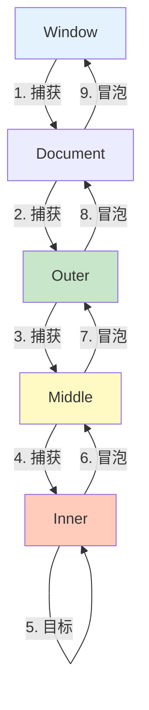

# 事件冒泡与捕获

事件冒泡和捕获是 DOM 事件传播的两个阶段，理解它们对处理复杂交互至关重要。

## 事件传播

### 三个阶段

```javascript
// DOM 事件传播的三个阶段：
// 1. 捕获阶段：从 window → document → 根元素 → 目标元素父节点
// 2. 目标阶段：在目标元素上触发
// 3. 冒泡阶段：从目标元素父节点 → 根元素 → document → window

// HTML 结构：
<div class="outer">
    <div class="middle">
        <div class="inner">Click Me</div>
    </div>
</div>

// 监听所有阶段
const outer = document.querySelector('.outer');
const middle = document.querySelector('.middle');
const inner = document.querySelector('.inner');

function log(element, phase) {
    console.log(`${element} - ${phase}`);
}

// 默认监听（冒泡阶段）
outer.addEventListener('click', () => log('Outer', 'Bubble'));
middle.addEventListener('click', () => log('Middle', 'Bubble'));
inner.addEventListener('click', () => log('Inner', 'Bubble'));

// 捕获阶段
outer.addEventListener('click', () => log('Outer', 'Capture'), true);
middle.addEventListener('click', () => log('Middle', 'Capture'), true);
inner.addEventListener('click', () => log('Inner', 'Capture'), true);
```



### 执行顺序

```javascript
// 点击 inner 时的执行顺序：
outer.addEventListener('click', () => console.log('1. Outer Capture'), true);
middle.addEventListener('click', () => console.log('2. Middle Capture'), true);
inner.addEventListener('click', () => console.log('3. Inner Capture'), true);
inner.addEventListener('click', () => console.log('4. Inner Bubble'));
middle.addEventListener('click', () => console.log('5. Middle Bubble'));
outer.addEventListener('click', () => console.log('6. Outer Bubble'));

// 输出：
// '1. Outer Capture'
// '2. Middle Capture'
// '3. Inner Capture'
// '4. Inner Bubble'
// '5. Middle Bubble'
// '6. Outer Bubble'
```

## 事件冒泡

### 什么是冒泡

```javascript
// 事件冒泡：事件从目标元素向上传播到祖先元素

<div class="parent">
    <div class="child">Click Me</div>
</div>

const parent = document.querySelector('.parent');
const child = document.querySelector('.child');

child.addEventListener('click', () => {
    console.log('Child clicked');
});

parent.addEventListener('click', () => {
    console.log('Parent clicked');
});

// 点击 child：
// 'Child clicked'
// 'Parent clicked'（冒泡触发）
```

### 阻止冒泡

```javascript
// stopPropagation：阻止事件继续传播
child.addEventListener('click', (e) => {
    console.log('Child clicked');
    e.stopPropagation();  // 阻止冒泡
});

parent.addEventListener('click', () => {
    console.log('Parent clicked');  // 不会执行
});

// stopImmediatePropagation：阻止当前元素的其他监听器
child.addEventListener('click', (e) => {
    console.log('First handler');
    e.stopImmediatePropagation();
});

child.addEventListener('click', () => {
    console.log('Second handler');  // 不会执行
});
```

### 冒泡的应用

```javascript
// 应用 1：事件委托
const list = document.querySelector('.list');

list.addEventListener('click', (e) => {
    // 利用冒泡，在父元素处理子元素事件
    const item = e.target.closest('.item');
    if (item) {
        console.log('Clicked:', item.textContent);
    }
});

// 应用 2：全局点击监听
document.addEventListener('click', (e) => {
    // 点击元素外部时关闭下拉菜单
    const dropdown = document.querySelector('.dropdown');
    if (!dropdown.contains(e.target)) {
        dropdown.classList.remove('active');
    }
});

// 应用 3：模态框关闭
const modal = document.querySelector('.modal');
modal.addEventListener('click', (e) => {
    if (e.target === modal) {
        modal.close();  // 点击遮罩层关闭模态框
    }
});
```

## 事件捕获

### 什么是捕获

```javascript
// 事件捕获：事件从祖先元素向下传播到目标元素

<div class="parent">
    <div class="child">Click Me</div>
</div>

const parent = document.querySelector('.parent');
const child = document.querySelector('.child');

// 第三个参数 true 表示捕获阶段
parent.addEventListener('click', () => {
    console.log('Parent capture');
}, true);

child.addEventListener('click', () => {
    console.log('Child click');
});

// 点击 child：
// 'Parent capture'（先执行）
// 'Child click'
```

### 捕获的应用

```javascript
// 应用 1：在捕获阶段阻止事件
const form = document.querySelector('form');

form.addEventListener('click', (e) => {
    // 在捕获阶段检查
    if (e.target.matches('button[type="submit"]')) {
        if (!validate()) {
            e.stopPropagation();  // 阻止事件到达目标
            return;
        }
    }
}, true);

// 应用 2：阻止子元素接收事件
const container = document.querySelector('.container');

container.addEventListener('click', (e) => {
    console.log('Container clicked');
    e.stopPropagation();  // 阻止事件继续传播到子元素
}, true);

// 应用 3：提前拦截事件
document.addEventListener('click', (e) => {
    // 在捕获阶段检查是否应该阻止
    if (shouldBlock(e.target)) {
        e.stopPropagation();
        e.preventDefault();
    }
}, true);
```

### 捕获与冒泡对比

```javascript
<div class="outer">
    <div class="middle">
        <div class="inner">Click Me</div>
    </div>
</div>

const outer = document.querySelector('.outer');
const middle = document.querySelector('.middle');
const inner = document.querySelector('.inner');

// 捕获阶段
outer.addEventListener('click', () => console.log('1. Outer Capture'), true);
middle.addEventListener('click', () => console.log('2. Middle Capture'), true);
inner.addEventListener('click', () => console.log('3. Inner Capture'), true);

// 冒泡阶段
outer.addEventListener('click', () => console.log('6. Outer Bubble'));
middle.addEventListener('click', () => console.log('5. Middle Bubble'));
inner.addEventListener('click', () => console.log('4. Inner Bubble'));

// 点击 inner 的输出：
// '1. Outer Capture'
// '2. Middle Capture'
// '3. Inner Capture'
// '4. Inner Bubble'
// '5. Middle Bubble'
// '6. Outer Bubble'
```

## 事件阶段检测

### eventPhase

```javascript
// event.eventPhase：检测事件所处的阶段
const element = document.querySelector('.element');

element.addEventListener('click', (e) => {
    switch (e.eventPhase) {
        case Event.CAPTURING_PHASE:  // 1
            console.log('Capturing phase');
            break;
        case Event.AT_TARGET:        // 2
            console.log('At target');
            break;
        case Event.BUBBLING_PHASE:   // 3
            console.log('Bubbling phase');
            break;
    }
});
```

### 当前目标

```javascript
// e.target：触发事件的元素（不变）
// e.currentTarget：当前处理事件的元素（随传播变化）

<div class="outer">
    <div class="inner">Click Me</div>
</div>

const outer = document.querySelector('.outer');
const inner = document.querySelector('.inner');

outer.addEventListener('click', (e) => {
    console.log('Target:', e.target);         // inner
    console.log('Current:', e.currentTarget); // outer
    console.log('This:', this);              // outer
});

inner.addEventListener('click', (e) => {
    console.log('Target:', e.target);         // inner
    console.log('Current:', e.currentTarget); // inner
    console.log('This:', this);              // inner
});
```

## 常见问题

### 问题 1：点击内部元素触发外部事件

```javascript
// ⚠️ 问题：点击按钮时触发了父元素的点击事件
<div class="card" onclick="openCard()">
    <button class="delete-btn" onclick="deleteCard()">Delete</button>
</div>

// ✅ 解决方案 1：阻止冒泡
const deleteBtn = document.querySelector('.delete-btn');
deleteBtn.addEventListener('click', (e) => {
    e.stopPropagation();
    deleteCard();
});

// ✅ 解决方案 2：检查事件目标
const card = document.querySelector('.card');
card.addEventListener('click', (e) => {
    if (e.target.matches('.delete-btn')) {
        deleteCard();
    } else {
        openCard();
    }
});

// ✅ 解决方案 3：使用 closest 检查
card.addEventListener('click', (e) => {
    const deleteBtn = e.target.closest('.delete-btn');
    if (deleteBtn) {
        e.stopPropagation();
        deleteCard();
        return;
    }
    openCard();
});
```

### 问题 2：事件监听器触发顺序

```javascript
// 问题：同一元素的多个监听器执行顺序
const button = document.querySelector('button');

button.addEventListener('click', () => console.log('1'));
button.addEventListener('click', () => console.log('2'));
button.addEventListener('click', () => console.log('3'));

// 输出：1, 2, 3（按注册顺序）

// 使用 capture 参数改变顺序
button.addEventListener('click', () => console.log('Capture'), true);
button.addEventListener('click', () => console.log('Bubble'));

// 输出：Capture, Bubble（捕获先于冒泡）

// 使用 once 只触发一次
button.addEventListener('click', () => {
    console.log('Once');
}, { once: true });
```

### 问题 3：动态添加的元素没有事件

```javascript
// ⚠️ 问题：动态添加的元素没有事件监听器
const list = document.querySelector('.list');

// 只为现有元素绑定
document.querySelectorAll('.item').forEach(item => {
    item.addEventListener('click', handleClick);
});

// 添加新元素
const newItem = document.createElement('li');
newItem.className = 'item';
newItem.textContent = 'New Item';
list.appendChild(newItem);
// newItem 没有事件监听器

// ✅ 解决方案：使用事件委托
list.addEventListener('click', (e) => {
    const item = e.target.closest('.item');
    if (item) {
        handleClick.call(item, e);
    }
});
```

## 事件委托最佳实践

```javascript
// ✅ 推荐做法

// 1. 在最近的静态祖先元素上委托
const container = document.querySelector('.container');

container.addEventListener('click', (e) => {
    const button = e.target.closest('button');
    if (button) {
        console.log('Button clicked:', button.dataset.id);
    }
});

// 2. 使用 matches 检查选择器
document.addEventListener('click', (e) => {
    if (e.target.matches('.interactive')) {
        console.log('Interactive element clicked');
    }
});

// 3. 使用 closest 查找目标元素
table.addEventListener('click', (e) => {
    const row = e.target.closest('tr');
    if (row && table.contains(row)) {
        console.log('Row clicked:', row.dataset.id);
    }
});

// 4. 组合多个选择器
container.addEventListener('click', (e) => {
    const deleteBtn = e.target.closest('.delete-btn');
    const editBtn = e.target.closest('.edit-btn');
    const item = e.target.closest('.item');

    if (deleteBtn) {
        deleteItem(deleteBtn.closest('.item'));
    } else if (editBtn) {
        editItem(editBtn.closest('.item'));
    } else if (item) {
        selectItem(item);
    }
});

// 5. 使用 data 属性传递参数
container.addEventListener('click', (e) => {
    const button = e.target.closest('button[data-action]');
    if (button) {
        const action = button.dataset.action;
        const id = button.dataset.id;
        handleAction(action, id);
    }
});

// ❌ 不推荐做法

// 1. 为每个元素单独绑定
items.forEach(item => {
    item.addEventListener('click', handler);
});

// 2. 在 body 或 document 上委托（性能差）
document.body.addEventListener('click', (e) => {
    if (e.target.matches('.item')) {
        console.log('Clicked');
    }
});

// 3. 阻止所有冒泡
document.addEventListener('click', (e) => {
    e.stopPropagation();  // 破坏其他事件处理
});
```

::: tip 事件传播检查清单

- [ ] 理解捕获、目标、冒泡三个阶段
- [ ] 使用事件委托减少监听器
- [ ] 阻止冒泡时考虑是否必要
- [ ] 使用 closest 查找目标元素
- [ ] 在最近的静态祖先元素上委托
- [ ] 注意动态元素的事件处理

:::

::: tip 异步编程回顾

恭喜！你已掌握 DOM 与事件的核心知识：

- [x] DOM 简介
- [x] DOM 操作
- [x] 事件处理
- [x] 事件冒泡与捕获

接下来学习 ES6+ 新特性 → [ES6+ 新特性](../07-es6-plus/let-const.md)
:::
