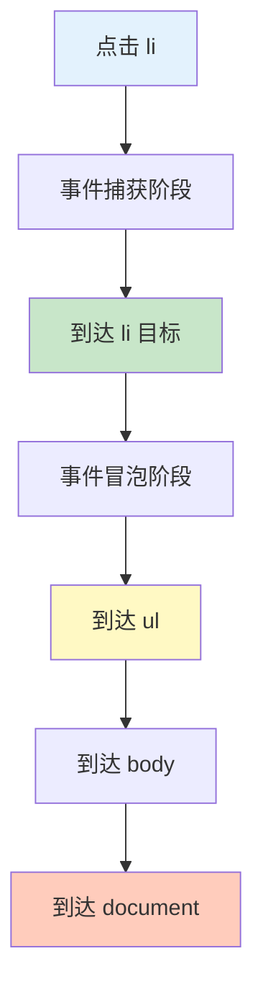

# 事件委托

事件委托是利用事件冒泡机制，在父元素上统一处理子元素事件的模式。

## 基本原理

### 事件冒泡

```javascript
// HTML 结构
<ul id="list">
    <li data-id="1">项目 1</li>
    <li data-id="2">项目 2</li>
    <li data-id="3">项目 3</li>
</ul>

// ❌ 传统方式：为每个 li 添加监听器
const items = document.querySelectorAll('#list li');
items.forEach(item => {
    item.addEventListener('click', (e) => {
        console.log('点击了项目:', e.target.dataset.id);
    });
});
// 问题：内存占用多，新增项目需要重新绑定

// ✅ 事件委托：只在父元素上添加监听器
const list = document.getElementById('list');
list.addEventListener('click', (e) => {
    // 检查点击的是否是 li 元素
    if (e.target.tagName === 'LI') {
        console.log('点击了项目:', e.target.dataset.id);
    }
});
// 优势：内存占用少，新增项目自动生效
```

### 事件流



```javascript
// 事件流的三个阶段
const container = document.querySelector('.container');

// 捕获阶段：从 document 到目标
container.addEventListener('click', (e) => {
    console.log('捕获阶段:', e.target);
}, true);  // true 表示捕获阶段

// 目标阶段：到达目标元素
// 冒泡阶段：从目标到 document
container.addEventListener('click', (e) => {
    console.log('冒泡阶段:', e.target);
}, false); // false 表示冒泡阶段（默认）

// 阻止冒泡
element.addEventListener('click', (e) => {
    e.stopPropagation();  // 阻止事件继续传播
    console.log('事件停止传播');
});
```

## 事件委托实现

### 基础实现

```javascript
// 列表项点击委托
const list = document.getElementById('list');

list.addEventListener('click', (e) => {
    // 获取实际的点击目标
    const target = e.target;

    // 检查是否是我们要处理的元素
    if (target.matches('li')) {
        const id = target.dataset.id;
        console.log('点击了项目:', id);

        // 高亮当前项
        list.querySelectorAll('li').forEach(li => {
            li.classList.remove('active');
        });
        target.classList.add('active');
    }
});

// 添加新项目
const newItem = document.createElement('li');
newItem.dataset.id = '4';
newItem.textContent = '项目 4';
list.appendChild(newItem);
// 新项目自动拥有点击事件处理
```

### closest 方法

```javascript
// 处理嵌套元素
const list = document.getElementById('list');

list.addEventListener('click', (e) => {
    // 向上查找最近的 li 元素
    const item = e.target.closest('li');

    if (item && list.contains(item)) {
        console.log('点击了项目:', item.dataset.id);
    }
});

// HTML 结构示例
<ul id="list">
    <li data-id="1">
        <span>图标</span>
        <strong>项目 1</strong>
        <button>删除</button>
    </li>
</ul>

// 点击 span、strong、button 都能找到对应的 li
```

### 事件源判断

```javascript
// 不同的判断方式
const container = document.querySelector('.container');

container.addEventListener('click', (e) => {
    const target = e.target;

    // 方式 1：matches
    if (target.matches('.btn-delete')) {
        console.log('点击了删除按钮');
    }

    // 方式 2：包含类名
    if (target.classList.contains('btn-delete')) {
        console.log('点击了删除按钮');
    }

    // 方式 3：标签名
    if (target.tagName === 'BUTTON') {
        console.log('点击了按钮');
    }

    // 方式 4：data 属性
    if (target.dataset.action === 'delete') {
        console.log('删除操作');
    }

    // 方式 5：组合判断
    if (target.matches('button[data-action="delete"]')) {
        console.log('删除按钮');
    }
});
```

## 高级应用

### 表格操作

```javascript
// 表格行操作
const table = document.getElementById('data-table');

table.addEventListener('click', (e) => {
    const row = e.target.closest('tr');

    if (!row || !table.contains(row)) return;

    // 删除按钮
    if (e.target.matches('.btn-delete')) {
        const id = row.dataset.id;
        deleteRow(id);
        row.remove();
    }

    // 编辑按钮
    if (e.target.matches('.btn-edit')) {
        const id = row.dataset.id;
        editRow(id);
    }

    // 选择框
    if (e.target.matches('input[type="checkbox"]')) {
        const checkbox = e.target;
        if (checkbox.matches('.select-all')) {
            // 全选/取消全选
            const checkboxes = table.querySelectorAll('input.select-item');
            checkboxes.forEach(cb => cb.checked = checkbox.checked);
        }
    }
});
```

### 菜单和导航

```javascript
// 下拉菜单
const nav = document.querySelector('nav');

nav.addEventListener('click', (e) => {
    const toggle = e.target.closest('[data-toggle]');

    if (toggle) {
        e.preventDefault();  // 阻止链接跳转

        const menuId = toggle.dataset.toggle;
        const menu = document.getElementById(menuId);

        // 切换显示
        menu.classList.toggle('show');

        // 关闭其他菜单
        document.querySelectorAll('[data-menu]').forEach(m => {
            if (m !== menu) {
                m.classList.remove('show');
            }
        });
    }

    // 点击外部关闭菜单
    if (!e.target.closest('[data-toggle]') && !e.target.closest('[data-menu]')) {
        document.querySelectorAll('[data-menu]').forEach(m => {
            m.classList.remove('show');
        });
    }
});
```

### 表单处理

```javascript
// 表单统一处理
const form = document.getElementById('user-form');

form.addEventListener('click', (e) => {
    // 动态添加字段
    if (e.target.matches('.add-field')) {
        const fieldType = e.target.dataset.type;
        const field = createField(fieldType);
        form.insertBefore(field, e.target);
    }

    // 删除字段
    if (e.target.matches('.remove-field')) {
        const field = e.target.closest('.form-field');
        field.remove();
    }
});

// 表单提交
form.addEventListener('submit', (e) => {
    e.preventDefault();

    // 收集表单数据
    const formData = new FormData(form);
    const data = Object.fromEntries(formData.entries());

    console.log('表单数据:', data);

    // 发送请求
    submitForm(data);
});
```

### 动态内容

```javascript
// 动态加载内容
const container = document.getElementById('container');

container.addEventListener('click', async (e) => {
    // 加载更多按钮
    if (e.target.matches('.load-more')) {
        const page = e.target.dataset.page || 1;
        const nextPage = parseInt(page) + 1;

        e.target.disabled = true;
        e.target.textContent = '加载中...';

        try {
            const items = await fetchItems(nextPage);
            appendItems(items);

            e.target.dataset.page = nextPage;
        } catch (error) {
            console.error('加载失败:', error);
        } finally {
            e.target.disabled = false;
            e.target.textContent = '加载更多';
        }
    }
});

// 图片懒加载
const gallery = document.getElementById('gallery');

gallery.addEventListener('click', (e) => {
    const img = e.target.closest('img');

    if (img && img.dataset.src) {
        // 显示大图
        const lightbox = document.getElementById('lightbox');
        const largeImg = lightbox.querySelector('img');
        largeImg.src = img.dataset.large;
        lightbox.classList.add('show');
    }
});
```

## 性能优势

### 内存占用

```javascript
// ❌ 大量事件监听器
const container = document.getElementById('container');
for (let i = 0; i < 1000; i++) {
    const button = document.createElement('button');
    button.addEventListener('click', () => {
        console.log('点击了按钮', i);
    });
    container.appendChild(button);
}
// 问题：1000 个事件监听器，内存占用大

// ✅ 事件委托
const container2 = document.getElementById('container2');
for (let i = 0; i < 1000; i++) {
    const button = document.createElement('button');
    button.dataset.index = i;
    container2.appendChild(button);
}

container2.addEventListener('click', (e) => {
    if (e.target.matches('button')) {
        const index = e.target.dataset.index;
        console.log('点击了按钮', index);
    }
});
// 优势：只有 1 个事件监听器
```

### 动态元素

```javascript
// ✅ 自动处理新增元素
const list = document.getElementById('list');

list.addEventListener('click', (e) => {
    const item = e.target.closest('li');
    if (item) {
        console.log('点击了项目:', item.dataset.id);
    }
});

// 动态添加项目
function addItem(id, text) {
    const li = document.createElement('li');
    li.dataset.id = id;
    li.textContent = text;
    list.appendChild(li);
    // 新项目自动拥有点击事件，无需重新绑定
}

// 添加项目
addItem('4', '项目 4');
addItem('5', '项目 5');
```

## 最佳实践

::: tip 事件委托建议

1. **统一处理** - 同类事件使用一个监听器
2. **closest 方法** - 处理嵌套元素
3. **事件源判断** - 使用 matches 精确匹配
4. **阻止冒泡** - 必要时使用 stopPropagation
5. **命名约定** - 使用 data-* 属性标识行为

:::

```javascript
// ✅ 推荐的事件委托模式
const container = document.getElementById('container');

container.addEventListener('click', (e) => {
    const target = e.target;
    const item = target.closest('[data-item]');

    if (!item || !container.contains(item)) return;

    const action = target.dataset.action || item.dataset.action;

    switch (action) {
        case 'delete':
            handleDelete(item.dataset.id);
            break;
        case 'edit':
            handleEdit(item.dataset.id);
            break;
        case 'view':
            handleView(item.dataset.id);
            break;
    }
});

function handleDelete(id) {
    console.log('删除:', id);
}

function handleEdit(id) {
    console.log('编辑:', id);
}

function handleView(id) {
    console.log('查看:', id);
}
```

## 事件委托库

### 简单实现

```javascript
// 简单的事件委托工具
class EventDelegator {
    constructor(root) {
        this.root = root;
        this.handlers = new Map();
    }

    on(selector, eventType, handler) {
        const key = `${eventType}:${selector}`;

        if (!this.handlers.has(key)) {
            this.root.addEventListener(eventType, (e) => {
                this.root.querySelectorAll(selector).forEach(element => {
                    if (element.contains(e.target) || element === e.target) {
                        const callbacks = this.handlers.get(key);
                        callbacks.forEach(cb => cb.call(element, e));
                    }
                });
            });

            this.handlers.set(key, []);
        }

        this.handlers.get(key).push(handler);
    }

    off(selector, eventType, handler) {
        const key = `${eventType}:${selector}`;
        if (this.handlers.has(key)) {
            const callbacks = this.handlers.get(key);
            const index = callbacks.indexOf(handler);
            if (index > -1) {
                callbacks.splice(index, 1);
            }
        }
    }
}

// 使用
const delegator = new EventDelegator(document.body);

delegator.on('.btn-delete', 'click', function(e) {
    console.log('删除按钮被点击:', this.dataset.id);
});

delegator.on('.btn-edit', 'click', function(e) {
    console.log('编辑按钮被点击:', this.dataset.id);
});
```

### 完整实现

```javascript
// 更完整的事件委托系统
class EventDelegation {
    constructor(root = document) {
        this.root = root;
        this.listeners = new Map();
    }

    // 注册事件委托
    add(selector, eventType, options = {}) {
        const { capture = false, passive = false } = options;

        if (!this.listeners.has(eventType)) {
            const handler = (e) => {
                const listeners = this.listeners.get(eventType);
                let current = e.target;

                while (current && current !== this.root) {
                    for (const listener of listeners) {
                        if (current.matches(listener.selector)) {
                            const ret = listener.fn.call(current, e);
                            if (ret === false) {
                                e.preventDefault();
                                e.stopPropagation();
                            }
                        }
                    }
                    current = current.parentElement;
                }
            };

            this.root.addEventListener(eventType, handler, { capture, passive });
            this.listeners.set(eventType, []);
        }

        this.listeners.get(eventType).push({
            selector,
            fn: options.handler || options,
        });
    }

    // 移除事件委托
    remove(selector, eventType) {
        if (this.listeners.has(eventType)) {
            const listeners = this.listeners.get(eventType);
            const index = listeners.findIndex(l => l.selector === selector);
            if (index > -1) {
                listeners.splice(index, 1);
            }
        }
    }

    // 委托快捷方法
    click(selector, handler) {
        this.add(selector, 'click', handler);
    }

    input(selector, handler) {
        this.add(selector, 'input', handler);
    }

    submit(selector, handler) {
        this.add(selector, 'submit', handler);
    }
}

// 使用示例
const events = new EventDelegation(document.body);

events.click('.btn-delete', function(e) {
    const id = this.dataset.id;
    console.log('删除:', id);
});

events.input('input[data-validate]', function(e) {
    const type = this.dataset.validate;
    validateField(this, type);
});

events.submit('form[data-ajax]', function(e) {
    e.preventDefault();
    const form = this;
    submitForm(form);
});
```

## 常见陷阱

### this 指向问题

```javascript
// ❌ 错误：this 指向不对
container.addEventListener('click', function() {
    // 这里的 this 是 container
    items.forEach(function(item) {
        // 这里的 this 不是我们期望的
        item.classList.add('active');
    });
});

// ✅ 正确：使用箭头函数
container.addEventListener('click', function() {
    items.forEach(item => {
        item.classList.add('active');
    });
});

// ✅ 正确：保存 this 引用
container.addEventListener('click', function() {
    const self = this;
    items.forEach(function(item) {
        self.doSomething(item);
    });
});
```

### 事件目标变化

```javascript
// 问题：点击子元素时 target 可能不是预期的元素
<li>
    <span>图标</span>
    <strong>文本</strong>
</li>

container.addEventListener('click', (e) => {
    // e.target 可能是 span 或 strong，不是 li
    const item = e.target.closest('li');
    if (item && container.contains(item)) {
        console.log('点击了项目:', item.dataset.id);
    }
});
```

### 阻止冒泡的影响

```javascript
// 问题：子元素阻止了冒泡，父元素收不到事件
container.addEventListener('click', (e) => {
    console.log('容器点击');
});

child.addEventListener('click', (e) => {
    e.stopPropagation();  // 容器收不到这个事件
    console.log('子元素点击');
});

// 解决：在捕获阶段处理
container.addEventListener('click', (e) => {
    console.log('容器点击（捕获阶段）');
}, true);
```

## 总结

| 方面 | 传统事件 | 事件委托 |
|------|---------|----------|
| **内存占用** | 高（每个元素一个监听器） | 低（父元素一个监听器） |
| **动态元素** | 需要重新绑定 | 自动生效 |
| **代码复杂度** | 分散 | 集中 |
| **性能** | 差 | 好 |
| **适用场景** | 少量元素 | 大量动态元素 |

::: v-pre

[事件冒泡与捕获](./event-bubbling-capture.md) → [DOM 操作](./dom-manipulation.md)

:::
