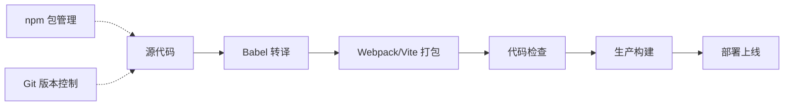

# 前端工程化

现代前端开发离不开工程化工具，它们提高了开发效率和代码质量。

## 学习内容

- [npm 包管理](./npm.md) - package.json、依赖管理、脚本
- [Webpack 打包](./webpack.md) - Webpack 配置、Loader、Plugin
- [Vite 构建](./vite.md) - Vite 原理、配置、插件
- [Babel 转译](./babel.md) - Babel 配置、预设、插件
- [工具链](./tooling.md) - ESLint、Prettier、Git Hooks

## 工具链生态

