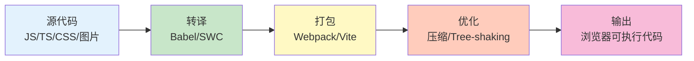

# 构建工具

构建工具是现代前端开发的基础，它们将源代码转换为浏览器可执行的代码。

## 为什么需要构建工具

### 浏览器限制

```javascript
// 1. 浏览器不支持最新 JavaScript 特性
// 2. 浏览器不支持 TypeScript
// 3. 浏览器不支持 CSS 预处理器
// 4. 浏览器不支持模块化（需要打包）
// 5. 需要压缩代码减小体积
// 6. 需要优化资源加载性能

// 示例：使用 ES6+ 特性
const users = await fetch('/api/users');
const data = await users.json();

// 构建工具转换为：
var users = await fetch('/api/users');
var data = await users.json();
```

### 构建流程



## Vite

### 基本概念

```bash
# Vite：下一代前端构建工具
# 特点：
# - 极速的服务启动（使用原生 ES 模块）
# - 轻量快速的热更新（HMR）
# - 丰富的功能（支持 TypeScript、CSS 预处理器等）
# - 优化的构建（使用 Rollup）

# 安装
npm create vite@latest my-app
cd my-app
npm install
npm run dev
```

### 配置文件

```javascript
// vite.config.js
import { defineConfig } from 'vite';
import react from '@vitejs/plugin-react';

export default defineConfig({
    // 插件
    plugins: [react()],

    // 开发服务器配置
    server: {
        port: 3000,
        open: true,
        proxy: {
            '/api': {
                target: 'http://localhost:8080',
                changeOrigin: true,
                rewrite: (path) => path.replace(/^\/api/, '')
            }
        }
    },

    // 构建配置
    build: {
        outDir: 'dist',
        assetsDir: 'assets',
        sourcemap: false,
        minify: 'terser',

        // Rollup 选项
        rollupOptions: {
            output: {
                manualChunks: {
                    'react-vendor': ['react', 'react-dom'],
                    'utils': ['lodash', 'axios']
                }
            }
        }
    },

    // 路径别名
    resolve: {
        alias: {
            '@': '/src',
            '@components': '/src/components',
            '@utils': '/src/utils'
        }
    },

    // CSS 配置
    css: {
        preprocessorOptions: {
            scss: {
                additionalData: `@import "@/styles/variables.scss";`
            }
        }
    }
});
```

### 环境变量

```javascript
// .env.development
VITE_API_URL=http://localhost:8080
VITE_APP_TITLE=Dev App

// .env.production
VITE_API_URL=https://api.example.com
VITE_APP_TITLE=Production App

// 代码中使用
const apiUrl = import.meta.env.VITE_API_URL;
const appTitle = import.meta.env.VITE_APP_TITLE;

// 环境检查
if (import.meta.env.DEV) {
    console.log('Development mode');
}

if (import.meta.env.PROD) {
    console.log('Production mode');
}

// 自定义环境变量必须以 VITE_ 开头
// VITE_ 前缀的变量会暴露给客户端代码
```

## Webpack

### 基本概念

```javascript
// webpack.config.js
const path = require('path');

module.exports = {
    // 入口文件
    entry: './src/index.js',

    // 输出配置
    output: {
        path: path.resolve(__dirname, 'dist'),
        filename: 'bundle.js',
        clean: true  // 清理输出目录
    },

    // 模式
    mode: 'production',  // 'development' | 'production'

    // Loader：处理非 JS 文件
    module: {
        rules: [
            // 处理 CSS
            {
                test: /\.css$/,
                use: ['style-loader', 'css-loader']
            },
            // 处理图片
            {
                test: /\.(png|jpg|gif)$/,
                type: 'asset/resource'
            },
            // 转译 JavaScript
            {
                test: /\.js$/,
                exclude: /node_modules/,
                use: 'babel-loader'
            }
        ]
    },

    // 插件
    plugins: [
        new HtmlWebpackPlugin({
            template: './public/index.html'
        })
    ],

    // 解析配置
    resolve: {
        extensions: ['.js', '.json'],
        alias: {
            '@': path.resolve(__dirname, 'src')
        }
    },

    // 开发服务器
    devServer: {
        static: './dist',
        hot: true,
        port: 3000
    }
};
```

### Loader

```javascript
// Babel Loader：转译 JavaScript
{
    test: /\.js$/,
    exclude: /node_modules/,
    use: {
        loader: 'babel-loader',
        options: {
            presets: ['@babel/preset-env'],
            plugins: ['@babel/plugin-transform-runtime']
        }
    }
}

// CSS Loader：处理 CSS
{
    test: /\.css$/,
    use: [
        'style-loader',    // 将 CSS 注入 DOM
        'css-loader',      // 解析 CSS
        'postcss-loader'   // PostCSS 处理
    ]
}

// Sass Loader：处理 Sass/SCSS
{
    test: /\.scss$/,
    use: [
        'style-loader',
        'css-loader',
        {
            loader: 'sass-loader',
            options: {
                additionalData: `@import "@/styles/variables.scss";`
            }
        }
    ]
}

// File Loader：处理文件
{
    test: /\.(png|jpg|gif|svg)$/,
    type: 'asset/resource',
    generator: {
        filename: 'images/[hash][ext][query]'
    }
}
```

### Plugin

```javascript
const HtmlWebpackPlugin = require('html-webpack-plugin');
const MiniCssExtractPlugin = require('mini-css-extract-plugin');
const TerserPlugin = require('terser-webpack-plugin');

module.exports = {
    plugins: [
        // HTML 插件：生成 HTML 文件
        new HtmlWebpackPlugin({
            template: './public/index.html',
            filename: 'index.html',
            inject: 'body',
            minify: {
                collapseWhitespace: true,
                removeComments: true
            }
        }),

        // CSS 提取插件
        new MiniCssExtractPlugin({
            filename: 'css/[name].[contenthash].css'
        }),

        // 环境变量插件
        new webpack.DefinePlugin({
            'process.env.NODE_ENV': JSON.stringify(process.env.NODE_ENV)
        }),

        // 压缩插件
        new TerserPlugin({
            terserOptions: {
                compress: {
                    drop_console: true
                }
            }
        })
    ]
};
```

## Babel

### 基本配置

```json
// .babelrc
{
  "presets": [
    [
      "@babel/preset-env",
      {
        "targets": {
          "browsers": ["> 1%", "last 2 versions"]
        },
        "useBuiltIns": "usage",
        "corejs": 3
      }
    ],
    "@babel/preset-react",
    "@babel/preset-typescript"
  ],
  "plugins": [
    "@babel/plugin-transform-runtime",
    "@babel/plugin-proposal-class-properties",
    "@babel/plugin-proposal-optional-chaining"
  ]
}
```

### 转译示例

```javascript
// 源代码（ES6+）
const greet = (name = 'Guest') => {
    return `Hello, ${name}`;
};

class Person {
    constructor(name) {
        this.name = name;
    }

    async fetchData() {
        const response = await fetch('/api/data');
        return response.json();
    }
}

// 转译后（ES5）
'use strict';

var greet = function greet() {
    var name = arguments.length > 0 && arguments[0] !== undefined
        ? arguments[0]
        : 'Guest';
    return 'Hello, ' + name;
};

var Person = function () {
    function Person(name) {
        this.name = name;
    }

    var _proto = Person.prototype;

    _proto.fetchData = async function fetchData() {
        var response = await fetch('/api/data');
        return response.json();
    };

    return Person;
}();
```

## PostCSS

### 基本配置

```javascript
// postcss.config.js
module.exports = {
    plugins: {
        // Autoprefixer：自动添加浏览器前缀
        autoprefixer: {
            overrideBrowserslist: [
                '> 1%',
                'last 2 versions'
            ]
        },

        // CSSNano：压缩 CSS
        cssnano: {
            preset: 'default'
        },

        // PostCSS Preset Env
        'postcss-preset-env': {
            stage: 3,
            features: {
                'nesting-rules': true,
                'custom-properties': true
            }
        }
    }
};
```

### 使用示例

```css
/* 源 CSS */
.container {
    display: flex;
    gap: 1rem;
    transition: all 0.3s ease;
}

/* 处理后（添加前缀） */
.container {
    display: -webkit-box;
    display: -ms-flexbox;
    display: flex;
    gap: 1rem;
    -webkit-transition: all 0.3s ease;
    transition: all 0.3s ease;
}
```

## 构建优化

### Tree Shaking

```javascript
// Tree Shaking：移除未使用的代码
// utils.js
export function usedFunction() {
    console.log('Used');
}

export function unusedFunction() {
    console.log('Unused');
}

// main.js
import { usedFunction } from './utils.js';
usedFunction();

// 构建后，unusedFunction 会被移除

// 配置
// webpack.config.js
module.exports = {
    mode: 'production',  // 生产模式自动启用 Tree Shaking

    optimization: {
        usedExports: true,
        sideEffects: false
    }
};

// package.json
{
  "sideEffects": false
  // 或指定哪些文件有副作用
  "sideEffects": ["*.css", "*.scss"]
}
```

### 代码分割

```javascript
// 代码分割：将代码拆分成多个 bundle
// 1. 入口分割
module.exports = {
    entry: {
        main: './src/main.js',
        vendor: './src/vendor.js'
    },
    output: {
        filename: '[name].[contenthash].js'
    }
};

// 2. 动态导入
button.addEventListener('click', async () => {
    const { default: Modal } = await import('./Modal.js');
    new Modal().show();
});

// 3. 提取公共代码
module.exports = {
    optimization: {
        splitChunks: {
            chunks: 'all',
            cacheGroups: {
                vendor: {
                    test: /node_modules/,
                    name: 'vendors',
                    chunks: 'all'
                }
            }
        }
    }
};
```

### 压缩

```javascript
// 压缩：减小代码体积
// webpack.config.js
const TerserPlugin = require('terser-webpack-plugin');
const CssMinimizerPlugin = require('css-minimizer-webpack-plugin');

module.exports = {
    optimization: {
        minimize: true,
        minimizer: [
            new TerserPlugin({
                terserOptions: {
                    compress: {
                        drop_console: true,
                        drop_debugger: true
                    },
                    format: {
                        comments: false
                    }
                },
                extractComments: false
            }),
            new CssMinimizerPlugin()
        ]
    }
};
```

## 构建工具最佳实践

```javascript
// ✅ 推荐做法

// 1. 使用 Vite 开发新项目
npm create vite@latest my-app

// 2. 使用 Webpack 处理复杂需求
const config = {
    // 配置 Loader 和 Plugin
};

// 3. 使用 Babel 转译现代 JavaScript
const babelConfig = {
    presets: ['@babel/preset-env']
};

// 4. 使用 PostCSS 处理 CSS
const postcssConfig = {
    plugins: [autoprefixer, cssnano]
};

// 5. 启用 Tree Shaking
const optimization = {
    usedExports: true,
    sideEffects: false
};

// 6. 代码分割提高性能
const splitChunks = {
    chunks: 'all'
};

// ❌ 不推荐做法

// 1. 忽略构建配置
// 使用默认配置可能导致性能问题

// 2. 不进行代码压缩
// 生产环境应该压缩代码

// 3. 不使用 Tree Shaking
// 导致最终 bundle 包含未使用的代码

// 4. 过度优化
// 过早优化是万恶之源
```

::: tip 构建工具检查清单

- [ ] 选择合适的构建工具（Vite 或 Webpack）
- [ ] 配置 Babel 转译 JavaScript
- [ ] 配置 PostCSS 处理 CSS
- [ ] 启用 Tree Shaking
- [ ] 配置代码分割
- [ ] 生产环境压缩代码

:::

::: tip 下一步

学习包管理器 → [包管理器](./package-managers.md)
:::
