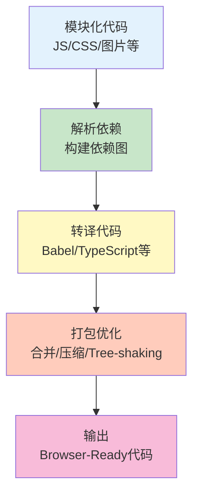

# 模块打包器

模块打包器将模块化的代码和资源打包成浏览器可执行的文件。

## 为什么需要打包

### 模块化需求

```javascript
// 现代前端开发使用模块化
// main.js
import { utils } from './utils.js';
import { Button } from './components/Button.js';
import './styles/main.css';

utils.log('App started');

// 浏览器对 ES 模块的支持有限
// 需要打包器将模块转换为浏览器可执行的代码
```

### 打包器作用



## Rollup

### 基本使用

```bash
# Rollup：专注于 ES 模块的打包器
# 特点：
# - 生成更小的 bundle
# - 支持 Tree-shaking
# - 专注于库的打包

# 安装
npm install rollup -D

# 命令行使用
rollup input.js -o output.js -f es

# 配置文件
# rollup.config.js
export default {
    input: 'src/main.js',
    output: {
        file: 'dist/bundle.js',
        format: 'es'  // 'es' | 'cjs' | 'umd' | 'iife'
    }
};
```

### 配置示例

```javascript
// rollup.config.js
import resolve from '@rollup/plugin-node-resolve';
import commonjs from '@rollup/plugin-commonjs';
import typescript from '@rollup/plugin-typescript';
import babel from '@rollup/plugin-babel';
import terser from '@rollup/plugin-terser';
import postcss from 'rollup-plugin-postcss';

export default {
    // 入口文件
    input: 'src/main.ts',

    // 输出配置
    output: [
        {
            file: 'dist/bundle.es.js',
            format: 'es',        // ES 模块
            sourcemap: true
        },
        {
            file: 'dist/bundle.cjs.js',
            format: 'cjs',       // CommonJS
            sourcemap: true
        },
        {
            file: 'dist/bundle.umd.js',
            format: 'umd',       // UMD
            name: 'MyLibrary',
            sourcemap: true
        }
    ],

    // 插件
    plugins: [
        // 解析 node_modules 中的模块
        resolve(),

        // 转换 CommonJS 为 ES 模块
        commonjs(),

        // TypeScript 支持
        typescript(),

        // Babel 转译
        babel({
            babelHelpers: 'bundled',
            exclude: 'node_modules/**'
        }),

        // PostCSS 处理
        postcss(),

        // 压缩代码
        terser()
    ],

    // 外部依赖（不打包）
    external: ['react', 'react-dom']
};
```

### 高级配置

```javascript
import { terser } from 'rollup-plugin-terser';

export default {
    // 多入口配置
    input: {
        main: 'src/main.ts',
        worker: 'src/worker.ts'
    },
    output: {
        entryFileNames: '[name].js',
        chunkFileNames: '[name]-[hash].js',
        assetFileNames: '[name]-[hash][extname]'
    },

    // 预设构建
    presets: [
        // '@rollup/preset-node'  // Node.js 库
        // '@rollup/preset-browser'  // 浏览器库
    ],

    // 代码分割
    output: {
        manualChunks: {
            'vendor': ['react', 'react-dom']
        }
    }
};
```

## esbuild

### 基本使用

```bash
# esbuild：极快的打包器
# 特点：
# - 速度极快（Go 编写）
# - 内置 TypeScript 支持
# - 内置压缩

# 安装
npm install esbuild -D

# 命令行使用
esbuild src/main.js --bundle --outfile=dist/bundle.js

# API 使用
import * as esbuild from 'esbuild';

await esbuild.build({
    entryPoints: ['src/main.js'],
    bundle: true,
    outfile: 'dist/bundle.js'
});
```

### 配置示例

```javascript
import * as esbuild from 'esbuild';

// 基本构建
await esbuild.build({
    entryPoints: ['src/main.tsx'],
    bundle: true,
    outfile: 'dist/bundle.js',
    loader: {
        '.tsx': 'tsx',
        '.ts': 'tsx'
    },
    define: {
        'process.env.NODE_ENV': '"production"'
    },
    minify: true,
    sourcemap: true,
    target: 'es2015'
});

// 服务模式
const ctx = await esbuild.context({
    entryPoints: ['src/main.tsx'],
    bundle: true,
    outfile: 'dist/bundle.js'
});

await ctx.watch();  // 监听模式
await ctx.serve();  // 开发服务器
```

### 插件系统

```javascript
import { build } from 'esbuild';

// 自定义插件
const envPlugin = {
    name: 'env',
    setup(build) {
        build.onResolve({ filter: /^env:/ }, args => {
            return { path: args.path.replace('env:', ''), namespace: 'env-ns' };
        });

        build.onLoad({ filter: /.*/, namespace: 'env-ns' }, args => {
            return {
                contents: JSON.stringify(process.env[args.path]),
                loader: 'json'
            };
        });
    }
};

// 使用插件
await build({
    entryPoints: ['src/main.js'],
    bundle: true,
    outfile: 'dist/bundle.js',
    plugins: [envPlugin]
});
```

## Turbopack

### 基本使用

```bash
# Turbopack：Next.js 团队开发的打包器
# 特点：
# - 极快的 HMR（热更新）
# - 内置对 React 的支持
# - Rust 编写

# 安装
npm install turbo -g

# 命令行使用
turbo build

# 配置文件
// turbo.config.json
{
  "$schema": "https://turbo.build/schema.json",
  "pipeline": {
    "build": {
      "dependsOn": ["^build"],
      "outputs": ["dist/**", ".next/**"]
    },
    "lint": {
      "outputs": []
    }
  }
}
```

## 打包优化

### Tree Shaking

```javascript
// Tree Shaking：移除未使用的代码

// utils.js
export function used() {
    console.log('Used');
}

export function unused() {
    console.log('Unused');
}

// main.js
import { used } from './utils.js';
used();

// 打包后，unused 会被移除

// Webpack 配置
module.exports = {
    mode: 'production',
    optimization: {
        usedExports: true,
        sideEffects: false
    }
};

// package.json
{
  "sideEffects": false,
  "sideEffects": ["*.css"]
}
```

### 代码分割

```javascript
// 代码分割：将代码拆分成多个 bundle

// 1. 入口分割
module.exports = {
    entry: {
        main: './src/main.js',
        vendor: './src/vendor.js'
    },
    output: {
        filename: '[name].[contenthash].js'
    }
};

// 2. 动态导入
button.addEventListener('click', async () => {
    const { default: Modal } = await import('./Modal.js');
    new Modal().show();
});

// 3. 提取公共代码
module.exports = {
    optimization: {
        splitChunks: {
            chunks: 'all',
            cacheGroups: {
                vendor: {
                    test: /node_modules/,
                    name: 'vendors',
                    chunks: 'all'
                },
                common: {
                    minChunks: 2,
                    priority: -10,
                    reuseExistingChunk: true
                }
            }
        }
    }
};
```

### 懒加载

```javascript
// 懒加载：按需加载代码

// React 懒加载
import { lazy, Suspense } from 'react';

const Home = lazy(() => import('./pages/Home'));
const About = lazy(() => import('./pages/About'));

function App() {
    return (
        <Suspense fallback={<div>Loading...</div>}>
            <Home />
        </Suspense>
    );
}

// 路由懒加载
const routes = [
    {
        path: '/home',
        component: lazy(() => import('./pages/Home'))
    },
    {
        path: '/about',
        component: lazy(() => import('./pages/About'))
    }
];

// 条件加载
async function loadEditor() {
    if (needsEditor) {
        const { default: Editor } = await import('./Editor');
        return new Editor();
    }
}
```

## 打包器对比

### 功能对比

```javascript
// 打包器对比

// Webpack
// - 功能最全面
// - 生态最丰富
// - 配置较复杂
// - 适合大型应用

// Rollup
// - 专注库的打包
// - Tree-shaking 效果好
// - 输出更干净
// - 适合打包库

// esbuild
// - 速度最快
// - 功能相对简单
// - 正在快速发展
// - 适合开发环境

// Turbopack
// - Next.js 集成
// - 极快的 HMR
// - 新兴工具
// - 适合 React 项目
```

### 选择建议

```javascript
// 选择建议

// 1. 大型应用：Webpack
// - 功能全面
// - 生态成熟
// - 社区支持好

// 2. 打包库：Rollup
// - 输出干净
// - Tree-shaking 好
// - 多格式支持

// 3. 新项目：Vite（esbuild）
// - 开发体验好
// - 构建速度快
// - 配置简单

// 4. Next.js 项目：Turbopack
// - 深度集成
// - 性能优秀
// - 未来趋势
```

## 打包器最佳实践

```javascript
// ✅ 推荐做法

// 1. 根据项目选择打包器
// 应用用 Webpack/Vite
// 库用 Rollup

// 2. 启用 Tree Shaking
const optimization = {
    usedExports: true,
    sideEffects: false
};

// 3. 配置代码分割
const splitChunks = {
    chunks: 'all',
    cacheGroups: {
        vendor: {
            test: /node_modules/,
            name: 'vendors'
        }
    }
};

// 4. 使用懒加载
const Modal = lazy(() => import('./Modal'));

// 5. 压缩输出代码
const minimizer = [
    new TerserPlugin()
];

// 6. 生成 sourcemap
const devtool = 'source-map';

// ❌ 不推荐做法

// 1. 过度配置
// 不必要的优化可能适得其反

// 2. 忽略性能
// 不优化最终输出

// 3. 不使用代码分割
// 所有代码打包成一个文件

// 4. 混合使用多个打包器
// 增加复杂度
```

::: tip 模块打包器检查清单

- [ ] 选择合适的打包器
- [ ] 配置代码分割
- [ ] 启用 Tree Shaking
- [ ] 使用懒加载
- [ ] 压缩输出代码
- [ ] 生成 sourcemap

:::

::: tip 下一步

学习任务运行器 → [任务运行器](./task-runners.md)
:::
