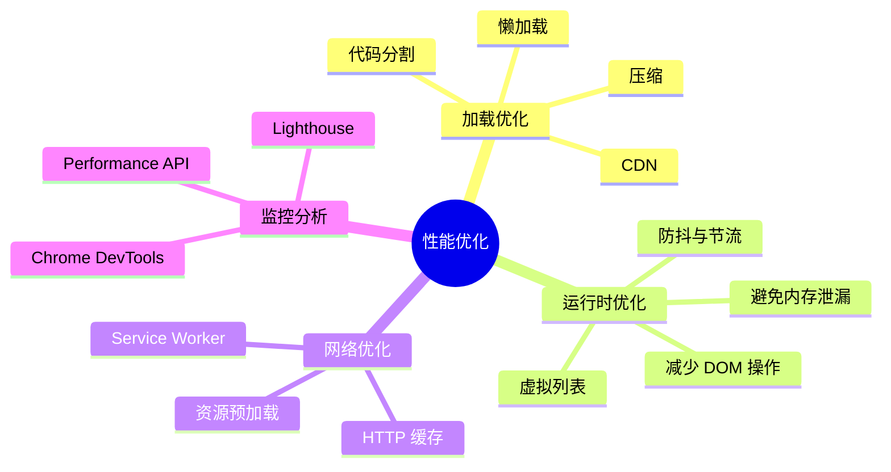

# 性能优化

性能优化是提升用户体验的关键，需要深入理解 JavaScript 运行机制。

## 学习内容

- [V8 引擎](./v8-engine.md) - 垃圾回收、隐藏类、优化编译
- [内存管理](./memory.md) - 内存泄漏、垃圾回收机制
- [代码优化](./optimization.md) - 性能优化技巧、最佳实践
- [性能分析](./profiling.md) - Chrome DevTools、Lighthouse

## 性能优化清单

