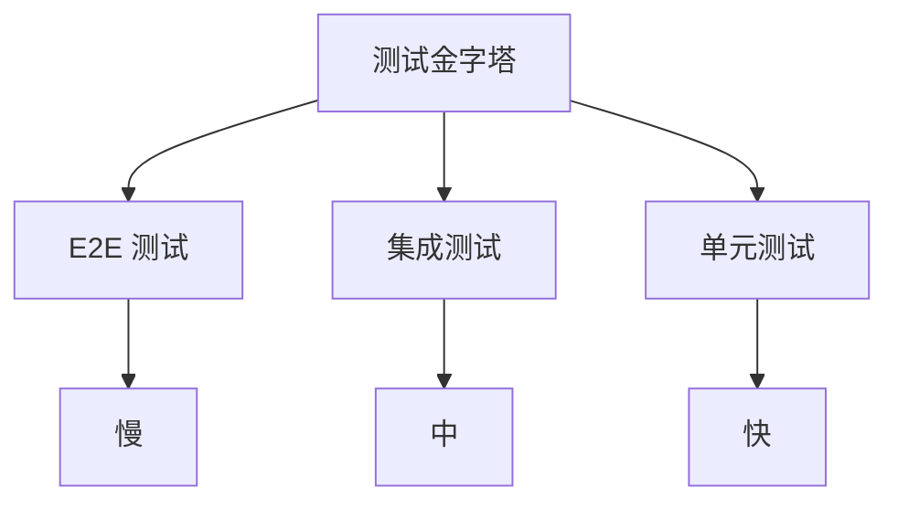

# 测试与调试

良好的测试和调试习惯是代码质量的保障。

## 学习内容

- [调试技巧](./debugging.md) - Chrome DevTools、断点调试
- [单元测试](./unit-testing.md) - Jest、Vitest、Mocha
- [端到端测试](./e2e-testing.md) - Playwright、Cypress
- [代码检查](./linting.md) - ESLint、Prettier、TypeScript

## 测试金字塔

::: tip 测试原则

1. **单元测试**：测试函数和方法
2. **集成测试**：测试模块交互
3. **E2E 测试**：测试完整流程
4. **测试驱动**：TDD/BDD 开发模式
:::
