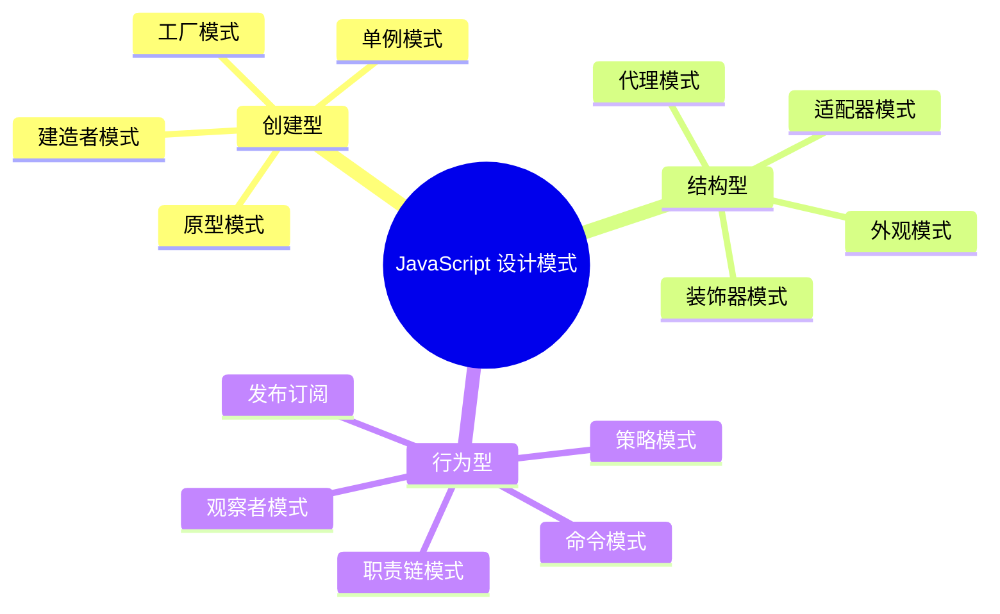

# 设计模式

设计模式是解决特定问题的成熟方案，提高代码的可维护性和复用性。

## 学习内容

- [创建型模式](./creational.md) - 单例、工厂、建造者
- [结构型模式](./structural.md) - 适配器、装饰器、代理
- [行为型模式](./behavioral.md) - 观察者、策略、命令

## 常用模式

::: tip 模式选择

- **单例模式**：全局配置、状态管理
- **观察者模式**：事件系统、响应式框架
- **策略模式**：算法切换、表单验证
- **工厂模式**：对象创建、组件库
:::
