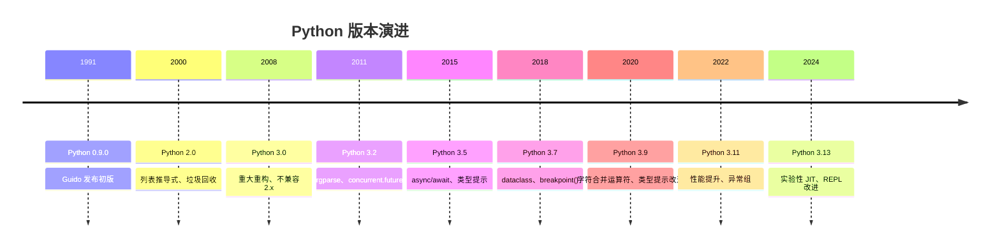

# Python 概述与环境

了解 Python 语言的历史、特点，搭建开发环境。

## 学习内容

<VPCard
  title="Python 概述"
  desc="Python 语言历史、版本演进、应用领域"
  logo="https://api.iconify.design/ri/book-2-line.svg"
  link="/langs/python/00-overview/py-overview.md"
/>

<VPCard
  title="环境安装配置"
  desc="Python 安装、虚拟环境、IDE 配置"
  logo="https://api.iconify.design/ri/download-cloud-2-line.svg"
  link="/langs/python/00-overview/py-env.md"
/>

<VPCard
  title="Hello World"
  desc="第一个 Python 程序"
  logo="https://api.iconify.design/ri/hand-coin-line.svg"
  link="/langs/python/00-overview/hello-world.md"
/>

## Python 版本时间线

## 开发工具推荐

::: tabs

@tab IDE

- **PyCharm**：功能强大的 Python IDE
- **VS Code**：轻量级，插件丰富
- **Jupyter**：数据科学交互式开发

@tab 包管理

- **pip**：官方包管理器
- **conda**：跨平台包管理
- **poetry**：现代依赖管理工具

@tab 虚拟环境

- **venv**：内置虚拟环境
- **virtualenv**：第三方虚拟环境
- **conda env**：Conda 环境管理

:::
