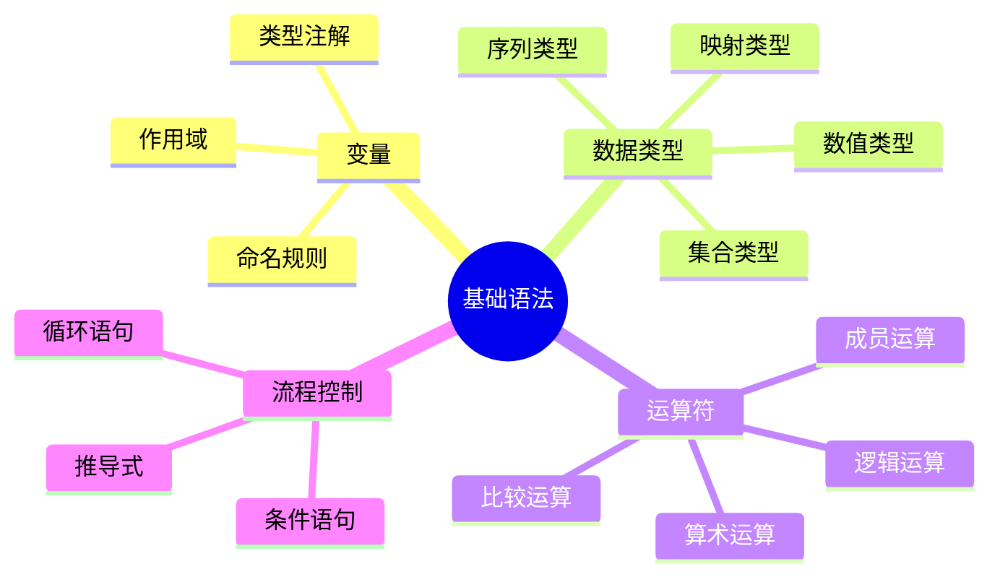

# 基础语法

掌握 Python 的基础语法，包括变量、数据类型、运算符和流程控制。

## 学习内容

<VPCard
  title="变量与数据类型"
  desc="Python 变量、基本数据类型、类型转换"
  logo="https://api.iconify.design/ri/database-2-line.svg"
  link="/langs/python/01-basics/variables.md"
/>

<VPCard
  title="运算符"
  desc="算术、比较、逻辑、位运算符"
  logo="https://api.iconify.design/ri/calculator-line.svg"
  link="/langs/python/01-basics/operators.md"
/>

<VPCard
  title="流程控制"
  desc="条件语句、循环语句、控制语句"
  logo="https://api.iconify.design/ri/flow-chart.svg"
  link="/langs/python/01-basics/control-flow.md"
/>

<VPCard
  title="字符串操作"
  desc="字符串格式化、常用方法、正则表达式"
  logo="https://api.iconify.design/ri/font-size-2.svg"
  link="/langs/python/01-basics/strings.md"
/>

## 知识体系



## 代码风格对比

::: tabs

@tab 不推荐

```python
# 不推荐的写法
x=1+2
y=x*3
if y>5:
print("y大于5")
```

@tab 推荐

```python
# 推荐的写法（PEP 8）
x = 1 + 2
y = x * 3
if y > 5:
    print("y大于5")
```

:::
